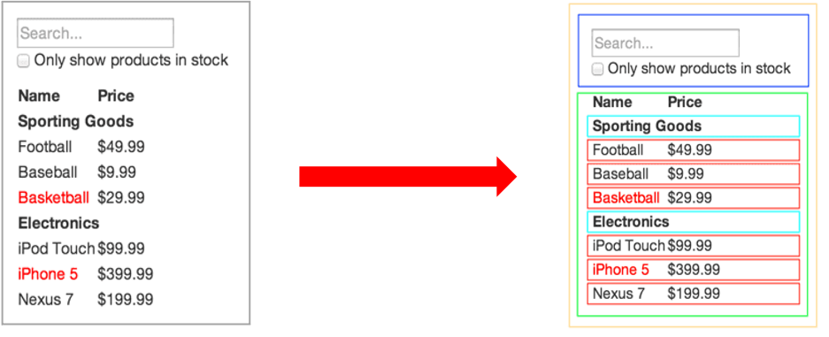

# React 组件基础

- React 组件介绍
- React 组件的两种创建方式 
- 事件绑定
- 组件的状态
- 事件绑定 this 指向
- 表单处理

## React 组件介绍

> 目标：能够知道 React 组件的意义

- 组件是 React 开发（现代前端开发）中最重要的内容！
- 组件允许你将 UI 拆分为独立、可复用的部分，每个部分都可以独立的思考
- 组合多个组件（组装乐高积木）实现完整的页面功能
- 特点：独立、可复用、可组合
- 组件包含三部分：HTML/CSS/JS
- 展示页面中的可复用部分



## React 组件的两种创建方式

> 目标：掌握 React 组件的两种创建方式

1. 使用 JS 中的`函数`创建组件
2. 使用 JS 中的 `class` 创建组件

### 使用函数创建组件

- 使用 JS 的函数(或箭头函数)创建的组件，叫做`函数组件`
- 约定1：**函数名称必须以大写字母开头**，React 据此区分`组件`和`普通的 HTML`
- 约定2：函数组件必须有返回值，表示该组件的 UI 结构；如果不需要渲染任何内容，则返回 null

```js
// 使用普通函数创建组件：
function Hello() {
  return <div>这是我的第一个函数组件!</div>
}

function Button() {
  return <button>按钮</button>
}

// 使用箭头函数创建组件：
const Hello = () => <div>这是我的第一个函数组件!</div>
```

- 渲染组件：
  - 组件就像 HTML 标签一样可以被渲染到页面中。组件表示的是一段结构内容，对于函数组件来说，渲染的内容是函数返回值对应的内容
  - 使用函数名称作为组件标签名称

```js
// 使用 双标签 渲染组件：
<Hello></Hello>
ReactDOM.render(<Hello></Hello>, root)

// 使用 单标签 渲染组件：
<Hello />
ReactDOM.render(<Hello />, root)
```

### 使用 class 创建组件

- 使用 ES6 的 class 创建的组件，叫做类（class）组件
- 约定1：**类名称也必须以大写字母开头**
- 约定2：类组件应该继承 React.Component 父类，从而使用父类中提供的方法或属性 
- 约定3：类组件必须提供 render 方法
- 约定4：render 方法必须有返回值，表示该组件的 UI 结构

```js
// 导入 React
import React from 'react'
class Hello extends React.Component {
  render() {
    return <div>Hello Class Component!</div> 
  }
}
ReactDOM.render(<Hello />, root)

// 只导入 Component
import { Component } from 'react'
class Hello extends Component {
  render() {
    return <div>Hello Class Component!</div> 
  }
}
```

- *练习：将组件抽离到独立的文件中*

```js
// index.js
import Hello from './Hello'
// 渲染导入的Hello组件
ReactDOM.render(<Hello />, root)


// Hello.js
import { Component } from 'react'
class Hello extends Component {
  render() {
    return <div>Hello Class Component!</div>
  }
}
// 导出Hello组件
export default Hello
```

## 练习

```js
const list = [
  { id: 1, name: '小马哥', content: '我是马哥' },
  { id: 2, name: '大飞哥', content: '我是大飞哥' },
  { id: 3, name: '强哥', content: '我很强' },
  { id: 4, name: '棠哥', content: '我很甜' },
]

/**
 * 0 分别用函数组件和class组件来实现，分别抽离到单独为的 js 文件中：
 * 
 * 1 根据 list 列表数据，渲染一个列表
 * 2 列表用 ul，列表中的每一项是 li
 * 3 每个 li 元素中，包含两个元素：h3 和 p
 * 4 h3 标签展示内容为： 评论人：xxx -> name
 * 5 p 标签展示内容为：  评论内容：xxx -> content
 * 6 通过 className 的方式添加样式：
 *  6.1 去掉 li 元素前面的点
 *  6.2 评论人添加 pink 颜色
 *  6.3 评论内容 skyblue 背景色
 * 
 * 7 附加：
 *  如果 list 有数据就展示上述的列表
 *  如果 list 中没有数据，就展示 <div>暂无数据</div>
 */
```
