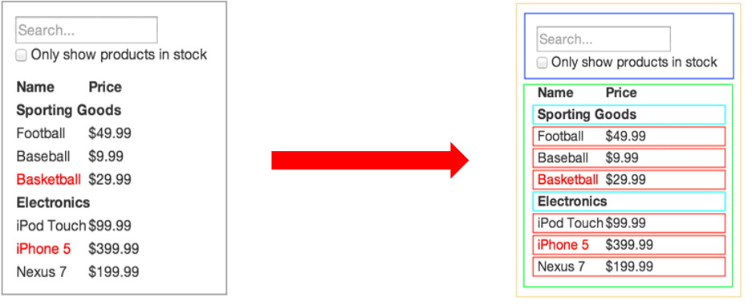

# React 组件基础

- React 组件介绍
- React 组件的两种创建方式 
- 事件绑定
- 组件的状态
- 事件绑定 this 指向
- 表单处理

## React 组件介绍

> 目标：能够知道 React 组件的意义

- 组件是 React 开发（现代前端开发）中最重要的内容！
- 组件允许你将 UI 拆分为独立、可复用的部分，每个部分都可以独立的思考
- 组合多个组件（组装乐高积木）实现完整的页面功能
- 特点：独立、可复用、可组合
- 组件包含三部分：HTML/CSS/JS
- 展示页面中的可复用部分



## React 组件的两种创建方式

> 目标：掌握 React 组件的两种创建方式

1. 使用 JS 中的`函数`创建组件
2. 使用 JS 中的 `class` 创建组件

### 使用函数创建组件

- 使用 JS 的函数(或箭头函数)创建的组件，叫做`函数组件`
- 约定1：**函数名称必须以大写字母开头**，React 据此区分`组件`和`普通的 HTML`
- 约定2：函数组件必须有返回值，表示该组件的 UI 结构；如果不需要渲染任何内容，则返回 null

```js
// 使用普通函数创建组件：
function Hello() {
  return <div>这是我的第一个函数组件!</div>
}

function Button() {
  return <button>按钮</button>
}

// 使用箭头函数创建组件：
const Hello = () => <div>这是我的第一个函数组件!</div>
```

- 渲染组件：
  - 组件就像 HTML 标签一样可以被渲染到页面中。组件表示的是一段结构内容，对于函数组件来说，渲染的内容是函数返回值对应的内容
  - 使用函数名称作为组件标签名称

```js
// 使用 双标签 渲染组件：
<Hello></Hello>
ReactDOM.render(<Hello></Hello>, root)

// 使用 单标签 渲染组件：
<Hello />
ReactDOM.render(<Hello />, root)
```

### 使用 class 创建组件

- 使用 ES6 的 class 创建的组件，叫做类（class）组件
- 约定1：**类名称也必须以大写字母开头**
- 约定2：类组件应该继承 React.Component 父类，从而使用父类中提供的方法或属性 
- 约定3：类组件必须提供 render 方法
- 约定4：render 方法必须有返回值，表示该组件的 UI 结构

```js
// 导入 React
import React from 'react'
class Hello extends React.Component {
  render() {
    return <div>Hello Class Component!</div> 
  }
}
ReactDOM.render(<Hello />, root)

// 只导入 Component
import { Component } from 'react'
class Hello extends Component {
  render() {
    return <div>Hello Class Component!</div> 
  }
}
```

- *练习：将组件抽离到独立的文件中*

```js
// index.js
import Hello from './Hello'
// 渲染导入的Hello组件
ReactDOM.render(<Hello />, root)


// Hello.js
import { Component } from 'react'
class Hello extends Component {
  render() {
    return <div>Hello Class Component!</div>
  }
}
// 导出Hello组件
export default Hello
```

## 事件绑定

> 目标：能够给 button 绑定 click 事件

- 如何绑定事件
- 事件对象

### 如何绑定事件

- React 事件绑定语法与 DOM 事件语法相似
- 语法：on+事件名称={事件处理程序}，比如：onClick={() => {}}
- 注意：React 事件采用驼峰命名法，比如：onMouseEnter、onFocus

```js
// 类组件：
class App extends Component { 
  handleClick() {
    console.log('单击事件触发了') 
  }
  render() { 
    return (
      <button onClick={this.handleClick}></button>
    )
  } 
}

// 函数组件：
function App() {
  const handleClick = () => {
    console.log('单击事件触发了')
  }

  return (
    <button onClick={handleClick}>点我</button>
  )
}
```

### 事件对象

- 通过事件处理程序的参数获取到事件对象

```js
// 函数组件：
function App() {
  const handleClick = e => {
    e.preventDefault()
    console.log('单击事件触发了', e)
  }

  return (
    <a href="http://itcast.cn/" onClick={handleClick}>传智 v587</a>
  )
}
```

## 组件的状态

> 目标1：能说出有状态组件和无状态组件的职责
> 目标2：能够为组件添加状态和修改状态的值

- 【概念】有状态组件和无状态组件
- 【代码】状态的操作

### 有状态组件和无状态组件

- 函数组件又叫做`无状态组件`，类组件又叫做`有状态组件`【前提：基于没有 React Hooks 之前说的】
- 组件中是否有状态，是两种类型的组件的区别
- 状态（state）即数据
- 函数组件没有自己的状态，只负责数据展示（`静`）
- 类组件有自己的状态，负责更新 UI，让页面 `动` 起来

比如，下图计数器案例中，点击按钮让数值加 1。
0 和 1 就是组件在不同时刻的状态，而数值由 0 变为 1 就表示状态发生了变化。
状态变化后，UI 也要相应的更新。React 中想要实现该功能，就要使用有状态组件 class 组件来完成。


### 状态的操作

1. 初始化状态
2. 读取状态 
3. 修改状态

### 初始化状态

- 通过 class 的实例属性 `state` 来初始化
- `state` 的值：对象，表示一个组件中可以有多个数据
- 注意：**这不是新语法**

```js
class Hello extends Component {
  state = {
    count: 0,
    list: [],
    isLoading: true
  }

  render() {
    return (
      <div>计数器</div>
    )
  }
}
```

### 读取状态

- 通过 `this.state` 来获取状态

```js
class Hello extends Component {
  state = {
    count: 0
  }

  render() {
    return (
      <div>计数器：{this.state.count}</div>
    )
  }
}
```

### 修改状态

- 语法：`this.setState({ 要修改的部分数据 })`
- setState() 作用：1 **修改 state** 2 **更新 UI**
- 思想：数据驱动视图，也就是只需要修改数据（状态）那么页面（视图）就会自动的刷新
  - 核心：数据！！！
  - 从现在开始，我们关心的是如何修改数据，而不再是关心如何修改DOM
  - 并且，注意：尽量避免直接手动 DOM（通过 document.querySelector() 获取到到DOM对象然后再操作） 操作！！！
- 注意：*不要直接修改 state 中的值，这是无效的*！

```js
class Hello extends Component {
  state = {
    count: 0
  }

  render() {
    return (
      <div>
        <h1>计数器：{this.state.count}</h1>
        <button onClick={() => {
          // 将 count 状态值修改为：10
          this.setState({
            count: 10
          })
        }}>+1</button>
      </div>
    )
  }
}

// 在 count 当前值的基础上加 1
this.setState({
  count: this.state.count + 10
})
```

- React 中的核心理念：==状态不可变==

  - 也就是说，不要直接修改当前状态值，而是创建新的状态值！！！

  ```js
  state = {
    count: 0,
    list: [1, 2, 3],
    person: {
      name: 'jack',
      age: 18
    }
  }
  
  // 【不推荐】直接修改当前值的操作：
  this.state.count++
  ++this.state.count
  this.state.count += 1
  this.state.count = 1
  this.state.list.push(123)
  this.state.person.name = 'rose'
  
  // 【推荐】不是直接修改当前值，而是创建新值的操作：
  this.setState({
    count: this.state.count + 1,
    list: [...this.state.list],
    person: {
      ...this.state.person,
    	// 要修改的属性，会覆盖原来的属性，这样，就可以达到修改对象中属性的目的了  
      name: 'rose'
    }
  })
  ```

## 从 JSX 中抽离事件处理程序

> 目标：能够理解为什么要从 JSX 中抽离 JS 逻辑代码

- 注意：不要在 JSX 中掺杂过多 JS 逻辑代码，会显得非常混乱
- 推荐：将代码逻辑抽离到单独的方法中，在 JSX 中调用这些方法。从而，保证 JSX 结构清晰
- 注意：React 事件处理程序中的 this 就是 undefined！！！

```js
class Hello extends Component {
  state = {
    count: 0
  }

  // 注意：点击 +1 按钮时，此处的代码会报错
  handleClick() {
    // 在 count 当前值的基础上加 1
    this.setState({
      count: this.state.count + 10  
    })
  }

  render() {
    return (
      <div>
        <h1>计数器：{this.state.count}</h1>
        <button onClick={this.handleClick}>+1</button>
      </div>
    )
  }
}

/**
 * 错误分析：
 * 
 * 报错信息 -> TypeError: Cannot read property 'setState' of undefined
 * 
 * 因为是通过 this 调用的 setState 方法。所以，`this 值为 undefined`
 * 
 * ---
 * 
 * 问题：为什么 this 值为 undefined？
 * 回答：在 React 的事件处理程序中，this 为 undefined
 * 
 * ---
 * 
 * 问题：在 JSX 中使用`箭头函数`作为事件处理程序时，代码能够正确运行，此处的 this 是谁？
 * 回答：此处的 this 实际上是 render 方法中的 this（即，class 的实例对象）
 * 
 * ---
 * ***
 * 为了能够让事件处理程序中的 this 为 class 的实例对象，需要处理 this 指向问题
 * ***
 */
```

## 事件绑定 this 指向

> 目标：能够处理 class 组件事件绑定时 this 指向的问题

处理 React 事件处理程序中 this 指向的问题，有以下三种方式：

1. Function.prototype.bind()
2. 箭头函数
3. class 的实例方法【推荐】

方式一：

```js
class Hello extends Component {
  constructor() {
    super()
    // 此处，通过 bind 方法，将此处的 this（class 实例对象）与方法绑定
    // 将来，不管以什么方式调用方法，方法中的 this 都是此处绑定的 this
    this.handleClick = this.handleClick.bind(this)
  }

  handleClick() {
    this.setState({ ... })
  }

  render() {
    return (
      <button onClick={this.handleClick}>+1</button>
    )
  }
}
```

方式二：

```js
class Hello extends Component {
  // ...省略 handleClick

  render() {
    // 箭头函数中的 this 就是 render 方法中的 this，即，class 实例对象
    return (
      <button onClick={() => this.handleClick()}>+1</button>
    )
  } 
}
```

方式三：

```js
class Hello extends Component {
  // 值为箭头函数形式的实例方法
  handleClick = () => {
    this.setState({ ... })
  }

  render() { 
    return (
      <button onClick={this.handleClick}>+1</button>
    )
  }
}
```

## 表单处理

> 目标：能够使用受控组件的方式获取文本框的值

使用 React 处理表单元素，有两种方式:

1. 受控组件【推荐】
2. 非受控组件

### 受控组件

在 React 组件中，如果数据是可以改变的，这个数据应该放在哪？  
放在 `state` 中，并通过 `setState()` 来修改

但，HTML 中的表单元素（比如，input/textarea 等）是可输入的，也就是有自己的状态  

React将 state 与表单元素的值（value）绑定到一起，由 state 的值来控制表单元素的值，从而保证单一数据源（`single source of truth`）

- 受控组件：其值受到 React 控制的表单元素

```js
/**
 * 以获取文本框的值为例，演示受控组件的使用步骤：
 * 
 * 1 准备状态 txt，值为：''
 * 2 将状态 txt 设置为 input 标签的 value 属性的值
 * **【控制表单元素值的来源】此时，文本框的初始值就是状态 txt 的值**
 * 3 为 input 标签添加 change 事件
 * 4 在事件处理程序（handleChange）中，通过事件对象 e 获取到当前文本框的值（即，用户输入的内容）
 * 5 调用 setState 方法，将文本框的值作为状态 txt 的最新值
 * **【控制表单元素值的变化】此时，文本框中输入什么，状态 txt 的值就是什么**
 * 
 * 状态变化过程：文本框中输入内容 => setState({ txt }) => 组件重新渲染 => 将状态 txt 的最新值渲染到文本框中
 */

class Hello extends Component {
  state = {
    txt: ''
  }

  handleChange = e => {
    this.setState({
      txt: e.target.value
    })
  }

  render() {
    return (
      <div>
        <input value={this.state.txt} onChange={handleChange} />
      </div>
    )
  }
}
```

- 注意：**使用受控组件的方式处理表单元素后，状态的值就是表单元素的值。即：想要操作表单元素的值，只需要操作对应的状态即可**

### 非受控组件

- 受控组件是通过 React 组件的状态来控制表单元素的值
- 非受控组件是通过手动操作 DOM 的方式来控制
- 此时，需要用到一个新的概念：ref
- ref：用来在 React 中获取 DOM 元素

```js
/**
 * 通过手动操作 DOM 的方式获取文本框的值：
 * 
 * 1 导入 createRef 函数
 * 2 调用 createRef 函数，创建一个 ref 对象，存储到实例属性 txtRef 中
 * 3 为 input 添加 ref 属性，值为 txtRef
 * **此时，input 对应的 DOM 元素与 txtRef 对象被关联在一起**
 * 4 在按钮的事件处理程序中，通过 txtRef.current 即可拿到 input 对应的 DOM 元素
 *   txtRef.current.value 拿到的就是文本框的值
 * 
 * **注意：ref 是一个对象，对象中有一个 current 属性，current 属性的值才是相应的 DOM 元素**
 */

import { createRef } from 'react'

class Hello extends Component {
  txtRef = createRef()

  handleClick = () => {
    // 文本框对应的 DOM 元素
    // console.log(this.txtRef.current)

    // 文本框的值：
    console.log(this.txtRef.current.value)
  }

  render() {
    return (
      <div>
        <input ref={this.txtRef} />
        <button onClick={handleClick}>获取文本框的值</button>
      </div>
    )
  }
}
```

---
