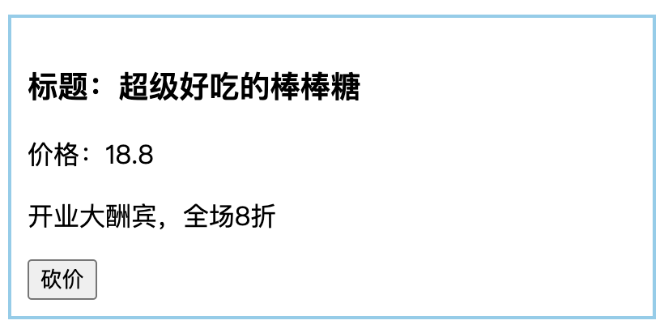

# React 组件进阶

- 组件通讯
- 组件生命周期

## 组件通讯

> 目标1：能够使用 props 给组件传递数据
> 目标2：能够掌握父、子组件之间的通讯
> 目标3：能够使用 Context 实现跨组件通讯

- 组件通讯介绍
- props
- 组件通讯 - 三种常见情况
- 组件通讯 - Context

### 组件通讯介绍

在组件化开发过程中，我们将一个完整的功能拆分成多个组件，每个组件各司其职，最终完成整个应用的功能。而在这个过程中，多个组件之间不可避免的要共享某些数据（比如，组件 A 要用到组件 B 中的数据）。  
而组件是独立且封闭的单元，默认情况下，只能使用组件内部的数据（所以，组件 B 中的数据只能在组件 B 中使用，无法直接被组件 A 使用）。  
为了实现这些功能，就需要*打破组件的独立封闭性*，让其与外界沟通。这个过程就是组件通讯。

- 注意：**组件中的状态是私有的**，也就是说，组件的状态只能在组件内部使用，无法直接在组件外使用
- 问题：组件为什么被设计为独立且封闭的？ 为了更好的实现组件的复用，如果一个组件被用到多次，多次使用之间不应该相互影响，所以，被设计为独立、且封闭的

### props

- property 属性的简写
- 使用场景：组件接收外部数据时
- 作用：接收（其他组件）传递给当前组件的数据
- 如何传递？给组件标签添加属性，就表示给组件传递数据
- 如何接收？函数组件通过参数 props 接收数据，类组件通过 this.props 接收数据

```js
// 接收数据：
// props 的值就是：{ name: 'jack', age: 19 }
function Hello(props) {
  return (
    <div>接收到数据:{props.name}</div>
  )
}

// 传递数据：
// 可以把传递数据理解为调用函数 Hello，即：Hello({ name: 'jack', age: 19 })
<Hello name="jack" age={19} />
<div class="" id=""></div>
```

```js
// 接收数据：
// class 组件需要通过 this.props 来获取
class Hello extends Component {
  render() {
    return (
      <div>接收到的数据:{this.props.age}</div>
    ) 
  }
}

// 传递数据：
<Hello name='jack' age={19} />
```

- props 的特点：
  1. **props 是只读对象**，只能读取对象中的属性，无法修改
  2. 可以传递任意数据
- 注意：使用类组件时，如果写了构造函数，应该将 props 传递给 super()，否则，无法在构造函数中获取到 props

```js
class Hello extends Component {
  constructor(props) {
    // 注意此处 props 的处理方式
    super(props)
  }
  render() {
    return (
      <div>接收到的数据:{this.props.age}</div>
    ) 
  }
}
```

### 组件通讯 - 三种常见情况

组件通讯与组件之间的位置关系有关，常见的组件之间的关系有两种：
1. 父子组件，两者之间可以相互通讯，且实现方式不同，所以分为两种情况：1 **父组件 -> 子组件**  2 **子组件 -> 父组件**
2. 兄弟组件，两者之间可以相互通讯，但实现方式相同，所以只有一种情况：**兄弟组件A -> 兄弟组件B**

- 共三种情况：
  1. 父 -> 子
  2. 子 -> 父
  3. 兄弟组件之间

#### 父组件 -> 子组件

- 目标：将父组件中的数据，传递给子组件
- 步骤：
  1. 父组件中提供数据 lastName
  2. 给子组件标签添加属性 name，值为 state 中的 lastName
  3. 子组件通过 props 接收父组件中传递过来的数据，并展示
- 总结：利用 props 传递数据

```js
// 父组件：
class Parent extends Component {
  state = {
    money: 1000
  }

  render() {
    return (
      <div className="parent">
        <p>父组件</p>
        <div>
          父亲有：<span className="money">{this.state.money}</span> 钱
        </div>
        {/* 通过 props 将 money 传递给子组件 */}
        <Child money={this.state.money} />
      </div>
    )
  }
}

// 子组件：
const Child = props => {
  return (
    <div className="child">
      <p>子组件</p>
      <div>
        {/* 通过 props.money 接收到父组件的数据 */}
        儿子有：<span className="money">{props.money}</span> 钱
      </div>
    </div>
  )
}
```

- 练习：


```js
// 列表数据
[
  { id: 1, name: '超级好吃的棒棒糖', price: 18.8, info: '开业大酬宾，全场8折' },
  { id: 2, name: '超级好吃的大鸡腿', price: 34.2, info: '开业大酬宾，全场8折' },
  { id: 3, name: '超级无敌的冰激凌', price: 14.2, info: '开业大酬宾，全场8折' }
]
```

```css
/* 基础样式 */
.parent {
  width: 400px;
  padding: 10px;
  border: 2px solid black;
}
.child {
  margin: 10px 0;
  padding: 10px;
  border: 2px solid skyblue;
}
.money {
  color: red;
}

.product {
  width: 400px;
  padding: 20px;
  border: 2px solid #000;
  border-radius: 5px;
  margin: 10px;
}
```

#### 概念：单向数据流

- `单向数据流`，也叫做：自上而下的数据流
- 表示：父组件中的数据可以通过 props 传递给子组件，并且，当父组件中的数据更新时，子组件就会自动接收到最新的数据
- 类比：就像瀑布的水一样只能从上往下流动，并且，当上游的水变浑浊，下游的水也会受到影响

#### 子组件 -> 父组件

- 注意：**组件中的状态是私有的**，组件中的状态只能由组件自身来修改
- 思路：在父组件中准备一个修改状态的函数，将其传递给子组件，由子组件调用该函数并传递数据
- 可以理解为：父组件给子组件了一个箱子，子组件往箱子里面放什么，父组件拿到的就是什么
- 步骤：
  1. 父组件提供一个修改状态的函数，用于接收数据
  2. 将该函数通过 props 传递给子组件
  3. 子组件调用回调函数，并将要传递的数据作为参数

```js
// 父组件：
class Parent extends Component {
  state = {
    money: 1000
  }

  // 准备一个修改状态的方法
  spendMoney = count => {
    this.setState({
      money: this.state.money - count
    })
  }

  render() {
    return (
      <div className="parent">
        <p>父组件</p>
        <div>
          父亲有：<span className="money">{this.state.money}</span> 钱
        </div>
        {/* 将方法传递给子组件 */}
        <Child money={this.state.money} spendMoney={this.spendMoney} />
      </div>
    )
  }
}

// 子组件：
const Child = props => {
  return (
    <div className="child">
      <p>子组件</p>
      <div>
        儿子有：<span className="money">{props.money}</span> 钱
      </div>
      <div>
        {/* 调用 props.spendMoney 来修改父组件中的状态 */}
        <button onClick={() => props.spendMoney(100)}>买手机</button>
      </div>
    </div>
  )
}
```

- 练习



#### 兄弟组件

- 思想：`状态提升`，即，将两个兄弟组件要共享的状态提升到离这个两个组件最近的公共父组件中，由公共父组件管理这个状态
- 公共父组件负责：1 提供共享状态 2 提供操作共享状态的方法
- 接收数据的组件：通过 props 从父组件接收数据【父 -> 子】
- 修改数据的组件：通过 回调函数 调用父组件提供的操作共享状态的方法【子 -> 父】

### 组件通讯 - Context

组件之间的层级关系，除了以上两种常见的情况外，还有一种不太常见的情况，那就是：远房亲戚关系（也就是两个组件之间间隔较远）


- 实现方式：使用 Context 来实现跨组件传递数据
- Context：上下文，可以理解为一个范围

```js
import { createContext } from 'react'

// 1 创建 Context 对象
const { Provider, Consumer } = createContext()

// 2 使用 Provider 组件包裹整个应用，并通过 value 属性提供要共享的数据
<Provider value="blue">
  <div className="App">
    <Child1 /> 
  </div>
</Provider>

// 3 使用 Consumer 组件接收要共享的数据
<Consumer>
  {data => <span>data参数表示接收到的数据 -- {data}</span>}
</Consumer>
```

## 组件生命周期

- 组件生命周期概述
- 生命周期的三个阶段

### 组件声明周期概述

怎么来的？做了什么？怎么去的？
组件从被创建到挂载到页面中运行，再到组件不用时卸载的这个过程就是组件的生命周期。  
生命周期的每个阶段总是伴随着一些事件调用，这些事件就是生命周期的钩子函数。这些钩子函数，给开发人员在不同阶段操作组件提供了时机。


### 生命周期的三个阶段

1. 创建时（挂载阶段）
2. 更新时（更新阶段）
3. 卸载时（卸载阶段）

#### 创建时（挂载阶段）

- 触发时机：组件创建时（页面加载时）
- 执行顺序：constructor -> render -> componentDidMount

|钩子函数          |触发时机               |作用|
|--|--|--|
|constructor      |组件创建时             |1. 初始化state 2. 为事件处理程序绑定this|
|render           |每次组件渲染都会触发     |渲染UI|
|componentDidMount|组件挂载(完成DOM渲染)后  |1. 发送网络请求 2. DOM操作|

#### 更新时（更新阶段）

- 触发时机：1. setState() 2. 组件接收到新的props 3. forceUpdate()
- 说明：以上三者任意一种变化，都会触发组件重新渲染
- 执行顺序：render -> componentDidUpdate

|钩子函数          |触发时机               |作用|
|--|--|--|
|render           |每次组件渲染都会触发     |渲染UI|
|componentDidUpdate|组件更新(完成DOM渲染)后 |1 发送网络请求(前提：比较了更新前后的props) 2 DOM操作|

#### 卸载时（卸载阶段）

- 触发时机：组件从页面中卸载(消失)

|钩子函数          |触发时机               |作用|
|--|--|--|
|componentWillUnmount|组件卸载(从页面中消失) |执行清理工作(比如:清理定时器等)|

组件生命周期有助于理解组件的运行过程。钩子函数让开发者可以在特定的时机执行某些功能。
