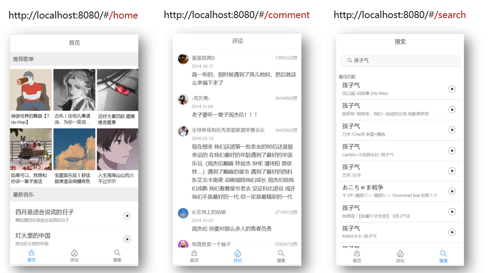

# React 路由与单页应用程序

- 单页应用程序
- React 路由

## 单页应用程序

- SPA： `Single Page Application`  单页面应用程序
- MPA : `Multiple Page Application`多页面应用程序 

[SPA ](https://baike.baidu.com/item/SPA/17536313?fr=aladdin)
[网易云音乐](https://music.163.com/)

### 优势

1. 加快页面响应速度，降低了对服务器的压力
   - 传统的多页面应用程序，每次请求服务器返回的都是一整个完整的页面
   - 单页面应用程序只有第一次会加载完整的页面，以后每次请求仅仅获取必要的数据
2. 更好的用户体验，运行更加流畅


### 缺点

1. 开发成本高 (需要学习路由)
2. **不利于 SEO** 搜索引擎优化
   - 可以通过 SSR（服务端渲染 Server Side Rendering）来解决 SEO 问题

---

## React 路由

- React 路由介绍
- 路由的基本使用
- 路由的执行过程
- 路由的常用操作

## React 路由介绍

现代的前端应用大多都是 SPA(单页应用程序)，也就是只有一个 HTML 页面的应用程序。因为它的用户体 验更好、对服务器的压力更小，所以更受欢迎。为了有效的使用单个页面来管理原来多页面的功能，前端路由 应运而生。

- 前端路由的功能：让用户从一个视图(页面)导航到另一个视图(页面) 
- 前端路由是一套映射规则，在React中，是 URL路径 与 组件 的对应关系 
- 使用React路由简单来说，就是配置 路径和组件(配对)




## 路由的基本使用

- 使用步骤
- 常用组件说明

### 使用步骤

1. 安装：`yarn add react-router-dom`
2. 导入路由的三个核心组件：Router / Route / Link

```js
import { BrowserRouter as Router, Route, Link } from 'react-router-dom'
```

3. 使用 Router 组件包裹整个应用(重要)

```js
<Router>
  <div className="App">
    // ... 省略页面内容
  </div>
</Router>
```

4. 使用 Link 组件作为导航菜单(路由入口) 

```js
<Link to="/first">页面一</Link>
```

5. 使用 Route 组件配置路由规则和要展示的组件(路由出口)
 
```js
const First = () => <p>页面一的页面内容</p>

<Router>
  <div className="App">
    <Link to="/first">页面一</Link>
    <Route path="/first" component={First}></Route>
  </div>
</Router>
```

### 常用组件说明

- Router 组件:包裹整个应用，一个 React 应用只需要使用一次
- 两种常用 Router:HashRouter 和 BrowserRouter
- HashRouter:使用 URL 的哈希值实现(localhost:3000/#/first)
- (推荐)BrowserRouter:使用 H5 的 history API 实现(localhost:3000/first)
- Link 组件:用于指定导航链接(a 标签)

```js
// to属性:浏览器地址栏中的pathname(location.pathname)
<Link to="/first">页面一</Link>
```

- Route 组件:指定路由展示组件相关信息

```js
// path属性:路由规则
// component属性:展示的组件
// Route组件写在哪，渲染出来的组件就展示在哪
<Route path="/first" component={First}></Route>
```

## 路由的执行过程

1. 点击 Link 组件(a标签)，修改了浏览器地址栏中的 url
2. React 路由监听到地址栏 url 的变化
3. React 路由内部遍历所有 Route 组件，使用路由规则( path )与 pathname 进行匹配
4. 当路由规则(path)能够匹配地址栏中的 pathname 时，就展示该 Route 组件的内容

## 路由的常用操作

- 编程式导航
- 默认路由 
- 匹配模式
 
### 编程式导航

- 场景:点击登录按钮，登录成功后，通过代码跳转到后台首页，如何实现? 
- 编程式导航:通过 JS 代码来实现页面跳转
- history 是 React 路由提供的，用于获取浏览器历史记录的相关信息
- push(path):跳转到某个页面，参数 path 表示要跳转的路径
- go(n): 前进或后退到某个页面，参数 n 表示前进或后退页面数量(比如:-1 表示后退到上一页)

```js
class Login extends Component { 
  handleLogin = () => {
    // ...
    this.props.history.push('/home')
  }
  render() {...省略其他代码}
}
```

### 默认路由

- 问题:现在的路由都是点击导航菜单后展示的，如何在进入页面的时候就展示呢? 
- 默认路由:表示进入页面时就会匹配的路由
- 默认路由path为:/

```js
<Route path="/" component={Home} />
```

### 匹配模式

- 模糊匹配
- 精确匹配

#### 模糊匹配

- 问题:当 Link组件的 to 属性值为 “/login”时，为什么 默认路由 也被匹配成功? 
- 默认情况下，React 路由是模糊匹配模式
- 模糊匹配规则:只要 pathname 以 path 开头就会匹配成功

```js
<Link to="/login">登录页面</Link>
<Route path="/" component={Home} /> 匹配成功

// path 代表Route组件的path属性
// pathname 代表Link组件的to属性(也就是 location.pathname)
```

|path|能够匹配的pathname|
|--|--|
|/|所有 pathname|
|/first|/first 或 /first/a 或 /first/a/b/...|

#### 精确匹配

- 问题:默认路由任何情况下都会展示，如何避免这种问题?
- 给 Route 组件添加 exact 属性，让其变为精确匹配模式
- 精确匹配:只有当 path 和 pathname 完全匹配时才会展示该路由

```js
// 此时，该组件只能匹配 pathname=“/” 这一种情况 
<Route exact path="/" component=... />
```

推荐:给默认路由添加 exact 属性

---

## SPA - 单页应用程序

- SPA：`Single Page Application`  单页面应用程序
- MPA：`Multiple Page Application`多页面应用程序 

[SPA ](https://baike.baidu.com/item/SPA/17536313?fr=aladdin)

[网易云音乐](https://music.163.com/)

### 优势

- 传统的多页面应用程序，每次请求服务器返回的都是一整个完整的页面
- 单页面应用程序只有第一次会加载完整的页面
- 以后每次请求仅仅获取必要的数据，减少了请求体积，加快页面响应速度，降低了对服务器的压力
- SPA更好的用户体验，运行更加流畅

### 缺点

1. 开发成本高 (需要学习路由)  `vue-router   react-router`
2. **不利于 SEO** 搜索引擎优化    谷歌浏览器在解决这个问题    ssr:服务端渲染 server side rendering

## 路由介绍

- **路由** : 是浏览器 **URL 中的哈希值**( # hash) 与 **展示视图内容(组件)** 之间的对应规则
  - 简单来说,路由就是一套映射规则(一对一的对应规则), 由开发人员制定规则.- 
  - 当 URL 中的哈希值( `#` hash) 发生改变后,路由会根据制定好的**规则**, 展示对应的视图内容(组件)
- **为什么要学习路由?**
  - 渐进式 =>vue => vuer-router (管理组件之间的跳转)
  - 在 web App 中, 经常会出现通过一个页面来展示和管理整个应用的功能.
  - SPA 往往是功能复杂的应用,为了有效管理所有视图内容,前端路由 应运而生.
- **vue 中的路由** : 是 **hash** 和 **component** 的对应关系, **一个哈希值对应一个组件**
