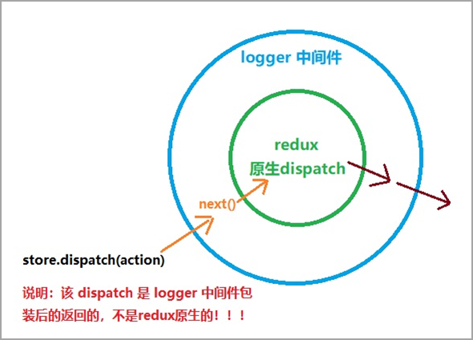

# Redux 中间件


默认情况下，Redux 自身只能处理同步数据流。但是在实际项目开发中，状态的更新、获取，通常是使用异步操作来实现。

- 问题：如何在 Redux 中进行异步操作呢?
- 回答：通过 Redux 中间件机制来实现。

Redux 中间件作用：**处理具有副作用(side effect)的功能**，比如，异步操作就是最常见的 side effect。

### 中间件说明

- 中间件，可以理解为处理一个功能的中间环节
- 下图中，自来水从水库到用户家庭中的每一个环节都是一个中间件
- 中间件的优势：可以串联、组合，在一个项目中使用多个中间件
- **Redux 中间件用来处理 状态 更新，也就是在 状态 更新的过程中，执行一系列的相应操作**


### Express 中间件和 Redux 中间件的区别

- Express 中的中间件：
  - 作用：处理请求相关的操作
  - Express 中的中间件是串联的，中间挨个处理

```js
浏览器发起请求 >>> 【服务器接收到请求 ---> 处理请求 ---> 响应请求】 >>> 浏览器接收到响应结果

// 使用中间件后：
浏览器发起请求 >>> 【服务器接收到请求 ---> 处理请求开始 -> [中间件1] -> [中间件2] -> 处理请求结束 ---> 响应请求】 >>> 浏览器接收到响应结果
```

- Redux 中的中间件采用的叫做 `洋葱模型`，也就是：一个中间件有两次触发时机，也就是进入中间件和出中间件都可以执行相应的操作。
  - 比如，记录日志，在洋葱模型下，记录两次日志：1 状态更新前记录一次  2 状态更新后记录一次

### 中间件的触发时机

- Redux 中间件执行时机：**在 dispatching action 和 到达 reducer 之间**。
  - 没有中间件：`dispatch(action) => reducer`
  - 使用中间件：`dispatch(action) => 执行中间件代码 => reducer`

- 原理：封装了 redux 自己的 dispatch 方法
  - 没有中间件：`store.dispatch()` 就是 Redux 库自己提供的 dispatch 方法，用来发起状态更新
  - 使用中间件：store.dispatch() 就是 中间件 封装处理后的 dispatch，但是，最终一定会调用 Redux 库自己提供的 dispatch 方法

- 没有中间件：
  - 
- 有中间件：
  - 

## logger 中间件

1. 安装：`yarn add redux-logger`
2. 导入 redux-logger
3. 从 redux 中导入 applyMiddleware 函数
4. 将 applyMiddleware() 调用作为 createStore 函数的第二个参数
5. 调用 applyMiddleware 函数时，将 logger 作为参数传入
- 调用 store.dispatch() 查看 logger 中间件记录的日志信息

```js
import { createStore, applyMiddleware } from 'redux'
import logger from 'redux-logger'
import rootReducer from './reducers'
const store = createStore(rootReducer, applyMiddleware(logger))
```

## 处理异步操作：thunk 中间件

 `redux-thunk` 中间件可以处理`函数形式的 action`。因此，在函数形式的 action 中就可以执行异步操作代码，完成异步操作。

使用 `redux-thunk` 中间件前后对比：

1. 不使用 redux-thunk 中间件，action 只能是一个对象

```js
// 普通对象
{ type: 'counter/increment' }
dispatch({ type: 'counter/increment' })

// action creator
const increment = payload => ({ type: 'counter/increment', payload })
dispatch(increment(2))
```

2. **使用 redux-thunk 中间件后，action 既可以是对象，又可以是函数**

```js
// 1 对象：
// 使用 action creator 返回对象
const increment = payload => ({ type: 'counter/increment', payload })

// 2 函数：
// 使用 action creator 返回函数
const incrementAsync = () => {
  return () => {
    // ... 执行异步操作代码
  }
}

// 比如：
const incrementAsync = () => {
  return async (dispatch, getState) => {
		// ... 执行异步操作代码
    // 通过返回函数（thunk 函数）的参数，可以拿到：1 dispatch 分发状态的方法 2 getState 获取状态的方法
  }
}
```

- redux-thunk 中间件的源码
  - [redux-thunk 源码链接](https://github.com/reduxjs/redux-thunk/blob/master/src/index.js)

```js
function createThunkMiddleware(extraArgument) {
  // Redux 中间件的写法：const myMiddleware = store => next => action => { /* 此处写 中间件 的代码 */ }
  return ({ dispatch, getState }) => (next) => (action) => {
    // redux-thunk 的核心代码：
    // 判断 action 的类型是不是函数
    // 如果是函数，就调用该函数（action），并且传入了 dispatch 和 getState
    if (typeof action === 'function') {
      return action(dispatch, getState, extraArgument);
    }
    
    // 如果不是函数，就调用下一个中间件（next），将 action 传递过去
    // 如果没有其他中间件，那么，此处的 next 指的就是：Redux 自己的 dispatch 方法
    return next(action);
  };
}
```

### 使用步骤

1. 安装：`yarn add redux-thunk`
2. 导入 redux-thunk
3. 将 thunk 添加到中间件列表中
4. 修改 action creator，返回一个函数

- 说明：
  1. 在函数形式的 action 中执行异步操作
  2. 在异步操作成功后，分发 action 更新状态

```js
// store/index.js
import thunk from 'redux-thunk'
// 将 thunk 添加到中间件列表中
const store = createStore(rootReducer, applyMiddleware(thunk, logger))

const increment = payload => ({ type: 'counter/increment', payload })

const incrementAsync = () => {
  return dispatch => {
    // 执行异步操作
    setTimeout(() => {
      // 异步操作完成后，发起状态更新
      dispatch(increment(6))
    }, 1000)
  }
}

// 其他示例：
const login = () => {
  return dispatch => {
    // 执行异步操作
    const res = await http.post('/login', { mobile: '13911111111', code: '246810' })
    // 异步操作成功后，发起状态更新
    dispatch(setToken(res.data.data))
  }
}
```

### 使用 redux-thunk 中间件前后对比

1. 不使用 redux-thunk 中间件：

```js
// 1 dispatch 分发动作
dispatch({ type: 'INCREMENT', payload: 2 })

// 2 action 达到 reducer，调用 reducer
// reducer(10, { type: 'INCREMENT', payload: 2 })
// 得到新的状态值：12

// 3 因为 Redux 中的状态更新了，所以，导致了组件重新渲染，组件中渲染出来的值：12
```

2. 使用 redux-thunk 中间件：

```js
// 函数形式的 action
const incrementAsync = () => {
  // 注意：此处返回的是函数，而不是一个对象
  return (dispatch, getState) => {
    // 执行异步操作的代码了

    setTimeout(() => {
      dispatch({ type: 'INCREMENT', payload: 2 })
    }, 1000)

    // 1 首先执行异步操作，比如，发请求获取个人资料
    // 2 在异步操作完成后，继续调用 dispatch 分发状态
    // 3 然后，redux 中就有了这个状态数据了
  }
}

// 0 处理异步操作
// 目的：仅仅是给你一个地方，可以让你写 异步代码；也可以认为是这个函数形式的 action 帮你消化掉了 异步操作
dispatch(incrementAsync())

// 1 dispatch 分发动作
dispatch({ type: 'INCREMENT', payload: 2 })

// 2 action 达到 reducer，调用 reducer
// reducer(10, { type: 'INCREMENT', payload: 2 })
// 得到新的状态值：12

// 3 因为 Redux 中的状态更新了，所以，导致了组件重新渲染，组件中渲染出来的值：12
```

## json-server

作用：根据一个 json 文件，再不用写任何代码的情况下，生成一套完整的 RESTFul 接口

工具包：`yarn global add json-server`

安装后，这个包提供了一个全局命令：`json-server`

步骤：

1. 全局安装：`yarn global add json-server`
2. 准备一个 json文件

```json
{
  "counter": {
    "count": 9
  }
}
```

3. 启动接口：`json-server --watch ./data.json --port 3004`
4. 接下来就可以访问：http://localhost:3004/counter

## redux-thunk 案例

### 1 进入页面获取 count 数据

1. 在组件中通过 `useEffect` 分发一个异步action（函数形式的action）

```js
	// Counter.js 组件中：

  useEffect(() => {
    dispatch(getCount())
  }, [dispatch])
```

2. 在 actions/counter.js 目录中，创建一个名为 `getCount` 的异步action

```js
const getCount = () => {
  return async dispatch => {
    // 2.1 发请求，获取 count 数据
    const res = await axios.get('http://localhost:3004/counter')
		
    // 2.2 拿到接口返回的数据后，通过 dispatch 参数来分发一个新的 action
    //		 该 action 的目的就是为了更新 redux 状态，因此是一个 对象形式的 action
    // res.data => { count: 9 }
    dispatch({ type: 'counter/init', payload: res.data.count })
  }
}
```

3. 回到 reducers/counter.js 中，添加一个针对于 `counter/init` action 类型的处理：

```js
// 计数器的 reducer
function counterReducer(state = 10, action) {
  // console.log('reducer state', state)
  switch (action.type) {
    // ...省略其他

    // 根据接口的返回值，初始化 count 的值
    case 'counter/init':
      return action.payload // 此处，直接返回 action.payload 即可，因此，这里面存储的就是接口返回的数据
    default:
      return state
  }
}

```

### 2 计数器加1功能

1. 给加1按钮绑定点击事件
2. 在点击事件中，分发一个异步action

```js
  // +3
  const onAdd3 = () => {
    dispatch(add3())
  }
```

3. 回到 actions 目录中，创建异步action

```js
// 加3
const add3 = () => {
  return async (dispatch, getState) => {
    const state = getState()

    // 修改接口数据
    await axios.patch('http://localhost:3004/counter', {
      count: state.count + 3
    })

    // 修改 redux 中的数据，这样，页面中的数据才会改变
    dispatch(increment(3))

    // 也可以，再次分发 获取count 值的 action，再次发送请求，获取数据
    // dispatch(getCount())
  }
}
```

4. 异步操作用来修改接口中的值

5. 异步操作成功后，还需要更新本地 redux 中的状态，这样，页面中的内容才能够改变


## redux 中间件原理

- Redux 中间件原理：创建一个函数，包装 store.dispatch，使用新创建的函数作为新的 dispatch
- 比如下图，logger 就是一个中间件，使用该中间件后 store.dispatch 就是包装后的新 dispatch
- 中间件修改了 store.dispatch，在分发动作和到达 reducer 之间提供了扩展



```js
const logger = store => next => action => {
  // 记录日志代码
  console.log('dispatching', action)
  // 如果只使用了一个中间件：
  // 那么，next 就表示原始的 dispatch
  // 也就是：logger中间件包装了 store.dispatch
  let result = next(action)
  // 记录日志代码
  console.log('next state', store.getState())
  return result
}
```

如果有多个中间件：


---
