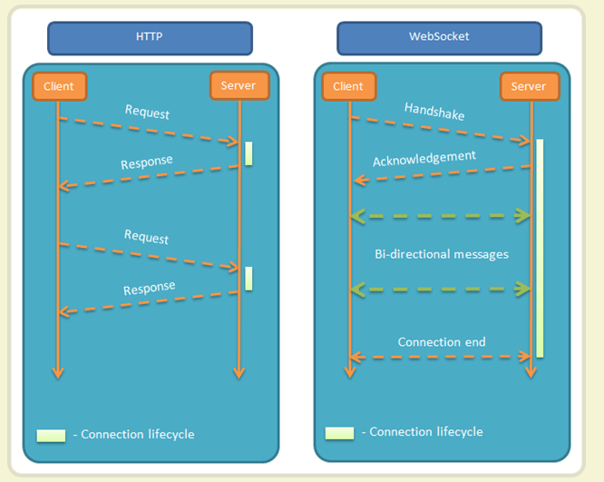

# websocket

> WebSocket 是一种数据通信协议，类似于我们常见的 http 协议。

## 为什么需要 WebSocket？

初次接触 WebSocket 的人，都会问同样的问题：我们已经有了 HTTP 协议，为什么还需要另一个协议？它能带来什么好处？

答案很简单，因为 HTTP 协议有一个缺陷：通信只能由客户端（浏览器、手机等）发起。

举例来说，我们想了解今天的天气，只能是客户端向服务器发出请求，服务器返回查询结果。HTTP 协议做不到服务器主动向客户端推送信息。

这种单向请求的特点，注定了如果服务器有连续的状态变化，客户端要获知就非常麻烦。我们只能使用["轮询"](https://www.pubnub.com/blog/2014-12-01-http-long-polling/)：每隔一段时候，就发出一个询问，了解服务器有没有新的信息。最典型的场景就是聊天室。

轮询的效率低，非常浪费资源（因为必须不停连接，或者 HTTP 连接始终打开）。因此，工程师们一直在思考，有没有更好的方法。WebSocket 就是这样发明的。

## websocket简介

WebSocket 协议在2008年诞生，2011年成为国际标准。所有浏览器都已经支持了。

它的最大特点就是，服务器可以主动向客户端推送信息，客户端也可以主动向服务器发送信息，是真正的双向平等对话，属于[服务器推送技术](https://en.wikipedia.org/wiki/Push_technology)的一种。

典型的websocket应用场景：

+ 即时通讯，，，客服
+ 聊天室 
+ 点餐




## websocket使用

1. 原生方式
2. 第三方包

### 原生方式

- 基于浏览器内置的 `WebSocket` 对象
- 步骤
  1. 创建 WebSocket 连接
  2. 监听 open 事件，看连接是否成功
  3. 双方进行双向通讯
  4. 关闭连接

```js
// 创建 WebSocket 连接
// http/https
// ws/wss
const socket = new WebSocket('wss://xxx.com')

// 建立连接成功
// open 事件：用于指定连接成功后的回调函数
socket.addEventListener('open', event => {
  // 给 服务器 发送消息
  socket.send('服务器你好，我是浏览器，我给你发消息了')
})

// 监听服务器返回的消息
// message 事件：用于指定当从服务器接受到信息时的回调函数
socket.addEventListener('message', event => {
  // event.data 是服务器发送回来的消息
  console.log('Message from server ', event.data)
})

// close 事件：用于指定连接关闭后的回调函数
socket.addEventListener('close', event => {
  // event.data 是服务器发送回来的消息
  console.log('Message from server ', event.data)
})

// --

// 关闭连接的 API：
socket.close()
```

### socket.io 的使用 

- 原生的 `WebSocket` 使用比较麻烦，实际开发中推荐使用第三方库：`socket.io`
  - 客户端包为：`socket.io-client`
- 资源：
  - 官网：https://socket.io/
  - 代码：https://github.com/socketio/socket.io
- 常用 API：
  - 建立连接 `const socketio = io('地址', {额外传参})` 等同于 原生websocket `new WebSocket()`
  - 收消息：`socketio.on('自定义消息名', data => {})`
  - 发消息：`socketio.emit('自定义消息名', '内容')`
  - 关闭链接：`socketio.close()`

## 小智同学

1. 安装并导入包：`yarn add socket.io-client`
   - io 是 `Input 和 Output` 的简称

```ts
import io from 'socket.io-client'
```

2. 在 useEffect 中，创建 websocket 连接

```ts
useEffect(() => {
  // 1. 建立连接
  const socketio = io('http://toutiao.itheima.net', {
    // 参数
    query: {
      token: getTokens().token
    },
    // 连接方式：
    transports: ['websocket']
  })

  // 2. 连接成功
  socketio.on('connect', () => {
    // 让小智给你打个招呼
    setList(list => [...list, { name: 'xz', msg: '您想知道点啥？' }])
  })

  // 3. 接收消息
  socketio.on('message', data => {
    // 服务器返回的消息
    setList(list => [...list, { name: 'xz', msg: data.msg }])
  })

  socketIO.current = socketio

  return () => socketio.close()
}, [])
```

```ts
useEffect(() => {
  chatListRef.current.scrollTop = chatListRef.current.scrollHeight
}, [list])

const onSend = e => {
  if (!value) return
  if (e.keyCode === 13) {
    // 3. 发信息
    socketIO.current.emit('message', { msg: value, timestamp: Date.now() })
    // 聊天记录
    setList([...list, { name: 'self', msg: value }])
    setValue('')
  }
}
```
