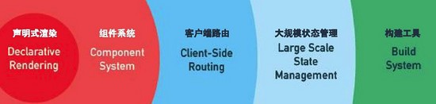

# Vue基本概念 


+ 为什么要学习vue   （vue/react/angular） jquery
  + 公司对vue有要求 [BOSS直聘](<https://www.zhipin.com/>)
  + 开发更加的效率和简洁，并且容易维护。

## vue介绍

- [vue 中文网](https://cn.vuejs.org/)  尤雨溪 
- [Vue.js 是什么](https://cn.vuejs.org/v2/guide/index.html#Vue-js-%E6%98%AF%E4%BB%80%E4%B9%88)
- Vue (读音 /vjuː/，类似于 **view**) 是一套用于构建用户界面的**渐进式javascript框架**。  

### 渐进式的概念

渐进式：逐渐增强，可以在项目中使用vue的一部分功能，也可以使用vue的全家桶来管理整个项目。

angular: 全家桶 



### 框架的概念

- [我们所说的前端框架与库的区别？](https://zhuanlan.zhihu.com/p/26078359?group_id=830801800406917120)

**Library**

+ 代表：jQuery  art-template moment  axios

+ 库，本质上是一些函数的集合。每次调用函数，实现一个特定的功能   工具箱

- 使用库的时候，把库当成工具使用，需要自己控制代码的执行逻辑。
- 写作文

**Framework**

+ 代表：vue、angular、react、bootstrap

+ 框架，是一套完整的解决方案

- 使用框架的时候，框架实现了大部分的功能，我们只需要按照框架的规则写代码
- 完形填空

**库和框架的区别**

+ 使用库的时候，很自由，只要调用库提供的各种各样的方法就行，也可以不用其他的一些方法
+ 使用框架的时候，需要按照框架的规则写代码，限制会非常多，但同时框架的功能也很强大，可以极大的提升开发的效率。

## vue是MVVM的框架

+ MVVM，一种软件架构模式，决定了写代码的方式。
  + M：model数据模型(ajax获取到的数据)	
  + V：view视图（页面）
  + VM：ViewModel 视图模型

- MVVM通过`数据双向绑定`让数据自动地双向同步  **不在需要操作DOM**
  - V（修改视图） -> M（数据自动同步）
  - M（修改数据） -> V（视图自动同步）


**1. 在vue中，不推荐直接手动操作DOM！！！**     

**2. 在vue中，通过数据驱动视图，不要在想着怎么操作DOM，而是想着如何操作数据！！**


## vue组件化思想

模块化：一个独立的js文件就是一个模块

组件化：一个组件会包含（HTML+CSS+JS） 把一个完整的页面拆分成多个组件构成。

组件 (Component) 是 Vue.js 最强大的功能之一。

在vue中都是组件化开发的，组件化开发就是把一个完整的页面分割成一个一个的小组件。


组件的优点：

+ 容易维护
+ 复用

## 开发vue的方式

开发vue有两种方式   

+ 传统开发模式：基于html/css/js文件开发vue 
+ 工程化开发方式：在webpack环境中开发vue，这是最推荐的方式。
+ 现代化的项目也都是在webpack环境下进行开发的。
  + 学习
  + 项目

# vue-cli的使用

> `vue-cli`也叫vue脚手架,`vue-cli`是vue官方提供的一个全局命令工具，这个命令可以帮助我们快速的创建一个vue项目的基础架子。

+ 开箱即用
+ 零配置
+ webpack、babel

## 基本使用

+ 全局安装命令 

```bash
npm install -g @vue/cli
# OR
yarn global add @vue/cli
```

+ 查看版本`vue`

```js
vue --version
```

+ 初始化一个vue项目

```js
vue create 项目名(不能用中文)
```

+ 启动项目

```
yarn serve
yarn build
```


## 如何覆盖webpack配置

> 注意：我们在项目无法找到webpack.config.js文件，因为vue把它隐藏。

如果需要覆盖webpack的配置，可以创建一个vue.config.js文件，覆盖webpack配置文件

```jsx
/* 覆盖webpack的配置 */
module.exports = {
  devServer: {
    open: true,
    port: 3000
  }
}
```


## 目录分析与清理


+ public/index.html不用动，提供一个最基础的页面
+ src/main.js不用动，  渲染了App.vue组件
+ src/App.vue默认有很多的内容，可以全部删除

```jsx
<template>
  <div>123</div>
</template>
```

+ assets文件夹与components直接删除

## vue单文件组件的说明

一个`.vue`文件就是一个组件,后续开发vue，所有的功能都是基于组件实现。

安装插件


一个单文件组件由三部分构成

+ template(必须)  影响组件渲染的结构  html
  + 只能有一个根元素
+ script                     逻辑   js
+ style                       样式   css less scss
  + style用于提供组件的样式，默认只能用css
  + 可以通过`lang="less"`开启less的功能，需要安装依赖包

```
yarn add less-loader@7.2.1 less -D
```


# vue的插值表达式

## vue通过data提供数据

> vue中通过template可以提供模板，但是这样的数据是写死的。

vue可以通过data提供数据，注意：`data必须是一个函数，并且返回一个对象`

```jsx
<script>
export default {
  data () {
    return {
      money: 100,
      msg: 'hello'
    }
  }    
}
</script>
```

## 通过插值表达式显示数据

插值表达式, 小胡子语法  mustach语法` {{  }}`

1. 作用:  使用 data 中的数据渲染视图（模板）

2. 基本语法, 支持三元运算符

   ```jsx
   {{ msg }}
   {{ obj.name }}
   {{ msg.toUpperCase() }}
   {{ obj.age > 18 ? '成年' : '未成年' }}
   ```

3. vue中插值表达式的注意点

   (1)  使用的数据在 data 中要存在

   ```jsx
   <h1>{{ gaga }}</h1>
   ```

   (2)  能使用表达式, 但是不能使用 if  for

   ```jsx
   <h1>{{ if (obj.age > 18 ) { }   }}</h1>
   ```

   (3)  不能在标签属性中使用

   ```jsx
   <h1 id="box" class="box" title="{{ msg }}"></h1>
   ```

## 安装vue开发者工具

+ 直接通过谷歌应用商店安装  需要梯子
+ 通过极简插件下载插件，本地安装。 https://chrome.zzzmh.cn/index

# vue指令

**vue指令, 实质上就是特殊的 html 标签属性, 特点:  v- 开头**

每个 v- 开头的指令, 都有着自己独立的功能, 将来vue解析时, 会根据不同的指令提供不同的功能

## v-bind指令

- 描述：插值表达式不能用在html的属性上，如果想要动态的设置html元素的属性，需要使用v-bind指令
- 作用：动态的设置html的属性
- 语法：`v-bind:title="msg"`
- 简写：`:title="msg"`

```html
<!-- 完整语法 -->
<a v-bind:href="url"></a>
<!-- 缩写 -->
<a :href="url"></a>
```

## v-on指令

### 基本使用

语法：
       1. v-on:事件名=“要执行的少量代码"
       2. v-on:事件名=“methods中的函数名"
       3. v-on:事件名=“methods中的函数名(实参)" 

+ 最基本的语法

  + `<button v-on:事件名="事件函数">按钮</button>`，需要在methods中提供事件处理函数

  ```jsx
  <button v-on:click="fn">搬砖</button>
  <button v-on:click="fn1">卖房</button>
  
    // 提供方法
    methods: {
      fn () {
        console.log('你好啊')
        // console.log(this)
        this.money++
      },
      fn1 () {
        this.money += 10000
      },
    }
  ```

+ 需要传递参数

  + `<button v-on:事件名="事件函数(参数)">按钮</button>`，需要在methods中提供事件函数，接受参数

  ```jsx
  <button v-on:click="addMoney(1)">搬砖</button>
  <button v-on:click="addMoney(10000)">卖房</button>
  
  methods: {
    addMoney (money) {
      this.money += money
    }
  }
  ```

+ 如果事件的逻辑足够简单，可以不提供函数

```jsx
<button v-on:click="money++">搬砖</button>
<button v-on:click="money += 10000">卖房</button>
```

### vue中获取事件对象(了解)

需求: 默认a标签点击会跳走,  希望阻止默认的跳转, 阻止默认行为  e.preventDefault()

vue中获取事件对象

(1) 没有传参, 通过形参接收 e

(2) 传参了, 通过$event指代事件对象 e

```jsx
<template>
  <div id="app">
    <a @click="fn" href="http://www.baidu.com">去百度</a>
    <a @click="fn2(100, $event)" href="http://www.baidu.com">去百度2</a>
  </div>
</template>

<script>
export default {
  methods: {
    fn(e) {
      e.preventDefault()
    },
    fn2(num, e) {
      e.preventDefault()
    }
  }
}
</script>
```

### v-on 事件修饰符

- vue中提供的事件修饰符

  .prevent 阻止默认行为

  .stop 阻止冒泡

```html
<div id="app">
  <a @click.prevent="fn" href="http://www.baidu.com">去百度</a>
</div>
```

### 按键修饰符

需求: 用户输入内容, 回车, 打印输入的内容

在监听键盘事件时，我们经常需要判断详细的按键。此时，可以为键盘相关的事件添加按键修饰符

- @keyup.enter  回车

- @keyup.esc  返回

```html
<div id="app">
  <input type="text" @keyup="fn"> <hr>
  <input type="text" @keyup.enter="fn2">
</div>

```


## v-if 和 v-show

### 基本使用

v-show 和 v-if 功能: 控制盒子的显示隐藏

1. v-show

   语法:  v-show="布尔值"    (true显示, false隐藏)

   原理:  实质是在控制元素的 css 样式,  `display: none;`

2. v-if   

   语法: v-if="布尔值"   (true显示, false隐藏)

   原理:  实质是在动态的创建 或者 删除元素节点

应用场景: 

- 如果是频繁的切换显示隐藏, 用 v-show

  v-if, 频繁切换会大量的创建和删除元素, 消耗性能

- 如果是不用频繁切换, 要么显示, 要么隐藏的情况, 适合于用 v-if

  v-if 是惰性的, 如果初始值为 false, 那么这些元素就直接不创建了, 节省一些初始渲染开销

```html
<template>
  <div id="app">
    <h1 v-show="isShow">v-show盒子-{{ msg }}</h1>
    <h1 v-if="isShow">v-if盒子-{{ msg }}</h1>
  </div>
</template>
```

### v-else 和 v-else-if

```html
<div id="app">
  <h1 v-if="isLogin">尊敬的超级vip, 你好</h1>
  <h1 v-else>你谁呀, 赶紧登陆~</h1>

  <hr>
  
  <h1 v-if="age >= 60">60岁以上, 广场舞</h1>
  <h1 v-else-if="age >= 30">30岁以上, 搓麻将</h1>
  <h1 v-else-if="age >= 20">20岁以上, 蹦迪</h1>
  <h1 v-else>20岁以下, 唱跳rap篮球</h1>
</div>

```

### 案例-折叠面板

需求: 点击展开或收起时，把内容区域显示或者隐藏

静态结构：

```jsx
<template>
  <div id="app">
    <h3>案例：折叠面板</h3>
    <div class="box">
      <div class="title">
        <h4>芙蓉楼送辛渐</h4>
        <!-- 按钮位置 -->
        <span class="btn">
          收起
        </span>
      </div>

      <!-- 切换显示隐藏的部分  -->
      <div class="container">
        <p>寒雨连江夜入吴,</p>
        <p>平明送客楚山孤。</p>
        <p>洛阳亲友如相问，</p>
        <p>一片冰心在玉壶。</p>
      </div>
    </div>
  </div>
</template>

<script>
export default {
  data() {
    return {
      
    }
  }
}
</script>

<style lang="less">
body {
  background-color: #ccc;
  #app {
    width: 400px;
    height: 320px;
    margin: 20px auto;
    background-color: #fff;
    border: 4px solid blueviolet;
    border-radius: 1em;
    box-shadow: 3px 3px 3px rgba(0, 0, 0, 0.5);
    padding: 1em 2em 2em;
    h3 {
      text-align: center;
    }
    .box {
      box-shadow: 0 1px 4px 0 rgba(0, 0, 0, 0.5);
      border-radius: 4px;
      border: 1px solid #ebeef5;
      background-color: #fff;
      overflow: hidden;
      color: #303133;
      transition: .3s;
    }
    .title {
      display: flex;
      justify-content: space-between;
      align-items: center;
      padding: 10px 20px;
    }
    .title h4 {
      line-height: 2;
      margin: 0;
    }
    .container {
      padding: 0 20px;
      border-top: 1px solid #ccc;
    }
    .btn {
      /* 鼠标改成手的形状 */
      cursor: pointer;
    }
  }
}
</style>
```

完整代码：

```jsx
<template>
  <div id="app">
    <h3>案例：折叠面板</h3>
    <div class="box">
      <div class="title">
        <h4>芙蓉楼送辛渐</h4>
        <!-- 按钮位置 -->
        <span class="btn" @click="isShow = !isShow">
          {{ isShow ? '收起' : '展开' }}
        </span>
      </div>

      <!-- 切换显示隐藏的部分 (数据驱动) -->
      <div v-show="isShow" class="container">
        <p>寒雨连江夜入吴,</p>
        <p>平明送客楚山孤。</p>
        <p>洛阳亲友如相问，</p>
        <p>一片冰心在玉壶。</p>
      </div>
    </div>
  </div>
</template>

<script>
export default {
  data() {
    return {
      isShow: true
    }
  }
}
</script>

<style lang="less">
body {
  background-color: #ccc;
  #app {
    width: 400px;
    height: 320px;
    margin: 20px auto;
    background-color: #fff;
    border: 4px solid blueviolet;
    border-radius: 1em;
    box-shadow: 3px 3px 3px rgba(0, 0, 0, 0.5);
    padding: 1em 2em 2em;
    h3 {
      text-align: center;
    }
    .box {
      box-shadow: 0 1px 4px 0 rgba(0, 0, 0, 0.5);
      border-radius: 4px;
      border: 1px solid #ebeef5;
      background-color: #fff;
      overflow: hidden;
      color: #303133;
      transition: .3s;
    }
    .title {
      display: flex;
      justify-content: space-between;
      align-items: center;
      padding: 10px 20px;
    }
    .title h4 {
      line-height: 2;
      margin: 0;
    }
    .container {
      padding: 0 20px;
      border-top: 1px solid #ccc;
    }
    .btn {
      /* 鼠标改成手的形状 */
      cursor: pointer;
    }
  }
}
</style>
```

## v-model

### 基本使用

**作用: 给表单元素使用, 双向数据绑定 ** 

1. 数据变化了, 视图会跟着变

2. 视图变化了, 数据要跟着变

   输入框内容变化了(监听用户的输入, 监听input事件), 数据要跟着变

语法: v-model='值'

```jsx
<input type="text" v-model="msg">
```

### v-model 处理其他表单元素

**v-model 会忽略掉表单元素原本的value, checked等初始值**

textarea, select, checkbox

### v-model 修饰符

- number

  如果想自动将用户的输入值, 用parseFloat转成数字类型, ，可以给 `v-model` 添加 `number` 修饰符：

  ```html
  <input v-model.number="age" type="number">
  ```

  如果这个值如果这个值无法转数字，则会返回原始的值。

- trim

  如果要自动过滤用户输入的首尾空白字符，可以给 `v-model` 添加 `trim` 修饰符：

  ```html
  <input v-model.trim="msg">
  ```

- lazy

  在`change`时而非`input`时更新，可以给 `v-model` 添加 `lazy` 修饰符：

  ```html
  <input v-model.lazy="msg">
  ```

案例：注册案例

## v-text 和 v-html

### v-text指令

- 解释：更新元素的 `textContent/innerText`。如果要更新部分的 `textContent` ，需要使用 `{{ Mustache }}` 插值。 

```html
<h1 v-text="msg"></h1>
```

### v-html指令

- 解释：更新DOM对象的` innerHTML`,html标签会生效

```html
<h1 v-html="msg"></h1>
```

**在网站上动态渲染任意 HTML 是非常危险的，因为容易导致 [XSS 攻击](https://en.wikipedia.org/wiki/Cross-site_scripting)。只在可信内容上使用 `v-html`，**永不**用在用户提交的内容上。** 

## v-for 

### 基本使用

 v-for 作用: 遍历对象和数组

1. 遍历数组 (常用)

```jsx
v-for="item in 数组名"  item每一项
v-for="(item, index) in 数组名"  item每一项 index下标

注意：item和index不是定死的，可以是任意的名字，但是需要注意 第一项是值  第二项是下标
```

2. 遍历对象 (一般不用)

```jsx
<!--
  v-for也可以遍历对象（不常用）
  v-for="(值, 键) in 对象"
-->
<ul>
  <li v-for="value in user" :key="value">{{value}}</li>
</ul>
<ul>
  <li v-for="(value, key) in user" :key="key">{{value}} ---{{key}}</li>
</ul>
```

3. 遍历数字

```jsx
<!-- 
  遍历数字
  语法： v-for="(item, index) in 数字"
  作用：遍历具体的次数 item从1开始  index下标从0开始的
-->
<ul>
  <li v-for="(item, index) in 10" :key="item">{{item}} ---{{index}}</li>
</ul>
```

### 虚拟DOM 和 diff算法

**vue就地复用策略：**Vue会尽可能的就地（同层级，同位置），对比虚拟dom，复用旧dom结构，进行差异化更新。

**虚拟dom**: 本质就是一个个保存节点信息, 属性和内容的 描述真实dom的 JS 对象

**diff算法：**

- 策略1：

  先同层级根元素比较，如果根元素变化，那么不考虑复用，整个dom树删除重建

  先同层级根元素比较，如果根元素不变，对比出属性的变化更新，并考虑往下递归复用。

- 策略2：

  对比同级兄弟元素时，默认按照**下标**进行对比复用。

  对比同级兄弟元素时，如果指定了 key，就会 **按照相同 key 的元素** 来进行对比。

### v-for 的key的说明***

1. 设置 和 不设置 key 有什么区别？

   - 不设置 key， 默认同级兄弟元素按照下标进行比较。
   - 设置了key，按照相同key的新旧元素比较。

2. key值要求是?

   - 字符串或者数值，唯一不重复
   - 有 id 用 id,  有唯一值用唯一值，实在都没有，才用索引

3. key的好处?

   key的作用：提高虚拟DOM的对比复用性能

以后：只要是写到列表渲染，都推荐加上 key 属性。且 key 推荐是设置成 id， 实在没有，就设置成 index


## 样式处理

###  v-bind 对于class的增强

v-bind 对于类名操作的增强, 注意点, :class 不会影响到原来的 class 属性

:class="对象/数组"

```jsx
<template>
  <div>
    <!-- 
      v-bind： 作用：设置动态属性
      v-bind针对 class和style 进行增强
      允许使用对象或者数组
        对象：如果键值对的值为true，那么就有这个，否则没有这个类
        数组：数组中所有的类都会添加到盒子上
    -->
    <!-- <div class="box" :class="isRed ? 'red': ''">123</div> -->
    <!-- <div class="box" :class="{red: isRed, pink: isPink}">123</div> -->
    <div class="box" :class="arr">123</div>
  </div>
</template>
```

### v-bind对于style 的增强

```jsx
<template>
  <div>
    <!-- 
      :style也可以使用对象或者数组
     -->
    <div class="box" :style="[styleObj1, styleObj2]">123</div>
  </div>
</template>
```

# 品牌列表案例


## 基本结构与样式

+ 结构

```jsx
<template>
  <div id="app">
    <!-- 卡片区域 -->
    <div class="card">
      <div class="card-header">
        添加品牌
      </div>
      <div class="card-body">
        <!-- 行内的表单 -->
        <form class="form-inline">
          <div class="col-auto">
            <label class="sr-only" for="inlineFormInputGroup"></label>
            <div class="input-group mb-2">
              <div class="input-group-prepend">
                <div class="input-group-text">品牌名称</div>
              </div>
              <input type="text" class="form-control">
            </div>
          </div>
          <div class="col-auto">
            <label class="sr-only" for="inlineFormInputGroup"></label>
            <div class="input-group mb-2">
              <div class="input-group-prepend">
                <div class="input-group-text">品牌价格</div>
              </div>
              <input type="text" class="form-control">
            </div>
          </div>
          <button type="button" class="btn btn-primary mb-2">添加</button>
        </form>
      </div>
    </div>

    <!-- 表格区域 -->
    <table class="table table-bordered mt-2">
      <thead>
        <tr>
          <th>#</th>
          <th>车辆名称</th>
          <th>车辆价格</th>
          <th>创建时间</th>
          <th>操作</th>
        </tr>
      </thead>
      <tbody>
        <tr>
          <td>1</td>
          <td>宝马3</td>
          <td>100</td>
          <td>2020-12-12</td>
          <td>
            <a href="#">删除</a>
          </td>
        </tr>
        <tr class="footer">
          <td>统计</td>
          <td colspan="2">
            总价钱：100
          </td>
          <td colspan="2">
            平均价：100
          </td>
        </tr>
      </tbody>
      <tbody>
        <tr>
          <td colspan="5" class="text-center">没有更多数据</td>
        </tr>
      </tbody>
    </table>
    <div>
      
    </div>
  </div>
</template>

<script>

export default {
}
</script>

<style lang="less">
#app {
  width: 60%;
  margin: 50px auto;
  a {
    margin-right: 5px;
  }
  .footer {
    background-color: rgba(0, 0, 0, .05);
  }
}
</style>
```

+ 记得安装less

```jsx
yarn add less less-loader@7.2.1 -D
```

+ 引入教学资料的bootstrap.css


```jsx
import Vue from 'vue'
import App from './App.vue'
// 导入bootstrap的样式
import './styles/bootstrap.css'
Vue.config.productionTip = false

new Vue({
  render: h => h(App),
}).$mount('#app')

```

+ 在styles中提供bootstrap的样式文件


## 列表渲染功能

+ 在data中提供数据

```jsx
data() {
  return {
    list: [
      { id: 1, brand: '奔驰S450', price: 120, time: new Date('2020-12-12') },
      { id: 2, brand: '奥迪A4', price: 30, time: new Date('2020-12-01') },
      { id: 3, brand: '五菱宏光', price: 8, time: new Date('2020-12-05') }
    ]
  }
}
```

+ 使用`v-for`指令进行渲染

```jsx
<tr v-for="(item, index) in list" :key="item.id">
  <td>{{index + 1}}</td>
  <td>{{item.brand}}</td>
  <td>{{item.price}} 万</td>
  <td>{{item.time}}</td>
  <td>
    <a href="#">删除</a>
  </td>
</tr>
```

## 没有更多数据的显示隐藏

```jsx
<tbody v-if="list.length > 0"> 
  ...
</tbody>
<tbody v-else>
  ...
</tbody>
```


## 品牌的删除功能

+ 给删除按钮注册点击事件，记得阻止默认行为

```jsx
<a href="#" @click.prevent="del(item.id)">删除</a>
```

+ 在methods中提供对应的方法

```js
methods: {
  del (id) {
    console.log(id)
    // 把list中对应id的数据给删除掉
    // const index = this.list.findIndex(item => item.id === id)
    // this.list.splice(index, 1)
    this.list = this.list.filter(item => item.id !== id)
  }
}
```


## 添加功能

+ 使用v-model获取品牌和价格

```jsx
<input type="text" class="form-control" v-model.trim="brand">
<input class="form-control" type="number" v-model.number="price">
```

+ 在data中提供brand和price

```jsx
data() {
  return {
    ...
    brand: '',
    price: ''
  }
},
```

+ 给添加按钮注册点击事件

```jsx
<button type="button" class="btn btn-primary mb-2" @click="add">添加</button>
```

+ 在methods中准备add方法

```js
add () {
  // 表单校验
  if (!this.brand) {
    alert('请输入品牌')
    return
  }
  if (!this.price) {
    alert('请输入价格')
    return
  }
  // 添加数据
  this.list.unshift({
    id: Date.now(),
    brand: this.brand,
    price: this.price,
    time: new Date()
  })
  // 清空表单
  this.brand = ''
  this.price = ''
}
```

# 过滤器

## 过滤器的基本使用

`过滤器（Filters）`是 vue 为开发者提供的功能，常用于文本的格式化。

过滤器可以用在两个地方：`插值表达式`和 `v-bind 属性绑定`。

过滤器由“管道符”`|`进行调用，示例代码如下：

```jsx
<!-- 通过过滤器对message进行过滤 -->
<p>{{message | 过滤器}}</p>

<!-- 通过过滤器对title进行过滤 -->
<div :title="title | 过滤器"></div>
```

## 定义过滤器

`局部过滤器`: 组件私有的过滤器，可以在 filters 节点中定义过滤器，该过滤器只能在当前组件中调用

```jsx
export default {
  filters: {
    upper (input) {
      return input.slice(0, 1).toUpperCase() + input.slice(1)
    }
  }
}
```

`全局过滤器`： 如果希望在多个 vue 组件之间共享过滤器，可以在`main.js`中通过`Vue.filter()`方法定义全局过滤器

```jsx
// 参数1： 过滤器名称
// 参数2： 过滤器函数，处理过滤逻辑
Vue.filter('upper', function (input) {
  return input.slice(0, 1).toUpperCase() + input.slice(1)
})
```

## 调用多个过滤器

> 过滤器可以串联地进行调用

```jsx
<template>
  <!-- 把msg的值，交给filterA进行处理 -->
  <!-- 把filterA处理的结果，再交给filterB进行处理 -->
  <!-- 最终把filterB处理，把最终的值渲染到页面 -->
  <div>{{msg | filterA | filterB}}</div>
</template>
```

案例：让单词首字母大写，且最多显示10个字符

## 过滤器传参

在使用过滤器的时候，可以额外传递参数

```jsx
// 使用过滤器的时候可以传递额外的参数
<p>{{msg | filterA(arg1, arg2)}}</p>

// 定义过滤器的时候，需要接收额外的参数
filters: {
  // 建议给过滤器的额外参数提供默认值
  filterA (input, arg1 = 0, arg2 = 1) {
    
  }
}
```

## 品牌管理中使用过滤器

+ 安装moment

```jsx
yarn add moment
```

+ 引入moment `App.vue`

```jsx
import moment from 'moment'
```

+ 在filters中定义过滤器

```jsx
filters: {
  // 格式化时间
  formatDate (input) {
    // 1. 自己格式化  2. 使用moment
    // console.log(input)
    // console.log(moment)
    return moment(input).format('YYYY-MM-DD HH:mm:ss')
  }
}
```

+ 在显示时间的地方使用过滤器

```jsx
<td>{{item.time | formatDate}}</td>
```


# 计算属性

## 基本使用

需求：翻转字符串案例

> 计算属性是一个属性，写法上是一个函数，这个函数的返回值就是计算属性最终的值。

> 1. 计算属性必须定义在 computed 节点中

> 2. 计算属性必须是一个 function,计算属性必须有返回值

> 3. 计算属性不能被当作方法调用,当成属性来用

定义计算属性

```jsx
// 组件的数据： 需要计算的属性
computed: {
  reverseMsg () {
    return this.msg.split('').reverse().join('')
  }
}
```

使用计算属性

```jsx
<p>{{ reverseMsg }}</p>
```

## 品牌管理案例-计算属性处理总价钱

+ 在computed中提供计算属性

```jsx
computed: {
  total: function () {
    // 把this.list中所有的价格加起来
    let total = 0
    this.list.forEach(item => total += +item.price)
    return total
  }
},
```

+ 在模板中直接渲染计算属性

```jsx
<td colspan="2">
  总价钱：{{ total }} 万
</td>
```

+ 平均价钱

```jsx
computed: {
  total: function () {
    // 把this.list中所有的价格加起来
    let total = 0
    this.list.forEach(item => total += +item.price)
    return total
  },
  avg () {
    return (this.total / this.list.length).toFixed(2)
  }
},
```

## 计算属性的缓存的问题

计算属性： 缓存

计算属性只要计算了一次，就会把结果缓存起来，以后多次使用计算属性，直接使用缓存的结果，只会计算一次。

计算属性依赖的属性一旦发生了改变，计算属性会重新计算一次，并且缓存

```jsx
// 计算属性只要计算了一次，就会把结果缓存起来，以后多次使用计算属性，直接使用缓存的结果，只会计算一次。
// 计算属性依赖的属性一旦发生了改变，计算属性会重新计算一次，并且缓存
export default {
  data () {
    return {
      msg: 'hello'
    }
  },
  computed: {
    reverseMsg() {
      console.log('我执行了')
      return this.msg.split('').reverse().join('')
    }
  }
}
```

## 计算属性的完整写法

```jsx
// 1. 计算属性默认情况下只能获取，不能修改。
// 2. 计算属性的完整写法
/* 
  computed: {
    full() {},
    full: {
      get() {
        return this.first + ' ' + this.last
      },
      set(value) {

      }
    }
  }
*/
computed: {
  full: {
    get () {
      ...
    },
    set (value) {
      ...
    }
  }
}
```

## 案例- 全选反选

> 目标: 完成全选和反选的功能

注意: 小选框都选中(手选/点反选), 全选自动选中

图示:


标签和数据准备(可复制):

```vue
<template>
  <div>
    <span>全选:</span>
    <input type="checkbox" />
    <button >反选</button>
    <ul>
      <li >
        <input type="checkbox" />
        <span>名字</span>
      </li>
    </ul>
  </div>
</template>

<script>
export default {
  data() {
    return {
      arr: [
        {
          name: "猪八戒",
          c: false,
        },
        {
          name: "孙悟空",
          c: false,
        },
        {
          name: "唐僧",
          c: false,
        },
        {
          name: "白龙马",
          c: false,
        },
      ],
    };
  }
};
</script>

<style>
</style>
```

正确答案(==不可复制==):

```html
<template>
  <div>
    <span>全选:</span>
    <!-- 4. v-model 关联全选 - 选中状态 -->
    <input type="checkbox" v-model="isAll"/>
    <button @click="btn">反选</button>
    <ul>
      <li v-for="(obj, index) in arr" :key="index">
        <!-- 3. 对象.c - 关联 选中状态 -->
        <input type="checkbox" v-model="obj.c"/>
        <span>{{ obj.name }}</span>
      </li>
    </ul>
  </div>
</template>

<script>
// 目标: 小选框 -> 全选
// 1. 标签+样式+js准备好
// 2. 把数据循环展示到页面上
export default {
  data() {
    return {
      arr: [
        {
          name: "猪八戒",
          c: false,
        },
        {
          name: "孙悟空",
          c: false,
        },
        {
          name: "唐僧",
          c: false,
        },
        {
          name: "白龙马",
          c: false,
        },
      ],
    };
  },
  // 5. 计算属性-isAll
  computed: {
    isAll: {
      set(val){
        // 7. 全选框 - 选中状态(true/false)
        this.arr.forEach(obj => obj.c = val)
      },
      get(){
        // 6. 统计小选框状态 ->  全选状态
        return this.arr.every(obj => obj.c === true)
      }
    }
  },
  methods: {
    btn(){
      // 8. 让数组里对象的c属性取反再赋予回去
      this.arr.forEach(obj => obj.c = !obj.c)
    }
  }
};
</script>

<style>
</style>
```

## 


# 属性监听

## 基本使用

当需要监听某个数据是否发生改变，就要用到watch

```jsx
/* 
  watch: {
    // 只要属性发生了改变，这个函数就会执行
    属性: function () {

    }
  }
*/
watch: {
  // 参数1： value    变化后的值
  // 参数2： oldValue 变化前的值
  msg (value, oldValue) {
    console.log('你变了', value, oldValue)
  }
}
```

## 复杂类型的监听-监听的完整写法

> 如果监听的是复杂数据类型，需要深度监听，需要指定deep为true,需要用到监听的完整的写法

```jsx
// 1. 默认情况下，watch只能监听到简单类型的数据变化,如果监听的是复杂类型，只会监听地址是否发生改变，不会监听对象内部属性的变化。
// 2. 需要使用监听的完整写法 是一个对象
watch: {
  // friend (value) {
  //   console.log('你变了', value)
  // }
  friend: {
    // handler 数据发生变化，需要执行的处理程序
    // deep: true  如果true,代表深度监听，不仅会监听地址的变化，还会监听对象内部属性的变化
    // immediate: 立即 立刻  是否立即监听 默认是false  如果是true,代表页面一加载，会先执行一次处理程序
    handler (value) {
      console.log('你变了', value)
    },
    deep: true,
    immediate: true
  }
},
```

## 品牌管理-监听数据进行缓存

+ 监听list的变化

```jsx
watch: {
  // 深度监听
  list: {
    deep: true,
    handler (value) {
      console.log('你变了', value)
      // 把value保存到localStorage中
      // localStorage只能储存字符串类型
      localStorage.setItem('brand-list', JSON.stringify(value))
    }
  }
}
```

+ 获取list数据的时候不能写死，从localStorage中获取

```jsx
data() {
  return {
    list: JSON.parse(localStorage.getItem('brand-list')) || [],
    brand: '',
    price: ''
  }
},
```


# 附加小练习

## 附加练习_1.买点书练习

> 目标: 把数据铺设到页面上, 当用户点击买书按钮, 书籍数量增加1, 并且要计算累计的和

演示:


标签结构和数据(复制接着写): 

```vue
<template>
  <div>
    <p>请选择你要购买的书籍</p>
    <ul>
    </ul>
    <table border="1" width="500" cellspacing="0">
      <tr>
        <th>序号</th>
        <th>书名</th>
        <th>单价</th>
        <th>数量</th>
        <th>合计</th>
      </tr>
    </table>
    <p>总价格为: </p>
  </div>
</template>

<script>
export default {
  data() {
    return {
      arr: [
        {
          name: "水浒传",
          price: 107,
          count: 0,
        },
        {
          name: "西游记",
          price: 192,
          count: 0,
        },
        {
          name: "三国演义",
          price: 219,
          count: 0,
        },
        {
          name: "红楼梦",
          price: 178,
          count: 0,
        },
      ],
    };
  }
};
</script>
```

正确答案(==不可复制==)

```vue
<template>
  <div>
    <p>请选择你要购买的书籍</p>
    <ul>
      <li v-for="(item, ind) in arr" :key="ind">
        <span>{{ item["name"] }}</span>
        <button @click="buy(ind)">买书</button>
      </li>
    </ul>
    <table border="1" width="500" cellspacing="0">
      <tr>
        <th>序号</th>
        <th>书名</th>
        <th>单价</th>
        <th>数量</th>
        <th>合计</th>
      </tr>
      <tr v-for="(item, index) in arr" :key="index">
        <td>{{ index + 1 }}</td>
        <td>{{ item["name"] }}</td>
        <td>{{ item["price"] }}</td>
        <td>{{ item["count"] }}</td>
        <td>{{ item["price"] * item["count"] }}</td>
      </tr>
    </table>
    <p>总价格为: {{ allPrice }}</p>
  </div>
</template>

<script>
export default {
  data() {
    return {
      arr: [
        {
          name: "水浒传",
          price: 107,
          count: 0,
        },
        {
          name: "西游记",
          price: 192,
          count: 0,
        },
        {
          name: "三国演义",
          price: 219,
          count: 0,
        },
        {
          name: "红楼梦",
          price: 178,
          count: 0,
        },
      ],
    };
  },
  methods: {
    buy(index) {
      this.arr[index]["count"]++;
    },
  },
  computed: {
    allPrice() {
      // 数组里放的是对象, 而对象是复杂类型, 引用关系, 值改变会触发计算属性重新执行
      return this.arr.reduce((sum, obj) => {
        return (sum += obj["price"] * obj["count"]);
      }, 0);
    },
  },
};
</script>

<style>
</style>
```

## 附加练习_2.求和

> 目标: 把用户选中的数字, 累计求和显示

提示: 

* v-model绑定的变量是数组, 可以收集checkbox的value属性呦

演示:


数据(复制):

```js
[9, 15, 19, 25, 29, 31, 48, 57, 62, 79, 87]
```

==此处不可复制==:正确答案:

```html
<template>
  <div>
    <!-- 无id时, 可以使用index(反正也是就地更新) -->
    <div
      v-for="(item, index) in arr"
      style="display: inline-block"
      :key="index"
    >
      <input type="checkbox" v-model="checkNumArr" :value="item" />
      <span>{{ item }}</span>
    </div>
    <p>你选中的元素, 累加的值和为: {{ theSum }}</p>
  </div>
</template>

<script>
export default {
  data() {
    return {
      arr: [9, 15, 19, 25, 29, 31, 48, 57, 62, 79, 87],
      checkNumArr: [], //  保存用户选中的数字
    };
  },
  computed: {
    theSum() {
      return this.checkNumArr.reduce((sum, val) => {
        return (sum += val);
      }, 0);
    },
  },
};
</script>

<style>
</style>
```

> 总结, 当计算属性函数里引用的vue变量发生改变, 函数就执行并重新返回结果并缓存起来