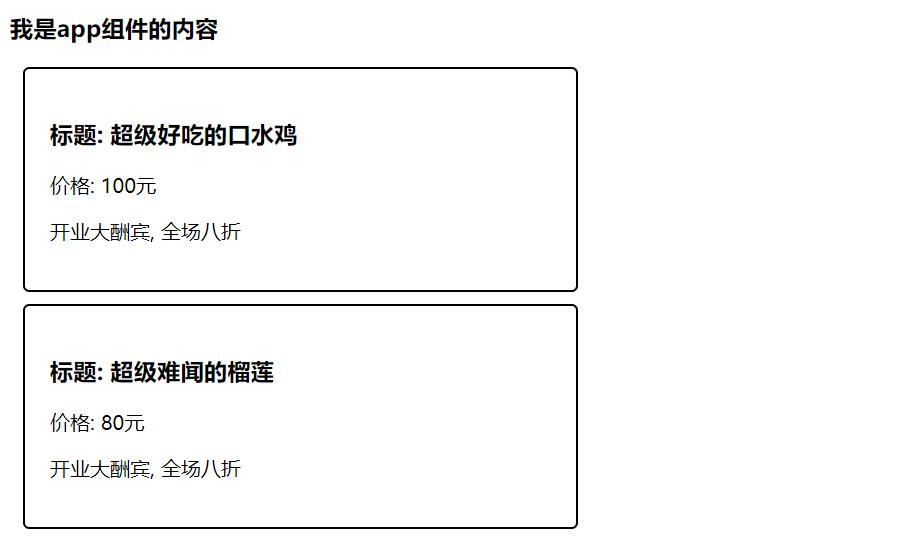
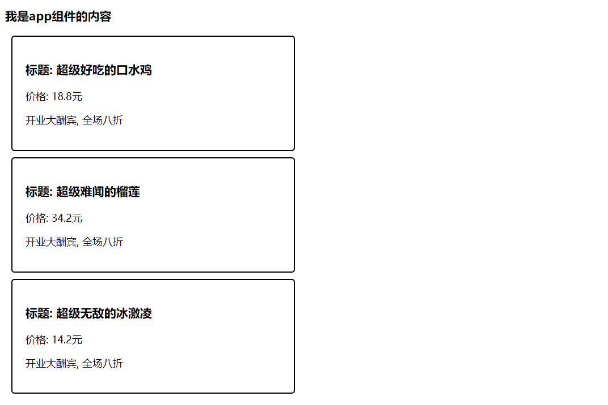
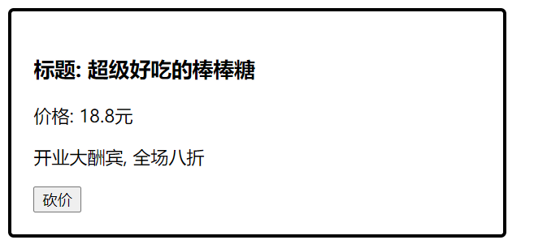
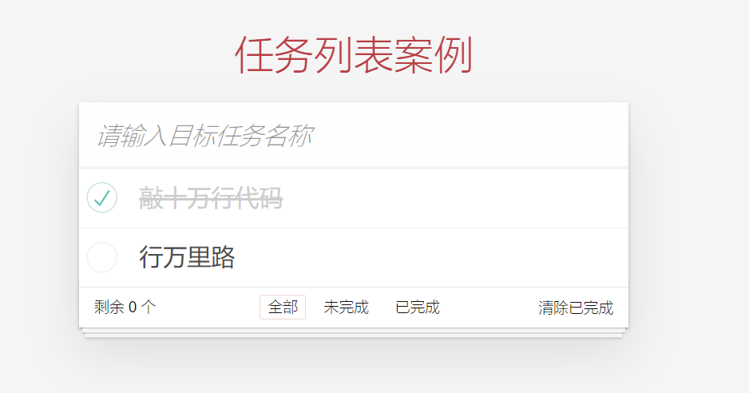
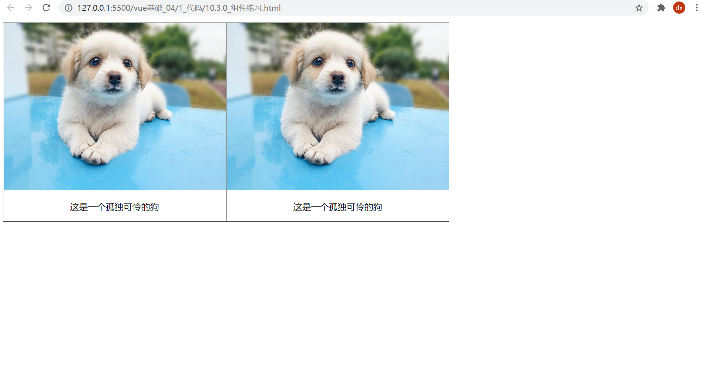
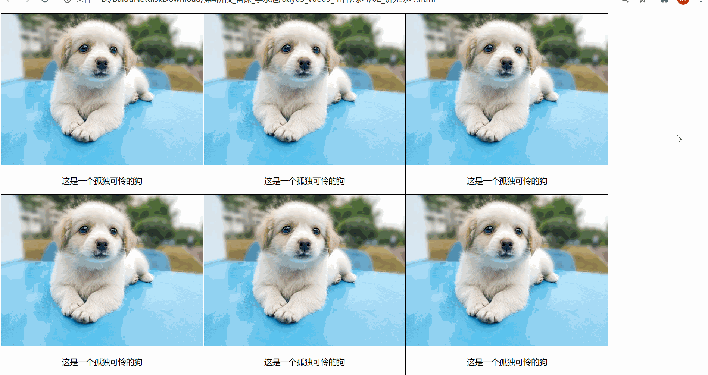
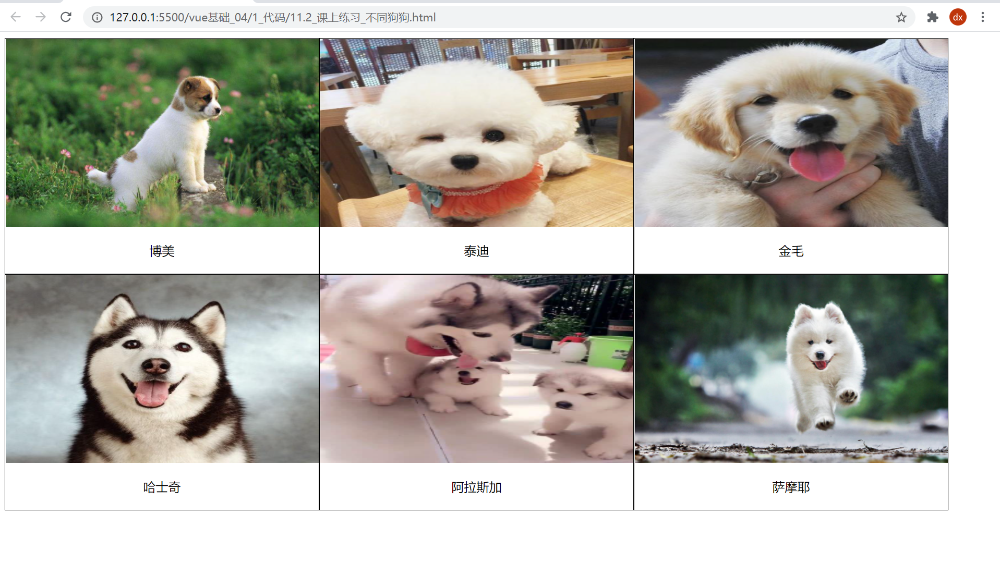

# 组件化开发

## 什么是组件化开发

**组件化开发** 指的是：根据封装的思想，把页面上 `可重用的部分` 封装为 `组件`，从而方便项目的 开发 和 维护。

**一个页面， 可以拆分成一个个组件，一个组件就是一个整体, 每个组件可以有自己独立的 结构 样式 和 行为**

例如：http://www.ibootstrap.cn/ 所展示的效果，就契合了组件化开发的思想。

用户可以通过拖拽组件的方式，快速生成一个页面的布局结构。


前端组件化开发的好处主要体现在以下两方面：

- 提高了前端代码的**复用性和灵活性**  

- 提升了开发效率和后期的**可维护性**

  

vue 是一个完全支持组件化开发的框架。vue 中规定组件的后缀名是 `.vue`。

## 组件的注册

刚才我们创建使用的是 App.vue 根组件, 这个比较特殊, 是最大的一个根组件

而App.vue根组件内, 还可以写入一些小组件, 而这些组件, 要使用, 就需要先注册!

**注册组件有两种注册方式**:  分为“全局注册”和“局部注册”两种

- 被全局注册的组件，可以在任意的组件模板范围中使用 通过`Vue.component()`
- 被局部注册的组件，只能在当前注册的组件模板范围内使用 通过`components`

### 局部注册

+ 把独立的组件封装一个`.vue文件中`，推荐放到`components`文件夹

```jsx
components
  -- HmHeader.vue
  -- HmContent.vue
  -- HmFooter.vue
```

+ 通过组件的`components`配置 局部注册组件

```jsx
import HmHeader from './components/HmHeader'
import HmContent from './components/HmContent'
import HmFooter from './components/HmFooter'

export default {
  // data methods filters computed watch
  components: {
    // 组件名: 组件
    // 组件名：注意，不能和html内置的标签重名
    // 使用的时候：直接通过组件名去使用
    // HmHeader  HmHeader  hm-header
    HmHeader,
    HmContent,
    HmFooter
  }
}
```

==注意点：注册的组件的名字不能和HTML内置的标签重名==

+ 可以在模板中使用组件，，，，使用组件和使用html的标签是一样的，，，可以多次使用

```jsx
<template>
  <div>
    <!-- 组件注册好了，就跟使用html标签一样了 -->
    <hm-header></hm-header>
    <hm-content></hm-content>
    <hm-footer></hm-footer>
  </div>
</template>
```

==局部注册的组件只能在当前组件中使用==

## 全局注册组件

+ 在`components`文件夹中创建一些新的组件

```jsx
components
  -- HmHeader.vue
  -- HmContent.vue
  -- HmFooter.vue
```

+ 在`main.js`中通过`Vue.component()`全局注册组件

```jsx
import HmHeader from './components/HmHeader'
import HmContent from './components/HmContent'
import HmFooter from './components/HmFooter'

// 全局注册
// Vue.component(名字, 组件)
Vue.component('HmHeader', HmHeader)
Vue.component('HmContent', HmContent)
Vue.component('HmFooter', HmFooter)
```

+ 使用

```jsx
<template>
  <div>
    <!-- 组件注册好了，就跟使用html标签一样了 -->
    <hm-header></hm-header>
    <hm-content></hm-content>
    <hm-footer></hm-footer>
  </div>
</template>
```

==注意：全局注册的组件 可以在任意的组件中去使用==


### 组件名的大小写

在进行组件的注册时，定义组件名的方式有两种：

- 注册使用短横线命名法，例如 hm-header 和 hm-main

  ```js
  Vue.component('hm-button', HmButton)
  ```

  使用时 `<hm-button> </hm-button>`

- 注册使用大驼峰命名法，例如 HmHeader 和 HmMain

  ```jsx
  Vue.component('HmButton', HmButton)
  ```

  使用时 `<HmButton> </HmButton>` 和 `<hm-button> </hm-button>`  都可以

推荐定义组件名时, 用大驼峰命名法, 更加方便

全局注册

```jsx
Vue.component('HmButton', HmButton)
```

局部注册:

```jsx
components: {
  HmHeader,
  HmMain,
  HmFooter
}
```

使用时, 推荐遵循html5规范, 小写横杠隔开

```jsx
<hm-header></hm-header>
<hm-main></hm-main>
<hm-footer></hm-footer>
```

### 通过 name 注册组件 (了解)

> 组件在开发者工具中显示的名字可以通过name进行修改

在注册组件期间，除了可以直接提供组件的注册名称之外，还可以把组件的 name 属性作为注册后组件的名称

组件内容:

```jsx
<template>
  <button>按钮组件</button>
</template>

<script>
export default {
  name: 'HmButton'
}
</script>

<style lang="less">
button {
  width: 80px;
  height: 50px;
  border-radius: 5px;
  background-color: pink;
}
</style>
```

进行注册:

```jsx
import HmButton from './components/hm-button.vue'
Vue.component(HmButton.name, HmButton)  // 等价于 app.component('HmButton', HmButton)
```

## 组件的样式冲突  `scoped`

默认情况下，写在组件中的样式会`全局生效`，因此很容易造成多个组件之间的样式冲突问题。

组件样式默认会作用到全局, 就会影响到整个 index.html 中的 dom 元素

- `全局样式`: 默认组件中的样式会作用到全局

- `局部样式`: 可以给组件加上 scoped 属性, 可以让样式只作用于当前组件

```jsx
<style lang="less" scoped>
div {
  background-color: pink;
}
</style>
```

原理:

1. 添加scoped后, 会给当前组件中所有元素, 添加上一个自定义属性

   

2. 添加scoped后,  每个style样式, 也会加上对应的属性选择器

   

最终效果: 必须是当前组件的元素, 才会有这个自定义属性, 才会被这个样式作用到

# 组件通信

每个组件都有自己的数据, 提供在data中, 每个组件的数据是独立的, 组件数据无法互相直接访问 (合理的)

但是如果需要跨组件访问数据, 就需要用到组件通信

组件通信的方式有很多: 现在先关注两种,  父传子  子传父

##  准备代码1

`App.vue`

```jsx
<template>
  <div class="content">
    <MyProduct></MyProduct>
  </div>
</template>

<script>
import MyProduct from './components/MyProduct.vue'
export default {
  data() {
    return {
      title: '香辣鸡腿堡',
      price: '20元',
      info: '买一送一'
    }
  },      
  // 局部注册
  components: {
    MyProduct
  }
}
</script>

<style>

</style>
```

## 准备代码2

`src/components/MyProduct.vue`

```jsx
<template>
  <div class="my-product">
    <h3>标题：超级好吃的口水鸡</h3>
    <p>价格：50元</p>
    <p>开业大酬宾,全场8折</p>
  </div>
</template>

<script>
export default {
}
</script>

<style lang="less" scoped>
.my-product {
  padding: 20px;
  border: 3px solid #000;
  border-radius: 10px;
  width: 400px;
  margin: 10px;
}
</style>
```


## 组件通信 - 父传子 props 传值

语法:

1. 父组件通过给子组件加属性传值

```jsx
<MyProduct price="100" title="不错" :info="msg"></MyProduct>
```

2. 子组件中, 通过props属性接收

```js
props: ['price', 'title', 'info']
```

**需求: 封装一个商品组件 my-product**



`my-product.vue`

```vue
<template>
  <div class="my-product">
    <h3>标题: {{ title }}</h3>
    <p>价格: {{ price }}元</p>
    <p>{{ info }}</p>
  </div>
</template>

<script>
export default {
  props: ['title', 'price', 'info']
}
</script>

<style>
.my-product {
  width: 400px;
  padding: 20px;
  border: 2px solid #000;
  border-radius: 5px;
  margin: 10px;
}
</style>
```


## v-for 遍历展示组件练习

**需求: 遍历展示商品列表**

假定, 发送请求回来的商品数据, 

```jsx
list: [
  { id: 1, proname: '超级好吃的棒棒糖', proprice: 18.8 },
  { id: 2, proname: '超级好吃的大鸡腿', proprice: 34.2 },
  { id: 3, proname: '超级无敌的冰激凌', proprice: 14.2 }
]
```

v-for 遍历展示

```jsx
<template>
  <div class="container">
    <h3>我是app组件的内容</h3>
    <my-product 
      v-for="item in list" :key="item.id" 
      :price="item.proprice" 
      :title="item.proname" 
      :info="msg">
    </my-product>
  </div>
</template>
```



## 单向数据流

```jsx
/* 
  在vue中需要遵循单向数据流原则
  1. 父组件的数据发生了改变，子组件会自动跟着变
  2. 子组件不能直接修改父组件传递过来的props  props是只读的
*/
```

==如果父组件传给子组件的是一个对象，子组件修改对象的属性，是不会报错的，，，，也应该避免==

## 组件通信 - 子传父

**需求: 砍价**



1. 子组件可以通过 `this.$emit('事件名', 参数1, 参数2, ...)` 触发事件的同时传参的

   ```jsx
   this.$emit('sayPrice', 2)
   ```

2. 父组件给子组件注册一个自定义事件

   ```jsx
   <my-product 
     ...
     @sayPrice="sayPrice">
   </my-product>
   ```

   父组件并提供对应的函数接收参数

   ```jsx
   methods: {
     sayPrice (num) {
       console.log(num)
     }
   },
   ```

## props 校验

**props 是父传子, 传递给子组件的数据, 为了提高 子组件被使用时 的稳定性, 可以进行props校验**, 验证传递的数据是否符合要求

默认的数组形式, 不会进行校验, 如果希望校验, 需要提供对象形式的 props

```jsx
props: {
	...
}
```

props 提供了多种数据验证方案，例如：

- 基础的类型检查  Number
- 多个可能的类型 [String, Number]
- 必填项校验   required: true
- 默认值 default: 100
- 自定义验证函数

官网语法: [地址](https://cn.vuejs.org/v2/guide/components-props.html#Prop-%E9%AA%8C%E8%AF%81)

```js
{
  props: {
    // 基础的类型检查
    propA: Number,
    // 多个可能的类型
    propB: [String, Number],
    // 必填的字符串
    propC: {
      type: String,
      required: true
    },
    // 带有默认值的数字
    propD: {
      type: Number,
      default: 100
    },
    // -------------------------------------------------------------------------
    // 自定义验证函数
    propF: {
      validator: function (value) {
        // 这个值必须匹配下列字符串中的一个
        return ['success', 'warning', 'danger'].indexOf(value) !== -1
      }
    }
  }
}
```


# 任务列表案例



## 封装组件

+ 封装三个组件`TodoHeader.vue,  TodoMain.vue, TodoFooter.vue`

+ 在`App.vue`局部注册三个组件

```jsx
import TodoHeader from './components/TodoHeader'
import TodoMain from './components/TodoMain'
import TodoFooter from './components/TodoFooter'
export default {
  // 局部注册组件
  components: {
    TodoHeader,
    TodoMain,
    TodoFooter
  },
}
```

+ 在`App.vue`渲染3个组件

```jsx
<template>
  <section class="todoapp">
    <todo-header></todo-header>
    <todo-main></todo-main>
    <todo-footer></todo-footer>
  </section>
</template>
```

+ 在`main.js`中导入通用的样式

```jsx
import './styles/base.css'
import './styles/index.css'
```

## 列表的渲染

+ 在`App.vue`提供了任务列表数据

```jsx
data () {
  return {
    list: [
      { id: 1, name: '吃饭', isDone: true },
      { id: 2, name: '睡觉', isDone: false },
      { id: 3, name: '打豆豆', isDone: true }
    ]
  }
}
```

+ App.vue通过父传子，把list数据传给`TodoMain.vue`

```jsx
    <!-- 父传子 -->
    <todo-main :list="list"></todo-main>
```

+ `TodoMain.vue`接受数据，且渲染

```html
props: {
  list: {
    type: Array,
    required: true,
  },
},

<ul class="todo-list">
  <!-- completed: 完成的类名 -->
  <li :class="{completed: item.isDone}" v-for="item in list" :key="item.id">
    <div class="view">
      <input class="toggle" type="checkbox" v-model="item.isDone">
      <label>{{item.name}}</label>
      <button class="destroy"></button>
    </div>
    <input class="edit" value="Create a TodoMVC template">
  </li>
</ul>
```

## 任务删除功能

+ 给删除按钮注册点击事件

```jsx
<button class="destroy" @click="del(item.id)"></button>
```

+ 通过$emit把值传给父组件

```jsx
methods: {
  del (id) {
    // console.log(id)
    this.$emit('del', id)
  }
}
```

+ 父组件给子组件注册事件

```jsx
<todo-main :list="list" @del="delFn"></todo-main>
```

+ 父组件通过回调函数接受参数

```js
methods: {
  delFn (id) {
    // 把id过滤掉
    this.list = this.list.filter(item => item.id !== id)
  }
}
```


## 任务状态修改功能

+ 把`v-model`改成了`:checked`

`v-model`和父组件双向数据绑定，违反单向数据流的原则。

```jsx
<input class="toggle" type="checkbox" :checked="item.isDone" >
```

+ 给checkbox注册change事件

```jsx
<input class="toggle" type="checkbox" :checked="item.isDone" @change="change(item.id)">
```

+ 子传父，让父组件修改

```jsx
change (id) {
  this.$emit('change', id)
}
```

+ 父组件注册事件

```jsx
<todo-main :list="list" @del="delFn" @change="changeFn"></todo-main>
```

+ 父组件修改状态

````jsx
changeFn (id) {
  const result = this.list.find(item => item.id === id)
  result.isDone = !result.isDone
}
````


## 任务的添加功能

+ 在`TodoHeader.vue`组件中通过v-model获取到任务的名字

````jsx
<input class="new-todo" placeholder="What needs to be done?" autofocus v-model.trim="name">
  
data () {
  return {
    name: ''
  }
},
````

+ 回车的时候，需要子传父，把名字传给父组件

```jsx
<input class="new-todo" placeholder="What needs to be done?" autofocus v-model.trim="name" @keyup.enter="add">

methods: {
  add () {
    // 子传父
    this.$emit('add', this.name)
    // 清空内容
    this.name = ''
  }
}
```

+ 父组件接受name，并且添加

```jsx
<todo-header @add="addFn"></todo-header>

addFn (name) {
  this.list.unshift({
    id: Date.now(),
    name,
    isDone: false
  })
}
```

## 剩余任务的统计功能

+ 父传子，把list传给`TodoFooter.vue`组件

```jsx
<todo-footer :list="list"></todo-footer>
```

+ footer组件通过props接收传递过来的数据

```jsx
props: {
  list: {
    type: Array,
    required: true,
  },
},
```

+ footer组件提供了一个计算属性，用于统计未完成的任务

```jsx
computed: {
  leftCount () {
    // 统计的未完成的任务的数量
    return this.list.filter(item => item.isDone === false).length
  }
}
```

+ 显示剩余任务的条数

```js
<footer class="footer" v-if="list.length > 0">
  
  
<span class="todo-count">
  <strong>{{ leftCount }}</strong> item left
</span>
```

## 清空功能

+ 提供计算属性，用于控制清空按钮的显示和隐藏

```js
computed: {
  // 获取所有未完成的任务的数量
  leftCount() {
    const arr = this.list.filter((item) => !item.isDone)
    return arr.length
  },
  // 如果list中有一个或者多个完成的任务，就应该显示
  isShowClear() {
    return this.list.some((item) => item.isDone)
  },
},
```

+ 通过v-show控制显示隐藏, 注册了点击事件

```html
<button v-show="isShowClear" class="clear-completed" @click="clear">
  Clear completed
</button>
```

+ 触发clear事件

```js
methods: {
  clear() {
    // 清空已经完成的任务  过滤，保留未完成的任务
    this.$emit('clear')
  },
},
```

+ 父组件清空已经完成的任务

```js
<TodoFooter :list="list" @clear="clearFn"></TodoFooter>

clearFn() {
  // console.log('清空')
  this.list = this.list.filter((item) => item.isDone === false)
},
```

## 底部筛选功能-点击高亮

+ 给3个a注册点击事件

```diff
<li>
  <a
+    @click.prevent="filter('all')"
    :class="{ selected: type === 'all' }"
    href="#/"
    >All</a
  >
</li>
<li>
  <a
+    @click.prevent="filter('active')"
    href="#/active"
    :class="{ selected: type === 'active' }"
    >Active</a
  >
</li>
<li>
  <a
+    @click.prevent="filter('completed')"
    href="#/completed"
    :class="{ selected: type === 'completed' }"
    >Completed</a
  >
</li>
```

+ 准备type数据，记录点击的按钮

```js
data() {
  return {
    type: 'all',
  }
},

filter(type) {
  this.type = type
},
```

+ 动态控制 selected类名

```diff
<li>
  <a
    @click.prevent="filter('all')"
+    :class="{ selected: type === 'all' }"
    href="#/"
    >All</a
  >
</li>
<li>
  <a
    @click.prevent="filter('active')"
    href="#/active"
+    :class="{ selected: type === 'active' }"
    >Active</a
  >
</li>
<li>
  <a
    @click.prevent="filter('completed')"
    href="#/completed"
+   :class="{ selected: type === 'completed' }"
    >Completed</a
  >
</li>
```

子传父 - 将类型 type 传递给 App.vue

```jsx
filter (type) {
  this.type = type
  this.$emit('filter', type)
}
```

提供计算属性完成切换

```jsx
computed: {
  showList () {
    if (this.type === 'completed') { // 显示已完成
      return this.list.filter(item => item.isDone === true)
    } else if (this.type === 'active') { // 显示未完成
      return this.list.filter(item => item.isDone === false)
    } else {
      return this.list // 全部显示
    }
  }
}
```


## 本地存储

- 监视数组的变化

```jsx
watch: {
  list: {
    deep: true,
    handler(newValue) {
      localStorage.setItem('todoList', JSON.stringify(newValue))
    }
  }
}
```

- data中默认使用本地的数据

```jsx
data(){
    return {
        list: JSON.parse(localStorage.getItem('todoList')) || [],
    }
},
```


## 全选功能

+ `TodoMain.vue`提供一个计算属性，用于控制 全选的状态

```js
isCheckAll() {
  return this.list.every((item) => item.isDone === true)
}
```

+ 给全选案例v-model双向绑定

```jsx
<input
  id="toggle-all"
  class="toggle-all"
  type="checkbox"
  v-model="isCheckAll"
/>
```

+ 计算属性默认无法修改，不支持双向绑定, 修改时子传父

```js
// 要求：list中isDone全部为true,才能是true  否则是false
isCheckAll: {
  get() {
    return this.list.every((item) => item.isDone === true)
  },
  set(value) {
    // console.log(value)
    this.$emit('checkAll', value)
  },
},
```

+ 父组件接受value值，并且修改

```jsx
<TodoMain
  @checkAll="checkAllFn"
></TodoMain>

checkAllFn(value) {
  this.list.forEach((item) => (item.isDone = value))
},
```


# 附加练习

## 附加练习_1.喜欢小狗狗吗

> 目标: 封装Dog组件, 用来复用显示图片和标题的

效果:



----

正确答案(==先不要看==)

components/practise/Dog1.vue

```html
<template>
  <div class="my_div">
    
    <p>这是一个孤独可怜的狗</p>
  </div>
</template>

<script>
export default {};
</script>

<style>
.my_div {
  width: 200px;
  border: 1px solid black;
  text-align: center;
  float: left;
}

.my_div img {
  width: 100%;
  height: 200px;
}
</style>
```

在App.vue中使用

```vue
<template>
  <div>
    <Dog></Dog>
    <Dog/>
  </div>
</template>

<script>
import Dog from '@/components/practise/Dog1'
export default {
  components: {
    Dog
  }
}
</script>

<style>

</style>
```

> 总结: 重复部分封装成组件, 然后注册使用

## 附加练习_2.点击文字变色

> 目标: 修改Dog组件, 实现组件内点击变色

提示: 文字在组件内, 所以事件和方法都该在组件内-独立

图示:



正确代码(==先不要看==)

components/practise/Dog2.vue

```html
<template>
  <div class="my_div">
    
    <p :style="{backgroundColor: colorStr}" @click="btn">这是一个孤独可怜的狗</p>
  </div>
</template>

<script>
export default {
  data(){
    return {
      colorStr: ""
    }
  },
  methods: {
    btn(){
      this.colorStr = `rgb(${Math.floor(Math.random() * 256)}, ${Math.floor(Math.random() * 256)}, ${Math.floor(Math.random() * 256)})`
    }
  }
};
</script>

<style>
.my_div {
  width: 200px;
  border: 1px solid black;
  text-align: center;
  float: left;
}

.my_div img {
  width: 100%;
  height: 200px;
}
</style>
```

## 附加练习_3. 循环展示狗狗

> 目标: 把数据循环用组件显示铺设

数据:

```js
[
    {
        dogImgUrl:
        "http://nwzimg.wezhan.cn/contents/sitefiles2029/10146688/images/21129958.jpg",
        dogName: "博美",
    },
    {
        dogImgUrl:
        "https://ss2.bdstatic.com/70cFvnSh_Q1YnxGkpoWK1HF6hhy/it/u=1224576619,1307855467&fm=26&gp=0.jpg",
        dogName: "泰迪",
    },
    {
        dogImgUrl:
        "https://ss2.bdstatic.com/70cFvnSh_Q1YnxGkpoWK1HF6hhy/it/u=2967740259,1518632757&fm=26&gp=0.jpg",
        dogName: "金毛",
    },
    {
        dogImgUrl:
        "https://pic1.zhimg.com/80/v2-7ba4342e6fedb9c5f3726eb0888867da_1440w.jpg?source=1940ef5c",
        dogName: "哈士奇",
    },
    {
        dogImgUrl:
        "https://timgsa.baidu.com/timg?image&quality=80&size=b9999_10000&sec=1563813435580&di=946902d419c3643e33a0c9113fc8d780&imgtype=0&src=http%3A%2F%2Fvpic.video.qq.com%2F3388556%2Fd0522aynh3x_ori_3.jpg",
        dogName: "阿拉斯加",
    },
    {
        dogImgUrl:
        "https://timgsa.baidu.com/timg?image&quality=80&size=b9999_10000&sec=1563813454815&di=ecdd2ebf479568453d704dffacdfa12c&imgtype=0&src=http%3A%2F%2Fwww.officedoyen.com%2Fuploads%2Fallimg%2F150408%2F1-15040Q10J5B0.jpg",
        dogName: "萨摩耶",
    },
]
```

图示:



正确代码(==不可复制==)

components/practise/Dog3.vue

```vue
<template>
  <div class="my_div">
    
    <p :style="{ backgroundColor: colorStr }" @click="btn">{{ dogname }}</p>
  </div>
</template>

<script>
export default {
  props: ["imgurl", "dogname"],
  data() {
    return {
      colorStr: "",
    };
  },
  methods: {
    btn() {
      this.colorStr = `rgb(${Math.floor(Math.random() * 256)}, ${Math.floor(
        Math.random() * 256
      )}, ${Math.floor(Math.random() * 256)})`;

      
    },
  },
};
</script>

<style scoped>
.my_div {
  width: 200px;
  border: 1px solid black;
  text-align: center;
  float: left;
}

.my_div img {
  width: 100%;
  height: 200px;
}
</style>
```

App.vue引入使用把数据循环传给组件显示

```vue
<template>
  <div>
    <Dog v-for="(obj, index) in arr"
    :key="index"
    :imgurl="obj.dogImgUrl"
    :dogname="obj.dogName"
    ></Dog>
  </div>
</template>

<script>
import Dog from '@/components/practise/Dog3'
export default {
  data() {
    return {
      // 1. 准备数据
      arr: [
        {
          dogImgUrl:
            "http://nwzimg.wezhan.cn/contents/sitefiles2029/10146688/images/21129958.jpg",
          dogName: "博美",
        },
        {
          dogImgUrl:
            "https://ss2.bdstatic.com/70cFvnSh_Q1YnxGkpoWK1HF6hhy/it/u=1224576619,1307855467&fm=26&gp=0.jpg",
          dogName: "泰迪",
        },
        {
          dogImgUrl:
            "https://ss2.bdstatic.com/70cFvnSh_Q1YnxGkpoWK1HF6hhy/it/u=2967740259,1518632757&fm=26&gp=0.jpg",
          dogName: "金毛",
        },
        {
          dogImgUrl:
            "https://pic1.zhimg.com/80/v2-7ba4342e6fedb9c5f3726eb0888867da_1440w.jpg?source=1940ef5c",
          dogName: "哈士奇",
        },
        {
          dogImgUrl:
            "https://timgsa.baidu.com/timg?image&quality=80&size=b9999_10000&sec=1563813435580&di=946902d419c3643e33a0c9113fc8d780&imgtype=0&src=http%3A%2F%2Fvpic.video.qq.com%2F3388556%2Fd0522aynh3x_ori_3.jpg",
          dogName: "阿拉斯加",
        },
        {
          dogImgUrl:
            "https://timgsa.baidu.com/timg?image&quality=80&size=b9999_10000&sec=1563813454815&di=ecdd2ebf479568453d704dffacdfa12c&imgtype=0&src=http%3A%2F%2Fwww.officedoyen.com%2Fuploads%2Fallimg%2F150408%2F1-15040Q10J5B0.jpg",
          dogName: "萨摩耶",
        },
      ],
    };
  },
  components: {
    Dog
  }
};
</script>
```

## 附加练习_4.选择喜欢的狗

> 目标: 用户每点击一次狗狗的名字, 就在右侧列表多显示一次名字

效果:


正确代码(==不可复制==)

components/practise/Dog4.vue

```vue
<template>
  <div class="my_div">
    
    <p :style="{ backgroundColor: colorStr }" @click="btn">{{ dogname }}</p>
  </div>
</template>

<script>
export default {
  props: ["imgurl", "dogname"],
  data() {
    return {
      colorStr: "",
    };
  },
  methods: {
    btn() {
      this.colorStr = `rgb(${Math.floor(Math.random() * 256)}, ${Math.floor(
        Math.random() * 256
      )}, ${Math.floor(Math.random() * 256)})`;

      // 补充: 触发父级事件
      this.$emit("love", this.dogname);
    },
  },
};
</script>

<style scoped>
.my_div {
  width: 200px;
  border: 1px solid black;
  text-align: center;
  float: left;
}

.my_div img {
  width: 100%;
  height: 200px;
}
</style>
```

App.vue

```vue
<template>
  <div>
    <Dog
      v-for="(obj, index) in arr"
      :key="index"
      :imgurl="obj.dogImgUrl"
      :dogname="obj.dogName"
      @love="fn"
    ></Dog>

    <hr />
    <p>显示喜欢的狗:</p>
    <ul>
      <li v-for="(item, index) in loveArr" :key="index">{{ item }}</li>
    </ul>
  </div>
</template>

<script>
import Dog from "@/components/practise/Dog4";
export default {
  data() {
    return {
      // 1. 准备数据
      arr: [
        {
          dogImgUrl:
            "http://nwzimg.wezhan.cn/contents/sitefiles2029/10146688/images/21129958.jpg",
          dogName: "博美",
        },
        {
          dogImgUrl:
            "https://ss2.bdstatic.com/70cFvnSh_Q1YnxGkpoWK1HF6hhy/it/u=1224576619,1307855467&fm=26&gp=0.jpg",
          dogName: "泰迪",
        },
        {
          dogImgUrl:
            "https://ss2.bdstatic.com/70cFvnSh_Q1YnxGkpoWK1HF6hhy/it/u=2967740259,1518632757&fm=26&gp=0.jpg",
          dogName: "金毛",
        },
        {
          dogImgUrl:
            "https://pic1.zhimg.com/80/v2-7ba4342e6fedb9c5f3726eb0888867da_1440w.jpg?source=1940ef5c",
          dogName: "哈士奇",
        },
        {
          dogImgUrl:
            "https://timgsa.baidu.com/timg?image&quality=80&size=b9999_10000&sec=1563813435580&di=946902d419c3643e33a0c9113fc8d780&imgtype=0&src=http%3A%2F%2Fvpic.video.qq.com%2F3388556%2Fd0522aynh3x_ori_3.jpg",
          dogName: "阿拉斯加",
        },
        {
          dogImgUrl:
            "https://timgsa.baidu.com/timg?image&quality=80&size=b9999_10000&sec=1563813454815&di=ecdd2ebf479568453d704dffacdfa12c&imgtype=0&src=http%3A%2F%2Fwww.officedoyen.com%2Fuploads%2Fallimg%2F150408%2F1-15040Q10J5B0.jpg",
          dogName: "萨摩耶",
        },
      ],
      loveArr: []
    };
  },
  components: {
    Dog,
  },
  methods: {
    fn(dogName) {
      this.loveArr.push(dogName)
    },
  },
};
</script>

<style >
</style>
```

## 