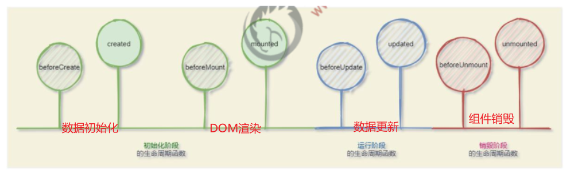
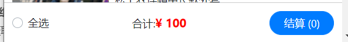
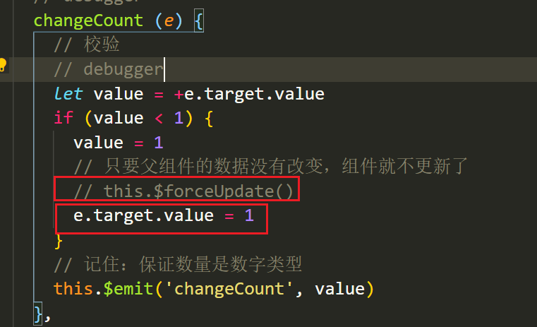

# 非父子组件通讯

> 非父子组件通讯，没有办法使用父子通讯，可以使用通用的组件通讯解决方案：event bus
>
> event bus适用于任意的两个组件进行通讯

## 步骤

> Jack组件给Rose组件发数据

+ 在`main.js`中创建 bus对象，并且挂到Vue的原型上，保证所有的vue组件都能访问到

```js
// 1. 创建event bus
// 实质上 bus就是一个空的vue实例
// 2. 把bus挂载到Vue的原型上，所有的组件都能够通过 this.bus访问到 bus对象
const bus = new Vue()
Vue.prototype.bus = bus
```

+ Jack需要通过bus发布事件

```js
methods: {
  fn() {
    // 发布消息
    this.bus.$emit('aa', this.msg)
  },
},
```

+ Rose通过bus监听事件（订阅事件）

```js
// 钩子函数,,,组件只要创建，就会立即执行created函数
created() {
  // 给bus订阅事件
  this.bus.$on('aa', (msg) => {
    console.log('接收到消息', msg)
    this.msg = msg
  })
}, 
```

注意点：订阅事件的时候，通过bus进行订阅的，所以订阅事件的函数需要写成 **箭头函数**

# 组件通讯终极解决方案-vuex

> vuex 

# 生命周期

## 研究生命周期的意义

生命周期 => 一个事物从出生 到 消亡的全部过程 

生命周期（Life Cycle）是指一个组件从`创建`-> `运行` -> `销毁`的整个阶段，强调的是一个时间段

- 张三出生，表示这个人生命周期的开始
- 张三离世，表示这个人生命周期的结束
- 中间张三的一生，就是张三的生命周期

我们可以把`每个 vue 组件运行的过程`，也概括为生命周期：

- vue 组件的初始化，表示生命周期的开始
- vue 组件的销毁，表示生命周期的结束
- vue 组件中间运行的过程，就是组件的生命周期


## 生命周期函数(钩子函数)

**生命周期函数：是由 vue 框架提供的内置函数，会伴随着组件的生命周期，自动按次序执行。**

生命周期函数的作用：允许程序员在`特定的时间点`，执行某些特定的操作。

例如，组件创建完毕后，可以在created 生命周期函数中发起Ajax 请求，从而初始化 data 数据。

## 组件生命周期分类

vue 组件的生命周期函数，可以分为 3 大类：

- 组件`初始化阶段`的生命周期函数
- 组件`运行阶段`的生命周期函数
- 组件`销毁阶段`的生命周期函数



```js
1. beforeCreate：data数据初始化之前，组件还没有数据
2. created: data数据初始化之后，可以获取到组件的数据
3. beforeMount：DOM渲染之前，DOM还没渲染
4. mounted：DOM渲染之后，可以操作DOM了
5. beforeUpdate: 数据更新，DOM更新前
6. updated: 数据更新，DOM更新后
7. beforeDestroy: 组件销毁前
8. destroyed: 组件销毁后
```


# axios的使用

原生ajax发请求

+ jquery的$.ajax
+ axios

1. axios 是什么 ?

   就是一个 发送  ajax  请求的工具。类似于`$.ajax`

   axios 底层, 就是 原生 ajax, 只是它内部是通过 promise 封装的

   https://github.com/axios/axios/

   https://www.kancloud.cn/yunye/axios/234845

2. axios的基本使用

```jsx
axios({
  method: '请求方式', // get post
  url: '请求地址',
  data: {    // 拼接到请求体的参数,  post请求的参数
    xxx: xxx,
  },
  params: {  // 拼接到请求行的参数, get请求的参数
   	xxx: xxx 
  }
}).then(res => {
  console.log(res.data) // 后台返回的结果
}).catch(err => {
  console.log(err)
})

```


# 案例：图书列表案例

## 结构准备

1. 拷贝教学资料的结构 .vue 到 src 中，改名App.vue
2. 安装 bootstrap

```jsx
yarn add bootstrap@3.4.1
```

3. main.js 导入 bootstrap

```js
import  'bootstrap/dist/css/bootstrap.css'
```

4. 安装axios

```
yarn add axios
```

接口地址： https://www.showdoc.com.cn/ajaxapi?page_id=3753516951471746


## 获取数据 - 列表渲染

1. 设置基础地址

```jsx
import axios from 'axios'
axios.defaults.baseURL = 'http://www.liulongbin.top:3006'
```

2. created发送请求获取数据

```jsx
async created() {
  // 发送请求，获取图书的列表
  const res = await axios({
    methods: 'get',
    url: '/api/getbooks'
  })
  const { status, data } = res.data
  if (status === 200) {
    this.list = data
  }
},
```

3. 动态渲染

```jsx
<tbody id="tb">
  <tr v-for="(item, index) in list" :key="item.id">
    <td>{{ index + 1 }}</td>
    <td>{{ item.bookname }}</td>
    <td>{{ item.author }}</td>
    <td>{{ item.publisher }}</td>
    <td>
      <a
        href="javascript:;"
        class="btn btn-danger delete"
        >删 除</a
      >
    </td>
  </tr>
</tbody>
```


## 添加功能

1 给添加按钮注册点击事件

```jsx
<button id="btnAdd" class="btn btn-primary" @click="add">添加</button>
```

2 提供方法

```jsx
async add () {
  if (!this.bookname || !this.author || !this.publisher) {
    alert('请输入信息')
    return
  }
  const res = await axios({
    method: 'post',
    url: '/api/addbook',
    data: {
      bookname: this.bookname,
      author: this.author,
      publisher: this.publisher
    }
  })

  if (res.data.status === 201) {
    this.getList()
    this.bookname = ''
    this.author = ''
    this.publisher = ''
  } else {
    alert ('添加失败')
  }
}
```

3 封装获取数据的方法 getList

```jsx
async getList () {
  // 发送请求，获取图书的列表
  const res = await axios({
    methods: 'get',
    url: '/api/getbooks'
  })
  const { status, data } = res.data
  if (status === 200) {
    this.list = data
  }
},
```


## 删除功能

1 注册点击事件

```jsx
<a
  href="javascript:;"
  class="btn btn-danger delete"
  @click="del(item.id)"
  >删 除</a
>
```

2 提供方法

```jsx
async del (id) {
  const res = await axios({
    method: 'delete',
    url: '/api/delbook',
    params: {
      id
    }
  })
  const { status, msg } = res.data
  if (status === 200) {
    this.getList()
    alert('删除成功')
  } else {
    alert(msg)
  }
}
```


# 购物车综合案例


## 基本步骤

1. 初始化项目基本结构
2. 封装 MyHeader 组件
3. 封装 MyFooter 组件
4. 基于 axios 请求商品列表数据
5. 封装 MyGoods 组件
6. 封装 MyCounter 组件

## 项目初始化

1. 创建项目

```txt
vue created shopcar-demo
```

2. 安装依赖 下载bootstrap, less, less-loader@7.2.1

```txt
yarn add bootstrap less less-loader@7.2.1
```

3. 清理目录

4. 引入bootstrap样式文件

```jsx
// main.js 
import "bootstrap/dist/css/bootstrap.css"
```


## 封装my-header 组件


### 静态结构

+ 新建`components/MyHeader.vue`

```jsx
<template>
  <div class="my-header">我是标题</div>
</template>

<script>
export default {

}
</script>

<style lang="less" scoped>
  .my-header {
    height: 45px;
    line-height: 45px;
    text-align: center;
    background-color: #1d7bff;
    color: #fff;
    position: fixed;
    top: 0;
    left: 0;
    width: 100%;
  }
</style>
```

+ 在main.js中引入且局部注册

### 封装要求

1. 允许用户自定义  **title 标题**
2. 允许用户自定义  bgcolor **背景色**
3. 允许用户自定义  color  **字体颜色**


```jsx
<template>
    <div 
      class="my-header" 
      :style="{ backgroundColor: bgcolor, color: color }"
    >{{ title }}</div>
</template>

<script>
export default {
  props: {
    // 背景色, 文字颜色, 文本内容
    bgcolor: {
      type: String,
      default: '#1d7bff'
    },
    title: {
      type: String,
      default: '大标题'
    },
    color: {
      type: String,
      default: 'white'
    }
  }
}
</script>
```

问题：如果以后遇到了组件内不希望写死的内容，可以怎么操作呢？


## 封装 my-footer 组件



1 准备底部结构, 样式

```jsx
<template>
  <!-- 底部 -->
  <div class="my-footer">
    <!-- 全选 -->
    <div class="custom-control custom-checkbox">
      <input type="checkbox" class="custom-control-input" id="footerCheck">
      <label class="custom-control-label" for="footerCheck">全选</label>
    </div>
    <!-- 合计 -->
    <div>
      <span>合计:</span>
      <span class="price">¥ 100</span>
    </div>
    <!-- 按钮 -->
    <button type="button" class="footer-btn btn btn-primary">结算 (0)</button>
  </div>
</template>

<script>
export default {

}
</script>

<style lang="less" scoped>
.my-footer {
  position: fixed;
  bottom: 0;
  width: 100%;
  height: 50px;
  border-top: 1px solid #ccc;
  display: flex;
  justify-content: space-between;
  align-items: center;
  padding: 0 10px;
  background: #fff;

  .price {
    color: red;
    font-weight: bold;
    font-size: 15px;
  }
  .footer-btn {
    min-width: 80px;
    height: 30px;
    line-height: 30px;
    border-radius: 25px;
    padding: 0;
  }
}
</style>
```

2 使用底部组件

```jsx
<my-footer></my-footer>

import MyFooter from './components/my-footer.vue'
export default {
  name: 'App',
  components: {
    MyHeader,
    MyFooter
  }
}
```

## 封装GoodsItem组件

```jsx
<template>
  <div class="my-goods-item">
    <div class="left">
      <div class="custom-control custom-checkbox">
        <input type="checkbox" class="custom-control-input" id="input">
        <label class="custom-control-label" for="input">
          
        </label>
      </div>
    </div>
    <div class="right">
      <div class="top">商品名称</div>
      <div class="bottom">
        <span class="price">¥ 商品价格</span>
        <span>counter组件</span>
      </div>
    </div>
  </div>
</template>

<script>
export default {
}
</script>

<style lang="less" scoped>
.my-goods-item {
  display: flex;
  padding: 10px;
  border-bottom: 1px solid #ccc;
  .left {
    img {
      width: 120px;
      height: 120px;
      margin-right: 8px;
      border-radius: 10px;
    }
    .custom-control-label::before,
    .custom-control-label::after {
      top: 50px;
    }
  }
  .right {
    flex: 1;
    display: flex;
    flex-direction: column;
    justify-content: space-between;
    .bottom {
      display: flex;
      justify-content: space-between;
      padding: 5px 0;
      .price {
        color: red;
        font-weight: bold;
      }
    }
  }
}

</style>
```

处理样式

+ App.vue样式处理

```less
<style>
#app {
  padding-top: 45px;
  padding-bottom: 50px;
}
</style>
```


## 发送axios请求获取数据

**思考：在哪个位置发送请求？**

1 安装 axios

```
yarn add axios
```

2 在 `App.vue` created 中, 发送请求获取列表数据, 存到 goodsList 中

```jsx
data () {
  return {
    goodsList: []
  }
},
// 发送请求
async created () {
  const res = await axios({
    method: 'get',
    url: 'https://www.escook.cn/api/cart'
  })
  // console.log(res)
  const { status, list } = res.data
  if (status === 200) {
    this.goodsList = list
  }
}
```

## 动态渲染商品列表

+ 遍历GoodsItem组件

```jsx
<goods-item v-for="item in goodsList" :key="item.id" :goods="item"></goods-item>
```

+ GoodsItem接受数据

```jsx
<script>
export default {
  props: {
    goods: Object
  }
}
</script>
```

+ GoodsItem数据渲染

```html
<template>
  <div class="my-goods-item">
    <div class="left">
      <div class="custom-control custom-checkbox">
        <input type="checkbox" class="custom-control-input" :id="goods.id" :checked="goods.goods_state">
        <label class="custom-control-label" :for="goods.id">
          
        </label>
      </div>
    </div>
    <div class="right">
      <div class="top">{{goods.goods_name}}</div>
      <div class="bottom">
        <span class="price">¥ {{goods.goods_price}}</span>
        <span>counter组件</span>
      </div>
    </div>
  </div>
</template>
```

## 商品选中功能

1 `GoodsItem.vue` 完成基本选中效果,  注册change事件

```jsx
<input type="checkbox" class="custom-control-input" :id="goods.id" :checked="goods.goods_state" @change="change(goods.id)">
```

2 `GoodsItem.vue`子传父

```jsx
methods: {
  change (id) {
    this.$emit('changeState', id)
  }
}
```

3 `app.vue` 接收, 进行处理

```jsx
<goods-item 
  v-for="item in goodsList" 
  :key="item.id" 
  :goods="item"
  @changeState="change"
></goods-item>

change (id) {
  const good = this.goodsList.find(item => item.id === id)
  good.goods_state = !good.goods_state
}
```

## 商品全选功能

+ App.vue 父传子将数据传递给footer组件

```jsx
<my-footer :goodsList="goodsList"></my-footer>
```

+ Footer组件接受

```js
export default {
  props: {
    goodsList: {
      type: Array
    }
  }
}
</script>
```

+ Footer组件提供计算属性

```jsx
computed: {
  full: {
    get () {
      return this.goodsList.every(item => item.goods_state)
    }
  }
}
```

+ 双向绑定

```jsx
<input type="checkbox" class="custom-control-input" id="footerCheck" v-model="full">
```

+ 修改功能

```jsx
computed: {
  full: {
    get () {
      return this.goodsList.every(item => item.goods_state)
    },
    set (value) {
      this.$emit('changeAll', value)
    }
  }
}
```

+ 父组件修改

```jsx
<my-footer :goodsList="goodsList" @changeAll="changeAll"></my-footer>

changeAll (value) {
  this.goodsList.forEach(item => item.goods_state = value)
}
```

## 总价钱与总数量的显示

+ 提供计算属性 且渲染

```jsx
totalCount () {
    const arr = this.goodsList.filter(item => item.goods_state)
    return arr.reduce((prev, item) => prev + item.goods_count * item.goods_price, 0)
},
totalPrice () {
    const arr = this.goodsList.filter(item => item.goods_state)
    return arr.reduce((prev, item) => prev + item.goods_count, 0)
}
```

## MyCount组件封装

### 基本结构

```jsx
<template>
  <div class="my-counter">
    <button type="button" class="btn btn-light">-</button>
    <input type="number" class="form-control inp" value="1">
    <button type="button" class="btn btn-light">+</button>
  </div>
</template>

<script>
export default {

}
</script>

<style lang="less" scoped>
.my-counter {
  display: flex;
  .inp {
    width: 45px;
    text-align: center;
    margin: 0 10px;
  }
}
</style>
```

+ GoodsItem组件注册且使用

```jsx
import MyCount from './MyCount'
export default {
  components: {
    MyCount
  },
}
```

+ 渲染

```jsx
<my-count></my-count>
```

### 输入框值的处理

+ 父传子，传入数量

```jsx
<my-count :count="goods.goods_count"></my-count>
```

+ 子组件接收

```jsx
<script>
export default {
  props: {
    count: {
      type: Number,
      default: 1
    }
  }
}
</script>
```

+ 子组件显示，注册事件进行修改

```jsx
<input type="text" class="form-control inp" :value="count" @change="inputFn">
```

+ 子组件将值传递给父组件

```jsx
methods: {
  inputFn (e) {
    let num = parseInt(e.target.value)
    this.$emit('changeCount', num)
  }
}
```

+ 父组件接收，且传给父组件

```jsx
<my-count @changeCount="changeCount" :count="goods.goods_count"></my-count>

changeCount (count) {
  this.$emit('changeCount', this.goods.id, count)
}
```

+ App.vue中监听

```jsx
<goods-item 
  v-for="item in goodsList" 
  :key="item.id" 
  :goods="item"
  @changeState="change"
  @changeCount="changeCount"
></goods-item>

changeCount (id, count) {
  console.log(id, count)
  const goods = this.goodsList.find(item => item.id === id)
  goods.goods_count = count
}
```

### 加减处理

+ 注册事件

```html
<template>
  <div class="my-counter">
    <button type="button" @click="minus" class="btn btn-light">-</button>
    <input type="number" class="form-control inp" :value="count" @change="inputFn">
    <button type="button" @click="add" class="btn btn-light">+</button>
  </div>
</template>
```

+ 提供方法

```jsx
add () {
  this.$emit('changeCount', this.count + 1)
},
minus () {
  if (this.count <= 1) {
    return
  }
  this.$emit('changeCount', this.count - 1)
}
```

## 非法值处理

+ 通过debugger打断点分析原因

加了一个判断，如果输入的值是负数，让value值直接为1，父组件的数据没有发生改变，会导致组件不更新，input的值没有发生改变

+ 解决

如果 负数，让父组件的数据变成1，并且强制更新组件，或者手动让input框的值变成1

