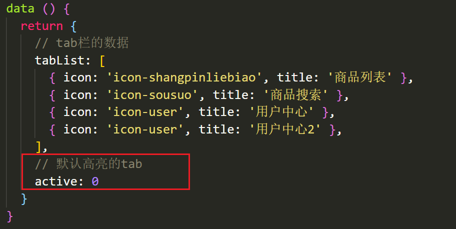
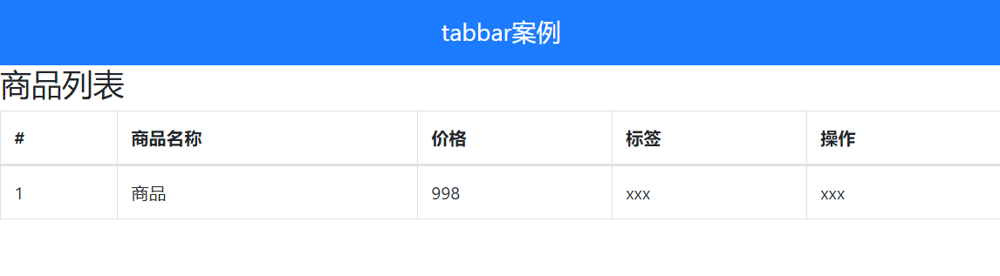

# ref 和 $refs 

利用 ref 和 $refs 可以用于获取 dom 元素, 或者组件实例

每个 vue 的组件实例上，都包含一个$refs 对象，里面存储着对应的DOM 元素或组件的引用。

1 给需要获取的 dom 元素或者组件, 添加 ref 属性

```jsx
<div>
  <div ref="box">我是div盒子</div>
  <jack ref="jack"></jack>
  <button @click="fn">按钮</button>
</div>
```

2 通过 `this.$refs.xxx` 获取, 拿到组件可以调用组件的方法

```jsx
import Jack from './jack.vue'
export default {
  methods: {
    fn () {
      console.log(this.$refs.box)
      console.log(this.$refs.jack)
      this.$refs.jack.sayHi()
    }
  },
  components: {
    Jack
  }
}
```

# $nextTick

**需求1: 点击按钮, 切换显示输入框**

```vue
<template>
  <div>
    <!-- 需求: 点击按钮, 切换显示输入框 -->
    <input type="text" v-if="isShowInput">
    <button @click="fn" v-else>点此搜索</button>
  </div>
</template>

<script>
export default {
  data () {
    return {
      isShowInput: false
    }
  },
  methods: {
    fn () {
      this.isShowInput = true
    }
  }
}
</script>
```

**需求2: 显示输入框的同时, 要获取焦点**

当文本框展示出来之后，如果希望它立即获得焦点，则可以为其添加 ref 引用，并调用原生 DOM 对象的.focus() 方法即可。

直接调用会报错, 因为 vue 是 异步dom更新的 (提升渲染效率),  `this.isShowInput = true` 执行完时, 实际的 dom 还没渲染出来

```jsx
<input ref="inp" type="text" v-if="isShowInput">

fn () {
  this.isShowInput = true
  this.$refs.inp.focus()
}
```

组件的 `$nextTick(callback)` 方法，会把 callback 回调推迟到下一个 DOM 更新周期之后执行。

通俗的理解是：**等组件的DOM 刷新之后，再执行 callback 回调函数**。从而能保证 callback 函数可以操作到最新的 DOM 元素。

```vue
<template>
  <div>
    <!-- 需求: 点击按钮, 切换显示输入框 -->
    <input ref="inp" type="text" v-if="isShowInput">
    <button @click="fn" v-else>点此搜索</button>
  </div>
</template>

<script>
export default {
  data () {
    return {
      isShowInput: false
    }
  },
  methods: {
    fn () {
      this.isShowInput = true
      this.$nextTick(() => {
        this.$refs.inp.focus()
      })
    }
  }
}
</script>
```


# dynamic 动态组件

## 动态组件的基本使用

什么是动态组件:   让多个组件使用同一个挂载点，并动态切换，这就是动态组件 

```vue
<template>
  <div>
    <h3>动态组件的演示</h3>
    <!-- 动态组件 => 多个组件使用同一个挂载点, 并可以动态的切换展示 -->
    <button @click="comName = 'my-swiper'">swiper</button>
    <button @click="comName = 'my-nav'">nav</button>
    
    <!-- 
      <my-nav></my-nav>
      <my-swiper></my-swiper> 
    -->
    <component :is="comName"></component>
  </div>
</template>

<script>
import MyNav from './my-nav.vue'
import MySwiper from './my-swiper.vue'
export default {
  data () {
    return {
      comName: 'my-nav'
    }
  },
  components: {
    MyNav,
    MySwiper
  }
}
</script>
```

## 使用 keep-alive 保持状态

默认情况下，切换动态组件时无法保持组件的状态。会将组件销毁, 将来显示时, 又会重新创建

此时可以使用vue 内置的 `<keep-alive>` 组件保持动态组件的状态。

使用 keep-alive 包裹动态组件时，会缓存不活动的组件实例，而不是销毁它们

```jsx
<keep-alive>
  <component :is="comName"></component>
</keep-alive>
```

==注意：缓存的组件是不会被销毁的，所以beforeDestroy和Destroyed两个钩子函数不会执行==

```jsx
缓存组件有两个新增的钩子函数
// 缓存的组件还有额外的两个钩子函数
// 缓存组件激活的时候触发
activated () {
  console.log('login组件激活了')
},
// 缓存组件失活的时候触发
deactivated () {
  console.log('login组件失活了')
}
```


# 插槽

插槽（Slot）是 vue 为组件的封装者提供的能力。

允许开发者在封装组件时，把不确定的、希望由用户指定的部分定义为插槽。

## 默认插槽 slot

**需求: 要在页面中显示一个对话框, 封装成一个组件**


通过父传子, 固然可以完成一定层面的组件的定制, 但是自定义性较差, 

如果希望能够自定义组件内部的一些结构 => 就需要用到插槽


**插槽作用: 用于实现组件的内容分发, 通过 slot 标签, 可以接收到写在组件标签内的内容**

插槽：slot  作用：占位置

基本示例:

```jsx
<my-dialog>
  <p>请输入正确的手机号码</p>
</my-dialog>
```

`my-dialog.vue`

```less
<template>
  <div class="my-dialog">
    <div class="header">
      <h3>友情提示</h3>
    </div>
    <div class="content">
      <slot></slot>
    </div>
    <div class="footer">
      <button>关闭</button>
    </div>
  </div>
</template>

<script>
export default {

}
</script>

<style lang="less" scoped>
.my-dialog {
  width: 400px;
  padding: 10px 20px;
  border: 3px solid #000;
  border-radius: 5px;
  margin: 10px;
}
</style>
```


## 后备内容 (默认值)

封装组件时，可以为预留的 `<slot>` 插槽提供后备内容（默认内容）。

如果组件的使用者没有为插槽提供任何内容，则后备内容会生效。

```jsx
<template>
  <div class="my-dialog">
    <div class="header">
      <h3>友情提示</h3>
    </div>
    <div class="content">
      <slot>这是后备内容</slot>
    </div>
    <div class="footer">
      <button>关闭</button>
    </div>
  </div>
</template>
```


## 具名插槽

### 插槽的分类:

**1 默认插槽(匿名插槽)**

`<slot></slot>` 只要没有具体分发的内容, 都会给到默认插槽

`<slot name="default"></slot>` 是默认插槽完整的写法 和 `<slot></slot>` 完全等价

**2 具名插槽: 具有名字的插槽 (配置了名字),  可以实现定向分发**

一旦配置了名字, 只会接收对应的内容, 不是分发给他的, 就不要


### 具名插槽的使用步骤

(1) 给插槽起名字 

```jsx
<div class="header">
  <slot name="header"></slot>
</div>
<div class="content">
  <slot>这是后备内容</slot>
</div>
<div class="footer">
  <slot name="footer"></slot>
</div>
```

(2) 需要使用 template 标签, 将内容包裹成一个整体

(3) 通过 v-slot:插槽名, 指定具体分发给谁

```html
<my-dialog>
  <template v-slot:header>
    <h3>这是大标题</h3>
  </template>

  <template v-slot:default>
    <p>这是内容</p>
  </template>

  <template v-slot:footer>
    <button>确认</button>
    <button>取消</button>
  </template>
</my-dialog>
```


### 具名插槽的简写

跟 v-on 和 v-bind 一样，v-slot 也有缩写，即把参数之前的所有内容 (v-slot:) 替换为字符 #。

例如 v-slot:header 可以被简写为 #header

```jsx
<my-dialog>
  <template #header>
    <h3>这是大标题</h3>
  </template>

  <template #default>
    <p>这是内容</p>
  </template>

  <template #footer>
    <button>确认</button>
    <button>取消</button>
  </template>
</my-dialog>
```


## 作用域插槽

作用域插槽: **定义 slot 插槽的同时, 是可以传值的**, 将来在分发内容时, 可以使用

1. 给 slot 标签, 以 添加属性的方式传值

```jsx
<slot name="bottom" :yes="yes" :no="no" money="100"></slot>
```

2. 所有添加的属性, 都会被收集到一个对象中

```js
{ yes: '确认', no: '取消', money: '100' }
```

3. 在template中, 通过  `v-slot:插槽名= "obj"` 接收

```jsx
<template #bottom="obj">
  <!-- {{ obj }} -->
  <button>{{ obj.yes }}</button>
  <button>{{ obj.no }}</button>
  <button>{{ obj.money }}</button>
</template>
```

4. 可以使用解构赋值简化数据的接收

```jsx
<template #bottom="{ yes, no, money }">
  <button>{{ yes }}</button>
  <button>{{ no }}</button>
  <button>{{ money }}</button>
</template>
```


# 自定义指令

## 自定义指令说明

https://www.vue3js.cn/docs/zh/guide/custom-directive.html

除了核心功能默认内置的指令 (`v-model` 和 `v-show`)，Vue 也允许注册自定义指令。 `v-xxx`  

注意，代码复用和抽象的主要形式是组件。

然而，有的情况下，你仍然需要对普通 DOM 元素进行底层操作，这时候就会用到自定义指令。

## 自定义指令 - 局部注册

例如需求:  当页面加载时，让元素将获得焦点 , (autofocus 在 safari 浏览器有兼容性)

```less
<template>
  <div>
    <h3>自定义指令</h3>
    <input ref="inp" type="text" v-focus>
  </div>
</template>

<script>
export default {
  directives: {
    // 自定义一个局部指令
    focus: {
      inserted (el) {
        el.focus()
      }
    }
  }
}
</script>
```

## 自定义指令 - 全局注册

```jsx

// 注册全局自定义指令
Vue.directive('focus', {
  inserted (el) {
    el.focus()
  }
})
```

## 自定义指令 - 指令的值

在绑定指令时，可以通过“等号”的形式为指令绑定具体的参数值

需求: v-color="color" 给对应的颜色, 就能改对应的字体颜色

```jsx
<div v-color="color">我是内容</div>
```

实现:

```jsx
directives: {
  // 自定义一个局部指令
  color: {
    // 指令所在的元素渲染的时候
    inserted (el, {value}) {
      el.style.color = value
    },
    // update指令的值改变时触发, binding.value指令的值修改触发
    update (el, binding) {
      el.style.color = binding.value
    }
  }
}
```

# 案例 - tabbar

## 案例概览


知识点:

- 组件封装
- 动态组件
- keep-alive
- 作用域插槽
- 自定义指令

## 搭建项目基本结构

+ 初始化项目

  ```jsx
  vue create tabbar-demo
  ```

+ 装包

  ```jsx
  yarn add less less-loader@7.2.1 -D
  
  yarn add bootstrap@4.6.0 axios 
  ```

+ 引入 bootstrap.css

  ```js
  import 'bootstrap/dist/css/bootstrap.css'
  ```

## 封装 my-header 组件


### my-header 组件封装要求

1. 允许用户自定义  **title 标题**
2. 允许用户自定义  **bgcolor 背景色**
3. 允许用户自定义color 颜色
4. my-header 组件需要在页面顶部进行  fixed 固定定位
5. 使用示例如下：

```jsx
<!-- 头部区域 -->
<my-header color="#fff" bgcolor="red">我是标题</my-header>
```

###  my-header 组件

+ 创建 components/MyHeader.vue 组件

```vue
<template>
  <div class="my-header">
    我是标题
  </div>
</template>

<script>
export default {
}
</script>

<style lang="less" scoped>
.my-header {
  height: 50px;
  line-height: 50px;
  text-align: center;
  font-size: 16px;
  background-color: red;
  color: #fff;
  position: fixed;
  left: 0;
  top: 0;
  width: 100%;
}
</style>
```

+ 在App.vue中局部注册组件

```jsx
<script>
import MyHeader from './components/MyHeader'
export default {
  components: {
    MyHeader
  }
}
</script>
```

+ 在App.vue中使用组件

```html
<template>
  <div id="app">
    <my-header></my-header>
  </div>
</template>
```

## my-header组件-动态处理插槽和数据

+ 封装的时候提供插槽和接受props

```jsx
<template>
  <div class="my-header" :style="{color: color, backgroundColor: bgColor}">
    <slot>我是标题</slot>
  </div>
</template>

<script>
export default {
  props: {
    bgColor: {
      type: String,
      default: 'skyblue'
    },
    color: {
      type: String,
      default: '#fff'
    }
  }
}
</script>
```

+ 使用的时候传入插槽和props

```jsx
<template>
  <div id="app">
    <my-header color="red" bgColor="pink">TabBar案例</my-header>
  </div>
</template>
```

## 封装 my-tab-bar 组件

### 基本封装说明


1. 用户通过名为 ` tabs` 的 prop 属性，为 tabbar 组件指定数据源
2. 数据源的限制:  tabbar 的 item 项最少 2 个，最多 5 个
3. 每个 tabbar 的 item 配置项，至少要包含如下两个属性：
   - icon -> 要展示的图标
   - text -> 显示的文本

### 基本创建 my-tab-bar 组件

```vue
<template>
  <div class="my-tab-bar">
    <div class="tab-item current">
      <span class="iconfont icon-shangpinliebiao"></span>
      <span>商品列表</span>
    </div>
    <div class="tab-item">
      <span class="iconfont icon-sousuo"></span>
      <span>商品搜索</span>
    </div>
    <div class="tab-item">
      <span class="iconfont icon-user"></span>
      <span>用户中心</span>
    </div>
  </div>
</template>

<script>
export default {
}
</script>

<style lang="less" scoped>
.my-tab-bar {
  position: fixed;
  left: 0;
  bottom: 0;
  width: 100%;
  height: 50px;
  border-top: 1px solid #ccc;
  display: flex;
  justify-content: space-around;
  align-items: center;
  .tab-item {
    display: flex;
    flex-direction: column;
    align-items: center;
    .iconfont {
      font-size: 18px;
    }
  }
  .current {
    color: #1d7bff;
  }
}
</style>
```

+ 在App.vue中导入且使用

```jsx
<script>
import MyHeader from './components/MyHeader'
import MyTabBar from './components/MyTabBar'
export default {
  components: {
    MyHeader,
    MyTabBar
  }
}
</script>

<template>
  <div id="app">
    <my-header color="red" bgColor="pink">TabBar案例</my-header>
    <my-tab-bar></my-tab-bar>
  </div>
</template>
```

+ 引入字体图标

```js
//main.js
// 导入字体图标
import './fonts/iconfont.css'
```


### 处理MyTabBar的校验

问题： tabbar 肯定不希望写死？ 如何动态控制呢？

+ 在App.vue中准备tabList数据

```jsx
data () {
  return {
    // tab栏的数据
    tabList: [
      { icon: 'icon-shangpinliebiao', title: '商品列表' },
      { icon: 'icon-sousuo', title: '商品搜索' },
      { icon: 'icon-user', title: '用户中心' }
    ]
  }
}
```

+ 通过父传子的方式，把数据传给MyTabBar组件

```jsx
<my-tab-bar :tabList="tabList"></my-tab-bar>
```

+ 子组件需要接受tabList, 添加prop的校验

```jsx
export default {
  props: {
    tabList: {
      type: Array,
      // 必须传
      required: true,
      // props的自定义校验
      validator (value) {
        // 校验长度必须是2-5位
        if (value.length >= 2 && value.length <= 5) {
          return true
        } else {
          console.error('tabList长度必须是2-5位')
          return false
        }
      }
    }
  }
}
```


+ 渲染tabBar

```jsx
<template>
  <div class="my-tab-bar">
    <div class="tab-item current" v-for="item in tabList" :key="item.title">
      <span class="iconfont" :class="item.icon"></span>
      <span>{{item.title}}</span>
    </div>
  </div>
</template>

```

### 控制MyTabBar的高亮

+ 在App.vue组件中提供了一个属性active 用于控制高亮



+ App.vue把active传递给MyTabBar组件


+ MyTabBar组件需要接受active属性


+ MyTabBar根据active属性控制高亮 current


### 点击tabBar,修改父组件的active

+ 给tabBar注册点击事件


+ 子传父，把下标传递给父组件


+ 父组件接受，并且修改active


备注： v-model 简写 （有点难）  =>   放在移动端  配合 .sync 修饰符一起讲， 比较顺


## 实现组件的动态切换

### 创建组件

创建 tabbar 对应的 3 个组件

1. 在  components 目录下创建  my-goods-list.vue 组件
2. 在  components 目录下创建  my-goods-search.vue 组件
3. 在  components 目录下创建  my-user-info.vue 组件

在 App.vue 中导入并注册对应的 3 个组件

```jsx
import MyHeader from "./components/my-header.vue";
import MyTabBar from "./components/my-tab-bar.vue";
import MyUserInfo from "./components/my-user-info.vue";
import MyGoodsList from "./components/my-goods-list.vue";
import MyGoodsSearch from "./components/my-goods-search.vue";
export default {
  components: {
    MyHeader,
    MyTabBar,
    // 导入三个组件
    MyUserInfo,
    MyGoodsList,
    MyGoodsSearch,
  },
}
```


### 在页面中使用动态组件

 1 通过 ` <components>` 标签动态渲染组件

```html
<component :is="'my-goods-list'"></component>
```

2 为  tablist 数组中的每个配置对象，都添加  name 属性，属性值是每个 tab 项 要展示的页面的名称

```jsx
data() {
  return {
    tabList: [
      {
        icon: "icon-shangpinliebiao",
        title: "商品列表",
        name: "my-goods-list",
      },
      {
        icon: "icon-sousuo",
        title: "商品搜索",
        name: "my-goods-search",
      },
      {
        icon: "icon-user",
        title: "我的信息",
        name: 'my-user-info'
      },
    ],
    active: 0,
  };
},
```

3 通过计算属性，动态计算出当前要展示的组件的名称：

```jsx
<component :is="activeName"></component>

computed: {
  activeName () {
    return this.tabList[this.active].name
  }
}
```


### 为动态组件开启状态保持

在  `<component>` 组件之外使用  `<keep-alive>`组件进行包裹，从而为动态组件开启状态保持。

示例代码如下：

```jsx
<keep-alive>
  <component :is="activeName"></component>
</keep-alive>
```

## my-goods-list 组件 - 获取数据

`MyGoodsList.vue`发送请求获取数据

```jsx
<template>
  <div>商品列表</div>
</template>

<script>
import axios from 'axios'
export default {
  data () {
    return {
      // 商品列表数据
      goodsList: []
    }
  },
  created () {
    this.getGoodsList()
  },
  methods: {
    // 初始化商品的数据
    async getGoodsList () {
      // 发送ajax请求
      const res = await axios.get('https://www.escook.cn/api/goods')
      const { status, data } = res.data
      if (status !== 0) return console.log('获取商品列表失败')
      // 请求成功
      this.goodsList = data
      console.log(data)
    }
  }
}
</script>

<style>

</style>
```

## 封装 my-table 组件

### 基本表格组件结构

新建 `my-table.vue` 组件

```jsx
<template>
  <table class="table table-bordered table-striped">
    <!-- 表格标题区域 -->
    <thead>
      <tr>
        <th>#</th>
        <th>商品名称</th>
        <th>价格</th>
        <th>标签</th>
        <th>操作</th>
      </tr>
    </thead>
    <!-- 表格主体区域 -->
    <tbody>
      <tr v-for="item in data" :key="item.id">
        <td>1</td>
        <td>商品</td>
        <td>998</td>
        <td>xxx</td>
        <td>xxx</td>
      </tr>
    </tbody>
  </table>
</template>

<script>
export default {
  name: 'MyTable',
  props: {
    data: {
      type: Array
    }
  }
}
</script>

<style>

</style>
```




### 基本插槽处理


为了提高组件的复用性，最好把表格的  标题区域 预留为  `<slot>`  插槽，

方便使用者自定义表格的标题, 且内容部分要和标题部分对应, 所以也应该定义成插槽

`my-table.vue`

```vue
<template>
  <table class="table table-bordered table-stripped">
    <!-- 表格标题区域 -->
    <thead>
      <tr>
        <slot name="header"></slot>
      </tr>
    </thead>
    <!-- 表格主体区域 -->
    <tbody>
      <tr v-for="item in data" :key="item.id">
        <slot name="body"></slot>
      </tr>
    </tbody>
  </table>
</template>

<script>
export default {
  name: 'MyTable',
  props: {
    data: {
      type: Array,
      required: true
    }
  }
}
</script>

```

使用 `my-table.vue`

```jsx
<template>
  <div>
    <h3>商品列表</h3>
    <my-table :data="goodsList">
      <template #header>
        <th>#</th>
        <th>商品名称</th>
        <th>价格</th>
        <th>标签</th>
        <th>操作</th>
      </template>

      <template #body>
        <td>1</td>
        <td>xxx</td>
        <td>¥ 99.00</td>
        <td>xxx</td>
        <td>
          <button class="btn btn-danger btn-sm">删除</button>
        </td>
      </template>
    </my-table>
  </div>
</template>
```

### 作用域插槽解决表格渲染

1 添加属性的方式, 提供数据

`my-table.vue`

```jsx
<template>
  <table class="table table-bordered table-stripped">
    <!-- 表格标题区域 -->
    <thead>
      <tr>
        <slot name="header"></slot>
      </tr>
    </thead>
    <!-- 表格主体区域 -->
    <tbody>
      <tr v-for="(item, index) in data" :key="item.id">
        <slot name="body" :row="item" :index="index"></slot>
      </tr>
    </tbody>
  </table>
</template>
```

2 在使用组件时, 拿到通过作用域插槽准备的参数

`my-goods-list.vue`

```jsx
<template>
  <div>
    <h3>商品列表</h3>
    <my-table :data="goodsList">
      <template #header>
        <th>#</th>
        <th style="width:200px">商品名称</th>
        <th>价格</th>
        <th>标签</th>
        <th>操作</th>
      </template>

      <template #body="{ row, index }">
        <td>{{ index + 1 }}</td>
        <td>{{ row.goods_name }}</td>
        <td>¥ {{ row.goods_price }}</td>
        <td>{{ row.tags }}</td>
        <td>
          <button class="btn btn-danger btn-sm">删除</button>
        </td>
      </template>
    </my-table>
  </div>
</template>
```

### 循环渲染 tag 标签

bootstrap徽章: https://v4.bootcss.com/docs/components/badge/

`my-goods-list.vue`

```jsx
<template>
  <div class="my-goods-list">
    <h3>商品列表</h3>
    <my-table :data="goodsList">
      <template #header>
        <th>#</th>
        <th style="width:200px">商品名称</th>
        <th>价格</th>
        <th>标签</th>
        <th>操作</th>
      </template>

      <template #body="{ row, index }">
        <td>{{ index + 1 }}</td>
        <td>{{ row.goods_name }}</td>
        <td>¥ {{ row.goods_price.toFixed(2) }}</td>
        <td>
          <span v-for="tag in row.tags" :key="tag" class="badge badge-warning">{{ tag }}</span>
        </td>
        <td>
          <button class="btn btn-danger btn-sm">删除</button>
        </td>
      </template>
    </my-table>
  </div>
</template>
```

样式

```less
<style lang="less" scoped>
.my-goods-list {
  .badge {
    margin-right: 5px;
  }
}
</style>
```

### 删除功能

这里暂时无接口, 我们直接从 goodsList 中删除对应项

1 `my-goods-list.vue` 注册点击事件

```jsx
<button @click="del(row.id)" class="btn btn-danger btn-sm">删除</button>
```

2`my-goods-list.vue` 根据 id 删除

```jsx
del(id) {
  // console.log(id)
  this.goodsList = this.goodsList.filter(item => item.id !== id)
}
```

## 添加 tag 标签

需求: 

1. 点击按钮 `+Tag`, 就能切换显示成输入框, 
2. 输入内容, 回车就可以新增一个 `tag` 标签
3. 按 esc 返回键, 可以清空输入框的内容

### input 和 button 切换显示

1 基本控制 +tag 和 输入框的显示隐藏

```vue
<td>
  <input v-if="row.inputVisible" class="tag-input form-control" type="text">
  <button v-else class="btn btn-primary btn-sm add-tag">+Tag</button>

  <span v-for="tag in row.tags" :key="tag" class="badge badge-warning">{{ tag }}</span>
</td>
```

2 点击按钮，控制 input 和 button 的切换：

```vue
<td>
  <input v-if="row.inputVisible" class="tag-input form-control" type="text">
  <button v-else @click="row.inputVisible = true"  class="btn btn-primary btn-sm add-tag">+Tag</button>

  <span v-for="tag in row.tags" :key="tag" class="badge badge-warning">{{ tag }}</span>
</td>
```

### 让 input 自动获取焦点

1 全局注册 `v-focus` 指令

```jsx
// 注册全局指令
Vue.directive('focus', {
  inserted (el) {
    el.focus()
  }
})
```

2 使用

```jsx
<input v-if="row.inputVisible" v-focus class="tag-input form-control" type="text">
```

### 文本框失去焦点自动隐藏

1 监听 blur 事件

```jsx
<input 
  v-if="row.inputVisible" 
  v-focus 
  @blur="handleBlur(row)"
  class="tag-input form-control"
  type="text">
```

2 失去焦点, 隐藏内容

```js
handleBlur (row) {
  row.inputVisible = false
}
```

### 回车新增 tag 标签

1 注册回车事件

```vue
<input 
  v-if="row.inputVisible" 
  v-focus 
  @blur="handleBlur(row)"
  @keyup.enter="handleEnter(row, $event)"
  class="tag-input form-control"
  type="text">
```

2 回车时添加

```jsx
handleEnter (row, e) {
  if (e.target.value.trim() === '') return
  row.tags.push(e.target.value)
  e.target.value = ''
  row.inputVisible = false
}
```

### 按下esc键清空文本框内容

```jsx
<input 
  v-if="row.inputVisible" 
  v-focus 
  @blur="handleBlur(row)"
  @keyup.enter="handleEnter(row, $event)"
  @keyup.esc="$event.target.value = ''"
  class="tag-input form-control"
  type="text">
```

