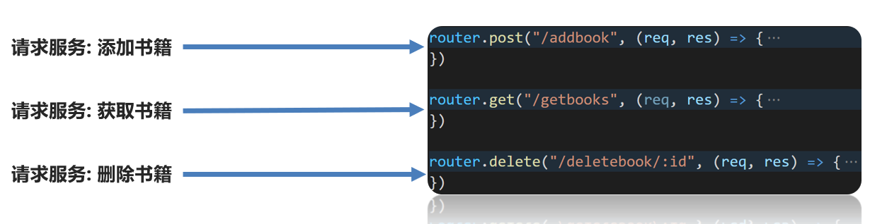
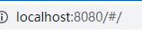
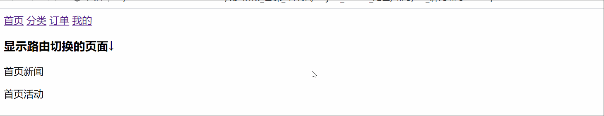

# 单页应用程序与路由

## SPA - 单页应用程序

- SPA： `Single Page Application`  单页面应用程序
- MPA : `Multiple Page Application`多页面应用程序 

[SPA ](https://baike.baidu.com/item/SPA/17536313?fr=aladdin)

[网易云音乐](https://music.163.com/)

### 优势

- 传统的多页面应用程序，每次请求服务器返回的都是一整个完整的页面
- 单页面应用程序只有第一次会加载完整的页面
- 以后每次请求仅仅获取必要的数据，减少了请求体积，加快页面响应速度，降低了对服务器的压力
- SPA更好的用户体验，运行更加流畅

### 缺点

1. 开发成本高 (需要学习路由)  `vue-router   react-router`
2. **不利于 SEO** 搜索引擎优化    谷歌浏览器在解决这个问题    ssr:服务端渲染 server side rendering

## 路由介绍

- **路由** : 是浏览器 **URL 中的哈希值**( # hash) 与 **展示视图内容(组件)** 之间的对应规则
  - 简单来说,路由就是一套映射规则(一对一的对应规则), 由开发人员制定规则.- 
  - 当 URL 中的哈希值( `#` hash) 发生改变后,路由会根据制定好的**规则**, 展示对应的视图内容(组件)
- **为什么要学习路由?**
  - 渐进式 =>vue => vuer-router (管理组件之间的跳转)
  - 在 web App 中, 经常会出现通过一个页面来展示和管理整个应用的功能.
  - SPA 往往是功能复杂的应用,为了有效管理所有视图内容,前端路由 应运而生.
- **vue 中的路由** : 是 **hash** 和 **component** 的对应关系, **一个哈希值对应一个组件**

> 目标: 设备和ip的映射关系


> 目标: 接口和服务的映射关系 



> 目标: 路径和组件的映射关系


## 前端路由 - 工作模式原理 (手写)

基本思路:

1. 用户点击了页面上的路由链接
2. 导致了 URL 地址栏中的 Hash 值发生了变化
3. 前端路由监听了到 Hash 地址的变化
4. 前端路由把当前 Hash 地址对应的组件渲染都浏览器中

实现简单的前端路由:

1. 导入并注册 `my-home.vue`  `my-movie`  ` my-about` 三个组件

```html
<script>
import MyAbout from './components/my-about.vue'
import MyHome from './components/my-home.vue'
import MyMovie from './components/my-movie.vue'
export default {
  components: {
    MyHome,
    MyAbout,
    MyMovie
  }
}
</script>
```

2. 通过 comName 动态组件, 控制要显示的组件

```vue
<template>
  <div>
    <h1>App组件</h1>
    <component :is="comName"></component>
  </div>
</template>

<script>
import MyAbout from './components/my-about.vue'
import MyHome from './components/my-home.vue'
import MyMovie from './components/my-movie.vue'
export default {
  data () {
    return {
      comName: 'my-home'
    }
  },
  components: {
    MyHome,
    MyAbout,
    MyMovie
  }
}
</script>
```

3. 声明三个导航链接, 点击时修改地址栏的 hash 值

```jsx
<template>
  <div>
    <h1>App组件</h1>
    <a href="#/home">首页</a>&nbsp;
    <a href="#/movie">电影</a>&nbsp;
    <a href="#/about">关于</a>&nbsp;
    <component :is="comName"></component>
  </div>
</template>
```

4. 在 created 中, 监视地址栏 hash 时的变化, 一旦变化, 动态切换展示的组件

```jsx
created () {
  window.onhashchange = () => {
    console.log(location.hash)
    switch(location.hash) {
      case '#/home':
        this.comName = 'my-home'
        break
      case '#/movie':
        this.comName = 'my-movie'
        break
      case '#/about':
        this.comName = 'my-about'
        break
    }
  }
},
```

# vue-router

## vue-router介绍

> 目标: 如何在Vue项目中集成路由

官网: https://router.vuejs.org/zh/

### 路由 - 组件分类

> 目标:  .vue文件分2类, 一个是页面组件, 一个是复用组件

.vue文件本质无区别, 方便大家学习和理解, 总结的一个经验

src/views(或pages) 文件夹 和 src/components文件夹

* 页面组件 - 页面展示 - 配合路由用
* 复用组件 - 展示数据/常用于复用


> 总结: views下的页面组件, 配合路由切换, components下的一般引入到views下的vue中复用展示数据

## vue-router使用

> 目标: 学会vue官方提供的vue-router路由系统功能模块使用

App.vue - 页面标签和样式准备(==可复制继续写==)

```vue
<template>
  <div>
    <div class="footer_wrap">
      <a href="#/find">发现音乐</a>
      <a href="#/my">我的音乐</a>
      <a href="#/part">朋友</a>
    </div>
    <div class="top">
      
    </div>
  </div>
</template>

<script>
export default {};
</script>

<style scoped>
.footer_wrap {
  position: fixed;
  left: 0;
  top: 0;
  display: flex;
  width: 100%;
  text-align: center;
  background-color: #333;
  color: #ccc;
}
.footer_wrap a {
  flex: 1;
  text-decoration: none;
  padding: 20px 0;
  line-height: 20px;
  background-color: #333;
  color: #ccc;
  border: 1px solid black;
}
.footer_wrap a:hover {
  background-color: #555;
}
.top {
  padding-top: 62px;
}
</style>
```

[vue-router文档](https://router.vuejs.org/zh/)

- 安装

```bash
yarn add vue-router
```

+ 导入路由 `main.js`中

```js
import VueRouter from 'vue-router'
```

+ 使用路由插件

```jsx
// 在vue中，使用使用vue的插件，都需要调用Vue.use()
Vue.use(VueRouter)
```

+ 创建路由对象

```jsx
const router = new VueRouter({
})
```

+ 关联到vue实例

```jsx
new Vue({
  router
})
```

==效果：地址栏中自动增加了 #==



## 配置路由规则

```js
// 4. 创建一个路由对象
const router = new VueRouter({
  // 路由的规则
  // route: 一条路由规则
  routes: [
    {
      // 路径 锚点
      // 组件
      path: '/find',
      component: Find,
    },
    {
      path: '/my',
      component: My,
    },
    {
      path: '/friend',
      component: Friend,
    },
  ],
})
```

==必须指定路由的出口==

```js
<div class="top">
  <!-- 路由的出口 -->
  <router-view></router-view>
</div>
```

## 路由的封装

+ 新建文件`router/index.js`

```js
import Vue from 'vue'
// 2. 导入VueRouter
import VueRouter from 'vue-router'

import Find from '../views/Find'
import My from '../views/My'
import Friend from '../views/Friend'

// 3. 使用vue插件  vue的插件想要生效必须调用一个方法  Vue.use(XXXX)
Vue.use(VueRouter)

// 4. 创建一个路由对象
const router = new VueRouter({
  // 路由的规则
  // route: 一条路由规则
  routes: [
    {
      // 路径 锚点
      // 组件
      path: '/find',
      component: Find,
    },
    {
      path: '/my',
      component: My,
    },
    {
      path: '/friend',
      component: Friend,
    },
  ],
})

export default router

```

+ main.js中

```js
import router from './router'

new Vue({
  // 5. 关联路由对象和vue实例 data methods
  render: (h) => h(App),
  router,
}).$mount('#app')
```


## vue路由 - 声明式导航

### 声明式导航 - 基础使用

> 目标: 可用全局组件router-link来替代a标签

1.  vue-router提供了一个全局组件 router-link
2.  router-link实质上最终会渲染成a链接 to属性等价于提供 href属性(to无需#)
3.  router-link提供了声明式导航高亮的功能(自带类名)

```vue
<template>
  <div>
    <div class="footer_wrap">
      <router-link to="/find">发现音乐</router-link>
      <router-link to="/my">我的音乐</router-link>
      <router-link to="/part">朋友</router-link>
    </div>
    <div class="top">
      <router-view></router-view>
    </div>
  </div>
</template>

<script>
export default {};
</script>

<style scoped>
/* 省略了 其他样式 */
.router-link-exact-active,
.router-link-active {
  background-color: #555 !important;
}
</style>
```

> 总结: 链接导航, 用router-link配合to, 实现点击切换路由

### 导航高亮

> RouterLink会自动给当前导航添加两个类名

```jsx
<!-- 
  RouterLink会自动给当前的链接添加两个类名
    router-link-active: 激活的导航链接   模糊匹配
    router-link-exact-active:  激活的导航链接 精确匹配

    exact: 必须要精确匹配
  -->
<RouterLink to="/" exact>发现音乐</RouterLink>
<RouterLink to="/my">我的音乐</RouterLink>
<RouterLink to="/friend">朋友</RouterLink>
      
```

可以修改默认高亮的类名

```js
const router = new VueRouter({
  linkActiveClass: 'aa',
  linkExactActiveClass: 'aa',
  // route: 一条规则
}
```


### 声明式导航 - 跳转传参

> 目标: 在跳转路由时, 可以给路由对应的组件内传值

在router-link上的to属性传值, 语法格式如下

* /path?参数名=值

* /path/:id – 需要路由对象提前配置 path: “/path/参数名”

对应页面组件接收传递过来的值

* $route.query.参数名(第一种)

* $route.params.参数名(第二种)

1. 创建components/Part.vue - 准备接收路由上传递的参数和值

   ```vue
   <template>
     <div>
         <p>关注明星</p>
         <p>发现精彩</p>
         <p>寻找伙伴</p>
         <p>加入我们</p>
         <p>人名: {{ $route.query.name }} -- {{ $route.params.username }}</p>
     </div>
   </template>
   ```

2. 路由定义

   ```js
   {
       path: "/part",
       component: Part
     },
     {
       path: "/part/:username", // 有:的路径代表要接收具体的值
       component: Part
     },
   ```

3. 导航跳转, 传值给MyGoods.vue组件

   ```vue
   <router-link to="/part?name=小传">朋友-小传</router-link>
   <router-link to="/part/小智">朋友-小智</router-link>
   ```


## vue路由 - 重定向和模式

### 路由 - 重定向

> 目标: 匹配path后, 强制切换到目标path上

* 网页打开url默认hash值是/路径
* redirect是设置要重定向到哪个路由路径

例如: 网页默认打开, 匹配路由"/", 强制切换到"/find"上

```js
const routes = [
  {
    path: "/", // 默认hash值路径
    redirect: "/find" // 重定向到/find
    // 浏览器url中#后的路径被改变成/find-重新匹配数组规则
  }
]
```

> 总结: 强制重定向后, 还会重新来数组里匹配一次规则

### 路由 - 404页面

> 目标: 如果路由hash值, 没有和数组里规则匹配

默认给一个404页面

语法: 路由最后, path匹配*(任意路径) – 前面不匹配就命中最后这个, 显示对应组件页面

1. 创建NotFound页面

   ```vue
   <template>
     
   </template>
   
   <script>
   export default {
   
   }
   </script>
   
   <style scoped>
       img{
           width: 100%;
       }
   </style>
   ```

2. 在main.js - 修改路由配置

   ```js
   import NotFound from '@/views/NotFound'
   
   const routes = [
     // ...省略了其他配置
     // 404在最后(规则是从前往后逐个比较path)
     {
       path: "*",
       component: NotFound
     }
   ]
   ```

> 总结: 如果路由未命中任何规则, 给出一个兜底的404页面

### 路由 - 模式设置

> 目标: 修改路由在地址栏的模式

hash路由例如:  http://localhost:8080/#/home

history路由例如: http://localhost:8080/home  (以后上线需要服务器端支持, 否则找的是文件夹)

[模式文档](https://router.vuejs.org/zh/api/#mode)

router/index.js

```js
const router = new VueRouter({
  routes,
  mode: "history" // 打包上线后需要后台支持, 模式是hash
})
```

## vue路由 - 编程式导航

> 用JS代码跳转, 声明式导航用a标签

### 编程式导航 - 基础使用

> 目标: 用JS代码来进行跳转

语法:

```js
this.$router.push({
    path: "路由路径", // 都去 router/index.js定义
    name: "路由名"
})
```

1. main.js - 路由数组里, 给路由起名字

```json
{
    path: "/find",
    name: "Find",
    component: Find
},
{
    path: "/my",
    name: "My",
    component: My
},
{
    path: "/part",
    name: "Part",
    component: Part
},
```

2. App.vue - 换成span 配合js的编程式导航跳转

```vue
<template>
  <div>
    <div class="footer_wrap">
      <span @click="btn('/find', 'Find')">发现音乐</span>
      <span @click="btn('/my', 'My')">我的音乐</span>
      <span @click="btn('/part', 'Part')">朋友</span>
    </div>
    <div class="top">
      <router-view></router-view>
    </div>
  </div>
</template>

<script>
// 目标: 编程式导航 - js方式跳转路由
// 语法:
// this.$router.push({path: "路由路径"})
// this.$router.push({name: "路由名"})
// 注意:
// 虽然用name跳转, 但是url的hash值还是切换path路径值
// 场景:
// 方便修改: name路由名(在页面上看不见随便定义)
// path可以在url的hash值看到(尽量符合组内规范)
export default {
  methods: {
    btn(targetPath, targetName){
      // 方式1: path跳转
      this.$router.push({
        // path: targetPath,
        name: targetName
      })
    }
  }
};
</script>
```

### 编程式导航 - 跳转传参

> 目标: JS跳转路由, 传参

语法 query / params 任选 一个

```js
this.$router.push({
    path: "路由路径"
    name: "路由名",
    query: {
    	"参数名": 值
    }
    params: {
		"参数名": 值
    }
})

// 对应路由接收   $route.params.参数名   取值
// 对应路由接收   $route.query.参数名    取值
```

==格外注意: 使用path会自动忽略params==

App.vue

```vue
<template>
  <div>
    <div class="footer_wrap">
      <span @click="btn('/find', 'Find')">发现音乐</span>
      <span @click="btn('/my', 'My')">我的音乐</span>
      <span @click="oneBtn">朋友-小传</span>
      <span @click="twoBtn">朋友-小智</span>
    </div>
    <div class="top">
      <router-view></router-view>
    </div>
  </div>
</template>

<script>
// 目标: 编程式导航 - 跳转路由传参
// 方式1:
// params => $route.params.参数名
// 方式2:
// query => $route.query.参数名
// 重要: path会自动忽略params
// 推荐: name+query方式传参
// 注意: 如果当前url上"hash值和?参数"与你要跳转到的"hash值和?参数"一致, 爆出冗余导航的问题, 不会跳转路由
export default {
  methods: {
    btn(targetPath, targetName){
      // 方式1: path跳转
      this.$router.push({
        // path: targetPath,
        name: targetName
      })
    },
    oneBtn(){
      this.$router.push({
        name: 'Part',
        params: {
          username: '小传'
        }
      })
    },
    twoBtn(){
      this.$router.push({
        name: 'Part',
        query: {
          name: '小智'
        }
      })
    }
  }
};
</script>
```


## vue路由 - 嵌套

### vue路由 - 路由嵌套

> 目标: 在现有的一级路由下, 再嵌套二级路由

[二级路由示例-网易云音乐-发现音乐下](https://music.163.com/)

router-view嵌套架构图

1. 创建需要用的所有组件

   src/views/Find.vue -- 发现音乐页

   src/views/My.vue -- 我的音乐页

   src/views/Second/Recommend.vue  -- 发现音乐页 / 推荐页面

   src/views/Second/Ranking.vue      -- 发现音乐页 / 排行榜页面

   src/views/Second/SongList.vue     -- 发现音乐页 / 歌单页面

2. main.js– 继续配置2级路由

   一级路由path从/开始定义

   二级路由往后path直接写名字, 无需/开头

   嵌套路由在上级路由的children数组里编写路由信息对象

3. 说明：

   App.vue的router-view负责发现音乐和我的音乐页面, 切换

   Find.vue的的router-view负责发现音乐下的, 三个页面, 切换

4. 配置二级导航和样式(==可直接复制==) - 在Find.vue中

```vue
<template>
  <div>
    <!-- <p>推荐</p>
    <p>排行榜</p>
    <p>歌单</p> -->
    <div class="nav_main">
      <router-link to="/find/recommend">推荐</router-link>
      <router-link to="/find/ranking">排行榜</router-link>
      <router-link to="/find/songlist">歌单</router-link>
    </div>

    <div style="1px solid red;">
      <router-view></router-view>
    </div>
  </div>
</template>

<script>
export default {};
</script>

<style scoped>
.nav_main {
  background-color: red;
  color: white;
  padding: 10px 0;
}
.nav_main a {
  text-align: center;
  text-decoration: none;
  color: white;
  font-size: 12px;
  margin: 7px 17px 0;
  padding: 0px 15px 2px 15px;
  height: 20px;
  display: inline-block;
  line-height: 20px;
  border-radius: 20px;
}
.nav_main a:hover {
  background-color: brown;
}
.nav_main .router-link-active{
  background-color: brown;
}
</style>
```

2. 配置路由规则-二级路由展示

```js
const routes = [
  // ...省略其他
  {
    path: "/find",
    name: "Find",
    component: Find,
    children: [
      {
        path: "recommend",
        component: Recommend
      },
      {
        path: "ranking",
        component: Ranking
      },
      {
        path: "songlist",
        component: SongList
      }
    ]
  }
  // ...省略其他
]
```

3. 说明：

* App.vue, 外层的router-view负责发现音乐和我的音乐页面切换

* Find.vue 内层的router-view负责发现音乐下的子tab对应的组件切换

4. 运行 - 点击导航观察嵌套路由在哪里展示

> 总结: 嵌套路由, 找准在哪个页面里写router-view和对应规则里写children


## vue组件库

- PC - **element-ui  ant-design**  iview 
- 移动端 **vant** **mint-ui** vux cube-ui NutUI


# 小练习

## 小练习_1.切换页面

> 目的: 点击导航a标签, 实现下面页面内容的切换

建议: 新初始化一个空白的项目来写, 避免新手放到一起, 看的乱

要求: 网页打开默认显示 - 首页部分

规范: 

* views/ 4个页面.vue文件
* router/index.js - 路由配置
* App.vue显示, main.js 注册路由

效果:




## 小练习_2.二级路由嵌套

> 目标: 完成演示的路由切换效果

建议: 再新建一个工程来写

图示:


作业3 

之前9.30号的那个案例改造成路由的方式