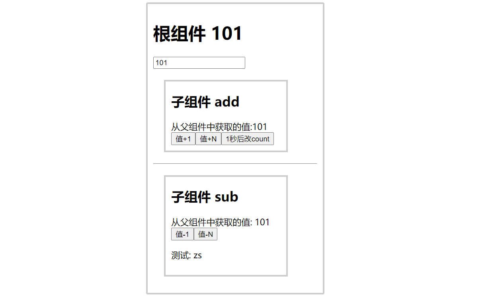
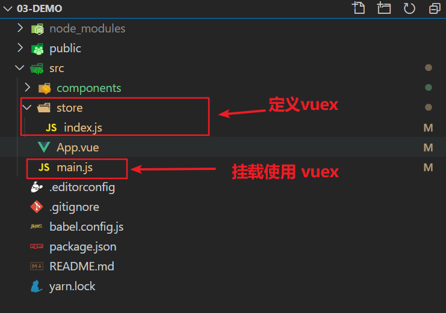

# 组件通信

- 父传子  属性绑定 子组件props接收
- 子传父 子组件内部发布自定义事件`this.$emit('自定义事件名', 参数)` 父组件绑定自定义事件
- 非父子
  - 1. 创建了 空的vue实例(eventbus) new Vue() 只做事件的发布和监听
    2. 在组件A 通过eventBus发布事件 eventbus.$emit('自定义事件名', 参数)
    3. 在组件B在created钩子函数中 通过eventBus监听事件  eventbus.$on('自定义事件类型',(val)=> {  })
- **依赖注入**
- **vuex**

# 依赖注入

-  作用: 父组件中的数据, 可以共享数据给子孙后代组件
- 局限: 依赖注入的数据不是响应式的, 推荐使用vuex来进行状态管理

父组件

```jsx
<template>
  <!-- 依赖注入
     局限: 依赖注入的数据不是响应式的, 推荐使用vuex来进行状态管理
     作用: 父组件中的数据, 可以共享数据给子孙后代组件
     语法: 
       父组件提供数据(暴露数据) 使用provide暴露 provide是一个函数 return一个对象 类似于data
         provide(){
          return {
            count: this.money
          }
        }

       子组件通过inject来接收数据
       inject: ['count']
   -->
  <div class="box">
    <h3>我是最外层的父组件 -- {{ money }}</h3>
    <Son></Son>
  </div>
</template>

<script>
import Son from './components/Son.vue'
export default {
  components: {
    Son
  },
  data(){
    return {
      money: 100
    }
  },
  // 父组件 provide 提供数据
  // provide是一个函数 return一个对象 类似于data
  provide(){
    return {
      count: this.money
    }
  }
}
</script>

<style>
.box {
  border: 3px solid #000;
  padding: 10px;
  margin: 10px;
}
</style>
```

子组件

```jsx
<template>
  <div class="son">我是儿子组件 -- {{count}} </div>
</template>

<script>
export default {
  // 接收祖先组件暴露的数据
  inject: ['count']
}
</script>

<style>
.son {
  border: 3px solid #000;
  padding: 10px;
  margin: 10px;
}
</style>
```

# vuex 概述 

目标：

- 了解 vuex 的应用场景  (在哪用)

- 掌握 vuex 的基本使用  (怎么用)

## vuex基本概念

[中文文档](https://vuex.vuejs.org/zh/guide/)

vuex是vue的集中状态管理工具，**状态就是数据**。 状态管理就是集中管理vue中 **通用的** 一些数据

使用场景: 多个组件共享同一份数据,才会将这个数据放在vuex中, 组件内部自己使用的数据还是放在组件的data中

大中型项目才会用户

注意：

- 不是所有的场景都适用于vuex，只有在必要的时候才使用vuex
- 使用了vuex之后，会附加更多的框架中的概念进来，增加了项目的复杂度

Vuex就像近视眼镜, 你自然会知道什么时候需要用它~

只要是中大型的项目, 必然会用到vuex

## vuex的优点: 方便的解决多组件的共享状态(数据)

 vuex的作用是解决多组件状态共享的问题。

- 它是独立于组件而单独存在的，所有的组件都可以把它当作一座桥梁来进行通讯。
- 特点：
  - **响应式**  只要数据修改了, 所有用到该数据的地方, 自动更新 (数据驱动)
  - 操作更简洁, 逻辑清晰


## 什么数据适合存到vuex中

一般情况下，只有  **多个组件均需要共享的数据** ，才有必要存储在vuex中，

对于某个组件中的私有数据，依旧存储在组件自身的data中。

例如：

- 对于所有组件而言，当前登陆的用户信息是需要在全体组件之间共享的，则它可以放在vuex中
- 对于文章详情页组件来说，当前的用户浏览的文章列表数据则应该属于这个组件的私有数据，应该要放在这个组件data中。

## 概述小结:

1. vuex解决什么问题?  **解决多组件数据共享的**
2. 什么样的数据, 适合存放到vuex?   **多个组件都要使用的数据可以放在vuex中**
3. 什么时候使用vuex?  中大型项目

vuex是一个vue提供的集中状态管理工具 解决多组件数据共享

# vuex入门

## 需求: 多组件共享数据

对于如下三个组件（一个父组件，两个子组件）



效果是三个组件共享一份数据:

- 任意一个组件都可以修改数据
- 三个组件的数据是同步的

1 创建项目

```
vue create vuex-demo
```

2 创建三个组件, 目录如下

```
|-components
|--add-item.vue
|--sub-item.vue
|-App.vue
```

3 源代码如下

`App.vue`

在入口组件中引入add-item和sub-item这两个子组件

```html
<template>
  <div id="app">
    <h1>根组件</h1>
    <input type="text">
    <add-item></add-item>
    <hr>
    <sub-item></sub-item>
  </div>
</template>

<script>
import AddItem from './components/add-item.vue'
import SubItem from './components/sub-item.vue'

export default {
  name: 'app',
  data: function () {
    return {
      
    }
  },
  components: {
    AddItem,
    SubItem
  }
}
</script>

<style>
#app {
  width: 600px;
  margin: 20px auto;
  border: 3px solid #ccc;
  border-radius: 3px;
  padding: 10px;
}
</style>
```

`main.js`

```js
import Vue from 'vue'
import App from './App.vue'

Vue.config.productionTip = false

new Vue({
  render: h => h(App)
}).$mount('#app')
```

`sub-item.vue`

```html
<template>
  <div class="box">
    <h2>子组件 sub</h2>
    从vuex中获取的值: <label></label>
    <br>
    <button>值-1</button>
  </div>
</template>

<script>
export default {
  name: 'SubItem'
}
</script>

<style lang="css" scoped>
.box{
  border: 3px solid #ccc;
  width: 400px;
  padding: 10px;
  margin: 20px;
}
h2 {
  margin-top: 10px;
}
</style>

```

`add-item.vue`

```html
<template>
  <div class="box">
    <h2>子组件 add</h2>
    从vuex中获取的值:<label></label>
    <br />
    <button>值+1</button>
  </div>
</template>

<script>
export default {
  name: 'AddItem'
}
</script>

<style lang="css" scoped>
.box {
  border: 3px solid #ccc;
  width: 400px;
  padding: 10px;
  margin: 20px;
}
h2 {
  margin-top: 10px;
}
</style>
```


## vuex 的使用 - 创建仓库

1 安装 vuex, 与vue-router类似，vuex是一个独立存在的插件，如果脚手架初始化没有选 vuex，就需要额外安装。

```
yarn add vuex
```

2 新建 `store/index.js` 专门存放 vuex

​	为了维护项目目录的整洁，在src目录下新建一个store目录其下放置一个index.js文件。 (和 `router/index.js` 类似)

​	

3 创建仓库 `store/index.js` 

```jsx
// 导入 vue
import Vue from 'vue'
// 导入 vuex
import Vuex from 'vuex'
// vuex也是vue的插件, 需要use一下, 进行插件的安装初始化
Vue.use(Vuex)

// 创建仓库 store
const store = new Vuex.Store()

// 导出仓库
export default store
```

4 在 main.js 中导入挂载到 Vue 实例上

```js
import Vue from 'vue'
import App from './App.vue'
import store from './store'

Vue.config.productionTip = false

new Vue({
  render: h => h(App),
  store
}).$mount('#app')
```

此刻起, 就成功创建了一个 **空仓库!!**


## 核心概念 - state 状态

State提供唯一的公共数据源，所有共享的数据都要统一放到Store中的State中存储。

打开项目中的store.js文件，在state对象中可以添加我们要共享的数据。

```jsx
// 创建仓库 store
const store = new Vuex.Store({
  // state 状态, 即数据, 类似于vue组件中的data,
  // 区别在于 data 是组件自己的数据, 而 state 中的数据整个vue项目的组件都能访问到
  state: {
    count: 101
  }
})
```

问题: 如何在组件中获取count?

1. 插值表达式 =》  {{  $store.state.count  }}
2. mapState 映射计算属性 =》  {{ count  }}


**1 原始形式- 插值表达式**

**`App.vue`**

组件中可以使用  **this.$store** 获取到vuex中的store对象实例，可通过**state**属性属性获取**count**， 如下

```vue
<h1>state的数据 - {{ $store.state.count }}</h1>
```

**计算属性** - 将state属性定义在计算属性中 https://vuex.vuejs.org/zh/guide/state.html

```js
// 把state中数据，定义在组件内的计算属性中
  computed: {
    count () {
      return this.$store.state.count
    }
  }
```

```vue
<h1>state的数据 - {{ count }}</h1>
```

但是每次, 都这样一个个的提供计算属性, 太麻烦了, 所以我们需要辅助函数 mapState 帮我们简化语法


**2 辅助函数  - mapState**

>mapState是辅助函数，帮助我们把store中的数据映射到 组件的计算属性中, 它属于一种方便的用法

用法 ： 

第一步：导入mapState (mapState是vuex中的一个函数)

```js
import { mapState } from 'vuex'
```

第二步：采用数组形式引入state属性

```js
mapState(['count']) 
```

> 上面代码的最终得到的是 **类似于**

```js
count () {
    return this.$store.state.count
}
```

第三步：利用**展开运算符**将导出的状态映射给计算属性

```js
  computed: {
    ...mapState(['count'])
  }
```

```vue
 <div> state的数据：{{ count }}</div>
```


## 核心概念 - mutations

### 基本使用

通过 `strict: true` 可以开启严格模式

> **state数据的修改只能通过mutations，并且mutations必须是同步的**

**定义mutations**

```js
const store  = new Vuex.Store({
  state: {
    count: 0
  },
  // 定义mutations
  mutations: {
     
  }
})
```

**格式说明**

mutations是一个对象，对象中存放修改state的方法

```js
mutations: {
    // 方法里参数 第一个参数是当前store的state属性
    // payload 载荷 运输参数 调用mutaiions的时候 可以传递参数 传递载荷
    addCount (state) {
      state.count += 1
    }
  },
```

组件中提交 mutations

```jsx
this.$store.commit('addCount')
```

**解决问题: 两个子组件, 添加操作 add,  addN 实现**


### 带参数的 mutation

需求: 父组件也希望能改到数据

提交 mutation 是可以传递参数的  `this.$store.commit('xxx',  参数)`

1 提供mutation函数

```js
mutations: {
  ...
  inputCount (state, count) {
    state.count = count
  }
},
```

2 注册事件

```jsx
<input type="text" :value="count" @input="handleInput">
```

3 提交mutation

```jsx
handleInput (e) {
  this.$store.commit('inputCount', +e.target.value)
}
```

**小tips: 提交的参数只能是一个, 如果有多个参数要传, 可以传递一个对象**

```jsx
this.$store.commit('inputCount', {
  count: e.target.value
})
```

**解决问题:  addN 的实现**


### **辅助函数** - mapMutations

> mapMutations和mapState很像，它把位于mutations中的方法提取了出来，我们可以将它导入

```js
import  { mapMutations } from 'vuex'
methods: {
    ...mapMutations(['addCount'])
}
```

> 上面代码的含义是将mutations的方法导入了methods中，等价于

```js
methods: {
      // commit(方法名, 载荷参数)
      addCount () {
          this.$store.commit('addCount')
      }
 }
```

此时，就可以直接通过this.addCount调用了

```jsx
<button @click="addCount">值+1</button>
```

但是请注意： Vuex中mutations中要求不能写异步代码，如果有异步的ajax请求，应该放置在actions中


## 核心概念-actions

> state是存放数据的，mutations是同步更新数据 (便于监测数据的变化, 更新视图等, 方便于调试工具查看变化)，
>
> actions则负责进行异步操作

**需求: 一秒钟之后, 要给一个数 去修改state**


**定义actions**

```js
actions: {
  setAsyncCount (context, num) {
    // 一秒后, 给一个数, 去修改 num
    setTimeout(() => {
      context.commit('inputCount', num)
    }, 1000)
  }
},
```

**原始调用** - $store (支持传参)

```js
setAsyncCount () {
  this.$store.dispatch('setAsyncCount', 200)
}
```


**辅助函数** -mapActions

> actions也有辅助函数，可以将action导入到组件中

```js
import { mapActions } from 'vuex'
methods: {
    ...mapActions(['setAsyncCount'])
}
```

直接通过 this.方法 就可以调用

```vue
<button @click="setAsyncCount(200)">+异步</button>
```


## 核心概念-getters

> 除了state之外，有时我们还需要从state中派生出一些状态，这些状态是依赖state的，此时会用到getters

例如，state中定义了list，为1-10的数组，

```js
state: {
    list: [1, 2, 3, 4, 5, 6, 7, 8, 9, 10]
}
```

组件中，需要显示所有大于5的数据，正常的方式，是需要list在组件中进行再一步的处理，但是getters可以帮助我们实现它

**定义getters**

```js
  getters: {
    // getters函数的第一个参数是 state
    // 必须要有返回值
     filterList:  state =>  state.list.filter(item => item > 5)
  }
```

使用getters

**原始方式** -$store

```vue
<div>{{ $store.getters.filterList }}</div>
```

**辅助函数** - mapGetters

```js
computed: {
    ...mapGetters(['filterList'])
}
```

```vue
 <div>{{ filterList }}</div>
```


## 核心概念 - 模块 module (进阶拓展)

> **由于使用单一状态树，应用的所有状态会集中到一个比较大的对象。当应用变得非常复杂时，store 对象就有可能变得相当臃肿。**

这句话的意思是，如果把所有的状态都放在state中，当项目变得越来越大的时候，Vuex会变得越来越难以维护

由此，又有了Vuex的模块化


### **模块定义** - 准备 state

定义两个模块   **user** 和  **goods**

的信息状态  userInfo  `modules/user.js`

```jsx
// 这是用户模块, 这个模块只做用户信息相关的操作
// 每一个单独的模块 有自己的 state ,mutaions actions, getters
const state = {
  // 用户相关信息
   userInfo: {
    name: 'zs',
    age: 18,
    sex: '男'
   }
}
const mutaions = {}
const actions = {}
const getters = {}

export default {
  state,
  mutaions,
  actions,
  getters
}

```

setting中管理项目应用的名称 title, desc  `modules/goods.js`

```jsx
// goods模块
export default {
  state: {
    goodsInfo: {
      // 商品信息
      name: '大菠萝',
      price: 20,
      info: '好吃不贵'
    }
  },
  mutations: {},
  actions: {},
  getters: {}
}

```

使用模块中的数据,  可以直接通过模块名访问 `$store.state.模块名.xxx`  =>  `$store.state.goods.goodsInfo`

也可以通过 mapState 映射


### 命名空间 namespaced

默认情况下，模块内部的 action、mutation 和 getter 是注册在**全局命名空间**的

这句话的意思是 刚才的user模块还是setting模块，它的 action、mutation 和 getter 其实并没有区分，都可以直接通过全局的方式调用, 如下图所示:


但是，如果我们想保证内部模块的高封闭性，我们可以采用namespaced来进行设置

`modules/user.js`

```jsx
// 这是用户模块, 这个模块只做用户信息相关的操作
// 每一个单独的模块 有自己的 state ,mutaions actions, getters
const state = {
  // 用户相关信息
  userInfo: {
    name: 'zs',
    age: 18,
    sex: '男'
  },
  list: [1, 2, 3]
}
const mutations = {
  // 修改用户名的mutation
/*   USER_CHANGENAME (state) {
    state.userInfo.name = '张老三'
  } */
  changeName (state) {
    state.userInfo.name = '张老三'
  }
}
const actions = {}
const getters = {
  filterList (state) {
    return state.list.filter(item => item > 1)
  }
}

export default {
  state,
  mutations,
  actions,
  getters,
  // 开启命名空间, 只要开启了命名空间后, 模块中的mutation, action, getters都会作用在局部
  namespaced: true
}

```

提交模块中的mutation

```jsx
全局的:   this.$store.commit('mutation函数名', 参数)

模块中的: this.$store.commit('模块名/mutation函数名', 参数)
```

提交模块中的action

```jsx
全局的:   this.$store.dispatch('action名字', 参数)

模块中的: this.$store.dispatch('模块名/action名字', 参数)
```

namespaced: true 后, 要添加映射, 可以加上模块名, 找对应模块的 state/mutations/actions/getters

```jsx
computed: {
  // 全局的
  ...mapState(['count']),
  // 模块中的
  ...mapState('user', ['myMsg']),
},
methods: {
  // 全局的
  ...mapMutations(['addCount'])
  // 模块中的
  ...mapMutations('user', ['updateMsg'])
}
```

