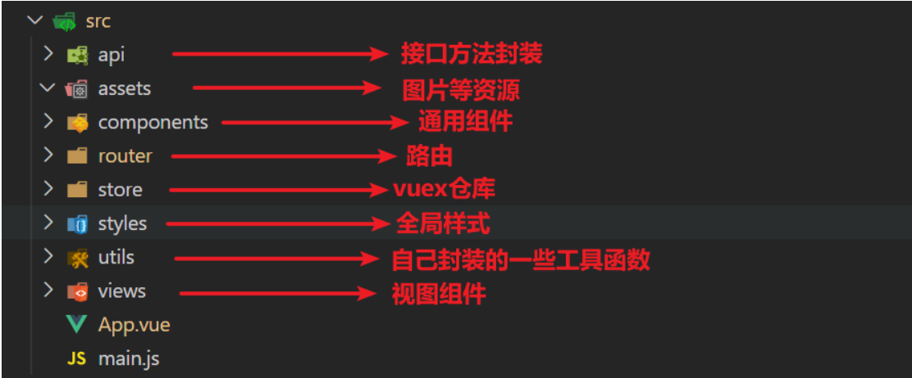

# 大事件

## 后台数据管理系统

项目演示地址: http://www.escook.cn:8086/ev/#/login

接口文档: https://www.showdoc.com.cn/1425457596992351/6972620264462285

**接口根路径修改成**: http://www.liulongbin.top:3008

本项目的技术栈 本项目技术栈基于 [ES2015+](http://es6.ruanyifeng.com/)、[vue](https://cn.vuejs.org/index.html)、[vuex](https://vuex.vuejs.org/zh-cn/)、[vue-router](https://router.vuejs.org/zh-cn/) 、[vue-cli](https://github.com/vuejs/vue-cli) 、[axios](https://github.com/axios/axios) 和 [element-ui](https://github.com/ElemeFE/element)

## 项目页面介绍

### 注册页面


### 登录页面


### 登录后 - 首页


### 文章管理-文章分类展示


###  文章管理-添加文章分类


###  文章管理-修改文章分类


###  文章管理-删除文章分类


###文章列表


### 基本资料


### 更换头像


### 重置密码


## 项目前置环境同步

**nodejs环境**

> nodejs是当下前端工程化开发必不可少的环境, 使用 nodejs的**`npm`**功能来管理依赖包

查看node 和 npm的版本

```bash
$ node -v #查看node版本 node版本12+
$ npm  -v #查看npm版本
```


**npm/yarn淘宝镜像**

配置淘宝镜像

```bash
$ npm config set registry  https://registry.npm.taobao.org/  #设置淘宝镜像地址
$ npm config get registry  #查看镜像地址

$ yarn config set registry  https://registry.npm.taobao.org/  #设置淘宝镜像地址
$ yarn config get registry  #查看镜像地址
```

**vscode编辑器**

> vscode编辑器是目前前端开发的编码利器， 以及丰富的插件系统，非常适合开发前端项目 

vscode编辑器插件 + **`vetur`** + **`eslint`**

> vetur是基于 单文件组件开发的支持插件, eslint是 基于代码校验的插件工具


除此之外, eslint需要在vscode中进行一些参数的配置

```json
{ 
    "editor.codeActionsOnSave": {
        "source.fixAll.eslint": true
    },
    ...
}
```

我的setting.json文件

```jsx
{
  "editor.fontSize": 20, //vscode文件图标主题
  "terminal.integrated.shell.windows": "C:\\Windows\\System32\\WindowsPowerShell\\v1.0\\powershell.exe", //默认终端shell
  "editor.insertSpaces": true,
  "editor.lineNumbers": "on", //开启行数提示
  "editor.quickSuggestions": {
    //开启自动显示建议
    "other": true,
    "comments": true,
    "strings": true
  },
  "editor.tabSize": 2, //制表符符号eslint
  "editor.codeActionsOnSave": {
    "source.fixAll.eslint": true
  },
  "settingsSync.ignoredExtensions": [],
  "path-intellisense.mappings": {
    "@": "${workspaceRoot}/src"
  },
  "git.enableSmartCommit": true,
  "vsicons.dontShowNewVersionMessage": true,
  "workbench.editor.untitled.hint": "hidden",
  "workbench.startupEditor": "newUntitledFile",
  "workbench.iconTheme": "vscode-icons",
  "[html]": {
    "editor.defaultFormatter": "esbenp.prettier-vscode"
  },
  "window.zoomLevel": 1
}

```

**将别的格式化插件禁用/卸载,  以上配置结束后,打开项目一定是根目录在编辑器中打开**

`小结`: 本节小结,确认项目的前置环境同步

## 创建项目

```jsx
vue create big-event-vue-87
```


##调整项目目录

默认生成的目录结构不满足我们的开发需求，所以这里需要做一些自定义改动。主要是两个工作：

- 删除初始化的默认文件
- 修改剩余代码内容
- 新增调整我们需要的目录结构

1. 删除文件

- components/HelloWorld.vue
- views/Home.vue
- views/About.vue
- images/logo.png

2. 修改内容

`src/router/index.js`

```jsx
import Vue from 'vue'
import VueRouter from 'vue-router'

Vue.use(VueRouter)

const router = new VueRouter({
  routes: []
})

export default router
```

`src/App.vue`

```jsx
<template>
  <div id="app">
    <router-view></router-view>
  </div>
</template>

<style lang="less">

</style>
```

store/index.js  和 main.js 不用动

3. 新增需要目录

在 src 目录下中补充创建以下目录：

- /api ： 存储请求函数模块
- /styles: 样式文件模块
- /utils: 工具函数模块



4. 将项目需要的全局样式的文件复制到styles文件夹中,并在main.js中引入

```jsx
// 导入全局样式
import '@/styles/global.css'
```

5. 将项目需要的图片资源放置images文件夹中

## ESlint代码规范

代码规范：一套写代码的约定规则。例如：赋值符号的左右是否需要空格？一句结束是否是要加;？... 

>  没有规矩不成方圆

ESLint:是一个代码检查工具，用来检查你的代码是否符合指定的规则(你和你的团队可以自行约定一套规则)。在创建项目时，我们使用的是 [JavaScript Standard Style](https://standardjs.com/readme-zhcn.html) 代码风格的规则。

### JavaScript Standard Style 规范说明

建议把：https://standardjs.com/rules-zhcn.html 看一遍，然后在写的时候遇到错误就查询解决。下面是这份规则中的一小部分：

- *字符串使用单引号* – 需要转义的地方除外
- *无分号* – [这](http://blog.izs.me/post/2353458699/an-open-letter-to-javascript-leaders-regarding)[没什么不好。](http://inimino.org/~inimino/blog/javascript_semicolons)[不骗你！](https://www.youtube.com/watch?v=gsfbh17Ax9I)
- *关键字后加空格* `if (condition) { ... }`
- *函数名后加空格* `function name (arg) { ... }`
- 坚持使用全等 `===` 摒弃 `==` 一但在需要检查 `null || undefined` 时可以使用 `obj == null`
- ......

### 代码规范错误

如果你的代码不符合standard的要求，eslint会跳出来刀子嘴，豆腐心地提示你。下面我们在main.js中随意做一些改动：添加一些空行，空格。

```jsx
import Vue from 'vue'
import App from './App.vue'

import './styles/index.less'
import router from './router'
Vue.config.productionTip = false

new Vue ( {
  render: h => h(App),
  router
}).$mount('#app')
```

按下保存代码之后：

你将会看在控制台中输出如下错误：


eslint 是来帮助你的。心态要好，有错，就改。

#### 手动修正

根据错误提示来一项一项手动修正。

如果你不认识命令行中的语法报错是什么意思，你可以根据错误代码（func-call-spacing, space-in-parens,.....）去 ESLint 规则列表中查找其具体含义。

它的网官在[这里](https://cn.eslint.org/docs/rules/)

打开 [ESLint 规则表](https://cn.eslint.org/docs/rules/)，使用页面搜索（Ctrl + F）这个代码，查找对该规则的一个释义


建议大家手动去修改错误，帮助养成良好的编码习惯，更加专业！！

#### 通过vscode中的eslint插件来实现自动修正

> 1. eslint会自动高亮错误显示
> 2. 通过配置，eslint会自动帮助我们修复错误

+ 如何安装


- 如何配置 

```json
// 当保存的时候，eslint自动帮我们修复错误
"editor.codeActionsOnSave": {
    "source.fixAll": true
},
```

**注意：使用了eslint校验之后，把vscode带的那些格式化工具全禁用了**

### 自定义规则

在.eslintrc.js中，有一个属性是专门用来设置自定义代码规则的，这个规则

```jsx
module.exports = {
  root: true,
  env: {
    node: true
  },
  extends: [
    'plugin:vue/essential',
    '@vue/standard'
  ],
  parserOptions: {
    parser: 'babel-eslint'
  },
 // rules是一个对象，以键值对的格式来约定规则：
  rules: {
    'no-console': process.env.NODE_ENV === 'production' ? 'warn' : 'off',
    'no-debugger': process.env.NODE_ENV === 'production' ? 'warn' : 'off',
    'no-multiple-empty-lines': 'off' 
  }
}
```

`小结`eslint介绍

## 版本控制代码托管

[git提交规范](https://www.cnblogs.com/anly95/p/13163384.html)

VueCLI 在创建项目的时候自动帮你初始化了 `Git` 仓库，并且基于初始代码默认执行了一次提交。

我们可以创建远程仓库, 并且将本地仓库推送到远程仓库。

### 创建远程仓库


### 推送远程仓库

https 和 ssh 都可以,  https需要输入一次账号密码, ssh需要配置一下

```bash
git add .
git commit -m '备注信息'
git remote add origin https://gitee.com/xxx/xxx.git 自己的仓库地址
git push -u origin master
```

`小结`

- 版本控制推送远程仓库代码

## 引入 element-ui 组件库


官方文档: https://element.eleme.io/#/zh-CN

注意练习的顺序: 先练习全部引入, 再练习按需引入 => 按需引入配置了之后, 就无法全部引入了

### 全部引入 (不推荐 - 自己练习即可)

全部引入, 会导入所有的组件, 虽然方便, 但是将来的打包体积也就大了

- 安装

```jsx
yarn add element-ui
```

- 在`main.js`中

```jsx
import ElementUI from 'element-ui';
import 'element-ui/lib/theme-chalk/index.css';

Vue.use(ElementUI);
```

- 演示

```jsx
<el-button type="primary">主要按钮</el-button>
```

### 按需导入 (推荐)  

减轻将来打包后的包的体积

+ 安装

```jsx
yarn add element-ui
```

- 安装`babel-plugin-component`

```jsx
yarn add babel-plugin-component -D
```

- 在` babel.config.js `中配置

```jsx
module.exports = {
  presets: [
    '@vue/cli-plugin-babel/preset'
  ],
  // 新增plugins插件节点,修改完配置文件一定重启项目
  "plugins": [
    [
      "component",
      {
        "libraryName": "element-ui",
        "styleLibraryName": "theme-chalk"
      }
    ]
  ]
}
```

- 使用插件`main.js`中

```jsx
import { Button } from 'element-ui'
Vue.use(Button)
```

### 抽离element.js模块

- 由于组件的导入都书写到了`main.js`中,导致`main.js` 代码冗余.将element-ui组件的导入和注册单独抽离到utils文件夹中
- 新建element.js

```jsx
import Vue from 'vue'
// 按需导入组件
import {
  Button,
  Switch } from 'element-ui'

// 注册全局组件
Vue.use(Button)
  .use(Switch)

```

- 直接导入main.js中

```jsx
// 直接导入vant-ui.js
import '@/utils/element.js'
```

## 关于@src目录路径提示的配置

1. 安装vscode插件 `Path Intellisense`
2. 新增vscode中setting.json配置

```json
 "path-intellisense.mappings": {
        "@": "${workspaceRoot}/src"
  }
```

3. 在src根目录下新建配置文件`jsconfig.json`

```json
{
    "compilerOptions": {
        "target": "ES6",
        "module": "commonjs",
        "allowSyntheticDefaultImports": true,
        "baseUrl": "./",
        "paths": {
          "@/*": ["src/*"]
        }
    },
    "exclude": [
        "node_modules"
    ]
}
```

4. 重启项目 一定项目一定根目录在vscode中打开
5. [参考博客地址](https://www.cnblogs.com/telwanggs/p/10953833.html)


