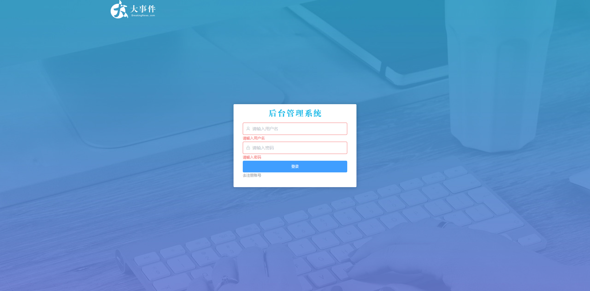
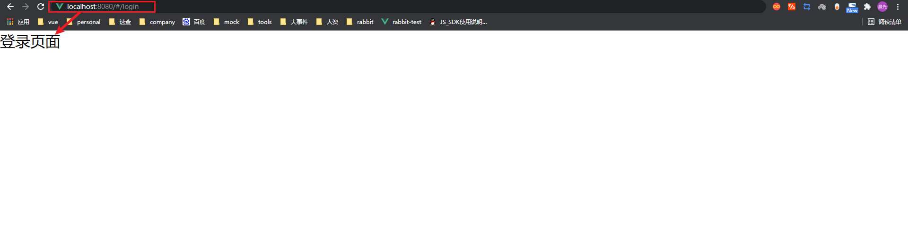
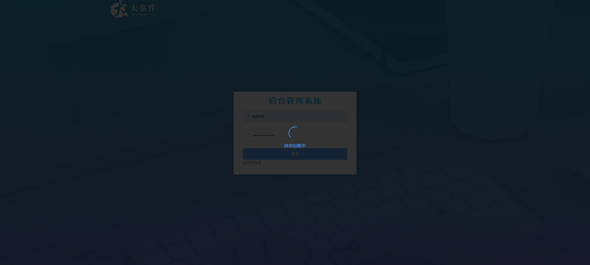
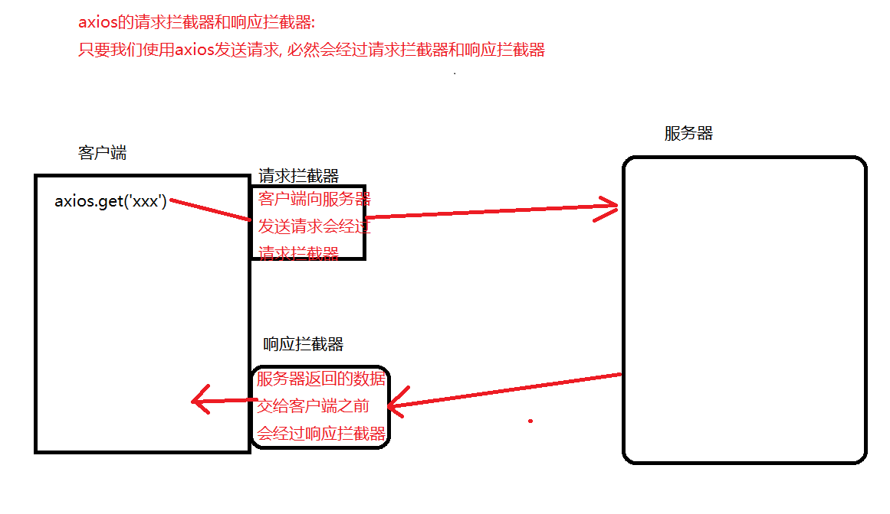
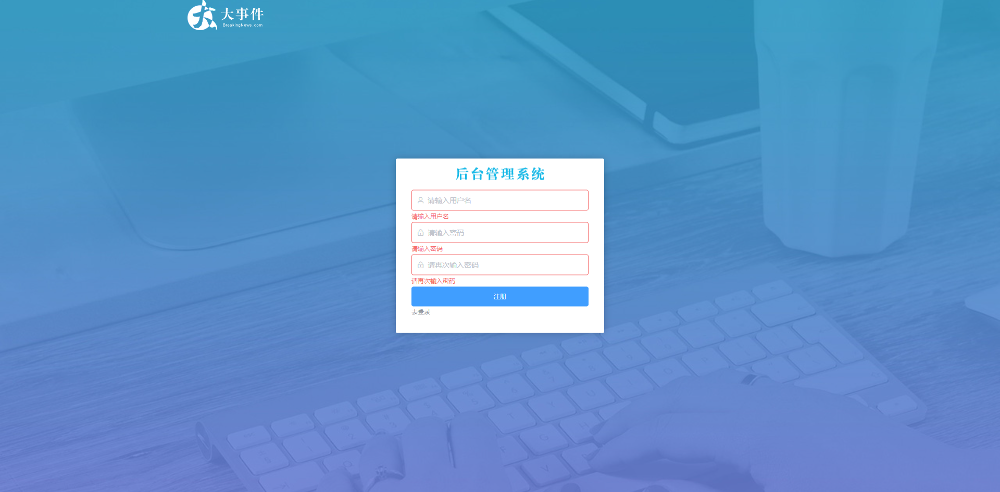
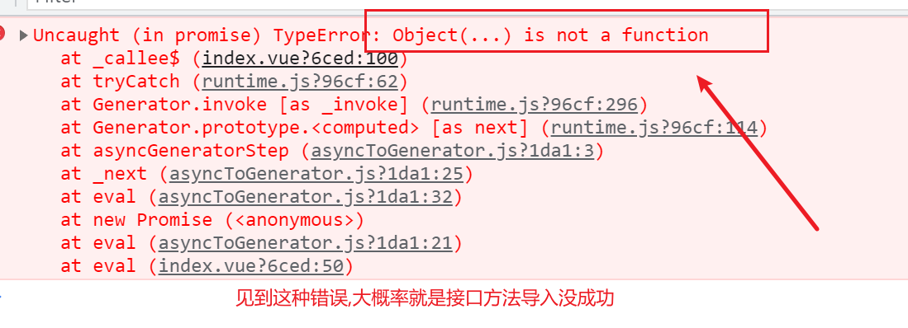

# 登录页面

## 效果图



## 创建组件 配置路由

1. 创建组件 `views/Login/index.vue`

```jsx
<template>
  <div class="login">登录页面</div>
</template>

<script>
export default {
  name: 'Login'
}
</script>

<style>

</style>
```

2. 配置路由 `router/index.js`

```jsx
import Vue from 'vue'
import VueRouter from 'vue-router'
import Login from '@/views/Login'

Vue.use(VueRouter)

const router = new VueRouter({
  routes: [
    { path: '/login', component: Login }
  ]
})

export default router
```

3. 测试效果:



## 实现页面布局

- 提前注册好 `Form FormItem Link Input` 四个组件
- [From和FromItem和Input](https://element.eleme.io/#/zh-CN/component/form)
- [Link组件](https://element.eleme.io/#/zh-CN/component/link)

```jsx
<template>
  <div class="login-container">
    <!-- 头部的 logo 区域 -->
    <div class="header">
      
    </div>

    <!-- 登录和注册区域 -->
    <div class="box">
      <div class="box-header"></div>
      <!-- 登录的表单 -->
      <el-form>
        <el-form-item>
          <el-input
            placeholder="请输入用户名"
            maxlength="10"
            prefix-icon="el-icon-user"
          ></el-input>
        </el-form-item>
        <el-form-item >
          <el-input
            placeholder="请输入密码"
            maxlength="15"
            type="password"
            prefix-icon="el-icon-lock"
          ></el-input>
        </el-form-item>
        <el-button type="primary" class="btn-login">登录</el-button>
        <el-link type="info" class="link-reg">去注册账号</el-link>
      </el-form>
    </div>
  </div>
</template>
<style lang="less" scoped>
.login-container {
  background-color: blue;
  height: 100%;
  background: url('../../images/images/login_bg.jpg') no-repeat center;
  background-size: cover;

  .header {
    width: 1200px;
    margin: 0 auto;
    user-select: none;
  }

  .box {
    width: 400px;
    height: 270px;
    background-color: #fff;
    position: absolute;
    top: 50%;
    left: 50%;
    transform: translate(-50%, -50%);
    border-radius: 3px;
    box-shadow: 0 1px 15px rgba(0, 0, 0, 0.2);
    padding: 0 30px;
    box-sizing: border-box;

    .box-header {
      height: 60px;
      background: url('../../images/images/login_title.png') no-repeat center;
    }

    .btn-login {
      width: 100%;
    }

    .link-reg {
      font-size: 12px;
    }
  }
}
</style>

```

- 在`App.vue`中设置样式 实现背景图完整展示

```jsx
<template>
  <div id="app">
    <router-view></router-view>
  </div>
</template>

<style lang="less">
#app {
  height: 100%;
}
</style>

```

##实现表单预校验

- 为form绑定model属性
- 为form绑定rules,并定义规则
- 为form-item绑定prop
- 为表单元素绑定v-model

```jsx
<template>
  <div class="login-container">
    <!-- 头部的 logo 区域 -->
    <div class="header">
      
    </div>

    <!-- 登录和注册区域 -->
    <div class="box">
      <div class="box-header"></div>
      <!-- 登录的表单 -->
      <el-form :model="loginForm" :rules="loginRules" ref="loginRef">
        <el-form-item prop="username">
          <el-input
            v-model="loginForm.username"
            placeholder="请输入用户名"
            maxlength="10"
            prefix-icon="el-icon-user"
          ></el-input>
        </el-form-item>
        <el-form-item prop="password">
          <el-input
            v-model="loginForm.password"
            placeholder="请输入密码"
            maxlength="15"
            type="password"
            prefix-icon="el-icon-lock"
          ></el-input>
        </el-form-item>
        <el-button type="primary" class="btn-login" @click="login">登录</el-button>
        <el-link type="info" class="link-reg">去注册账号</el-link>
      </el-form>
    </div>
  </div>
</template>

<script>
export default {
  name: 'Login',
  data() {
    return {
      // 登录表单的数据对象
      loginForm: {
        username: '',
        password: ''
      },
      // 登录表单的校验规则
      loginRules: {
        username: [
          { required: true, message: '请输入用户名', trigger: 'blur' },
          { pattern: /^[a-zA-Z0-9]{1,10}$/, message: '用户名必须是1-10位的字母数字', trigger: 'blur' }
        ],
        password: [
          { required: true, message: '请输入密码', trigger: 'blur' },
          { pattern: /^\S{6,15}$/, message: '密码必须是6-15位的非空字符串', trigger: 'blur' }
        ]
      }
    }
  },
}
</script>
```

## 登录操作

### 登录前的预校验

```jsx
1. 表单fom添加添加ref属性 
<el-form :model="loginForm" :rules="rules" ref="addFormRef"></el-form>
2. 点击登录调用表单预校验方法 validate

login () {
      // 校验通过后,再去发出登录的请求
    // 表单有一个validate预校验的方法, 这个方法中有一个参数,是一个布尔值, 校验通过是true,校验失败是false
    this.$refs.addFormRef.validate(async boo => {
        // console.log(boo)
        if (!boo) return console.log('校验未通过')
        console.log('发送登录请求')
    })
}
```

### 登录完成

`登录的测试账号:admin  登录测试密码:itheima-web`

1. 导入axios
2. 点击登录按钮发送登录的请求
3. 登录成功后或者登录失败都要提示用户 **[需要全局注册 $message](https://element.eleme.io/#/zh-CN/component/message)**
4. 存储登录成功后的token,`因为后续的api都需要携带token`
5. 跳转到首页

`element.js`

```jsx
+ element.js中新增
import {
  Message
} from 'element-ui'
Vue.prototype.$message = Message
```

`Login.vue`

```jsx
import axios from 'axios'

methods: {
    // 登录
    login() {
      this.$refs.loginRef.validate(async valid => {
        if (!valid) return

        const { data } = await axios({
            method: 'post', 
            url: 'http://www.liulongbin.top:3008/api/login',
            data: this.loginForm
        })
        if (data.code !== 0) {
          return this.$message.error('登录失败！')
        }
        // 登录成功，提示用户，保存 token，跳转到后台主页
        this.$message.success('登录成功！')
        localStorage.setItem('token', data.token)
        this.$router.push('/')
      })
    }
  }
```

# axios配置

## 封装axios

- 我们刚才测试了登录功能可以正确的返回数据,但是我们如果再发送多次请求,我们`需要在每个页面导入axios`,`并且需要写完整的地址去发送请求`,**如果有一天基地址变更了**呢?那我们需要逐个去修改每个请求地址, 所有我们正确的解决方案是抽离模块, 单独封装axios

`utils/request.js`

```jsx
// 导入 axios
import axios from 'axios'
import Vue from 'vue'
// 全局挂载axios
axios.defaults.baseURL = 'http://www.liulongbin.top:3008'
// 导出axios
export default axios 
```

- 将request.js在`main.js`中导入

```jsx
import http from  '@/utils/request'
// 把 axios 挂载到 Vue 上
Vue.prototype.$http = axios
```

- 改造登录的请求

```jsx
methods: {
    // 登录
    login() {
      this.$refs.loginRef.validate(async valid => {
        if (!valid) return
        const { data: res } = await this.$http({
            method: 'post', 
            url: '/api/login',
            data: this.loginForm
        })
        if (res.code !== 0) {
          return this.$message.error('登录失败！')
        }
        // 登录成功，提示用户，保存 token，跳转到后台主页
        this.$message.success('登录成功！')
        localStorage.setItem('token', res.token)
        this.$router.push('/')
      })
    }
  }
```

## 请求拦截器和响应拦截器配置loading



- 由于某些情况下网络过慢,我们发出的请求并没有及时响应,用户会频繁的点击登录按钮,我们想要禁用按钮或者全屏开启loading效果
- 我们发送的每一次请求都会经过请求拦截器和响应拦截器,我们可以在请求拦截器和响应拦截器中处理loading



`request.js`中配置全屏loading

```jsx
// 导入 Vue
import Vue from 'vue'
// 导入 axios
import axios from 'axios'
// 导入组件库
import { Loading } from 'element-ui'

// 全局挂载axios
axios.defaults.baseURL = 'http://www.liulongbin.top:3008'

// 全局挂载 - 请求拦截器
let fullScreenLoading
axios.interceptors.request.use(function (config) {
  // 展示 loading 效果
  fullScreenLoading = Loading.service({
    text: '拼命加载中',
    fullscreen: true,
    background: 'rgba(0, 0, 0, 0.8)'
  })
  return config
}, function (error) {
  return Promise.reject(error)
})

// 全局挂载 - 响应拦截器
axios.interceptors.response.use(function (response) {
  // 隐藏 loading 效果
  fullScreenLoading.close()
  return response
}, function (error) {
  // 隐藏 loading 效果
  loadingInstance.close()
  return Promise.reject(error)
})
// 导出axios
export default axios 
```

## 封装 api 接口模块

为什么要封装 api 接口模块 ? 不封装有以下两个缺点

- 不方便 **代码复用**。
- **不方便修改**, 集中管理更易维护

1. 新建 `api/user.js` 

```jsx
/**
 * 用户登录
 * loginForm 传递的是一个对象 包含 用户名和密码 
 * 
 */
import http from '@/utils/request.js'
export const reqLogin = loginForm => {
  return http({
    method: 'post',
    url: '/api/login',
    data: loginForm
  })
}
```

2. Login页面导入调用方法

```jsx
import { reqLogin } from '@/api/user.js'

methods: {
    login () {
        this.$refs.loginRef.validate(async valid => {
            if (!valid) return
            const { data: res } = await reqLogin(this.loginForm)
            if (res.code !== 0) {
                return this.$message.error('登录失败！')
            }
            // 登录成功，提示用户，保存 token，跳转到后台主页
            this.$message.success('登录成功！')
            localStorage.setItem('token', res.token)
            this.$router.push('/')
        })
 }
```

# 注册页面

## 效果图



## 注册页面跳转

- 为去注册账号按钮绑定点击事件,使用编程式导航跳转到注册页

`Login.vue`

```jsx
 <el-link type="info" class="link-reg" @click="$router.push('/reg')">去注册账号</el-link>
```

##快速实现注册页面基本布局

1. 创建组件 `views/Reg/index.vue`

```jsx
<template>
  <div class="reg-container">
    <!-- 头部的 logo 区域 -->
    <div class="header">
      
    </div>

    <!-- 登录和注册区域 -->
    <div class="box">
      <div class="box-header"></div>
      <!-- 注册的表单 -->
      <el-form>
        <el-form-item>
          <el-input
            placeholder="请输入用户名"
            maxlength="10"
            prefix-icon="el-icon-user"
          ></el-input>
        </el-form-item>
        <el-form-item>
          <el-input
            placeholder="请输入密码"
            maxlength="15"
            type="password"
            prefix-icon="el-icon-lock"
          ></el-input>
        </el-form-item>
        <el-form-item>
          <el-input
            placeholder="请再次输入密码"
            maxlength="15"
            type="password"
            prefix-icon="el-icon-lock"
          ></el-input>
        </el-form-item>
        <el-button type="primary" class="btn-login">注册</el-button>
        <el-link type="info" class="link-reg">去登录</el-link>
      </el-form>
    </div>
  </div>
</template>
<style lang="less" scoped>
.reg-container {
  background-color: blue;
  height: 100%;
  background: url('../../images/images/login_bg.jpg') no-repeat center;
  background-size: cover;

  .header {
    width: 1200px;
    margin: 0 auto;
    user-select: none;
  }

  .box {
    width: 400px;
    height: 335px;
    background-color: #fff;
    position: absolute;
    top: 50%;
    left: 50%;
    transform: translate(-50%, -50%);
    border-radius: 3px;
    box-shadow: 0 1px 15px rgba(0, 0, 0, 0.2);
    padding: 0 30px;
    box-sizing: border-box;

    .box-header {
      height: 60px;
      background: url('../../images/images/login_title.png') no-repeat center;
    }

    .btn-login {
      width: 100%;
    }

    .link-reg {
      font-size: 12px;
    }
  }
}
</style>

```

2. 配置路由`router/index.js`

```jsx
import Reg from '@/views/Reg'

const router = new VueRouter({
  routes: [
    { path: '/login', component: Login },
    { path: '/reg', component: Reg }  
  ]
})
```

## 实现注册页面表单基本校验

- 之前我们已经在登录页面实现了表单校验,我们可以直接复用之前登录页面的校验规则,在这个基础之上完成别的校验工作
- 主要实现自定义校验规则完成再次输入密码一致的需求

```jsx
<template>
  <div class="reg-container">
    <!-- 头部的 logo 区域 -->
    <div class="header">
      
    </div>

    <!-- 登录和注册区域 -->
    <div class="box">
      <div class="box-header"></div>
      <!-- 注册的表单 -->
      <el-form :model="regForm" :rules="regRules" ref="regRef">
        <el-form-item prop="username">
          <el-input
            v-model="regForm.username"
            placeholder="请输入用户名"
            maxlength="10"
            prefix-icon="el-icon-user"
          ></el-input>
        </el-form-item>
        <el-form-item prop="password">
          <el-input
            v-model="regForm.password"
            placeholder="请输入密码"
            maxlength="15"
            type="password"
            prefix-icon="el-icon-lock"
          ></el-input>
        </el-form-item>
        <el-form-item prop="repassword">
          <el-input
            v-model="regForm.repassword"
            placeholder="请再次输入密码"
            maxlength="15"
            type="password"
            prefix-icon="el-icon-lock"
          ></el-input>
        </el-form-item>
        <el-button type="primary" class="btn-login" @click="regUser">注册</el-button>
        <el-link type="info" class="link-reg" @click="$router.push('/login')">去登录</el-link>
      </el-form>
    </div>
  </div>
</template>

<script>
export default {
  name: 'Reg',
  data() {
    // 自定义校验规则，判断两次密码是否一致
    const rePwd = (rule, value, callback) => {
      if (value !== this.regForm.password) {
        callback(new Error('两次输入的密码不一致！'))
      } else {
        callback()
      }
    }

    return {
      // 注册表单的数据对象
      regForm: {
        username: '',
        password: '',
        repassword: ''
      },
      // 注册表单的校验规则
      regRules: {
        username: [
          { required: true, message: '请输入用户名', trigger: 'blur' },
          { pattern: /^[a-zA-Z0-9]{1,10}$/, message: '用户名必须是1-10位的字母数字', trigger: 'blur' }
        ],
        password: [
          { required: true, message: '请输入密码', trigger: 'blur' },
          { pattern: /^\S{6,15}$/, message: '密码必须是6-15位的非空字符串', trigger: 'blur' }
        ],
        repassword: [
          { required: true, message: '请再次输入密码', trigger: 'blur' },
          { pattern: /^\S{6,15}$/, message: '密码必须是6-15位的非空字符串', trigger: 'blur' },
          { validator: rePwd, trigger: 'blur' }
        ]
      }
    }
  }
}
</script>
```

## 点击注册按钮实现注册

1. 封装接口 `api/user.js`

```jsx
export const reqRegister = regForm => {
  return http({
    method: 'post',
    url: '/api/reg',
    data: regForm
  })
}
```

2. 绑定事件,发送请求`Reg/index.vue`

```jsx
 <el-button type="primary" class="btn-login" @click="regUser">注册</el-button>
import { reqRegister } from '@/api/user.js'
 methods: {
    // 注册新用户
    regUser() {
      this.$refs.regRef.validate(async valid => {
        if (!valid) return

        // 发起请求，注册新用户
        const { data: res } = await reqRegister(this.regForm)
        if (res.code === 1) {
          // 注册失败，提示错误消息
          this.$message.error(res.message)
        } else {
          // 注册成功，提示用户，跳转到登录页面
          this.$message.success('注册成功，请登录！')
          this.$router.push('/login')
        }
      })
    }
  }
```

## 常见错误



