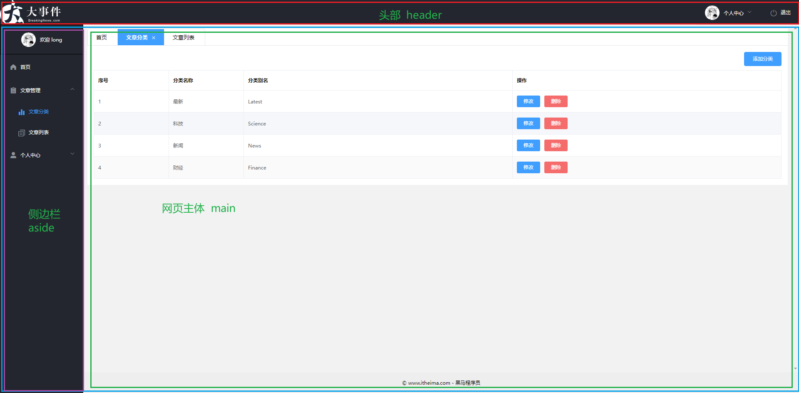
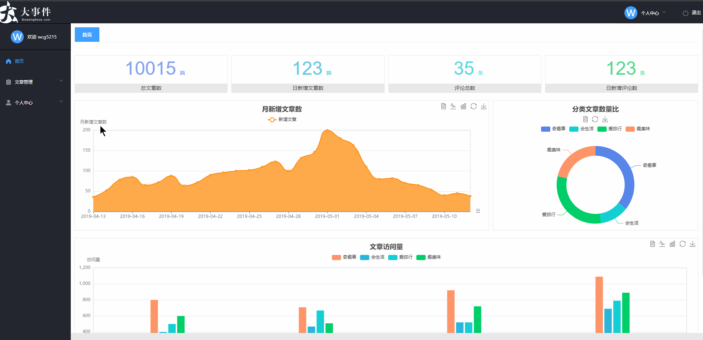
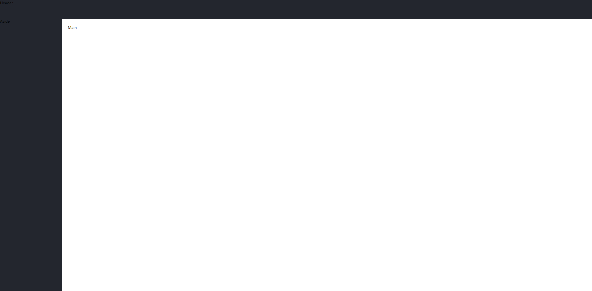
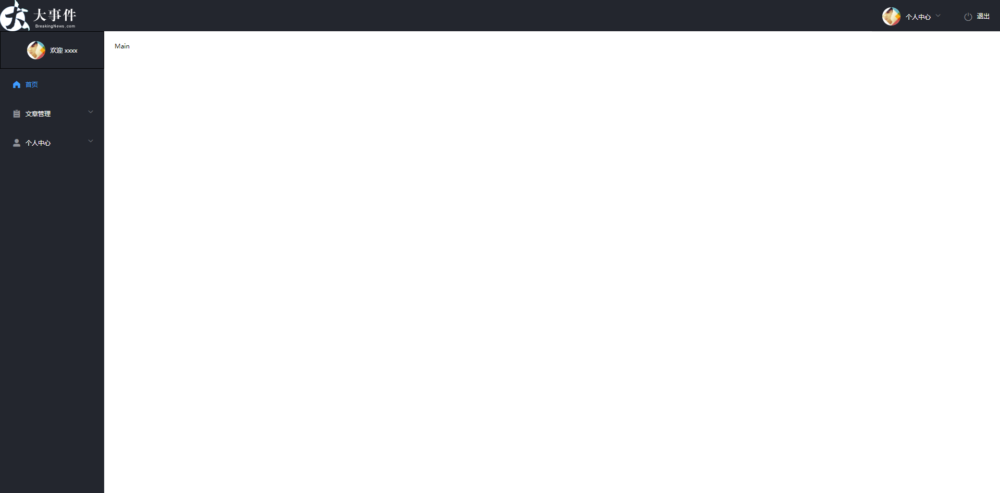
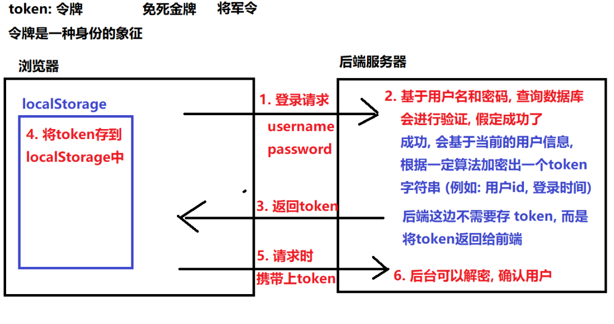
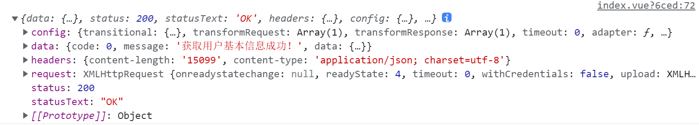
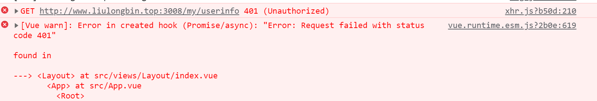
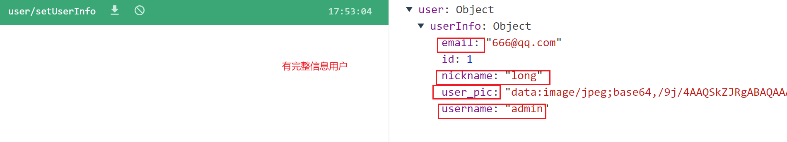
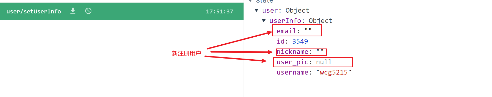
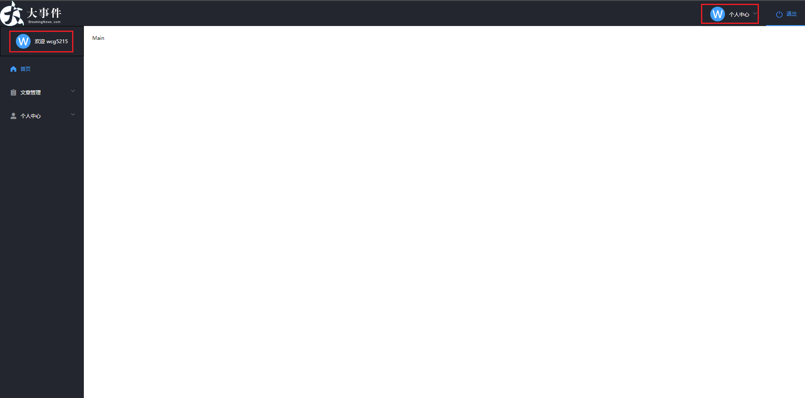

# 首页

## 效果图



## 首页整体路由设计



**实现目标:**

- 完成整体路由规划(要搞清楚要做几个页面，它们分别在哪个路由下面，是怎么跳转的.....)

通过观察上图,点击左侧导航,右侧区域在切换,那右侧区域内容一直在变,那这个地方就是一个路由的出口,我们需要搭建嵌套路由

目标：

- 把项目中所有用到的组件及路由表, 约定下来

**约定路由规则**

| path             | 文件                         | 功能              | 组件名       | 路由级别 |
| ---------------- | ---------------------------- | ----------------- | ------------ | -------- |
| /login           | views/Login/index.vue        | 登录页            | Login        | 一级路由 |
| /reg             | views/Reg/index.vue          | 注册页            | Reg          | 一级路由 |
| /                | views/Layout/index.vue       | 布局              | Layout       | 一级路由 |
| ├─ /             | views/Home/index.vue         | 主页              | Home         | 二级路由 |
| ├─ /artcategory  | views/ArtCategory/index.vue  | 文章分类          | Artcategory  | 二级路由 |
| ├─ /artlist      | views/ArtList/index.vue      | 文章列表          | ArtList      | 二级路由 |
| ├─ /userinfo     | views/UserInfo/index.vue     | 个人中心/基本资料 | UserInfor    | 二级路由 |
| ├─ /changeavatar | views/changeAvatar/index.vue | 个人中心/更换头像 | ChangeAvatar | 二级路由 |
| ├─ /resetpwd     | views/resetPwd/index.vue     | 个人中心/重置密码 | ResetPwd     | 二级路由 |

## 创建Layout组件 配置路由

1. 创建组件 `views/Layout/index.vue`
2. 搭建首页架子,我们经过上图分析,这种很常见的网页布局, **[element-ui组件库已经帮我们集成好了](https://element.eleme.io/#/zh-CN/component/container)**

```jsx
<template>
    <el-container class="main-container">
      <el-header>Header</el-header>
      <el-container>
        <el-aside width="200px">Aside</el-aside>
        <el-main>Main</el-main>
      </el-container>
  </el-container>
</template>

<script>
export default {
  name: 'Layout'
}
</script>

<style lang="less" scoped>
.main-container {
  height: 100%;

  .el-header {
    padding: 0;
    background-color: #23262e;
    display: flex;
    justify-content: space-between;

    .el-menu {
      height: 60px;
      user-select: none;
    }
  }

  .el-aside {
    background-color: #23262e;
    user-select: none;
    .el-menu {
      border-right: 0;
    }
  }

  .el-footer {
    text-align: center;
    line-height: 50px;
    background-color: #eeeeee;
    height: 50px !important;
  }
}

.el-menu-item {
  font-size: 12px;
}

/deep/ .el-submenu__title {
  font-size: 12px;
}

.avatar {
  width: 35px;
  height: 35px;
  border-radius: 50%;
  margin-right: 10px;
  object-fit: cover;
}
.text-avatar {
  width: 35px;
  height: 35px;
  display: inline-block;
  background-color: #409eff;
  border-radius: 50%;
  font-size: 24px;
  text-align: center;
  line-height: 35px;
  margin-right: 10px;
  color: white;
}

.aside-info {
  border: 1px solid #000;
  border: 0 1px;
  color: #fff;
  display: flex;
  align-items: center;
  justify-content: center;
  height: 70px;
}
</style>

```

2. 配置路由 `router/index.js`

```jsx
+ import Layout from '@/views/Layout'


const router = new VueRouter({
  routes: [
  +  { path: '/', component: Layout }
  ]
})


```

3. 测试效果:



## 头部结构搭建

使用`el-menu`组件实现头部导航基本结构布局 [element-ui导航组件](https://element.eleme.io/#/zh-CN/component/menu)

```jsx
<el-header>
      <!-- 左侧的 logo -->
      
      <el-menu mode="horizontal" background-color="#23262E" text-color="#fff" active-text-color="#409EFF">
        <el-submenu index="1">
          <template slot="title">
            
            <span>个人中心</span>
          </template>
          <el-menu-item index="1-1"><i class="el-icon-s-operation"></i>基本资料</el-menu-item>
          <el-menu-item index="1-2"><i class="el-icon-camera"></i>更换头像</el-menu-item>
          <el-menu-item index="1-3"><i class="el-icon-key"></i>重置密码</el-menu-item>
        </el-submenu>
        <el-menu-item index="2"><i class="el-icon-switch-button"></i>退出</el-menu-item>
      </el-menu>
    </el-header>
```

## 左侧侧边栏的搭建 

```jsx
 <!-- 侧边栏区域 -->
<el-aside width="200px">
    <div class="aside-info">
        
        <span>欢迎 xxxx</span>
    </div>
    <el-menu
        background-color="#23262E"
        text-color="#fff"
        active-text-color="#409EFF"
        unique-opened
        default-active="1"
        >
        <!-- 首页 -->
        <el-menu-item index="1">
            <i class="el-icon-s-home"></i>
            <span slot="title">首页</span>
        </el-menu-item>
        <!-- 文章管理 -->
        <el-submenu index="2">
            <template slot="title">
                <i class="el-icon-s-order"></i>
                <span>文章管理</span>
            </template>
            <el-menu-item index="2-1" ><i class="el-icon-s-data"></i>文章分类</el-menu-item>
            <el-menu-item index="2-2"><i class="el-icon-document-copy"></i>文章列表</el-menu-item>
        </el-submenu>
        <!-- 个人中心 -->
        <el-submenu index="3">
            <template slot="title">
                <i class="el-icon-user-solid"></i>
                <span>个人中心</span>
            </template>
            <el-menu-item index="3-1"><i class="el-icon-s-operation"></i>基本资料</el-menu-item>
            <el-menu-item index="3-2"><i class="el-icon-camera"></i>更换头像</el-menu-item>
            <el-menu-item index="3-3"><i class="el-icon-key"></i>重置密码</el-menu-item>
        </el-submenu>
    </el-menu>
</el-aside>
```

- 搭建头部和左侧效果图



## token

## 理解 token

什么是 Token？一个“令牌”（一串很长的字符串，由后端生成的），用来请求需要权限的接口用的。

如下: `eyJ0eXAiOiJKV1QiLCJhbGciOiJIUzI1NiJ9.eyJleHAiOjE2M...`

权限认证：大部分接口需要携带这个令牌去请求数据的

token令牌，说白了就是服务器, 根据用户信息生成的 **字符串**。

1. 用户登录后, 服务器会通过一定算法, 把用户信息加密成一个字符串, 并返回给前端
2. 前端需要将 token 字符串存到本地, 下次请求时需要携带



`什么是token？`

**是由服务器交给客户端的一个字符串(当前身份的唯一标识), 服务器与客户端数据请求响应都要携带token令牌(token有时效)**

## 获取用户个人信息携带token

- 头部header和侧边栏需要展示用户个人信息(头像,昵称等)

1. 封装获取个人信息的接口 `api/user.js`

```jsx
export const reqGetUserInfo = () => {
  return http({
    method: 'GET',
    url: '/my/userinfo',
    // 获取个人信息需要在请求头中配置token  token我们之前已经在登录的时候使用本地存储存储过了, 可以直接获取
    headers: {
      Authorization: localStorage.getItem('token')
    }
  })
}
```

2. 在Layout组件中发送请求获取数据

```jsx
<script>
import { reqGetUserInfo } from '@/api/user'
export default {
  name: 'Layout',
  async created () {
    const res = await reqGetUserInfo()
    console.log(res)
  }
}
</script>
```

获取用户信息成功效果图



### 请求失败的说明

- 如果请求个人信息报401的错误,一般有两种原因

1. token 未正确携带
2. token过期 (这个后台设定了 token 过期时间为 2小时左右) 



**看到这个错误, 要重新登录, 再测试** 

这个 token 过期, 我们后面会处理,  这里先不处理, 让大家意识到, 是有 token 过期这个问题存在的

## 创建user模块并挂载

- 刚才我们已经成功的获取到了用户的信息,我们想着会将用户信息存储在data中渲染,但是我们看到有多个页面渲染用户信息, `网页的头部` `网页的侧边栏` `个人中心`等页面, 那既然多个地方要使用同一份数据,我们将数据存储在vuex共享数据

1. 在store文件夹下新建modules目录,创建user模块并挂载

`store/modules/user.js`

```jsx
// 用户模块
export default {
  state: {
    // 用户信息
    userInfo: {}
  },
  mutations: { },
  actions: { },
  getters: { },
  namespaced: true // 开启命名空间
}

```

2. 挂载user模块 

`store/index.js`

```jsx
import Vue from 'vue'
import Vuex from 'vuex'
// 导入user模块
import user from './modules/user'
Vue.use(Vuex)
export default new Vuex.Store({
  modules: {
    // 挂载模块
    user
  }
})
```

## 在user模块获取用户信息并保存

- 我们刚才在layout页面设置获取用户的信息,那如果在个人中心页面要渲染用户信息需要重新发送一次获取用户的请求,我们直接在user模块中发送请求,将请求的结果直接存储在vuex中, 就可以实现多组件共享同一份数据

`store/modules/user.js`

```jsx
// 用户模块
import { reqGetUserInfo } from '@/api/user'
export default {
  state: {
    // 用户信息
    userInfo: {}
  },
  mutations: {
    // 设置用户信息
    setUserInfo (state, userInfo) {
      state.userInfo = userInfo
    }
  },
  actions: {
    async getUserInfo (context) {
      const { data } = await reqGetUserInfo()
      // 如果状态码是0 提交对应的mutation存储用户信息
      if (data.code === 0) {
        context.commit('setUserInfo', data.data)
      }
    }
  },
  getters: { },
  namespaced: true // 开启命名空间
}
```

- `layout`页面提交获取用户信息的action

```jsx
<script>

export default {
  name: 'Layout',
  created () {
    // 获取用户信息
    this.$store.dispatch('user/getUserInfo')
  }
}
</script>
```

- 个人信息存储在vuex效果图

**完善信息的用户**



**未完善信息用户**



## 渲染用户信息

- 为了后期方便多处渲染我们可以在user模块中定义getters,但是我们发现新用户有些字段的值是空的,我们做一些处理

`store/modules/user.js`

```jsx
export default {
  state: {
    ...
  },
  mutations: {
    ...
  },
  actions:{
   ...  
  },    
  getters: {
    // 动态计算文本头像
    textAvatar(state) {
      return state.userInfo.username ? state.userInfo.username.charAt(0).toUpperCase() : ''
    }
  }
}

```

- 用户如果有头像就显示头像,如果没有头像就显示昵称的首字母

`Layout`

```jsx


<!-- 头部区域个人信息渲染 --> 
<el-header>
    
    <el-menu mode="horizontal" background-color="#23262E" text-color="#fff" active-text-color="#409EFF">
        <el-submenu index="1">
            <template slot="title">
                <!-- 渲染用户头像  -->
                
                <div v-else class="text-avatar">{{ textAvatar }}</div>
                <span>个人中心</span>
            </template>
            <el-menu-item index="1-1"><i class="el-icon-s-operation"></i>基本资料</el-menu-item>
            <el-menu-item index="1-2"><i class="el-icon-camera"></i>更换头像</el-menu-item>
            <el-menu-item index="1-3"><i class="el-icon-key"></i>重置密码</el-menu-item>
        </el-submenu>
        <el-menu-item index="2"><i class="el-icon-switch-button"></i>退出</el-menu-item>
    </el-menu>
</el-header>


<!-- 侧边栏个人信息渲染 --> 
<div class="aside-info">
   
   <div v-else class="text-avatar">{{ textAvatar }}</div>
   <span>欢迎  {{ userInfo.nickname || userInfo.username }} </span>
</div>


// 组件内部提供辅助函数映射state和getters
+ import { mapState, mapGetters } from 'vuex'
export default {
  name: 'Layout',
  created () {
    // 获取用户信息
    this.$store.dispatch('user/getUserInfo')
  },
+ computed: {
    ...mapState('user', ['userInfo']),
    ...mapGetters('user', ['textAvatar'])
  }
}
```

渲染效果图



## axios 请求拦截器 - 添加 token

通过观察接口文档我们发现,后续的接口都需要配置token, 都在接口中配置 headers 固然可以, 但是太麻烦

我们应该通过 axios 请求拦截器, 统一配置,  统一携带 token

`utils/request.js`

```jsx
// 全局挂载 - 请求拦截器
axios.interceptors.request.use(function (config) {
  // 如果请求的 URL 地址以 /my 开头，则添加身份认证的字段
 + if (config.url.startsWith('/my')) {
 +  config.headers.Authorization = localStorage.getItem('token')
 + }
  // 展示 loading 效果
  fullScreenLoading = Loading.service({
    text: '拼命加载中',
    fullscreen: true,
    background: 'rgba(0, 0, 0, 0.8)'
  })
  return config
}, function (error) {
  return Promise.reject(error)
})
```

在`api/user.js`关于获取个人信息接口的token挂载就可以注释掉了

## 退出功能

1. 为头部右上角退出按钮绑定事件
2. 事件处理函数中应先弹出确认消息提示框  [注册提示框组件](https://element.eleme.io/#/zh-CN/component/message-box)
3. 用户点击确认后清除token信息, 跳转到登录页面

`utils/element.js`

```jsx
import Vue from 'vue'
// 按需导入组件
import {
  MessageBox
} from 'element-ui'

Vue.prototype.$confirm = MessageBox.confirm
```

`Layout`

```jsx
<el-menu-item index="2" @click="logout"><i class="el-icon-switch-button"></i>退出</el-menu-item>
methods: {
    async logout() {
        const confirmResult = await this.$confirm('确定退出登录吗?', '提示', {
            confirmButtonText: '确定',
            cancelButtonText: '取消',
            type: 'warning'
        }).catch(err => err)

        if (confirmResult !== 'confirm') return this.$message.info('已取消操作')
 
        // 移除 token
        localStorage.removeItem('token')
        // 跳转到登录页面
        this.$router.push('/login')
    }
}
```

## 页面访问权处理

- 我们思考一个问题,如果一个用户未登录,进入到首页,能成功获取到用户的个人信息么?
- 我们要求用户未登录,我们禁止用户访问首页
- 可以使用**[路由前置导航守卫](https://router.vuejs.org/zh/guide/advanced/navigation-guards.html#%E5%85%A8%E5%B1%80%E5%89%8D%E7%BD%AE%E5%AE%88%E5%8D%AB)**来进行页面拦截

`router/index.js`

```jsx
// 路由前置导航守卫
// 白名单列表
const whiteList = ['/login', '/reg'] 
router.beforeEach((to, from, next) => {
  // 先判断是否访问的是有权限的页面
  if (whiteList.includes(to.path)) {
    // 用户访问的是登录或者注册页面 不需要拦截 直接放行
    next()
  } else {
    // 进入else分支说明用户访问的是有权限的页面, 先判断是否有token
    // 如果有token直接放行
    if (localStorage.getItem('token')) { 
      next()
    } else { 
     // 没有token拦截到登录页面让用户重新登录   
      next({ path: '/login' })
    }
  }
})
```

## token过期处理

- 之前我们见过, token是会过期的,后台设定了 token 过期时间为 2小时左右
- 我们在响应拦截器中统一处理token过期

```jsx
import router from '@/router'


// 全局挂载 - 响应拦截器
axios.interceptors.response.use(function (response) {
  // 隐藏 loading 效果
  fullScreenLoading.close()
  return response
}, function (error) {
   // 响应失败会进入当前函数
  // 如果响应状态码是 401，则强制跳转到登录页面
  if (error.response.status === 401) {
    localStorage.removeItem('token')
    router.push('/login')
  }
  // 隐藏 loading 效果
  fullScreenLoading.close()
  return Promise.reject(error)
})
```

