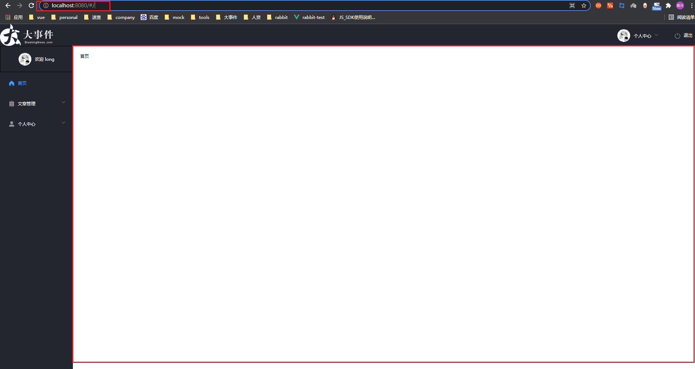
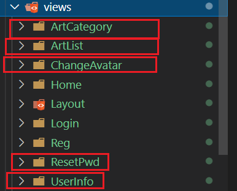
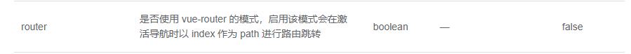
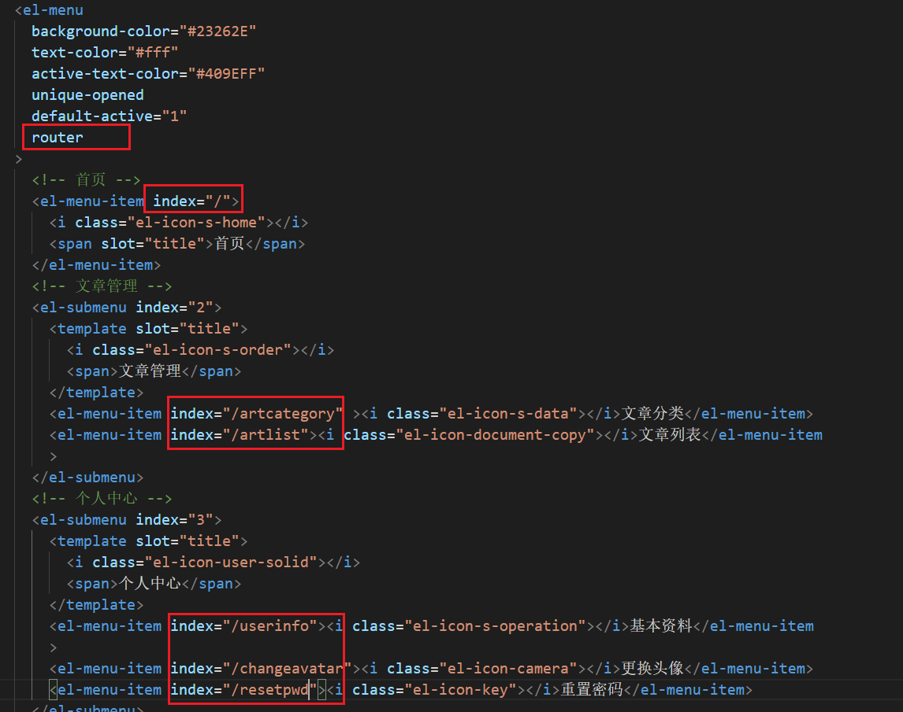
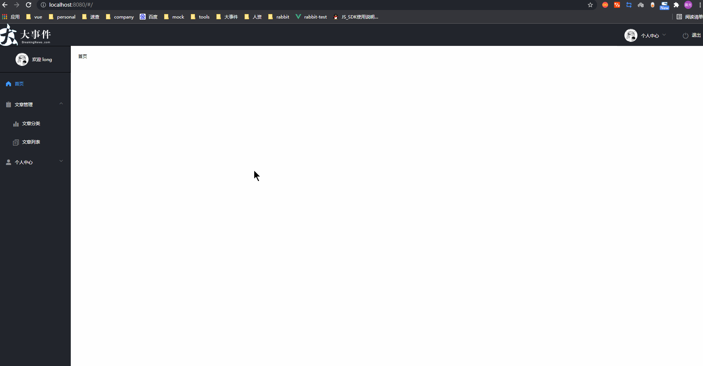
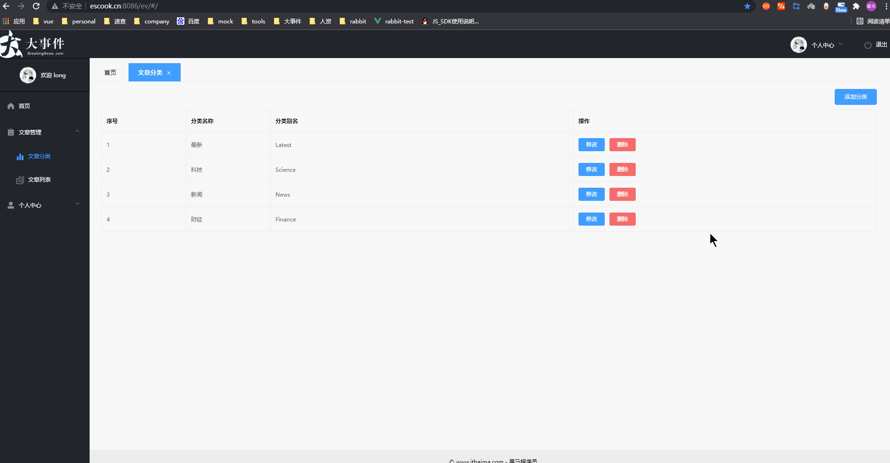

## 首页页面搭建

- 基于我们之前设计的路由,我们先来完成首页页面的搭建,这一节我们只确保首页页面能正确展示

| path             | 文件                         | 功能              | 组件名       | 路由级别 |
| ---------------- | ---------------------------- | ----------------- | ------------ | -------- |
| /login           | views/Login/index.vue        | 登录页            | Login        | 一级路由 |
| /reg             | views/Reg/index.vue          | 注册页            | Reg          | 一级路由 |
| /                | views/Layout/index.vue       | 布局              | Layout       | 一级路由 |
| ├─ /             | views/Home/index.vue         | 主页              | Home         | 二级路由 |
| ├─ /artcategory  | views/ArtCategory/index.vue  | 文章分类          | Artcategory  | 二级路由 |
| ├─ /artlist      | views/ArtList/index.vue      | 文章列表          | ArtList      | 二级路由 |
| ├─ /userinfo     | views/UserInfo/index.vue     | 个人中心/基本资料 | UserInfor    | 二级路由 |
| ├─ /changeavatar | views/changeAvatar/index.vue | 个人中心/更换头像 | ChangeAvatar | 二级路由 |
| ├─ /resetpwd     | views/resetPwd/index.vue     | 个人中心/重置密码 | ResetPwd     | 二级路由 |

在`views`目录下新建Home组件,并配置路由规则

`views/Home/index.vue`

```jsx
<template>
  <div>首页</div>
</template>

<script>
export default {
  name: 'Home'
}
</script>

<style>

</style>

```

在 `router/index.js` 配置二级路由规则

```jsx
+ import Home from '@/views/Home'
const router = new VueRouter({
  routes: [
    { path: '/login', component: Login },
    { path: '/reg', component: Reg },
    {
      path: '/',
      component: Layout,
+     children: [
+        { path: '/', component: Home }
      ]
    }
  ]
})
```

在`Layout.vue ` `el-main`中 配置二级路由的出口

```jsx
<el-main>
    <!-- 二级路由出口 -->
    <router-view></router-view>
</el-main>
```

访问根路径页面展示效果



## 快速实现别的二级页面的展示

在views目录下新建对应页面



配置二级路由规则

`router/index.js`

```jsx
// 导入组件
import ArtCategory from '@/views/ArtCategory'
import ArtList from '@/views/ArtList'
import UserInfo from '@/views/UserInfo'
import ChangeAvatar from '@/views/ChangeAvatar'
import ResetPwd from '@/views/ResetPwd'
// 配置二级路由规则
const router = new VueRouter({
  routes: [
    { path: '/login', component: Login },
    { path: '/reg', component: Reg },
    {
      path: '/',
      component: Layout,
      children: [
        { path: '/', component: Home },
        { path: '/artcategory', component: ArtCategory },
        { path: '/artlist', component: ArtList },
        { path: '/userinfo', component: UserInfo },
        { path: '/changeavatar', component: ChangeAvatar },
        { path: '/resetpwd', component: ResetPwd }
      ]
    }
  ]
})
```

切换页面路由地址展示对应的页面

## 点击左侧导航链接进行路由切换

- 当我们新建完组件并配置完路由规则后,只能在地址栏数路由地址切换组件,但是点击左侧链接路由并没有切换,需要为[menu组件开启路由模式](https://element.eleme.io/#/zh-CN/component/menu)





开启路由模式后效果图



## 处理刷新激活路由问题

```jsx
<!-- 动态控制默认展开 当前的路由地址 --> 
<el-menu
+   :default-active="$route.path"
     class="el-menu-vertical-demo"
     background-color="#23262e"
     text-color="#fff"
     active-text-color="#409eff"
     unique-opened
     router>
</el-menu>
```

### 处理头部导航链接点击跳转

```jsx
 <!-- 头部区域 -->
    <el-header>
       <!-- 左侧的 logo -->
      
+     <el-menu class="el-menu-demo" mode="horizontal" background-color="#23262e" text-color="#fff" router>
        <el-submenu index="3">
          <template slot="title">
            
            <div class="text-avatar" v-else>{{ textAvatar }}</div>
             个人中心
             </template>
 +           <el-menu-item index="/userinfo"><i class="el-icon-s-operation"></i>基本资料</el-menu-item>
 +           <el-menu-item index="/changeavatar"><i class="el-icon-camera"></i>更换头像</el-menu-item>
 +           <el-menu-item index="/resetpwd"><i class="el-icon-key"></i>重置密码</el-menu-item>
        </el-submenu>
        <el-menu-item @click="logout"><i class="el-icon-switch-button"></i>退出</el-menu-item>
      </el-menu>
    </el-header>
```

## 深度选择器

```jsx
<template>
  <div>首页
  <el-form label-width="80px">
    <el-form-item label="活动名称">
      <el-input></el-input>
    </el-form-item>
  </el-form>
  </div>
</template>

<script>
export default {

}
</script>

<style lang="less" scoped>
/* 在elementui组件库中 组件的标签名就是类名
  如果想要修改一些元素的样式,但是元素并不在template模板结构中, 但是通过浏览器检查工具可以检查到这个元素
  使用深度选择器只是在组件内部 修改了当前这个组件的样式
  1. 可以全局设置样式 -- 影响到所有组件
  2. 使用深度选择器 /deep/ 向下穿透 找到这个类名作用样式
  less  /deep/
  css 深度选择器 >>>
  scss深度选择器 ::v-deep
*/
.el-input{
 /deep/ .el-input__inner{
    border-radius: 10px !important;
    background: green !important;
  }
}
</style>

```

## 文章分类列表页面

### 渲染分类页面面包屑与按钮

- [注册卡片组件](https://element.eleme.io/#/zh-CN/component/card)
- [layout布局row和col](https://element.eleme.io/#/zh-CN/component/layout)
- [面包屑组件](https://element.eleme.io/#/zh-CN/component/breadcrumb)

```jsx
<template>
  <el-card class="cate-container">
    <!-- 面包屑导航 -->
    <el-breadcrumb  separator-class="el-icon-arrow-right">
      <el-breadcrumb-item :to="{ path: '/' }">首页</el-breadcrumb-item>
      <el-breadcrumb-item>文章管理</el-breadcrumb-item>
      <el-breadcrumb-item>文章分类</el-breadcrumb-item>
    </el-breadcrumb>
    <!-- 添加按钮 -->
    <el-row type="flex" justify="end">
      <el-col :span="2"><el-button type="primary" size="small">添加分类</el-button></el-col>
    </el-row>
    <!-- 表格 -->
  </el-card>
</template>
```

### 获取分类列表数据

`api/article.js`

```jsx
import http from '@/utils/request.js'
// 获取文章分类列表
export const reqGetArtCateList = () => {
  return http({
    method: 'get',
    url: '/my/cate/list'
  })
}
```

按照我们的梳理, 封装完接口应该在组件中发送请求获取数据了,但是我们要关注一个问题, 我们发现多个页面中都要使用到文章分类的数据 `文章列表页面`和`添加文章页面`

既然多个组件要使用这个数据,我们使用vuex来统一管理

新建`store/modules/article.js`

```jsx
import { reqGetArtCateList } from '@/api/article'

export default {
  state () {
    return {
      // 文章分类的列表数据
      cateList: []
    }
  },
  mutations: {
    // 设置分类列表数据
    setCateList (state, list) {
      state.cateList = list
    }
  },
  actions: {
    // 初始化文章分类
    async getCateList (ctx) {
      const { data: res } = await reqGetArtCateList()
      if (res.code === 0) {
        ctx.commit('setCateList', res.data)
      }
    }
  },
  getters: {},
  // 开启命名空间
  namespaced: true
}

```

在`store/index.js`中挂载article模块

```jsx
import Vue from 'vue'
import Vuex from 'vuex'
// 导入user模块
import user from './modules/user'
import article from './modules/article'
Vue.use(Vuex)

export default new Vuex.Store({
  modules: {
    // 挂载模块
    user,
    article
  }
})

```

### 渲染分类页面表格

- [注册表格组件](https://element.eleme.io/#/zh-CN/component/table)

```jsx
<template>
  <div class="catelist-container">
    <!-- 卡片视图 -->
    <el-card>
        <!-- 面板屑导航 -->
        <el-breadcrumb separator="/" style="margin-bottom: 10px">
          <el-breadcrumb-item :to="{ path: '/' }">首页</el-breadcrumb-item>
          <el-breadcrumb-item>文章管理</el-breadcrumb-item>
          <el-breadcrumb-item>文章分类</el-breadcrumb-item>
        </el-breadcrumb>
         <!-- 添加按钮 -->
        <el-row type="flex" justify="end" style="margin-bottom: 10px">
          <el-button type="primary" size="medium">添加分类</el-button>
        </el-row>
        <!-- 展示数据表格 -->
        <el-table
          :data="cateList"
          style="width: 100%" border stripe>
          <el-table-column type="index" label="序号" width="120"></el-table-column>
          <el-table-column prop="cate_name" label="分类名称"> </el-table-column>
          <el-table-column prop="cate_alias" label="分类别名"> </el-table-column>
          <el-table-column label="操作">
            <template #default>
              <el-button type="primary" size="mini">修改</el-button>
              <el-button type="danger" size="mini">删除</el-button>
            </template>
          </el-table-column>
        </el-table>
    </el-card>
  </div>
</template>
<script>
import { mapState, mapActions } from 'vuex'
export default {
  name: 'CateList',
  created () {
    // 获取文章分类列表
    this.getCateList()
  },
  data () {
    return {
    }
  },
  computed: {
    // 映射文章分类列表
    ...mapState('article', ['cateList'])
  },
  methods: {
    ...mapActions('article', ['getCateList'])
  }
}
</script>
```

### 添加文章分类



### 渲染新增分类的对话框

1. 为按钮绑定点击事件
2. 注册[对话框组件Dialog](https://element.eleme.io/#/zh-CN/component/dialog)
3. 完成表单基本结构搭建和表单校验规则

`artcategory/index.vue`

```jsx
 <!-- 添加按钮 -->
<el-row type="flex" justify="end" style="margin-bottom: 10px">
    <el-button type="primary" size="medium" @click="addDialogVisible = true">添加分类</el-button>
</el-row>

<!-- 添加分类信息的对话框 -->
<el-dialog title="添加文章分类" :visible.sync="addDialogVisible" width="35%">
    <!-- 添加的表单 -->
    <el-form :model="addForm" :rules="addRules" ref="addRef" label-width="80px">
        <el-form-item label="分类名称" prop="cate_name">
            <el-input v-model="addForm.cate_name"></el-input>
        </el-form-item>
        <el-form-item label="分类别名" prop="cate_alias">
            <el-input v-model="addForm.cate_alias"></el-input>
        </el-form-item>
    </el-form>
    <span slot="footer" class="dialog-footer">
        <el-button @click="addDialogVisible = false">取 消</el-button>
        <el-button type="primary">添 加</el-button>
    </span>
</el-dialog>

data () {
    return {
        // 是否展示添加的对话框
        addDialogVisible: false,
        // 添加的表单
        addForm: {
            cate_name: '',
            cate_alias: ''
        },
        // 添加的表单验证
        addRules: {
            cate_name: [
                { required: true, message: '请输入分类名称', trigger: 'blur' },
                { pattern: /^\S{1,10}$/, message: '分类名称必须是1-10位的非空字符串', trigger: 'blur' }
            ],
            cate_alias: [
                { required: true, message: '请输入分类别名', trigger: 'blur' },
                { pattern: /^[a-zA-Z0-9]{1,15}$/, message: '分类别名必须是1-15位的字母数字', trigger: 'blur' }
            ]
        }
    }
  },
```

### 监听对话框的关闭重置表单

```jsx
1. 表单元素添加ref属性
2. 对话框绑定@close事件
methods: {
    ...
    // 重置表单 对话框关闭完成后的事件
    resetAddForm () {
      this.$refs.addRef.resetFields()
    }
}
```

### 点击确定完成新增分类

- 我们准备的表单结构和校验规则通过后,完成文章分类的新增

1. 准备新增文章分类的接口 `api/article.js`

```jsx
// 新增文章分类列表
export const reqAddArticleCate = data => {
  return http({
    method: 'post',
    url: '/my/cate/add',
    data
  })
}

```

2. 为确定按钮绑定点击事件`ArtCategory/index.vue`

```jsx
 <el-button type="primary" @click="addCate">添 加</el-button>
```

3. 导入接口点击确定发送请求完成文章分类的新增`ArtCategory/index.vue`

```jsx
import { reqAddArticleCate } from '@/api/article'
methods: {
    ...
    // 新增文章分类
    addCate () {
     this.$refs.addRef.validate(async valid => {
        if (!valid) return
        const { data } = await reqAddArticleCate(this.addForm)
        // 提示用户
        if (data.code !== 0) return this.$message.error(data.message)
        this.$message.success('新增文章分类成功！')
        // 关闭对话框
        this.addDialogVisible = false
        // 重新获取分类列表
        this.getCateList()
      })
    }
 }  
```

### 删除文章分类

1. 准备删除文章分类的接口 `api/article.js`

```jsx
// 删除文章分类列表
// 要删除的分类 id，注意：这是一个 URL 查询参数
// 注意： 管理员不允许删除 id 为 1（最新） 和 2（科技） 的分类！
export const reqDelArticle = id => {
  return http({
    method: 'delete',
    url: '/my/cate/del',
    params: { id: id }
  })
}
```

2. 为删除按钮绑定点击事件 携带要删除分类的id`ArtCategory/index.vue`

```jsx
 <el-table-column label="操作">
    <template #default="{row}">
        <el-button type="primary" size="mini">修改</el-button>
        <el-button type="danger" size="mini" @click="removeCate(row.id)">删除</el-button>
    </template>
</el-table-column>
```

3. 导入接口点击确定发送请求完成文章分类的新增`ArtCategory/index.vue`

```jsx
import { reqDelArticle } from '@/api/article'
methods: {
    ...
    // 根据 id 删除分类
    async removeCate (id) {
      // 判断要删除的是否为前两个分类
      if (id === 1 || id === 2) return this.$message.warning('管理员不允许删除前两个分类！')

      // 询问用户是否要删除
      const confirmResult = await this.$confirm('此操作将永久删除该分类, 是否继续?', '提示', {
        confirmButtonText: '确定',
        cancelButtonText: '取消',
        type: 'warning'
      }).catch(err => err)

      // 取消了删除
      if (confirmResult !== 'confirm') return this.$message.info('已取消操作')

      // 调用删除的接口
      const { data: res } = await reqDelArticle(id)

      // 判断删除的结果
      if (res.code !== 0) return this.$message.error(res.message)
      this.$message.success('删除分类成功！')
      // 重新获取分类列表
      this.getCateList()
    }
}
```

### 编辑文章分类

#### 点击编辑按钮展示弹框

- 这个功能我们之前写过, 我们可以参照这新增文章分类的操作快速实现 `ArtCategory/index.vue`

1. 准备对话框
2. 准备对话框表单结构
3. 复用新增文章分类的对话框的表单规则
4. 点击编辑按钮展示编辑文章分类对话框

```jsx
<el-button type="primary" size="mini" @click="editDialogVisible = true">修改</el-button>
  <!-- 修改分类信息的对话框 -->
<el-dialog title="修改文章分类" :visible.sync="editDialogVisible" width="35%">
    <!-- 修改分类的表单 -->
    <el-form :model="editForm" :rules="addRules" ref="editRef" label-width="80px">
        <el-form-item label="分类名称" prop="cate_name">
            <el-input v-model="editForm.cate_name"></el-input>
        </el-form-item>
        <el-form-item label="分类别名" prop="cate_alias">
            <el-input v-model="editForm.cate_alias"></el-input>
        </el-form-item>
    </el-form>
    <span slot="footer" class="dialog-footer">
        <el-button @click="editDialogVisible = false">取 消</el-button>
        <el-button type="primary">确 定</el-button>
    </span>
</el-dialog>
data(){
  return {
      ...
	// 是否展示修改的对话框
      editDialogVisible: false,
      // 修改的表单
      editForm: {
          id: '',
          cate_name: '',
          cate_alias: ''
      }      
  }  
}
```

#### 根据id查询编辑的文章分类

1. 封装接口根据id查询编辑的文章分类详情 `api/article.js`

```jsx
// 根据id查询文章分类详情
export const reqGetCateInfoById = id => {
  return http({
    method: 'get',
    url: '/my/cate/info',
    params: { id: id }
  })
}
```

2. 导入接口, 点击编辑按钮传入id发送请求,将请求结果回显在表单中`ArtCategory/index.vue`

```jsx
<el-button type="primary" size="mini" @click="showEditDialog(row.id)">修改</el-button>
import {  reqGetCateInfoById } from '@/api/article'
methods: {
    ...
    // 展示修改的对话框
    async showEditDialog (id) {
      // 1. 禁止修改 id为1 和 2 的分类
      if (id === 1 || id === 2) return this.$message.warning('禁止修改该分类')
      // 2. 展示对话框
      this.EditDialogVisible = true
      // 3. 发送请求
      const { data } = await reqGetCateInfoById(id)
      // 4. 数据回显 将结果赋值给双向绑定给表单的editForm
      if (data.code !== 0) return this.$message.error('获取分类失败')
      this.editForm = data.data
    }
}
```

#### 完成分类列表编辑

1. 封装 更新文章分类接口 `api/article.js`

```jsx
// 根据 id 更新文章分类数据
export const reqUpdataArticle = data => {
  return http({
    method: 'put',
    url: '/my/cate/info',
    data
  })
}
```

2. 导入接口, 点击确定按钮携带数据发送请求更新文章分类信息`ArtCategory/index.vue`

```jsx
import { reqUpdataArticle } from '@/api/article'
methods: {
    ...
     // 修改分类信息
   editCate () {
        this.$refs.editRef.validate(async valid => {
            if (!valid) return
            const { data: res } = await reqUpdataArticle(this.editForm)
            if (res.code !== 0) return this.$message.error(res.message)
            this.$message.success('更新分类成功！')
            this.editDialogVisible = false
            this.getCateList()
        })
    }
}
```

3. 处理编辑对话框关闭重置表单和校验规则

```jsx
1. 表单元素添加ref属性
2. 对话框绑定@close事件
// 重置表单 对话框关闭完成后的事件
resetEditForm () {
    this.$refs.editRef.resetFields()
}
```

