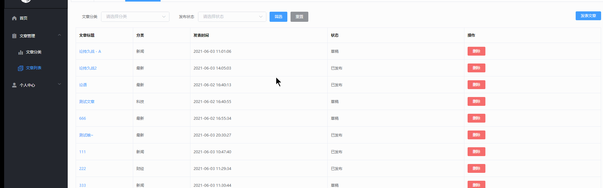

## 文章列表页面结构搭建

- 搭建文章列表页面结构`ArtList/index.vue`
- **[注册 select和option组件](https://element.eleme.io/#/zh-CN/component/select)**

```jsx
<template>
  <el-card>
     <!-- 面板屑导航 -->
    <el-breadcrumb separator="/" style="margin-bottom: 40px">
      <el-breadcrumb-item :to="{ path: '/' }">首页</el-breadcrumb-item>
      <el-breadcrumb-item>文章管理</el-breadcrumb-item>
      <el-breadcrumb-item>文章列表</el-breadcrumb-item>
    </el-breadcrumb>
     <!-- 头部筛选+发表按钮 -->
    <el-row type="flex" justify="space-between" class="selectForm">
      <!-- 左侧的筛选表单 -->
      <el-col :span="20">
      <!-- 表单区域 -->
      <el-form ref="searchRef" :model="q" label-width="80px" inline size="small">
        <el-form-item label="文章分类">
          <el-select v-model="q.cate_id" placeholder="请选择分类">
            <el-option label="科技" value="科技"></el-option>
            <el-option label="科学" value="科学"></el-option>
          </el-select>
        </el-form-item>
        <el-form-item label="发布状态">
          <el-select v-model="q.state" placeholder="请选择状态">
            <el-option label="已发布" value="已发布"></el-option>
            <el-option label="草稿" value="草稿"></el-option>
          </el-select>
        </el-form-item>
        <el-form-item>
          <el-button type="primary">筛选</el-button>
          <el-button type="info">重置</el-button>
        </el-form-item>
      </el-form>
      </el-col>    
      <!-- 右侧发表按钮 -->
      <el-col :span="1">
        <el-button type="primary" size="mini">发表文章</el-button>
      </el-col>
    </el-row>
    <!-- 表格 -->
  </el-card>
</template>

<script>
export default {
  data () {
    return {
      // 查询参数 q
      q: {
        pagenum: 1,
        pagesize: 2,
        cate_id: '',
        state: ''
      }
    }
  }
}
</script>
<style lang="less" scoped>
.selectForm{
  margin: 30px 0;
 /deep/ .el-form-item__label{
    font-size: 12px;
  }
}
</style>

```

## 获取文章列表数据

`api/article.js`

```jsx
import http from '@/utils/request.js'
/* 获取文章分类列表
  q 查询参数是一个对象 包含以下参数
  pagenum number类型 页码值整数，最小值为 1
  pagesize number类型 每页显示多少条数据整数，最小值为 1
  cate_id string类型 文章分类的 id 整数，最小值为 1
  state string类型  文章的发布状态 可选值有：已发布、草稿
  pagenum和pagesize为必传参数
*/
export const reqGetArticleList = q => {
  return http({
    method: 'get',
    url: '/my/article/list',
    params: q
  })
}
```

- 导入获取文章列表接口, 定义方法携带参数,发送请求获取文章列表数据`ArtList/index.vue`

```jsx
import { reqGetArticleList } from '@/api/article'
 data () {
    return {
      // 查询参数 q
      q: {
        pagenum: 1,
        pagesize: 2,
        cate_id: '',
        state: ''
      },
      // 文章列表的数组
      artList: [],
      total: 0
    }
  },
 created () {
    this.initArtList()
  },
  methods: {
    // 初始化文章列表的数据
    async initArtList () {
      const { data: res } = await reqGetArticleList(this.q)

      if (res.code !== 0) return this.$message.error('获取文章列表失败！')

      this.artList = res.data
      this.total = res.total
    }
  }
```

## 渲染文章列表页面表格数据

`ArtList/index.vue`

```jsx
<el-table :data="artList" style="width: 100%" stripe border>
    <el-table-column prop="title" label="文章标题" width="180">
        <template #default="{ row }">
            <el-link type="primary">{{ row.title }}</el-link>
        </template>
    </el-table-column>
    <el-table-column prop="cate_name" label="分类" width="180"> </el-table-column>
    <el-table-column prop="pub_date" label="发表时间"></el-table-column>
    <el-table-column prop="state" label="状态"></el-table-column>
    <el-table-column label="操作">
        <template>
            <el-button type="danger" size="mini">删除</el-button>
        </template>
    </el-table-column>
</el-table>
```

## 文章列表筛选

### 文章分类下拉表单数据渲染



通过如上图我们看到我们要渲染文章分类,但是文章分类的数据我们之前已经封装在vuex中,我们需要在当前组件使用,直接从提交获取文章分类的action, 并将vuex存储的分类数据映射在组件中使用

```jsx
<el-form-item label="文章分类">
    <el-select v-model="q.cate_id" placeholder="请选择分类">
        <el-option 
            v-for="item in cateList" 
            :key="item.id" 
            :label="item.cate_name" 
            :value="item.id">
        </el-option>
    </el-select>
</el-form-item>

import { mapState, mapActions } from 'vuex'
computed: {
    ...mapState('article', ['cateList']) // 文章分类数据
},
created () {
    this.getCateList()
  },
methods: {
    ...mapActions('article', ['getCateList']),
}
```

### 完成筛选文章列表

- 因为下拉表单选中的数据已经双向同步到了q查询参数中, 为筛选按钮绑定点击事件,直接发送查询请求即可,为保证数据完整性,手动将pagenum设置为1 发送请求

`ArtList/index.vue`

```jsx
 <el-button type="primary" @click="search">筛选</el-button>
 methods: {
     ...
     search() {
         this.q.pagenum = 1
         this.initArtList()
     },
 }
```

### 重置搜索

- 点击重置按钮显示所有列表,我们只需将q查询参数对象的参数还原为初始状态即可

```jsx
<el-button type="info" @click="reset">重置</el-button>
reset () {
      this.q.pagenum = 1
      this.q.cate_id = ''
      this.q.state = ''
      this.initArtList()
    }
```

## 处理发表时间日期格式

表格在战术文章发表日期的时候是一个日期对象,我们要展示成`YYYY-MM-DD HH:mm:ss `这种日期格式,我们可以使用过滤器来实现,并且有可能有多处会涉及到日期格式处理,我们封装一个全局的过滤器

1. 安装dayjs `yarn add dayjs`

`main.js`

```jsx
// 导入 dayjs
import dayjs from 'dayjs'
// 定义格式化时间的过滤器
Vue.filter('dateFormat', (time) => {
  return dayjs(time).format('YYYY-MM-DD HH:mm:ss')
})
```

2. 处理日期列的展示`ArtList/index.vue`

```jsx
<el-table-column  label="发表时间">
    <template #default="{ row }">
        {{ row.pub_date | dateFormat }}
    </template>
</el-table-column>
```

## 分页功能

- `目标`展示分页功能

1. [注册分页组件](https://element.eleme.io/#/zh-CN/component/pagination)`utils/element.js`

```jsx
import Vue from 'vue'
// 按需导入组件
import {
  Pagination
} from 'element-ui'
// 注册全局组件
Vue.use(Pagination)

```

2. `ArtList/index.vue`组件使用分页组件

```jsx
<!-- 分页区域 -->
<el-pagination
    @size-change="handleSizeChange"
    @current-change="handleCurrentChange"
    :current-page="q.pagenum"
    :page-sizes="[2, 3, 5, 10]"
    :page-size="q.pagesize"
    layout="total, sizes, prev, pager, next, jumper"
    :total="total"
    >
</el-pagination>

methods: {
    ...
     // 每页显示的数据条数发生了变化
    handleSizeChange (val) {
        this.q.pagesize = val
        this.initArtList()
    },
   // 页码值发生了变化
   handleCurrentChange (val) {
      this.q.pagenum = val
      this.initArtList()
    }
}

```

## 删除文章

1. 准备删除文章的接口`api/article.js`

```jsx
/*
  根据id删除文章
  参数id: 要删除的文章 id，注意：这是一个 URL 查询参数
*/
export const reqDelArticleById = id => {
  return http({
    method: 'delete',
    url: '/my/article/info',
    params: {
      id
    }
  })
}
```

2. 为删除按钮绑定点击事件并携带id参数

```jsx
<el-table-column label="操作">
    <template #default="{ row }">
        <el-button type="danger" size="mini" @click="remove(row.id)">删除</el-button>
    </template>
</el-table-column>
```

3. 组件导入删除接口,发送删除请求

```jsx
methods: {
    // 根据 id 删除文章
    async remove (id) {
        const confirmResult = await this.$confirm('此操作将永久删除该文章, 是否继续?', '提示', {
            confirmButtonText: '确定',
            cancelButtonText: '取消',
            type: 'warning'
        }).catch(err => err)

        if (confirmResult !== 'confirm') return this.$message.info('已取消操作')

        const { data: res } = await reqDelArticleById(id)

        if (res.code !== 0) return this.$message.error('删除文章失败！')
        this.$message.success('删除文章成功！')

        // 如果当前页码值 > 1 并且当前页中数据的条数等于 1
        if (this.q.pagenum > 1 && this.artList.length === 1) {
            // 则删除成功之后，当前页的数据条数为 0，需要请求上一页数据
            this.q.pagenum--
        }
        this.initArtList()
    }
}
```

## 文章详情

### 点击文章标题展示对话框

1. 为标题列的文章标题绑定点击事件,并携带文章id参数,为获取文章信息做准备`ArtList/index.vue`

```jsx
<el-table-column prop="title" label="文章标题" width="180">
    <template v-slot="{ row }">
        <el-link type="primary" @click="showInfo(row.id)">{{ row.title }}</el-link>
    </template>
</el-table-column>
```

2. 准备显示文章详情的对话框组件

```jsx
<!-- 文章详情的对话框 -->
<el-dialog title="文章预览" :visible.sync="infoVisible" width="80%">
    <p>文章详情内容</p>
    <span slot="footer" class="dialog-footer">
        <el-button type="primary" @click="infoVisible = false">关 闭</el-button>
    </span>
</el-dialog>
```

3. 点击按钮显示对话框

```jsx
data(){
    return {
        ...
         infoVisible: false,
    }
}
methods: {
    ...
    showInfo(id){
      console.log(id)
      this.infoVisible = true
    }
}
```

### 将文章详情抽离为子组件

- 接下来应该展示文章详情了,就在组件预留的p标签的位置,但是我们目前组件的代码已经越来越多了,所以为了维护方便,我们将文章详情抽离成子组件

1. 新建`ArtList/components/ArtInfo.vue`子组件

```jsx
<template>
  <div>
    <h1 class="title">文章标题</h1>

    <div class="info">
      <span>作者：张三</span>
      <span>发布时间：2019-10-20</span>
      <span>所属分类： 科技</span>
      <span>状态：草稿</span>
    </div>

    <el-divider></el-divider>

    
    <div>
      文章正文
    </div>
  </div>
</template>

<script>
export default {
  name: 'ArtInfo'
}
</script>

<style lang="less" scoped>
.title {
  font-size: 24px;
  text-align: center;
  font-weight: normal;
  color: #000;
  margin: 0 0 10px 0;
}

.info {
  font-size: 12px;
  span {
    margin-right: 20px;
  }
}
</style>

```

2. 将ArtInfo挂载为ArtList的子组件`ArtList/index.vue`

```jsx
import ArtInfo from './components/ArtInfo.vue'
 components: {
    ArtInfo
  }
<!-- 文章详情的对话框 -->
<el-dialog title="文章预览" :visible.sync="infoVisible" width="80%">
    <ArtInfo></ArtInfo>
    <span slot="footer" class="dialog-footer">
        <el-button type="primary" @click="infoVisible = false">关 闭</el-button>
    </span>
</el-dialog>      
```

### 展示文章详情

#### 获取文章详情

刚才点击文章标题传递了文章的id,我们可以在展示对话框的处理函数中获取到点击的文章详情

1. 封装获取文章详情的api `api/article.js`

```jsx
/*
根据 id 获取文章详情
文章的 id，注意：这是一个 URL 查询参数
*/
export const reqGetArtInfo = id => {
  return http({
    method: 'get',
    url: '/my/article/info',
    params: {
      id
    }
  })
}

```

2. 导入接口, 在展示对话框组件的处理函数中发送请求,将文章详情存储在data中`ArtList/index.vue`

```jsx
import { reqGetArtInfo } from '@/api/article'
data(){
    return {
       ...
      // 文章详情对象
      artInfo: {}
    }
},
methods: {
    ...
    async showInfo (id) {
        console.log(id)
        const { data } = await reqGetArtInfo(id)
        if (data.code !== 0) return this.$message.error('文章预览失败！')
        this.artInfo = data.data
        this.infoVisible = true
	}
}
```

#### 展示文章详情

- 我们将点击的文章详情获取到后要在对话框中展示,但是数据在父组件中,要在子组件中展示数据,所以需要父传子

`ArtList/index.vue` 父传子

```jsx
<ArtInfo :articleInfo="artInfo"></ArtInfo>
```

- 子组件`ArtInfo.vue`接收父组件传递的数据并渲染

```jsx
<template>
  <div>
    <h1 class="title">{{ articleInfo.title  }}</h1>

    <div class="info">
      <span>作者：{{ articleInfo.nickname || articleInfo.username }}</span>
      <span>发布时间：{{ articleInfo.pub_date | dateFormat }}</span>
      <span>所属分类： {{ articleInfo.cate_name }}</span>
      <span>状态：{{ articleInfo.state }}</span>
    </div>

    <el-divider></el-divider>

    
    <div v-html="articleInfo.content"></div>
  </div>
</template>

<script>

export default {
  name: 'ArtInfo',
  // 接收父组件传递的数据
  props: {
    articleInfo: {
      type: Object,
      required: true
    }
  }
}
</script>
```

## 发表文章

### 展示发表文章全屏对话框

1. 为发表文章按钮绑定点击事件

```jsx
<el-button type="primary" size="mini" @click="dialogVisible = true">发表文章</el-button>
```

2. 准备对话框组件展示

```jsx
<!-- 发表文章的对话框 -->
<el-dialog
    title="发表文章"
    :visible.sync="dialogVisible"
    :before-close="beforeClose"
    destroy-on-close
    fullscreen
    >
    <p>发表文章内容结构</p>
</el-dialog>

data(){
    return {
        ...
        dialogVisible: false
    }
}
```

3. 点击x按钮提示确认是否退出发表文章

```jsx
methods: {
    ...
    async beforeClose (done) {
        const confirmResult = await this.$confirm('此操作将导致文章信息丢失, 是否继续?', '提示', {
            confirmButtonText: '确定',
            cancelButtonText: '取消',
            type: 'warning'
        }).catch(err => err)
        console.log(confirmResult)
        if (confirmResult !== 'confirm') return
        done()
    }
}
```

### 抽离发表文章为对话框子组件

- 由于在发表文章对话框组件中的内容较多,所以我们将发表文章中的内容区域封装为一个子组件

在`ArtList`目录下新建`ArtPub.vue`组件

```jsx
<template>
  <div class="art-pub-container">
    <el-form  ref="pubRef" label-width="100px">
      <el-form-item label="文章标题" placeholder="请填写文章标题">
        <el-input  maxlength="30"></el-input>
      </el-form-item>
      <el-form-item label="文章分类">
        <el-select placeholder="请选择分类" clearable>
            <el-option label="科技" value="科技"> </el-option>
            <el-option label="科技" value="科技"> </el-option>
            <el-option label="科技" value="科技"> </el-option>
        </el-select>
      </el-form-item>
      <el-form-item label="文章内容"></el-form-item>
      <el-form-item label="文章封面">
        <div class="cover-box">
          
          <el-link type="primary" :underline="false">+ 选择封面</el-link>
          <input type="file" ref="iptFile" accept="image/*" />
        </div>
      </el-form-item>
      <el-form-item>
        <el-button type="primary">发布文章</el-button>
        <el-button type="info">存为草稿</el-button>
      </el-form-item>
    </el-form>
  </div>
</template>

<script>
export default {
  name: 'ArtPub'
}
</script>

<style lang="less" scoped>
.art-pub-container {
  padding: 0 30px 20px 0px;
}

.el-select {
  width: 100%;
}

/deep/ .ql-snow .ql-color-picker .ql-picker-label svg,
/deep/ .ql-snow .ql-icon-picker .ql-picker-label svg {
  position: relative;
  top: -6px;
}

/deep/ .ql-snow .ql-picker-label::before {
  position: relative;
  top: -8px;
}

/deep/ .ql-editor {
  min-height: 300px;
}

.cover-img {
  object-fit: cover;
  width: 400px;
  height: 280px;
  margin-right: 10px;
}

.cover-box {
  display: flex;
  flex-direction: column;
  align-items: flex-start;
}
</style>

```

### 为表单关联数据并设置规则

```jsx
<template>
  <div class="art-pub-container">
    <el-form :model="pubForm" :rules="pubRules" ref="pubRef" label-width="100px">
      <el-form-item label="文章标题" prop="title" placeholder="请填写文章标题">
        <el-input v-model="pubForm.title" maxlength="30"></el-input>
      </el-form-item>
      <el-form-item label="文章分类" prop="cate_id">
        <el-select v-model="pubForm.cate_id" placeholder="请选择分类" clearable>
          <el-option v-for="item in cateList" :key="item.id" :label="item.cate_name" :value="item.id"> </el-option>
        </el-select>
      </el-form-item>
      <el-form-item label="文章内容">
        <quill-editor v-model="pubForm.content"></quill-editor>
      </el-form-item>
      <el-form-item label="文章封面">
        <div class="cover-box">
          
          <el-link type="primary" :underline="false">+ 选择封面</el-link>
          <!--隐藏的输入框 -->
          <input type="file" style="display: none;" accept="image/*" ref="iptFile"/>
        </div>
      </el-form-item>
      <el-form-item>
        <el-button type="primary">发布文章</el-button>
        <el-button type="info">存为草稿</el-button>
      </el-form-item>
    </el-form>
  </div>
</template>
import defaultCover from '@/images/images/cover.jpg'
import { mapState, mapActions } from 'vuex'
data() {
    return {
      pubForm: {
        title: '', // 文章标题
        cate_id: '', // 文章分类id
        content: '', // 文章内容
        state: '', // 文章发布状态
        cover_img: defaultCover // 文章封面图
      },
      coverFile: null, // 上传的文件对象
      pubRules: {
        title: [
          { required: true, message: '请输入文章标题', trigger: 'blur' },
          { min: 1, max: 30, message: '文章标题的长度为1-30个字符', trigger: 'blur' } 
        ],
        cate_id: [{ required: true, message: '请选择文章分类', trigger: 'blur' }]
      },
    }
  },
created(){
    this.getCateList()
},      
computed: {
  ...mapState('article', ['cateList'])
},
methods: {
     ...mapActions('article', ['getCateList']),
}
```

###  富文本编辑器

1. [安装富文本编辑器包](https://www.npmjs.com/package/vue-quill-editor)`vue-quill-editor`

```jsx
yarn add vue-quill-editor
```

2. 在`main.js`导入并注册

```jsx
// 导入富文本编辑器
import VueQuillEditor from 'vue-quill-editor'
// 导入富文本编辑器样式
import 'quill/dist/quill.core.css'
import 'quill/dist/quill.snow.css'
import 'quill/dist/quill.bubble.css'
// 全局注册富文本编辑器组件
Vue.use(VueQuillEditor)
```

3. 在发布文章页面使用富文本编辑器

```jsx
<el-form-item label="文章内容">
   <quill-editor v-model="pubForm.content"></quill-editor>
</el-form-item>
```

### 点击选择文章封面

```jsx
<el-form-item label="文章封面">
    <div class="cover-box">
        
        <el-link type="primary" :underline="false" @click="chooseCover">+ 选择封面</el-link>
        <!--隐藏的输入框 -->
        <input type="file" style="display: none;" accept="image/*"  ref="iptFile" @change="uploadImg" />
    </div>
</el-form-item>
```

1. 点击选择封面文本触发文件域的点击事件进行文件选择

```jsx
methods: {
  ...
  chooseCover() {
      this.$refs.iptFile.click()
  },
}
```

2. 选择文件后将选中的图片使用`URL.createObjectURL`方法创建一个临时路径地址

```jsx
 // 上传图像本地预览
uploadImg (e) {
    // console.log(e.target.files[0]) // 上传的文件对象
    const file = e.target.files[0]
    if (file) {
        // 生成临时路径
        const tmp = URL.createObjectURL(file)
        console.log(tmp)
        // 将上传的图像本地预览
        this.pubForm.cover_img = tmp
        // 存一个file对象, 后期发布文章使用
        this.file = file
    }
},
```

### 发布文章完成

1. 封装发布文章的接口`api/article.js`

```jsx
export const reqPublishArticle = (data) => {
    return http({
        method: 'post',
        url: '/my/article/add',
        data
    })
}
```

2. 为按钮绑定点击事件

```jsx
  <el-form-item>
    <el-button type="primary" @click="publish('已发布')">发布文章</el-button>
    <el-button type="info" @click="publish('草稿')">存为草稿</el-button>
 </el-form-item>
```

3. 定义方法发送请求

```jsx
import {reqPublishArticle} from '@/api/article'
methods: {
    ...
  	// 发布文章
    publish (str) {
      // 处理state状态字段
      this.pubForm.state = str
      console.log(this.pubForm)
      // 1. 预校验
      this.$refs.pubRef.validate(async boo => {
        if (!boo) return ''
        // 2. 处理数据格式为formData格式
        const fm = new FormData()
        fm.append('title', this.pubForm.title)
        fm.append('cate_id', this.pubForm.cate_id)
        fm.append('content', this.pubForm.content)
        fm.append('state', this.pubForm.state)
        // cover_img要的是一个文件对象
        fm.append('cover_img', this.file)
        // 2. 发送发表文章接口请求
        const { data } = await reqPublishArticle(fm)
        // 3. 失败提示
        if (data.code !== 0) return this.$message.error(data.message)
        // 4.成功提示
        this.$message.success(data.message)
        // 5. 子传父通知父组件 关闭对话框
        this.$emit('addClose')
      })
    }
}
```

4. 父组件绑定自定义事件关闭对话框`ArtList/index`

```jsx
 <ArtPub @pub-success="pubSuccess"></ArtPub>
methods: {
    ...
    pubSuccess () {
      this.dialogVisible = false
      this.initArtList()
    }
}
```

###  发表完毕清空之前的添加记录

-   `destroy-on-close` 属性

```jsx
 <el-dialog
     title="发表文章"
     :visible.sync="dialogVisible"
     :before-close="beforeClose"
     fullscreen
     destroy-on-close
     >
    <ArtPub @pub-success="pubSuccess"></ArtPub>
</el-dialog>
```


