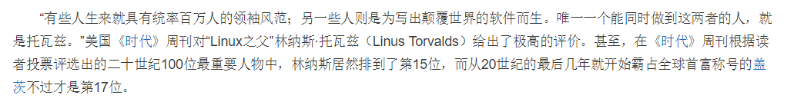

# 事件的高级运用

>  目标

```
1. 能够写出元素注册事件的两种方式
2. 能够说出删除事件的两种方式
3. 能够说出DOM事件流的三个阶段
4. 能够利用事件对象完成跟随鼠标案例
5. 能够阻止事件冒泡
6. 能够说出常见的鼠标和键盘事件
```

# 事件对象

## 事件对象的概述

> 在触发某个事件的时候，都会产生一个事件对象Event，这个对象中包含所有与事件相关的一些信息，包括触发事件的元素，事件的类型以及其他与事件相关的信息。

鼠标事件触发时，事件对象中会包含鼠标的位置信息。

键盘事件触发时，事件对象中会包含按下的键相关的信息。

```javascript
每一个事件在触发时，都会产生一个事件对象。
你见或者不见，我就在那里，不悲不喜。
你爱或者不爱，爱就在那里，不增不减。
你用或者不用，我都会给你，不离不弃。 
```

> 既然事件对象中存储了这么多的信息，我们首先需要做的就是获取到这个事件对象。

获取事件对象非常的简单，只需要在注册事件的时候，指定一个形参即可。这个形参就是我们想要获取到的事件对象。

```javascript
btn.onclick = function(event){
    //event就是事件对象，里面包含了事件触发时的一些信息。
	console.log(event);
}
```

提问:

1. 什么是事件对象 ? => 事件触发的时候存储的当前的事件信息
2. 如何获取事件对象 ? => 在事件函数中接受一个形参即可 

## 事件对象的常用属性

> 事件对象中有很多很多的属性，但是很多属性并不常用。我们经常用到的是***鼠标位置信息*** 和***键盘码***  相关的信息。

> https://developer.mozilla.org/zh-CN/docs/Web/API/Event

> 键盘事件

```
keydown => 键盘按下
keyup => 键盘抬起

键盘事件一般是给表单或者document注册
给表单注册: 在表单里面输入的时候触发
给document注册: 只要页面获取焦点的时候, 按键盘都会触发

注意点:
	keydown:会在值落到表单之前触发, 所以获取的结果是上一次的结果
	keyup:会在值落到表单之后触发, 所有获取的是当前这一次的结果
```

> 记录了键盘码的属性

```javascript
获取键盘码: 在键盘事件中，通过e.keyCode可以获取到按下的键盘码
```


提问:

1. 键盘事件有哪两个 ? 
2. 什么属性可以获取键盘的键盘码 ? => e.keyCode
3. keydown和keyup触发的事件分别是在内容生效之前还是之后 ?

【微博评论-添加回车发送功能】

> 记录了鼠标位置信息的相关属性

```js
screenX与screenY：光标相对于屏幕左上角的水平位置与垂直位置。
pageX与pageY：光标相对于网页（文档document）左上角的水平位置与垂直位置（推荐使用）
clientX与clientY：光标相对于可视区左上角的水平位置和垂直位置。
```

提问:

​	1. 三个属性分别对应的参照物是谁 ?

【案例:让小天使飞】 => mousemove事件 => 只要鼠标移动就会一直持续触发的事件


## 拖拽特效

> 移除事件(解绑事件)：

```javascript
box.onclick = null;
```

> 拖拽三部曲

1. 在当前元素上按下鼠标 => mousedown
2. 按下之后移动鼠标 => mousemove
3. 松开鼠标停止移动 => mouseup

注意点：

1. onmousemove一定要在mousedown之后触发， 所以要嵌套在mousedown里面
2. 在鼠标松开需要将mousemove解绑
3. 将mousemove,mouseup事件注册给document => 如果注册给box在移动过快的情况容易移动到box外面去

> 拖拽算法应用

1. 盒子的拖拽本质上就是移动盒子的left和top值
2. 求最终的left和top的位置 => 按下的初始位置 + 当前这一次移动的距离
3. 按下的初始位置： box.offsetLeft 和 box.offsetTop (先用: offsetLeft和offsetTop可以简单理解为当前盒子到body的左边和上边的距离)
4. 当前这一次移动的距离： 移动过程的鼠标落点 - 鼠标按下时的鼠标落点 

# 事件流

## 事件冒泡 (重点)

> 当一个元素的事件被触发时，同样的事件将会在该元素的所有祖先元素中依次被触发。这一过程被称为事件冒泡。

说白了就是：当我们触发了子元素的某个事件后，父元素对应的事件也会触发。 

**注意** : 只要存在嵌套关系的元素,就会有事件冒泡.跟有没有绑定该事件无关

### 事件冒泡的好处

> 当多个DOM对象需要绑定同一个事件的时候, 我们不需要单独给每一个元素绑定事件,我们只需要给其父元素绑定事件即可 利用冒泡的原理触发该事件， 我们称之为事件委派

```
1. 在事件委派中,事件源是恒定的(父元素), 我们可以通过事件对象 e.target去获取当前触发的那个元素去做判定
2. 如果没有事件冒泡, 那么大盒子的事件绑定有的时候很难触发
```

### 阻止事件冒泡

> 通过e.stopPropagation()方法可以阻止事件冒泡

```
1. 先要明确那一块区域不能冒泡
2. 需要阻止什么事件传递就给这块区域的最大盒子注册该事件
3. 在事件处理函数里面接受事件对象, 并添加上e.stopPropagation()
```

【案例：登录框】

提问:

1. 什么是事件冒泡 ?
2. 为什么需要事件冒泡 ? 有什么好处 ?
3. 事件冒泡同时会带来什么问题 ? 如何阻止 ?
4. 阻止事件冒泡的流程 ?

tip: 要理解事件冒泡的机制, 这样出现问题可以及时知道原因并解决!!

## 事件捕获（了解）

> 事件捕获是火狐浏览器提出来的，IE678不支持事件捕获（基本上，我们都是用事件冒泡）
> 事件的处理将从DOM层次的根开始，而不是从触发事件的目标元素开始，事件被从目标元素的所有祖先元素依次往下传递


> 注意： 事件捕获必须通过事件监听绑定，并且将第三个参数设置为true，因为传统事件绑定是采用冒泡的机制

```js
//第一个参数：事件的类型：click mouseenter 
//第二个参数：事件处理函数，监听者，每次点击，这个函数就执行。
//第三个参数：是否使用捕获，默认为false，表示冒泡
DOM节点.addEventListener(type, func, useCapture);
```


 


tip: 事件捕获用的很少, 了解即可!!

## 事件的三个阶段

1. 事件的捕获阶段
2. 事件的目标阶段（触发自己的事件）
3. 事件的冒泡阶段

 


事件有三个阶段，首先发生的是捕获阶段，然后是目标阶段，最后才是冒泡阶段，让`addEventLinstener`第三个参数为true时，表示该事件在捕获阶段发生，如果第三个参数为false，表示该事件在冒泡阶段发生。

**细节:** on注册的事件只会在冒泡阶段触发

1. 一个事件的完整流程分别是 ?

# 事件补充：

## 阻止浏览器默认行为(了解)

> 浏览器会自动执行对应的默认行为,在特殊情况下需要阻止.而通过 e.preventDefault() 可以阻止浏览器的默认行为


# 注册事件的新方式（事件监听）

> 为什么需要事件监听呢? 

1. 针对同一个元素的同一个事件使用on注册事件,会出现后面的覆盖前面的问题.
2. 使用on注册的事件,都是冒泡阶段触发.无法实现捕获阶段触发

> 现代浏览器支持的注册事件的新方式，这种方式注册的事件不会出现覆盖问题。并且可以通过第三个参数来确定是捕获还是冒泡阶段触发

>  解决方式: 使用事件监听形式注册

```javascript
//第一个参数：事件的类型：click mouseover 不要在带on
//第二个参数：函数，监听者，每次点击，这个函数就执行。
//第三个参数：是否使用捕获，默认为false，表示冒泡 如果为true 表示捕获执行
DOM对象.addEventListener(type, func, useCapture);
```

> 注册的方式不一样,自然解绑的方式也不一样.

1. 传统事件解绑只需要使用null覆盖即可
2. 事件监听注册的事件无法覆盖,所以必须使用专门的语法解绑

```javascript
//第一个参数：事件类型
//第二个参数：要移除的那个函数名 匿名函数无法解绑
//第三个参数：是解绑冒泡阶段的还是捕获阶段的 
DOM节点.removeEventListener(type, func, useCapture);	
```

**tips：如果想要让你注册的事件能够移除，不能使用匿名函数。** 

```js
function fn1() {
    alert("hehe");
}
//如果想让注册的事件能移除，不能用匿名函数。
box.addEventListener("click", fn1, false);
```

问题:

1. 说出传统事件监听的两个弊端? 并如何解决? 
2. 事件监听的语法? 参数 ?
3. 传统事件如何解绑 ? 
4. 事件监听如何解绑 ? 有什么注意点? 


# offset系列补充

## offsetHeight与offsetWidth

> offsetHeight与offsetWidth

1. 获取的是元素`可视宽度`和`可视高度`
2. 获取到的是数值类型，方便计算
3. offsetHeight与offsetWidth是只读属性，不能设置。

tip: 可视宽高指的是盒子显示的宽高. 如果盒子是隐藏的. 获取的结果是0

=> 改造照片墙案例,将写死的宽高换成动态的宽高

## offsetParent

> offsetParent是离当前元素最近的定位元素(absolute、relative)，如果没有，那就找body

tip: 简单理解: 就是绝对定位找参照物的那一套方式

## offsetLeft与offsetTop

> offsetLeft: 自身左侧到offsetParent左侧的距离；
>
> offsetTop: 自身顶部到offsetParent顶部的距离；

1.	元素自身与offsetParent可视距离
2.	获取到的是数值类型，方便计算
3.	只读属性，只能获取，不能设置

 

# 放大镜效果（选做案例）

> 放大镜在开发中是一个很常见的特效，但是所有的放大镜的实现效果都是一样。

实现思路：

```javascript
1. 给box注册onmouseenter事件，让big和mask显示
2. 给box注册onmouseleave事件，让big和mask隐藏
3. 给box注册onmousemove事件，获取鼠标在box中的位置，让mask跟着移动
4. 限定mask的移动范围
5. 根据大图小图的比例让bigImg跟着移动
```

# 

