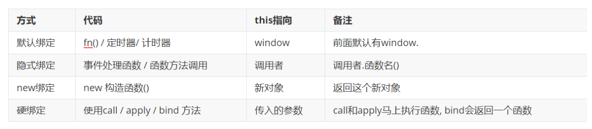
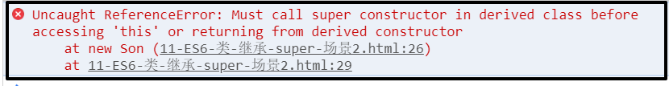

# Day02

## 昨日回顾

* 构造函数:
  * 本质: 函数
  * 目的: 定义模板, 批量创建对象
  * 使用: new 构造函数名() - 系统的Array/Date等都是构造函数~

* new关键字:
  * 新建对象, 赋予给构造函数里this的指向
  
* 原型prototype:
  * 构造函数的属性, 指向一个原型对象, 可以让对象实例共享方法

* `__proto__` 隐式原型
  * 对象的属性, 通过`__proto__ ` 可以访问到该对象的原型 

实例对象.`__proto__`  === 构造函数.prototype (相等)

* 原型链
  * 每个对象通过`__proto__` 属性, 进行逐级查找的关系过程, 叫做原型链

* this指向:



封装tab栏思路:

 	1. 先写静态的html+css
 	2. 把html变成动态JS创建 => 基于数据, 动态创建生成结构, 数据自己放到数组中
 	   let headerArr = ['新闻', '热点', '军事']
 	   let mainArr = ['新闻内容', '热点内容', '军事内容']
 	   (1) 创建 header div节点, 创建 main div节点
 	       添加类
 	       追加到 box 盒子中, appendChild
 	       <div class="box">
 	         <div class="header"></div>
 	         <div class="main"></div>
 	       </div>
 	   (2) 创建header中的span节点, main中的div节点
 	       基于数据遍历创建
 	       for (遍历 headerArr)
 	   
 	3. 绑定切换功能的点击事件
 	   (1) 给头部的导航, span 注册, 找到头部所有的span, 遍历注册事件
 	   (2) 一旦用户点击了, 控制类名
 	       排他, 重置span所有的类名, 给当前点击的span, 添加上 active 类
 	       for (遍历所有的span) {
 	       	 spanList[i].className = ''
 	       }
 		   排他, 重置div所有的类名, 给当前点击的div, 添加上 active 类
 	
 	4. 封装构造函数 (属性 和方法) - 调用创建, 传入需要的参数


## 作业讲解

```js
// 作业1: 再尝试给现在系统的Array构造函数添加一个取最大值得函数, 确保下面代码正确
// 提示: 对象调用函数, 本身没有会去哪里找? 所以在调用之前可以在Array函数, 的什么位置上扩展添加方法呢? 思考出来就能知道了.
// 给Array构造函数的prototype上,  添加一个getMax方法
Array.prototype.getMax = function(){
    let max = this[0]
    for (let i = 1; i < this.length; i++) {
      if (this[i] > max) {
        max = this[i]
      }
    }
    return max
}
let arr = [5, 2, 1, 10, 3, 4]
console.log(arr.getMax())

// 作业2: 给系统Date构造函数, 添加一个toMyString函数 - 
// 调用函数, 得到今天日期YYYY年MM月DD日 HH:mm:ss 格式的时间
Date.prototype.toMyString = function () {
  let year = this.getFullYear()
  let month = this.getMonth() + 1
  let day = this.getDate()
  let hour = this.getHours()
  let minutes = this.getMinutes()
  let seconds = this.getSeconds()
  
  // 补零操作
  month = month < 10 ? '0' + month : month
  day = day < 10 ? '0' + day : day
  hour = hour < 10 ? '0' + hour : hour
  minutes = minutes < 10 ? '0' + minutes : minutes
  seconds = seconds < 10 ? '0' + seconds : seconds

  return year + "年" + month + "月" + day + "日" + " " + [hour, minutes, seconds].join(":")
}
let date = new Date()
console.log(date.toMyString())
```


## 5. this 相关 - 补充(硬绑定)

| 方式     | 代码                         | this指向   | 备注                                        |
| -------- | ---------------------------- | ---------- | ------------------------------------------- |
| 默认绑定 | fn() / 定时器/ 计时器        | window     | 指向window                                  |
| 隐式绑定 | 事件处理函数 / 函数方法调用  | 调用者     | 调用者.函数名(), 指向调用者                 |
| new绑定  | new 构造函数()               | 新对象     | 指向这个新的实例对象                        |
| 硬绑定   | 使用call / apply / bind 方法 | 传入的参数 | call和apply马上执行函数, bind会返回一个函数 |

都是函数的方法, 可以指定this的指向

* call方法
* apply方法
* bind方法

```js
// 1. call方法, 调用函数的同时, 指定this指向
//    函数名.call(this指向, 参数1, 参数2, ...)
function Person (name, age) {
  this.name = name
  this.age = age
}
let obj = { desc: '不错' }
Person.call(obj, '小鹏', 18) // 硬绑定, 将函数执行的this指向obj (1) 立刻执行fn函数 (2) this指向obj
console.log(obj)

// 2. apply方法, 调用函数的同时, 指定this指向
//    函数名.apply(this指向, [参数1, 参数2, ...])
function Student (name, age) {
  this.name = name
  this.age = age
}
let stu = { className: '80期'}
Student.apply(stu, ['张三', 18]) // 执行Student函数, this指向stu, (注意传值, 必须使用数组格式)
console.log(stu)

// 3. bind方法, 不会立刻执行函数, 而是得到一个新的函数, 并且是绑定死了 this 指向
//    let newFn = fn.bind(this指向)
function Cat (name, age) {
  this.name = name
  this.age = age
}
let cat = { type: '加菲猫' }
let newFn = Cat.bind(cat)
newFn('小花', 2)
console.log(cat)

// 总结: 硬绑定 call apply bind
// (1) call apply bind 都可以替换修改函数this的指向
// (2) call 和 apply 会立马调用函数, call参数需要一个个的传, apply传参必须是数组形式
// (3) bind 会得到一个新函数, 这个函数绑定死了 this 指向
```


## 6. 构造函数补充 - 继承

**为什么要学习继承 ?**

写的构造函数, 定义了一个类型 (人类), 万一项目非常大, 又有了细化的多个类型 (老师, 工人, 学生)

学习继承, 可以让多个构造函数之间建立关联, 便于管理和复用

**什么是继承 ?**

继承: 从别人那里, 继承东西过来 (财产, 房产)

代码层面的继承: 继承一些属性和方法

### 6.1 继承 - 原型继承

分析需求:

​	人类, 属性: name, age

​	学生, 属性: name, age, className

​	工人, 属性: name, age, companyName

无论学生, 还是工人, => 都是人类, 所以人类原型上有的方法, 他们都应该要有

```js
// 1. 定义Person构造函数
function Person (name, age) {
  this.name = name
  this.age = age
}
Person.prototype.say = function () {
  console.log('人类会说话')
}

// 2. 定义Student构造函数
function Student (name, age, className) {
  this.name = name
  this.age = age
  this.className = className
}
// 3. 原型继承: 利用原型链, 继承于父级构造函数, 继承原型上的方法
// 语法: 子构造函数.prototype = new 父构造函数()
Student.prototype = new Person()
Student.prototype.study = function() {
  console.log('学生在学习')
}

let stu = new Student('张三', 18, '80期')
stu.say()
console.log(stu)
```


### 6.2 继承 - 组合继承

组合继承有时候也叫伪经典继承，指的是将原型链 和 借用构造函数 call 技术组合到一块，

从而发挥二者之长的一种继承模式，其背后的思路: **是使用原型链实现对原型属性和方法的继承 (主要是方法)，**

**而通过借用构造函数来实现对实例属性的继承**。这样既通过在原型上定义方法实现了函数复用，又能保证每个实例都有它的自己的属性。

```js
// 1. 定义Person构造函数
function Person (name, age) {
  this.name = name
  this.age = age
}
Person.prototype.say = function () {
  console.log('人类会说话')
}

// 2. 定义Student构造函数
function Student (name, age, className) {
  Person.call(this, name, age) // 实现属性的继承
  this.className = className
}

// 3. 原型继承: 利用原型链, 继承于父级构造函数, 继承原型上的方法
// 语法: 子构造函数.prototype = new 父构造函数()
Student.prototype = new Person()
Student.prototype.study = function() {
  console.log('学生在学习')
}

let stu = new Student('张三', 18, '80期')
stu.say()
console.log(stu)

// 方法通过 原型继承
// 属性通过 父构造函数的.call(this, name, age)
```


### 6.3 继承 - 寄生组合继承

student实例上有 name age,  而原型 `__proto__`上不需要再有这些属性, 所以利用 Object.create 改装下

Object.create(参数对象),  Object.create 会创建一个新对象, 并且这个新对象的`__proto__` 会指向传入参数对象

```js
// 1. 定义Person构造函数
function Person (name, age) {
  this.name = name
  this.age = age
}
Person.prototype.say = function () {
  console.log('人类会说话')
}

// 2. 定义Student构造函数
function Student (name, age, className) {
  Person.call(this, name, age)
  this.className = className
}

// 3. 原型继承: 利用原型链, 继承于父级构造函数, 继承原型上的方法
// 语法: 子构造函数.prototype = new 父构造函数()
Student.prototype = Object.create(Person.prototype)
Student.prototype.study = function() {
  console.log('学生在学习')
}

let stu = new Student('张三', 18, '80期')
stu.say()
console.log(stu)


// 总结:
// Object.create() 以参数的对象, 作为新建对象的__proto__属性的值, 返回新建的对象
```


### 6.4 construtor属性 (了解)

* constructor 是什么?

  它是原型对象里的一个属性, 指向了构造函数方法


```js
function Person (name) {
  this.name = name
}
let p1 = new Person()
console.log(p1.__proto__.constructor === Person) // true
```


## 7. ES6 - 面向对象编程 - 类 

ES6 :  ECMAScript6, 第6代标准(ECMAScript 2015年发布的标准, 也叫ES2015)  跨时代的年份

ES5:   ECMAScript5, 第5代标准(2009年发布的标准)

注意, 新标准下, 旧标准中的语法也都会保留

> ### 面向过程开发
>
> **面向过程：POP(Process-oriented programming)**
>
> 面向过程就是分析出解决问题所需要的步骤，然后用函数和基础代码, 把这些步骤一步一步实现，
>
> 使用的时候再一个一个的依次调用就可以了
>
> ### 面向对象开发
>
> 面向对象是把事务分解成为一个个对象，然后由对象之间分工与合作, 来实现功能。封装成类, 属性, 方法, 进行代码管理, 统一调度.
>
> ### 面向对象和过程区别
>
> 面向过程: 着重于步骤, 亲力亲为  (普通员工的思想)  清洁员: 1 拿到拖把,  2 把拖把洗一下 3 拖地 4 洗拖把  5 放回拖把
>
> 面向对象: 着重于对象的分工, 进行拆分调度, 便于维护管理    (老板的思想)   找个对象(清洁员) 会拖地        保洁员1.拖地()
>
> 注意: 面向对象, 是对于面向过程的封装抽象


> ### 类的概念
>
> 请把以下事物分类
>
> 一只叫大黄的狗, 老王的房子, 老刘的金毛, 小黑的劳斯莱斯车, 小李的别墅, 老北的阿拉斯加
>
> * 什么是类?
>
>   一组相同特征 和 行为的事物抽象  (类似构造函数)    function Person () { .... }  类: 就是一个抽象模板, 基于模板可以创建对象
>
>   特征(年纪, 名字, 性别) -> 属性,  行为(会跑, 会跳) -> 方法   
>
> * 类能干什么?
>
>   定义一套模板, 批量产生对象 (所以跟构造函数思路一样, 就是写的语法不同)

### 7.0 ES6类-创建 - class 

在ES5中, 我们使用的构造函数, 就是在模拟类的思想, 封装一个模板(类), 来批量生成对象

ES6中新增了关键字class, 来定义类, 但是class只是构造函数的语法糖, 底层还是构造函数

> 语法: class 大写开头类名 {}

````js
// 定义类 (类似于之前的构造函数)
// class 类名 {}
class Person {

}
// 创建一个实例对象
let p = new Person()
console.log(p)
````

### 7.1 ES6类-构造函数-constructor

```js
// 定义类
class Person {
  // 构造函数
  constructor (name, age) {
    this.name = name
    this.age = age
  }
  // 定义方法
  sayHi() {
    console.log('你好哇')
  }
}
// 实例化
let p = new Person('zs', 18)
console.log(p)

// 注意:
// 1. 实例属性, 定义在constructor中
// 2. class 是类不是对象, 添加类的方法, 直接写函数名() 即可, 不需要写function
//    每个函数之间, 也不需要逗号和分号
// 3. class中定义的函数, 会被自动挂载到原型对象上
```

### 7.2 ES6类-静态成员和实例成员 - static

**实例成员：由构造函数创建出来的对象能直接访问的属性和方法，包括：对象本身 以及原型中的所有的属性和方法。**

**静态成员：由构造函数直接访问到的属性和方法。**

```js
class Person {
  static aa = 123 // 静态成员
  constructor (name) {
    this.name = name // 实例成员
  }
  sayHello () { // 实例成员
    console.log('你好哇')
  }
  static fn () { // 静态成员
    console.log('静态成员测试')
  }
  static getRandomNum () {
    return Math.floor(Math.random() * 11)
  }
}
let p = new Person('zs')
// 实例成员的使用演示
console.log(p.name) 
p.sayHello()

// 静态成员的使用演示
console.log(Person.aa)
Person.fn()

// 只要被static修饰的属性或者方法, 就是静态成员
// 使用场景: 如果某个方法, 你觉得不需要实例对象来调用, 
// 就可以修饰成static, 用类直接调用 (比如: 一些工具方法 => 产生一个随机数)
```

### 7.3 ES6类-函数里this的值

```js
class Person {
  static aa = 123 // 静态成员
  constructor (name) {
    this.name = name // 实例成员
  }
  sayHello () { // 实例成员
    console.log('你好哇')
    console.log(this) // 指向实例对象
  }
  static getRandomNum () { // 静态成员
    return Math.floor(Math.random() * 11)
    console.log(this) // 指向类
  }
}
let p = new Person('zs')
console.log(p.name)
p.sayHello()

console.log(Person.aa)
console.log(Person.getRandomNum())
```

### 7.4 ES6类-继承 - extends

子类可以通过 extends 继承父类, 把属性和方法, 添加到子类的对象上, 底层还是寄生组合继承方式

* 属性继承原理, 使用 call() 来借调父类的构造函数
* 方法继承原理, 使用 prototype原型, 继承到父类的方法

```js
// 继承关键字 => extends
class Person {
  constructor (name, age) {
    this.name = name
    this.age = age
  }
  jump () {
    console.log('会跳')
  }
}
class Teacher extends Person {
  constructor (name, age, lesson) {
    super(name, age) // extends 中, 必须调用 super(), 会触发执行父类的构造函数
    this.lesson = lesson
    console.log('构造函数执行了')
  }
  sayHello () {
    console.log('会打招呼')
  }
}
let teacher1 = new Teacher('zs', 18, '体育')
console.log(teacher1)
```

### 7.5 ES6-类-子类 - super使用

需求: 子类中要调用到父类中的方法

* 构造函数中使用 super(), 会触发父级类的constructor执行
* 普通函数中使用 super.xxx(), 调用父级类里的函数执行

### 7.6 案例-使用class封装tab案例

```js
class CreateTab {
  constructor(query, configObj) {
    this.el = document.querySelector(query)
    this.headerArr = configObj.headerArr
    this.mainArr = configObj.mainArr
    // 调用方法, 进行初始化
    this.init()
    this.addClick()
  }
  init() {
    // 基于 this.el, this.headerArr, this.mainArr 动态的创建结构
    let headerArr = this.headerArr
    let mainArr = this.mainArr
    // 动态创建元素
    let headerDiv = document.createElement('div')
    let mainDiv = document.createElement('div')
    // 添加元素
    this.el.appendChild(headerDiv)
    this.el.appendChild(mainDiv)
    // 配置类名
    headerDiv.className = 'header'
    mainDiv.className = 'main'

    // 生成内部的结构, 遍历headerArr, 动态生成tab标题
    for (let i = 0; i < headerArr.length; i++) {
      let theSpan = document.createElement('span')
      let theDiv = document.createElement('div')
      // 添加元素
      headerDiv.appendChild(theSpan)
      mainDiv.appendChild(theDiv)
      // 控制类名(默认让第一个激活)
      if (i === 0) {
        theSpan.className = 'active'
        theDiv.className = 'active'
      }
      // 控制内容
      theSpan.innerHTML = headerArr[i]
      theDiv.innerHTML = mainArr[i]
    }
  }
  addClick() {
    // 2. 注册点击事件 (给每一个span都要注册事件)
    let spansList = this.el.querySelectorAll('.header > span')
    let divList = this.el.querySelectorAll('.main > div')
    for (let i = 0; i < spansList.length; i++) {
      // 将下标, 记录到dom元素身上, 将来点击事件内部, 就可以通过 this.index 访问到下标
      // spansList[i].index = i
      // 给每个span都注册点击事件
      spansList[i].onclick = function () {
        // 切换 => 控制类名 (排他)
        for (let j = 0; j < spansList.length; j++) {
          spansList[j].className = ''
          divList[j].className = ''
        }
        this.className = 'active'
        divList[i].className = 'active'
      }
    }
  }
}

let tab1 = new CreateTab('#box1', {
  headerArr: ['动物', '明星', '热点'], 
  mainArr: ['内容1', '内容2', '内容3']
})

let tab2 = new CreateTab('#box2', {
  headerArr: ['tab1', 'tab2'],
  mainArr: ['内容1', '内容2']
})
```

## 8. ES5新增数组方法

| 对象调用的方法                                             | 作用      | 返回值   |
| ---------------------------------------------------------- | --------- | -------- |
| array.forEach(function(value, index, array){})             | 遍历      | 无       |
| array.map(function(value, index, array){})                 | 遍历&返回 | 新数组   |
| array.filter(function(value, index, array){ return 条件 }) | 过滤&返回 | 新数组   |
| array.reduce(function(sum, value, index, array) {}, 0)     | 遍历&累计 | 累计结果 |
| array.every(function(value, index, array){ return 条件})   | 遍历&判断 | 布尔值   |
| array.some(function(value, index, array){return 条件})     | 遍历&判断 | 布尔值   |

### 8.0 数组方法使用

```js
let arr = [1, 5, 7, 3, 10, 2, 4]
// 1. forEach可以用于遍历数组
arr.forEach(function(item, index) {
  console.log(item, index)
})

// 2. map() - 遍历 - 收集每次函数return的结果 - 返回全新数组
let resultArr = arr.map(function(item, index) {
  return item * item
})
console.log(resultArr)

// 3. filter() - 过滤 - 收集return true的结果, 返回一个新数组
let result2Arr = arr.filter(function(item, index) {
  return item > 5
})
console.log(result2Arr)

// 4. reduce 累计运算 - 需要返回累计结果
// arr.reduce(function(sum, item, index) { .. }, 0)
let result3 = arr.reduce(function(sum, item, index) {
  return sum + item
}, 0)
console.log(result3)

// 5. every 每个
// 作用: 遍历一个数组, 每个元素都会执行一次函数, 必须每次执行, 都返回true, 最终才会返回true
let flag = arr.every(function(item, index) {
  return item > 0
})
console.log(flag)

// 6. some 某个
// 作用: 遍历一个数组, 每个元素都会执行一次函数, 只要有一次执行, 返回true, 结果就是true
let flag2 = arr.some(function(item, index) {
  return item > 8
})
console.log(flag2)
```

### 8.1 案例

```js
给定一个数组
let list = [
  // wu: 武力    zhi:智力
  { id: 1, name: '张飞', wu: 97, zhi: 10 },
  { id: 2, name: '诸葛亮', wu: 55, zhi: 99 },
  { id: 3, name: '赵云', wu: 97, zhi: 66 },
  { id: 4, name: '周瑜', wu: 80, zhi: 98 },
  { id: 5, name: '吕布', wu: 100, zhi: 8 },
  { id: 6, name: '司马懿', wu: 30, zhi: 98 }
]
求数组中所有英雄的武力平均值
得到一个新数组，只保留英雄的名字， ['张飞', '诸葛亮', '赵云', '周瑜', '吕布', '司马懿']
得到一个新数组，新数组中只保留武力值超过90的英雄
判断数组中所有英雄的武力是否都超过60， 最终打印结果： 全是猛将 / 还有弱鸡
删除数组中所有智力低于60的英雄
```

## 经验值

### 问题：ES6类的继承，出现语法报错；

* 描述：使用ES6对其它构造函数进行继承时，语法报错如下：



* 分析：

```js
Must call super constructor in derived class before accessing 'this' or returning from derived constructor
在访问“ this”或从派生构造函数返回之前，必须在派生类中调用super 构造函数
```

* 解决：

```js
class Father {
    say() {
        return '我是爸爸';
    }
}
class Son extends Father {
    constructor(x, y) {
        super();
        this.x = x;
    }
}
```

* 总结：无论父亲上面有没有属性，只要在子类中构造器函数内部操作this，就需要super()


## 今日作业

使用class关键字, 自定义时间类MyDate, 继承自系统的时间类Date

**要求1:** 在自定义类MyDate里新增1个方法叫formatDate, 返回格式化的日期YYYY/MM/DD HH:mm:ss (要求, 在方法内, 请使用this, 思考this的指向)

**要求2**: 使用自定义类创建实例对象, 分别调用getFullYear()自带方法, 查看是否成功, 如果成功证明继承成功

**需求3**: 调用自己扩展的方法formatDate, 查看是否会返回当前系统的日期