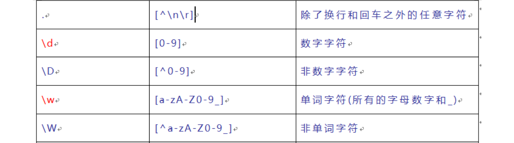

# Day03

## 昨日回顾

构造函数 - 补充

1. 可以在构造函数的原型属性上, 扩展方法

2. this指向
   * 默认绑定  fn()   指向 window
   
   * 隐式绑定  xxx.fn()   指向调用者
   
   * new绑定  this 指向实例对象
   
     (1) 创建一个新对象
   
     (2) 将构造函数中的this指向新对象
   
     (3) 执行构造函数
   
     (4) 将新对象返回
   
   * 硬绑定 (bind / call / apply)  想让this指向谁, this就指向谁
   
     call apply: (1) 会立刻执行函数 (2) 会指定函数执行时的this
   
     ​	函数名.call(this指向, 参数1, 参数2)
   
     ​    函数名.apply(this指向, [参数1, 参数2])
   
     bind: (1) 执行bind时不会调用函数 (2) 拷贝一个一模一样的函数, 并且绑定死新函数的this指向
   
     ​    let newFn = fn.bind(this指向的内容)
   
     ​    newFn()
   
3. 原型继承: 利用原型链, 继承方法  (改造原型链)  (原型替换)

   子构造函数.prototype = new 父构造函数()

4. 组合继承方式: 原型链技术 + 借用构造函数 call 技术, 组合实现继承

   (1) 原型链技术, 继承方法

   子构造函数.prototype = new 父构造函数()

   (2) 借用父构造函数, 继承实例属性

   function Son (name, age, desc) {

   ​	Father.call(this, name, age)

   ​    this.desc = desc

   }

5. 寄生组合继承: Object.create(父类.prototype)

   子构造函数.prototype =  Object.create(父类.prototype)

6. constructor属性 - 原型对象的一个属性, 指向了对应的构造函数

   Person.prototype.constructor === Person

7. 面向过程编程: 着重于步骤, 亲力亲为

   拖地(今天)

8. 面向对象编程: 着重于分工, 统一调度 和 管理, => 封装类(属性+方法), 创建对象, 调用方法进行实现功能, 

   清洁工1.拖地(今天)

   清洁工2.拖地(明天)

9. ES6 - 类 (一系列具有相同特征和行为的事物的抽象)  创建对象的模板
   1.  创建类 => class 类名 {}
   2. 在 constructor函数中,  扩展实例的属性
   3. 静态成员 (被static修饰的属性和方法), 必须由类来调用, 实例成员, 由实例对象来调用
   5. 继承 => extends  super()一起使用


## 作业讲解

使用class关键字, 自定义时间类MyDate, 继承自系统的时间类Date

**要求1:** 在自定义类MyDate里新增1个方法叫formatDate, 返回格式化的日期YYYY/MM/DD HH:mm:ss (要求, 在方法内, 请使用this, 思考this的指向)

**要求2**: 使用自定义类创建实例对象, 分别调用getFullYear()自带方法, 查看是否成功, 如果成功证明继承成功

**需求3**: 调用自己扩展的方法formatDate, 查看是否会返回当前系统的日期

```jsx
class MyDate extends Date {
  formatDate () {
    let year = this.getFullYear()
    let month = this.getMonth() + 1
    let day = this.getDate()
    let hour = this.getHours()
    let minutes = this.getMinutes()
    let seconds = this.getSeconds()
    // 补零操作
    month = month < 10 ? '0' + month : month
    day = day < 10 ? '0' + day : day
    hour = hour < 10 ? '0' + hour : hour
    minutes = minutes < 10 ? '0' + minutes : minutes
    seconds = seconds < 10 ? '0' + seconds : seconds
    return `${year}年${month}月${day}日 ${hour}:${minutes}:${seconds}`
  }
}
let date = new MyDate()
console.log(date.getFullYear())
console.log(date.formatDate())
```


## 8. ES5 / ES6 新增数组方法

### 8.0 方法讲解

- **ES5 新增数组方法**

| 对象调用的方法                                            | 作用                        | 返回值   |
| --------------------------------------------------------- | --------------------------- | -------- |
| array.forEach(function(item, index, array){})             | 遍历                        | 无       |
| array.map(function(item, index, array){})                 | 遍历&收集返回的项           | 新数组   |
| array.filter(function(item, index, array){ return 条件 }) | 过滤&保留return true的项    | 新数组   |
| array.reduce(function(sum, item, index, array) {}, 0)     | 遍历&累计求和               | 累计结果 |
| array.every(function(item, index, array){ return 条件})   | 遍历&判断是否都满足条件     | 布尔值   |
| array.some(function(item, index, array){return 条件})     | 遍历&判断是否有某个满足条件 | 布尔值   |
| Array.from(伪数组)                                        | 伪数组转真数组              | 真数组   |

- **ES6 新增数组方法**

| 对象调用的方法                                         | 作用     | 返回值               |
| ------------------------------------------------------ | -------- | -------------------- |
| array.find(function(item, index) { return 条件 })      | 遍历查找 | 找到的项 / undefined |
| array.findIndex(function(item, index) { return 条件 }) | 遍历查找 | 下标 / -1            |

```js
let arr = [1, 5, 7, 3, 10, 2, 4]
// 1. forEach可以用于遍历一个数组, 数组每有一项, 都会执行一次函数
arr.forEach(function(item, index) {
  console.log(item, index)
})

// 2. map() 映射, 遍历数组, 收集每次函数return的结果 - 返回一个新数组
let resultArr = arr.map(function(item, index) {
  return item * item
})
console.log(resultArr)

// 3. filter() - 过滤 - 遍历数组, 收集return true的结果, 返回一个新数组
let result2Arr = arr.filter(function(item, index) {
  return item > 5
})
console.log(result2Arr)

// 4. reduce 累加运算 - 遍历数组,需要返回累加的值, 可以进行累加操作
// arr.reduce(function(sum, item, index) { .. }, 起始累加值)
// sum 每前一次调用函数,累加完的结果
let result3 = arr.reduce(function(sum, item, index) {
  return sum + item
}, 0)
console.log(result3)

// 5. every 每个
// 作用: 遍历一个数组, 每个元素都会执行一次函数, 必须每次执行都返回true, 最终才会返回true
let flag = arr.every(function(item, index) {
  return item > 0
})
console.log(flag)

// 6. some 某个
// 作用: 遍历一个数组, 每个元素都会执行一次函数, 只要有一次执行返回true, 结果就是true
let flag2 = arr.some(function(item, index) {
  return item > 8
})
console.log(flag2)

// 7. Array.from(伪数组) 作用: 将伪数组转换成真数组
let divs = document.querySelectorAll('div')
Array.from(divs).some(function (item, index) {
  if (item.className === 'active') {
    return true
  } else {
    return false
  }
})

// -----------------------------------------------------------
// 8. find 找第一个符合条件的项, 没找到会返回 undefined
let arr2 = [
  { name: 'zs', score: 100 },
  { name: 'ls', score: 99 },
  { name: 'zs', score: 100 }
]
let obj = arr2.find(function(item, index) {
  return item.score === 100
})
console.log(obj)

// 9. findIndex 找第一个符合条件项的下标, 没找到会返回 -1
let index = arr2.findIndex(function(item, index) {
  return item.score === 101
})
console.log(index)
```

### 8.1 案例

```js
// 给定一个数组
let list = [
  // wu: 武力    zhi:智力
  { id: 1, name: '张飞', wu: 97, zhi: 10 },
  { id: 2, name: '诸葛亮', wu: 55, zhi: 99 },
  { id: 3, name: '赵云', wu: 97, zhi: 66 },
  { id: 4, name: '周瑜', wu: 80, zhi: 98 },
  { id: 5, name: '吕布', wu: 100, zhi: 8 },
  { id: 6, name: '司马懿', wu: 30, zhi: 98 }
]
求数组中所有英雄的武力平均值
得到一个新数组，只保留英雄的名字， ['张飞', '诸葛亮', '赵云', '周瑜', '吕布', '司马懿']
得到一个新数组，新数组中只保留武力值超过90的英雄
判断数组中所有英雄的武力是否都超过60， 最终打印结果： 全是猛将 / 还有弱鸡
删除数组中所有智力低于60的英雄
查找 id 为 4 的英雄
找到 name 为 吕布的英雄的下标
```

## 9. 函数补充

### 9.1 递归函数

> 递归函数：函数内部, 自己调用自己, 就是递归

递归的要求：

1. 自己调用自己
2. 要有结束条件（出口）

递归函数主要是`化归思想` ,将一个复杂的问题简单化，主要用于解决数学中的一些问题居多。

- 把要解决的问题，归结为已经解决的问题上。
- 一定要考虑什么时候结束让函数结束，也就是停止递归（一定要有已知条件）

```jsx
// 递归函数: 在一个函数内部, 自己调用自己
// 递归的要求:
// 1. 自己调用自己
// 2. 一定要有结束条件 (否则会死递归)
let count = 0
function tellStory () {
  console.log('从前有座山')
  console.log('山里有座庙')
  console.log('庙里有个老和尚')
  console.log('老和尚再给小和尚讲故事')
  count++
  // 只要小于5遍, 就接着讲, 讲完到第五遍, 就不讲了
  if (count < 5) {
    tellStory()
  }
}
tellStory()
```

练习：

- 计算1-100之间所有数的和

```jsx
// 递归: 化归思想, 复杂问题简单化
// 求 1-100 的和
// getSum(100) = getSum(99) + 100
// getSum(99) = getSum(98) + 99
// ...
// getSum(2) = getSum(1) + 2
// getSum(1) = 1
function getSum (n) {
  if (n === 1) {
    return 1
  }
  return getSum(n - 1) + n
}
console.log(getSum(100))
```


### 9.2 回调函数 (认识专有名词)

一个函数被当成参数传递时, 将来被调用,  这个函数, 我们就称之为回调函数

```js
function my(fn){
    fn(); // 这里调用外部传入进来的函数 - 回调外部的函数体执行 - 这个动作就叫回调函数
}

my(function(){
    console.log("函数执行");
})
// 例如数组的所有方法(filter, map, forEach, every, some, reduce等), 
// 还有addEventListener, 还有计时器, 定时器 (都将函数当成参数传递, 传递的函数都可以称之为回调函数)
```


### 9.3 闭包 - 实现数据私有

**闭包语法: 内层函数, 引用外层函数上的变量, 就可以形成闭包** 

**闭包作用: 可以实现数据私有**   

(当然闭包以前还用于解决其他 js 的一些其他小bug, 但是由于新语法如 let 等的诞生, 就没有这些闭包使用的需求了, 所以记忆这个数据私有的需求即可)

前置理解:

​	全局变量: 声明在全局的, 全局范围都能访问到的

​	局部变量: 函数内声明的, 只有函数内能访问到

​        当函数执行时,会为函数的内部的变量,开辟存储空间

​	当函数内部执行完毕, 默认会销毁函数内所声明的局部变量

```js
function fn () {
    let name = 'zs'
    let obj = {
        brand: '劳斯劳斯',
        price: 1000
    }
    console.log(name, obj)
}
fn()
fn()
fn()
// 函数执行时,会为函数的内部的变量,开辟存储空间,并在函数执行完成后,释放这块儿内存空间
```

```js
//定义一个定时器函数,统计函数调用的次数
// let count = 0  // 问题:全局变量,容易被修改到
// 解决方案;利用闭包,可以实现数据私有
function addCount(){
    let count = 0
    count++
    console.log('我被调用了'+ count +'次')
}
// 函数执行时,会为函数的内部的变量,开辟存储空间,并在函数执行完成后,释放这块儿内存空间
addCount()
addCount()
addCount()

// 闭包: 内层函数,引用到外层函数的变量,就可以实现闭包
// function addCount() {
//   // 局部变量 => 私有
//   let count = 0
//   function add() {
//     count++
//     console.log('我被调用了' + count + '次')
//   }
//   // 在闭包中,返回一个引用类型,这块闭包的内存空间就不会被释放
//   return add
// }
// let addFn = addCount()
// addFn()
// addFn()
// addFn()

// 函数在调用时,会在运行内存里开辟一块空间,用于执行,在这块空间中,会去存储声明的局部变量

// 正常一个函数执行后,就会释放运行时的空间, 但是如果发现外部有对于函数内部的内容的引用时,就不释放了

// js有个垃圾回收机制,函数的局部变量,默认执行完,就会被当成垃圾销毁
// 但是如果外部还有对内部函数内容的引用时,那么这块儿空间就不会被释放
```


需求: 定义一个计数器方法, 每点击一次按钮, 就调用一次进行计数, 实现充币一元

```jsx
<button id="btn">充币一元</button>

<script>
  // 全局变量不安全, 很容易被别人修改掉
  let btn = document.querySelector('#btn')
  let money = 0 // 初始余额

  function countMoney () {
    money++
    console.log('已充值游戏币, 当前余额' + money + '元')
  }

  btn.onclick = function() {
    countMoney()
  }
</script>
```

缺点: money 是全局变量, 不安全, 很可能会被修改掉

利用闭包解决:

```jsx
<button id="btn">充币一元</button>

<script>
  let btn = document.querySelector('#btn')

  function countMoney () {
    let money = 0 // 初始余额
    function add() {
      money++
      console.log('已充值游戏币, 当前余额' + money + '元')
    }
    return add
  }
  let addFn = countMoney()

  btn.onclick = function() {
    addFn()
  }
</script>
```


## 10. 浅拷贝与深拷贝(了解)

> 深拷贝与浅拷贝一般是针对于复杂类型而言的。

推荐资源：[javaScript中浅拷贝和深拷贝的实现](https://github.com/wengjq/Blog/issues/3)

浅拷贝：将对象中的各个属性依次进行复制，浅拷贝只复制了一层对象的属性。如果对象属性中还有对象，那么赋值的仅仅是地址。还是会相互影响。

深拷贝：将对象中的各个属性一次进行复制，深拷贝会递归赋值所有层对象的属性。如果对象属性中还有对象，会继续拷贝，这样拷贝出来的对象完全独立。

- 浅拷贝的简易实现

```jsx
// 浅拷贝：将对象中的各个属性依次进行复制，浅拷贝只复制了一层对象的属性。
// 如果对象属性中还有对象，那么赋值的仅仅是地址。还是会相互影响。
let obj = {
  name: 'zs',
  age: 18
}
let obj2 = {}
for (let key in obj) {
  obj2[key] = obj[key]
}
console.log(obj2)
```

​	问题: 浅拷贝, 如果对象的属性中还有对象, 那么拷贝的仅仅是对象的地址, 将来两个对象间还是会互相影响

- 深拷贝的简易实现

```jsx
// 深拷贝：将对象中的各个属性一次进行复制，深拷贝会递归赋值所有层对象的属性。
// 如果对象属性中还有对象，会继续拷贝，这样拷贝出来的对象完全独立。
let xiaoming = {
  name: 'zs',
  age: 18,
  car: {
    name: '劳斯莱斯',
    money: 100
  }
}
function cloneObj (obj) {
  let temp = {}
  for (let k in obj) {
    // 如果对象的属性还是对象，递归复制
    // 如果对象的属性是简单类型，直接复制
    if (typeof obj[k] === 'object') {
      temp[k] = cloneObj(obj[k])
    } else {
      temp[k] = obj[k]
    }
  }
  return temp
}
let newObj = cloneObj(xiaoming)
newObj.car.money = 10
console.log(newObj.car.money)
```

**一般出在面试题中: 考察复杂类型赋值时, 其实赋值的是地址**

后面也有更简单的深拷贝方式, 如: JSON.stringify  和 JSON.parse 可以非常方便的实现深拷贝


## 11. 正则表达式

> 正则表达式：用于匹配字符串规律规则的表达式，在编程语言中有广泛的应用，经常用于表单校验，高级搜索等。

比如: 判断手机号是否符合11位规则等

### 11.0 创建正则表达式

构造函数的方式

```javascript
let regExp = new RegExp(/\d/);
```

正则字面量

```javascript
let regExp = /\d/;  
```

正则的使用

```javascript
/\d/.test("aaa1"); // true
```


### 11.1 元字符

> 正则表达式由一些普通字符和元字符组成，普通字符包括大小写字母、数字等，而元字符则具有特殊的含义。

```jsx
// 正则表达式由一些普通字符和元字符组成，
// 普通字符包括大小写字母、数字等，而元字符则具有特殊的含义。
console.log(/a/.test('abc')) // true
console.log(/ac/.test('abc')) // false   
```

#### (1) 常见基础元字符



```jsx
// 元字符, 有特殊含义的字符
// \d 数字, 0-9
console.log(/\d/.test('1da')) // true
console.log(/\d/.test('aba')) // false

// \D 非数字, 除了0-9
console.log(/\D/.test('1a1')) // true
console.log(/\D/.test('111')) // false

// \w 匹配单词字符, 字母数字下划线 范围 0-9 a-z A-Z _
console.log(/\w/.test('$_$')) // true
console.log(/\w/.test('$$')) // false
console.log(/\w/.test('123')) // true

// \W 匹配非单词字符
console.log(/W/.test('$$$')) // true
console.log(/W/.test('111')) // false

// . 匹配换行回车以外的任意字符 (没啥太大用, 但是要知道他是一个元字符)
console.log(/./.test('abc')) // true
console.log(/./.test('123')) // true
console.log(/./.test('\n')) // false
```


#### (2) 正则优先级

`|`表示或，优先级最低

`()`优先级最高，表示分组

```jsx
// 看字符串中, 有没有 a 或者 b
console.log(/a|b/.test('bac')) // true
console.log(/a|b/.test('ac')) // true
console.log(/a|b/.test('cd')) // false

// 匹配 ab 或 cd
console.log(/ab|cd/.test('abc')) // true
// 匹配 abd 或者 acd
console.log(/a(b|c)d/.test('abc')) // false
```

**猜一猜**

```jsx
console.log(/b|foot/.test('bbbbb'));

console.log(/(b|f)oot/.test('bbbbb'));
```


#### (3) 正则中括号语法 []

**需求: 匹配 a 或 b 或 c**

`[]`在正则表达式中表示一个字符的位置，[]里面写这个位置可以出现的字符。

```javascript
console.log(/[abc]/);//匹配a,b,c
```

`[^]`在中扩号中的^表示非的意思。

```javascript
//^表示该位置不可以出现的字符
console.log(/[^abc]/);//匹配除了a，b，c以外的其他字符
```

`[a-z]` `[1-9]`表示范围

```javascript
console.log(/[a-z]/.test("d"));//小写字母
console.log(/[A-Z]/.test("d"));//大写字母
console.log(/[0-9]/.test("8"));//数字
console.log(/[a-zA-Z0-9]/);//所有的小写字母和大写字母以及数字
```


#### (4) 正则边界语法 ^ $

> 我们前面学习的学习的正则,  只要有满足的条件的就会返回true，并不能做到精确的匹配。

^ (尖括号)表示开头   请注意: ***[ ]里面的^表示取反***

$表示结尾

```javascript
console.log(/a/.test('abc')) // 不严格匹配, 只要有, 就是true

console.log(/^11/.test('11b')) // 必须以11开头, true
console.log(/11$/.test('11b')) // 必须以11结尾, false
console.log(/^11$/.test('11b')) // 必须是 11, false 严格匹配, 严格到字符数都是确定的
```

**小练习:**

```jsx
console.log(/^chuan/.test("dachuan"))
console.log(/^chuan/.test("chuang"))
console.log(/^chuan/.test("chuan"))

console.log(/chuan$/.test("chuan"))
console.log(/chuan$/.test("dachuan"))
console.log(/chuan$/.test("chuang"))

console.log(/^chuan$/.test("chuan"))
console.log(/^chuan$/.test("chuanchuan"))
```


#### (5) 正则量词语法

> 量词用来控制出现的次数，一般来说量词和边界会一起使用

1. `*`表示能够出现0次或者更多次，x>=0;
2. `+`表示能够出现1次或者多次，x>=1
3. `?`表示能够出现0次或者1次，x=0或者x=1
4. `{n}`表示能够出现n次
5. `{n,}`表示能够出现n次或者n次以上
6. `{n,m}`表示能够出现n-m次

```jsx
// a 可以出现, 0次或者1次或者多次
console.log(/^a*$/.test('')) // true
console.log(/^a*$/.test('a')) // true
console.log(/^a*$/.test('aa')) // true

// a 可以出现, 1次或者多次
console.log(/^a+$/.test('')) // false
console.log(/^a+$/.test('a')) // true
console.log(/^a+$/.test('aa')) // true

// a 可以出现, 0次或1次
console.log(/^a?$/.test('')) // true
console.log(/^a?$/.test('a')) // true
console.log(/^a?$/.test('aa')) // false

// 2个a
console.log(/^a{2}$/.test('aaa'))

// 2个a或者以上个a
console.log(/^a{2,}$/.test('aaa'))

// 2-4个a
console.log(/^a{2,4}$/.test('aaa'))
```


### 11.2 正则的使用

#### (1) 表单校验

1. 验证姓名

   - 只能是汉字
   - 长度2-6位之间
   - 汉字范围[\u4e00-\u9fa5]

   ```javascript
   let nameReg = /^[\u4e00-\u9fa5]{2,6}$/;
   ```

2. 验证QQ

   - 数字组成
   - 开头不能是0
   - 长度为5-11位

   ```javascript
   let qqReg = /^[1-9]\d{4,10}$/;
   ```

3. 验证手机

   - 以1开头
   - 第二位要求 3-9
   - 11位数字组成

   ```javascript
   let mobileReg = /^1[3-9]\d{9}$/;
   ```


4. 如若是, 邮箱等特别复杂的, 百度即可

#### (2) 正则替换

需求: 将字符串中所有的 "2b" 和 "2B" 替换为 "**"

```jsx
let str = '你是2b青年, 我就说了, 咋地! 2b, 2b, 2b, 你就是2B青年'
console.log(str.replace(/2b/gi, '**'))
```


## 今日作业

```js
// 思考下面这行代码, 请说出最后的结果 (考察, item是形参, 如果是简单类型的形参的修改, 不会影响到原来值)
let arr = [5, 6, 7, 8];
arr.forEach(function(item){
   item = item + 1;
})
console.log(arr);

let arr2 = [
    { name: 'zs', age: 18 },
    { name: 'zs', age: 20 },
]
arr2.forEach(function(item) {
    item.age = item.age + 1
})
console.log(arr2)
```


```jsx
// 给定一个数组
let studentList = [
  { id: 1, name: '小明', score: 97 },
  { id: 2, name: '小王', score: 55 },
  { id: 3, name: '小刘', score: 85 },
  { id: 4, name: '小刘', score: 80 }
]

1. 请用reduce, 求和后, 算出学生们的平均成绩
2. 请用some判断, 整个班级是否不及格的同学? (60分以下) 
3. 请用find找出, 整个班级中不及格的那一位同学
4. 请用filter筛选出及格的好学生们
```


