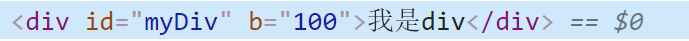
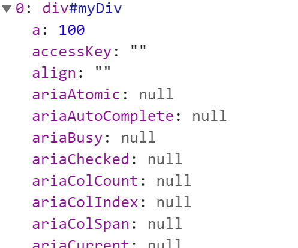

# Day02

## 昨日回顾

1. JQ的入口函数
   - js的入口函数 :  等待标签 dom树渲染完成 ,资源(图片,音频等)加载完成后才执行 
   - window.onload  = function 
   - JQ的入口函数: 等待标签 dom树渲染完成 ,不需要等待图片等资源加载完成就执行了
   - $(document).ready(function(){})
   - $(function(){})  简写
2. JQ获取标签
   - 支持css选择器
     - id class  标签 全选 子代 后代 交集 并集... 
   - 支持其他方法
     - siblings()  兄弟元素
     - find()  查找 
     - index() 获取下标
     - parent()  父代
     - children()  子代 
     - eq() 通过下标来查找
3. 原生与JQ的相互转换
   - 原生 =>JQ  $(原生对象)
   - JQ => 原生  通过下标  
     - Jq对象.eq(0)   (返回的jq对象)   jq对象[0]  (返回的是dom对象)
4. 注册事件
   - on('事件类型',事件处理函数)    常用
   - 事件类型(事件处理函数)
   - 事件委托 - 事件冒泡 
     - on('事件类型','筛选器',事件处理函数)
5. JQ操作样式
   - 行内
     - css('属性名','属性值')   每次只能设置一个属性
     - css({属性名:'属性值',....}) 同时设置多个属性
   - 操作类
     - 添加 addClass('不需要加点')
     - 移出 removeClass()
     - 切换 toggleClass()  取反
     - 判断 hasClass()  布尔值
6. 链式编程
   - 当前JQ对象调用完方法之后,原地返回一个JQ对象,继续在调用其他的方法 一直.下去
   - 返回调用者本身
7. JQ内置动画
   - 显示与隐藏
     - show()
     - hide()
     - toggle()
   - 滑入与滑出
     - slideDown()
     - slideUp()
     - slideToggle()
   - 淡入与淡出
     - fadeIn()
     - fadeOut()
     - fadeToggle()
     - fadeTo(毫秒值,透明度)
8. hover()  
   - 鼠标移入mouseenter 和 鼠标移出mouseleave
9. stop()  
   - 停掉当前标签身上的所有动画 ,只执行最后一个动画
10. 自定义动画animate
    - animate({属性名:'属性值'}, 毫秒值,事件处理函数)
11. 分析功能 =>拆分功能 => 结合学习的api  => 最终的效果


## 1. 事件相关

### 01-事件 - 注册 - on的更多用法

```js
// 注册事件
// $("css选择器").on(事件类型, 事件处理函数);
// 注册多个事件 - 独立的事件处理函数
// $("css选择器").on({事件类型: 事件处理函数, 事件类型: 事件处理函数});
// 注册多个事件 - 同一个事件处理函数
// $("css选择器").on("事件类型 事件类型", 事件处理函数);
$("div").on("click", () => {
    console.log("点击事件");
});
$("div").on({
    click () {
        console.log("点击事件2");
    },
    mouseover () {
        console.log("鼠标移入啊");
    }
});
$("div").on("click mouseover", () => {
    console.log("事件触发同一个函数");
})
```

问题小结:

1. JQ on() 方法同时注册多个事件一共有几种写法?

   

### 02-事件 - 解绑

讲解内容:

1. 给button 注册多个事件
2. 移出事件 

```js
$("#btn").on({
    click: function() {
        console.log(1);
    },
    mouseenter: function() {
        console.log(2);
    },
    mouseleave: function() {
        console.log(3);
    },
});

// 事件的解绑
// 1.全部移除
$("button").off();

// 2.指定移除  多个事件，字符串形式，空格分开
$("button").off("mouseenter mouseleave");
```

问题小结:

1. JQ如何解绑事件?

   

### 03-one方法的使用及实现原理

引入: 例如抽奖活动,只能抽取一次, 所以说让我们的代码只执行一次

讲解内容:

1. jq - one()方法的使用
2. 通过原生js实现one方法 

```js
// 场景：执行后不能在再次执行；抽奖！执行一次  $("css选择器").one()
$("#btn1").one("click", function() {
    console.log("--------------");
});
```

问题小结:

1. JQ  one和 on 的区别是什么?
2. 如何通过原生js实现一个one方法? 


### 04-代码 - 主动触发事件

说明: 通过代码来主动触发事件

讲解内容:

- js代码 - 触发标签事件执行
  - 原生绑定onclick()  - 偶尔用
  - 原生绑定click()  
  - 创建自定义事件 new CustomEvent - 常用
- jq代码 -触发标签事件执行
  - $('css选择器').click()
  - $('css选择器').trigger()
  - $('css选择器').triggerHandler()
  - trigger() / triggerHandler()的区别
- 场景: 注册页面,输入框在网页打开就处于聚焦状态

```js
// JS原生 - 用JS代码主动触发事件执行
// // 先绑定事件
// let fatherDiv = document.getElementById("father");
// let sonDiv = document.getElementById("son");
// fatherDiv.onclick = function () {
//     console.log("js - father的点击事件触发");
// }
// sonDiv.onclick = function () {
//     console.log("js - son的点击事件触发");
// }
// // JS代码触发事件处理函数执行
// // 方式1: 只是事件函数被调用, 而不是执行了事件(没有冒泡出现)
// // sonDiv.onclick();  // 事件

// // 方式2: 执行click就是模拟鼠标点击 
// // sonDiv.click() // 方法 

// // 方式3: 真正触发一个事件 - 是一套完整的事件机制
// let event = new CustomEvent("click", {bubbles: true}); // 是否可以冒泡
// sonDiv.dispatchEvent(event);

// JQ代码 - 触发标签事件执行
// 先绑定事件
$("#father").click(() => {
    console.log("JQ - father - 点击了");
});
$("#son").click(() => {
    console.log("JQ - son - 点击了");
});

// 方式1: 直接调用函数 - 会真正触发事件 
$("#son").click();
// 方式2: 派发事件 - 会触发标签的默认行为
$("#son").trigger("click");
// 方式3: 派发事件 - 不会触发标签默认行为
$("#son").triggerHandler("click");

// 例如1: 注册页面, 输入框在网页打开就处于聚焦状态

// 输入框:
$("input").focus(() => {
    console.log("输入框 - 被focus了");
});

// 查看区别
// $("input").trigger("focus");
$("input").triggerHandler("focus");
```

问题小结:

1. js主动触发事件主要有哪几种方式?

   - onclick() 
   - click()
   - 创建一个自定义事件

2. jq主动触发事件主要有哪几种方式?

   - click()
   - trigger('事件类型')    触发标签的默认行为
   - triggerHandler('事件类型')   不会触发标签的默认行为

   

### 05-事件对象

引入: 什么是事件对象 ?

- 在事件处理函数中,在形参上接受一个系统给你传递的值 

讲解内容:

- jq的事件对象

```js
// 在事件处理函数中,在形参上接受一个系统给你传递的值 
// 事件对象里有什么 - 触发这个事件的相关信息
$("#btn").click((ev) => { 
    ev.stopPropagation();
    console.log(ev);
})
// jq的事件对象继承自原生的事件对象
```

问题小结:

1. jq的事件对象ev为什么可以使用stopPropagation() ?

   

### 06-对象拷贝

引入: jq内部封装了一些比较好用工具的方法,比如extend()

讲解内容:

1. 浅拷贝
2. 深拷贝

```js
// $.extend()
// 语法1: $.extend(新对象，被复制的对象);

// 1.合并数据
let obj1 = {
    info: 10,
}

let obj2 = {
    info: 100,
    name: "zd",
    age: 18
}

let obj3 = {
    info: 1000,
    num: 10,
    fn: function() {
        console.log(1);
    }
};

// 如果有重名属性名，后者覆盖前者 ！
$.extend(obj1, obj2, obj3); // obj1和obj2赋予到obj身上(格式固定)
console.log(obj1);


// 2. 浅拷贝
let obj4 = {}

let obj5 = {
    info: 1,
    name: "zd",
    cc: {
        a: 1,
        b: 2
    },
    arr: [1, 2, 3]
};
$.extend(obj4, obj5);
obj4.cc.a = 10;
console.log(obj4);
console.log(obj5);


// 3. 深拷贝  
let obj6 = {}
let obj7 = {
    info: 1,
    name: "zd",
    cc: {
        a: 1,
        b: 2
    },
    arr: [1, 2, 3]
};
$.extend(true, obj6, obj7); 
obj6.cc.a = 10;
console.log(obj7);
// 参数二往后的对象的的所有key+value,会合并到第一个参数对象身上,并且返回第一个参数对象
```

问题小结:

1. $.extend()方法如何实现深拷贝?


### 07-多库共存

引入: 在很久以前,很多插件都有$()这个方法,例如zepto.js,或者自己写的插件方法名也是$,那如果在代码中遇到这种命名冲突该如何解决?	

讲解内容:

- 解决$()同名的问题
-  jQuery.noConflict()

```js
// 什么是多库共存? 如果你同时引入多个插件,如果同名 $,后者会覆盖前者,这个时候,就需要给某一个插件改名,改它的全局变量的名字
<div id="myDiv"></div>
<script src="./js/jquery3.5.1.js"></script>
<script>
    // 自己封装的插件 / 引入的其他插件, 也有个方法叫$
    // Jq 主动不用$ 用哪个变量名, 自己定
    let zs = jQuery.noConflict();
</script>
<script>
    // 自己的插件
    $ = function(){
    	console.log("我是自定义的$方法");
    }

    console.log(zs("#myDiv"));
    $();
</script>
```

问题小结:

1. jquery提供了什么方法来解决多库共存(同名$)的问题?

   - let zz =  jQuery.noConflict()

   

## 2. 属性操作

### 08-属性操作

引入:  我们之前学过原生js操作属性,那么我们来学习下jq是如何操作的.

讲解内容:

- 原生js操作属性
  - setAttribute()
  - getAttribute()
- jq操作属性
  - attr
  - prop

attribute - 是页面标签上的属性 - 设置和获取都是和页面的标签打交道



property - DOM对象身上的key(属性) - DOM对象上拥有标签所有的标准属性



```js
<div id="myDiv" b="0">我是div</div>
<script src="./js/jquery3.5.1.min.js"></script>
<script>
    // 标签上的属性
    // 1. JQ对象.attr("标签上的属性")
    // 获取
    console.log($("#myDiv").attr("b"));
// 设置
$("#myDiv").attr("b", 100);

// 2. JQ对象.prop("DOM对象上的key")
$("#myDiv").prop("a", 100);
console.log($("#myDiv")); // {a: 100, ...}
console.log($("#myDiv").prop("a"));
// prop()操作自定义属性 ,存到内存中,不会显示到页面中 

// 结论:
// 标准属性用prop() / 自定义属性用attr() 
</script>
```

问题小结: 

1. jq操作属性的方法是什么?


## 3.文本属性操作

### 09-文本属性操作

引入:之前我们通过原生js操作文本,操作表单,那jq的实现方式是什么呢?

讲解内容:

1. html() / text() / val()

```js
// 1. html() - 相当于innerHTML
$("#myDiv").html("<h2>我是JQ用html方法插入的内容</h2>");
console.log($("#myDiv").html());

// 2. text() - 相当于innerText
$("#myDiv").text("<h2>5555</h2>");
console.log($("#myDiv").text());

// 3. val() - 相当于value
$("#myInput").val("我是插入的值");
console.log($("#myInput").val());
// 总结: 传参就是设置,不传参就是获取
```

问题小结:

1. jq操作文本的方法是什么?
2. jq操作表单的方法是什么?
3. 传参 设置 ,不传参获取


## 4.案例 - 购物车

### 案例 - 购物车1 - 全选

案例演示: 购物车

```js
// 1. 全选影响小选框
// 1.1 给全选框绑定点击事件 (注意全选框2个, 都叫.checkall)
$(".checkall").click(function(){ // 因为让this指向全选框-不能用箭头函数
    // 1.2 获取全选的状态 - $(this).prop("checked")
    // 1.3 获取所有小选框, 都设置成大选框的状态
    $(".cart-item .j-checkbox").prop("checked", $(this).prop("checked"));
    // 1.4 把大选框的都影响到
    $(".checkall").prop("checked", $(this).prop("checked"));
})
```


### 案例 - 购物车2 - 小选

```js
 // 2. 小选框 -> 全选
// 2.1 获取所有小选框, 绑定点击事件
$(".cart-item .j-checkbox").click(()=>{
    // 2.2 把小选框集合JQ对象, 转成数组类型
    // 2.3 使用every() 必须所有的小选框都选中,全选框都才选 中 - every
    let isAll = Array.from($(".cart-item .j-checkbox")).every(el => el.checked == true)
    // 2.4 筛选的条件影响全选框
    $(".checkall").prop("checked", isAll);
})
```


### 案例 - 购物车3 - 选中商品变背景色

```js
function setLight() {
    // 3.1 遍历每个小选框
    $(".j-checkbox").each(function (index, smallP) {
        // 3.2 判断当前小选框 - 是否选中
        if ($(smallP).prop("checked") == true) {
            // 3.3 找到这个小选框的爷爷(cart-item一行的那个div标签, 设置高亮class)
            $(smallP).parents(".cart-item").addClass("check-cart-item")
        } else {
            // 3.4 移除小选框的爷爷的高亮的类名
            $(smallP).parents(".cart-item").removeClass("check-cart-item")
        }
    })
}
```


### 案例 - 购物车4 - 修改商品数量

- 基础知识：

```js
// toFixed(num) 方法可把 Number 四舍五入为指定小数位数的数字
// num 规定小数的位数

//substr 和 substring 都是JS 截取字符串函数
// substr(start, length)
// start  - 所需的子字符串的起始位置  
// length - 字符个数                 可选项

// substring(start, end)
// start   - 所需的子字符串的起始位置
// end     - 指明子字符串的结束位置    可选项  
```

```css
/* input设置type="number"去掉上下箭头  */
input::-webkit-outer-spin-button,
input::-webkit-inner-spin-button {
  -webkit-appearance: none !important;
}
input[type='number'] {
  -moz-appearance: textfield !important;
}
```

```js
// 4. 修改商品数量和小计
// 4.1 给所有的+绑定点击事件
$(".increment").click(function () {
    // 4.2 对应输入框+1
    $(this).prev().val($(this).prev().val() * 1 + 1);
    // 4.5 获取单价, 计算小计
    let price = $(this).parents(".p-num").prev(".p-price").html().substring(1); // ¥21.34 截取单价
    $(this).parents(".cart-item").find(".p-sum").html("¥" + (price * $(this).prev().val()).toFixed(2));
})
// 4.3 给所有的-绑定点击事件
$(".decrement").click(function () {
    // 4.4 如果值大于1, 才能执行-1
    if ($(this).next().val() > 1) {
        $(this).next().val($(this).next().val() - 1);
        // 4.6 获取单价, 计算小计
        let price = $(this).parents(".p-num").prev(".p-price").html().substring(1); // ¥21.34 截取单价
        $(this).parents(".cart-item").find(".p-sum").html("¥" + (price * $(this).next().val()).toFixed(2));
    }
})
// 4.3 输入框 - 实时输入 - 也要计算小计
$(".itxt").on("input", function () {
    if ($(this).val() < 1) {
        $(this).val(1);
    }
    // 4.3.1 获取当前的值
    // $(this).val()
    // 单价
    let price = $(this).parents(".cart-item").find(".p-price").html().substring(1);
    // 数量
    let count = $(this).val();
    // 单价*数量 赋予到小计的标签上并且把结果保留2位小数
    // 计算机只认识0和1,只认识整数
    // 把小数转成二进制 ->除不尽,取近似值,精度的误差
    $(this).parents(".cart-item").find(".p-sum").html("￥" + (price * count).toFixed(2));
})
```


### 案例 - 购物车5 - 删除单个商品

```js
// 5. 删除单个商品
$(".p-action").click(function(){
    // 5.1 找到商品容器删除
    $(this).parents(".cart-item").remove();
    // 5.2 更新全选状态
    let isAll = Array.from($(".cart-item .j-checkbox")).every(el => el.checked == true)
    // 5.3 如果数组长度为0, 直接等于false
      if ($(".cart-item .j-checkbox").length == 0) {
        isAll = false;
      }
    $(".checkall").prop("checked", isAll);
})
```


### 案例 - 购物车6 - 删除选中商品和清空

```js
// 6. 删除选中的商品
// 6.1 给删除选中商品标签绑定点击事件
$(".remove-batch").click(function(){
    // 6.2 获取所有商品容器, 判断哪个容器的小多选框是选中状态, 则删除对应商品容器
    $(".cart-item").each(function(i, contentDiv){
        if ($(contentDiv).find(".j-checkbox").prop("checked")) {
            $(this).remove();
        }
    })
 
    // 6.3 - 删除后, 还得同步判断全选的状态
      let isAll = Array.from($(".j-checkbox")).every(function(smallC){
        return smallC.checked == true;
      })
      // // 如果数组长度为0, 直接等于false
      if ($(".j-checkbox").length == 0) {
        isAll = false;
      }    
    // 6.4 更新全选状态
    $(".checkall").prop("checked", isAll);
})

// 6.5 清空购物车绑定点击事件
$(".clear-all").click(function(){
    $(".cart-item").remove();
    $(".checkall").prop("checked", false);
})
```


### 案例 - 购物车7 - 已选总数量

```js
// 7. 已选总数量
// 全选 / 小选点击 / 点击商品数量 / 单个删除 / 删除选中 / 清空购物车 - 都得影响选中鼠数量, 所以封装个方法, 每个地方都调用
function totalNum(){
    // 7.1 判断当前商品是否勾选, 选中累计数量
     let sum = 0;
    
     // :checked伪类选择器-只选中当前已经checked勾选的小选框
     // $(".j-checkbox:checked").each(function (index, smallC) { // 输入框 
     //  sum += $(smallC).parents(".cart-item").find(".itxt").val() * 1;
     //     })
    $('.j-checkbox').each(function (index, smallC) {
        if(smallC.checked){
            sum += $(smallC).parents(".cart-item").find(".itxt").val() * 1;
        }
    })
    // 7.2 赋予到相应位置上
    $(".amount-sum").find("em").html(sum);
}
```


### 案例 - 购物车8 - 统计总价

```js
// 7. 已选总数量
// 全选 / 小选点击 / 点击商品数量 / 单个删除 / 删除选中 / 清空购物车 - 都得影响选中鼠数量, 所以封装个方法, 每个地方都调用
function totalNum(){
    // 7.1 判断当前商品是否勾选, 选中累计数量
    let sum = 0;
    // 8.1 计算总价
    let allPrice = 0;
     // :checked伪类选择器-只选中当前已经勾选的小选框
     // $(".j-checkbox:checked").each(function (index, smallC) {
     // // 输入框 
     //  allPrice += $(smallC).parents(".cart-item").find(".p-sum").html().substr(1) * 1;
     //     })
    $('.j-checkbox').each(function (index, smallC) {
        if(smallC.checked){
          sum += $(smallC).parents(".cart-item").find(".itxt").val() * 1;
          allPrice += $(smallC).parents(".cart-item").find(".p-sum").html().substr(1) * 1;
        }
     })
    
    // 7.2 赋予到相应位置上
    $(".amount-sum").find("em").html(sum);
    // 8. 总价赋予到标签上
    $(".price-sum").find("em").html("¥" + allPrice.toFixed(2));
}
```


## 今日作业

课上案例全都实现一遍
