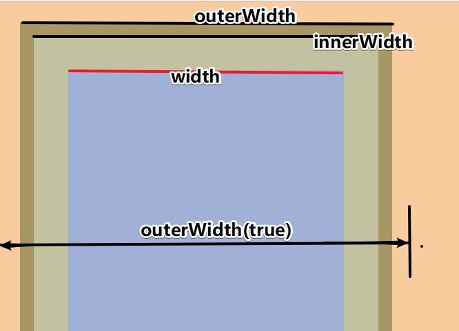
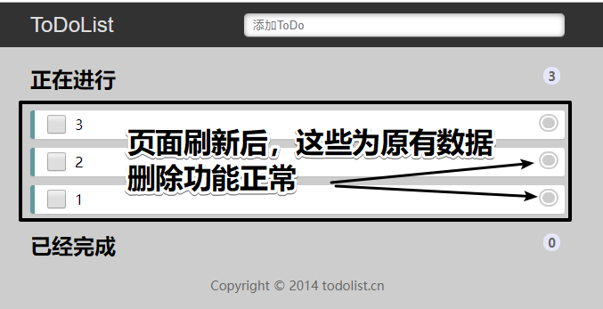
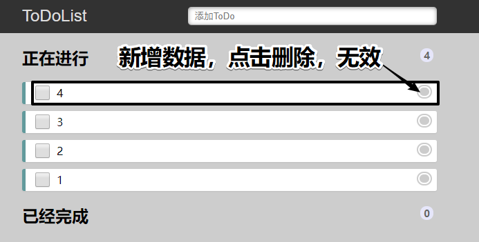

# Day03

## 昨日回顾

1. 事件on的更多用法

   - 拥有不同的处理函数
     - on({事件类型(){},...})
   - 拥有相同的处理函数
     - on('事件类型 事件类型',事件处理函数)

2. 事件解绑

   - off()  全部 
   - off('事件类型 事件类型') 解绑一个或多个

3. one方法 和原理

   - one 在网页运行期间,只执行一次
   - 定义了flag  => 点击 =>flag = false

4. 代码主动触发事件

   - JS
     - onclick()  不冒泡   (函数被调用了,并不是一套完整的事件机制)
     - click()  可以冒泡
     - 创建了自定义事件 newCustomEvent('事件类型',{bubbles:true})
     - 事件源.dispatchEvent(event)
   - JQ
     - click()  可以冒泡
     - trigger()      可以冒泡      触发标签的默认行为
     - triggerHandler()  不可以冒泡  不会触发标签的默认行为

5. 事件对象

   - 在事件处理函数中,系统通过形参返回的值
   - 包含了和事件相关的信息

6. 对象拷贝

   - $.extend(true,参数一,参数二)
   - 将参数二往后的所有的key+value 都会合并到参数一身上,并且会返回参数一
   - 后者覆盖前者 (同名属性)

   - 浅拷贝
   - 深拷贝 

7. 多库共存

   - 同名$  命名冲突
   - jQuery.noConflict()

8. 属性操作

   - JS
     - setAtrribute('属性名','属性值')
     - getAttribute('属性名')
   - JQ
     - 标准和自定义属性
     - 标准 prop()
       - prop('属性','属性值')  设置
       - prop('属性')  获取
     - 自定义 attr()
       - attr('属性名','属性值')  设置
       - attr('属性名')
   - 文本属性操作
     - html()  text()
     - val()  
     - 设置  =>传一个参数
     - 获取 =>不传参


## 1. 补充属性

### 01-尺寸 - 位置

引入: 通过案例来获取标签的尺寸信息和位置信息

讲解内容:

```js
// 1. 尺寸
// width()   获取匹配元素当前计算的宽度值  width 
// innerWidth()   获取匹配元素内部区域宽度 width + padding
// outerWidth()  获取匹配元素的外部宽度  width + padding + border 
// outerWidth(true) 设置为 true 时，计算边距在内 
                    // width + padding + border + margin 

// 2. 位置
// css('left')     获取匹配元素的left值 
// position()      获取匹配元素相对父元素的偏移 {left:值,top:值}
// offset()        获取匹配元素在当前文档的相对偏移,以文档的左上角为参照  
//                 {left:值,top:值}
// offset({left:值,top:值}) 设置位置
```



* 尺寸：只能获取，不能设置；设置找css();
* 位置: position() 是获取  offset() 可以获取可设置(相对于文档左上角)

```js
// 1. 尺寸
console.log($(".father").css("width")); // 400px
console.log($(".father").width()); // 400 (width) (只读)
console.log($(".father").innerWidth()); // 500  (包含width+padding2个方向) (只读)
console.log($(".father").outerWidth()); // 520 (width+padding+border) (只读)
console.log($(".father").outerWidth(true)); // 530 (width+padding+border+margin) (只读)

// 2. 位置 -  得看参照物
console.log($(".son").css("left")); // 20px
console.log($(".son").position()); // {top: 20, left: 20} (只读)
console.log($(".son").offset()); // {top: 55, left: 55}  (以文档左上角为参照)

// 设置位置 - 自动计算真正的left和top属性值是多少
// 值-父级的left和margin和border就是此标签的left
$(".son").offset({
    left: 200,
    top: 0
})
```

问题小结:

1. position()和offset()这两个方法, 获取到left和top的值有什么不同?


### 02-卷入-语法

引入: 分析页面卷入的含义

讲解内容:

- 滚动条产生有2种方式
  - 文档滚动条: 标签高度超出屏幕
  - 盒子滚动条: overflow-y: auto; (前提是有固定高度, 内容超出盒子容器高度)

```js
// 1. 当用户滚动指定的元素时，会发生 scroll 事件。

// 2. scroll 事件适用于所有可滚动的元素和 window 对象（浏览器窗口)

// 3. 获取卷入高度；被卷入JQ标签对象.scrollTop();
//    也可以设置后影响滚动位置;

// 例1: 监测document滚动
$(document).scroll(() => {
    console.log($(document).scrollTop());
})
// 点击document - 让滚动条回到顶部
$(document).click(() => {
    $("html,body").scrollTop(0);
})


// 例2: 监测box容器滚动
$(".box").scroll(() => {
    console.log($(".box").scrollTop());
})
$(".box").click(() => {
    $(".box").scrollTop(0);
})

// 1.兼容
// $('html, body')是为了兼容标准模式和怪异模式的scrollTop的值
// 因为如果没有顶部的DOCTYPE声明,就会以怪异模式来解析这个文档, 设置scrollTop只有body才能生效
// 如果有DOCTYPE声明,就会以html5标准模式,来解析这个文档的代码,设置scrollTop时以html才能生效

//2.为什么不能用$(document)设置动画?
// document是文档不是标签 ,没有样式属性去使用,所以不能用document设置动画

// 3.为什么$()的document不写引号?
// 因为document本身就是一个变量(文档对象)  - 不是css选择器,所以直接转换
// $("html,body")用的是标签名css选择器,所以css选择器需要加引号
```

问题小结:

1. 为什么不能用$(document)设置动画?
2. 为什么$()的document不写引号?


### 03-案例 - 返回顶部

案例演示:通过案例

需求：

1. 页面滚动到指定位置的时候，右下角按钮显示
2. 点击按钮, 返回到顶部

```js
// 思路：
//     1.滚动行为监听，注册给document
//     2.获取卷入高度值？和某个值（自己定）300 进行比较！
//     3.大于 设置的值，返回按钮就可以出现；
//     4.点击按钮, 返回到顶部(document的scrollTop为0)

// 1. document - 滚动事件
$(document).scroll(function () {
    // 2. 判断document的卷入值
    if ($(document).scrollTop() > 300) {
        // 3. 让右下角 - 出现
        $("div").stop().show();
    } else {
        // 4. 否则让div淡出
        $("div").stop().hide();
    }
});

// 4. 点击按钮, 返回到顶部
$("div").click(function () {
    // 带动画的返回：动画滚动：兼容写法：火狐和谷歌不能设置给document；
    $("body,html").stop().animate({
        scrollTop: 0
    });
});
```


### 04-案例 - 电梯导航

案例演示: 通过案例

需求: 

1.网页滚动到今日推荐 - 左侧电梯导航出现, 接着滚动到某一个区域, 左侧对应电梯导航高亮

2.点击左侧电梯导航 - 网页滚动到对应模块

```js
$(function () {
  // 需求: 
  // 1. 网页滚动到今日推荐 - 左侧电梯导航出现, 接着滚动到某一个区域, 左侧对应电梯导航高亮
  // 2. 点击左侧电梯导航 - 网页滚动到对应模块
  let fn = function () {
    // 2.判断滚动的高度是否大于今日推荐的位置
    let scrollTop = $(document).scrollTop()
    let recommendTop = $('.recommend').offset().top
    if (scrollTop>= recommendTop) {
      // 2.1左侧导航显示 - fadeIn
      $('.fixedtool').stop().fadeIn(200)
    } else {
      // 2.1左侧导航隐藏 - fadeOut
      $('.fixedtool').stop().fadeOut(200)
    }

    // 3.获取floor下4大块的div标签,该模块对应的左侧导航显示
    // 3.1 - 通过index拿到当前模块的下标
    // 3.2 -将下标给到左侧的电梯导航 - eq(下标)
    let targetIndex = 0
    $('.floor>div').each(function (index, el) {
      if (Math.round($(document).scrollTop()) >= Math.round($(el).offset().top)) {
        targetIndex = index  //保存最后一个索引值
      }
    })
    $('.fixedtool li').eq(targetIndex).addClass('current').siblings().removeClass('current')
  }
  // 1.给网页绑定滚动事件
  $(document).on('scroll', fn)
  // 4.给左侧电梯绑定点击事件
  $('.fixedtool li').on('click', function () {
    $(document).off()
    // 4.1自身高亮 - 兄弟不亮
    $(this).addClass('current').siblings().removeClass('current')
    // 4.2拿到当前的下标 
    let index = $(this).index()
    // 4.3找到具体对应模块,获取位置
    let offsetTop = $('.floor>div').eq(index).offset().top
    // 4.4给body设置scrollTop()
    $('html,body').stop().animate({
      scrollTop: offsetTop
    }, function () {
      $(document).on('scroll', fn)
    })
  })
})
```


## 2. 元素操作

### 05-创建-添加-删除-克隆

引入: 我们通过原生js可以实现对DOM的创建 添加 删除 克隆,那我们可以看下JQ是如何实现的

讲解内容:

- 创建   -  借助字符串来创建   $('<p>我是创建的p标签</p>>') 
- 添加
  - append()    内部  - 向当前元素内部追加内容   
  - prepend()   内部  - 向元素内部前置内容          
  - before()      兄弟  - 向元素之前插入内容         
  - after()         兄弟  - 向元素之后插入内容          

- 删除 remove()  
  - 从DOM中删除匹配的元素
- 克隆 clone()
  - 克隆匹配的DOM元素

```js
// 1. 创建标签 - 借助字符串来创建
let result1 = $("<p>我是p标签</p>");
let result2 = $(`<p><span>我是p里的span</span></p>`); // 模板字符串可以任意嵌套标签使用
console.log(result1);
console.log(result2);

// 2. 添加标签
$("#myDiv").append(result1); // 内部末尾追加
$("#myDiv").prepend(result2); // 内部头部追加

// 在目标后面兄弟位置插入标签
result1.after($("<p>我是after插入的p标签</p>")); 
// 在目标前面兄弟位置插入标签
result1.before($("<p>我是before插入的p标签</p>")); 

// 3. 删除标签
// $("#myDiv").remove();

// 4. 克隆
let clone4 = $("#myDiv").clone();
console.log(clone4);
```

问题小结: jq如何实现 创建 - 添加 - 删除 - 克隆标签?


### 06-1案例 - todolist-初始化列表

引入: 通过演示案例

```js
// 1.1 准备初始化任务数据
let arr = [{
    "info": "学习",
    "done": false
}, {
    "info": "写代码",
    "done": false
}, {
    "info": "睡觉",
    "done": true
}]

// 1.2 铺设初始任务
arr.forEach(function (obj, i) {
    let theLi = $(`<li><input type="checkbox" ${obj.done? 'checked': ''}> 
<p>${obj.info}</p>
<a href="javascript:;" index=${i}></a></li>`);
    // 已经完成
    if (obj.done) {
        $("#donelist").append(theLi);
    }
    // 没有完成
    else {
        $("#todolist").append(theLi);
    }
})

// 1.3 统计数量
function totalCount(){
  $("#todocount").html($("#todolist li").length);
  $("#donecount").html($("#donelist li").length);
}
```


### 06-2案例 - todolist - 新增任务

```js
// 2 新增任务
// 2.1 判断是回车
// 2.2 新建数据对象
// 2.3 同步到数组中管理
// 2.4 清空输入框
// 2.5 统计最新任务量 
// 2.6 重新加载页面

$("#title").on("keydown", function (ev) {
    if (ev.keyCode == 13 && $("#title").val().length > 0) { // 判断是回车
        let newObj = { // 新建数据对象
            info: $("#title").val(),
            done: false
        };
        dataArr.push(newObj); // 同步到数组中管理
        $("#title").val(""); // 清空输入框
        localStorage.setItem("todolist", JSON.stringify(dataArr));
        totalCount(); // 统计最新任务量
        load(); // 重新加载页面
    }
})
// 封装加载页面的方法
function load() {
    // 先清空页面现有的
    $("#todolist, #donelist").empty();
    // 开始循环现在数组
    dataArr.forEach(function (obj, i) {
        let theLi = $(`<li><input type="checkbox" ${obj.done ? 'checked' : ''}> 
<p>${obj.info}</p>
<a href="javascript:;" index=${i}></a></li>`);
        // 已经完成
        if (obj.done) {
            $("#donelist").append(theLi);
        }
        // 没有完成
        else {
            $("#todolist").append(theLi);
        }
    })
    totalCount(); // 统计最新任务量

}
```


### 06-3案例 - todolist - 删除任务

```js
// 3 删除任务
// 3.1 给a绑定点击事件 - 删除动作 - 事件委托
// 因为a是在上面动态创建的,不能直接给a注册事件,
// 所以利用事件委托 - 既能给现在的a还能给将来的a委托一个点击事件
// 3.2 获取索引
// 3.3 删除数组元素
// 3.4 更新到本地
// 3.5 更新页面

$("#todolist, #donelist").on("click", "a", function () {
    // 获取索引
    let index = $(this).attr("index");
    // 删除数组元素
    dataArr.splice(index, 1);
    // 更新到本地
    localStorage.setItem("todolist", JSON.stringify(dataArr));
    // 更新页面
    load();
})
// JavaScript无法感知新添加的元素（也就是说即便你为其它与该元素相同的元素添加了事件，也无法应用到该元素下
```


### 06-4案例 - todolist - 完成任务/取消完成任务

```js
// 4 事件委托 - input - 点击事件
// 4.1 获取索引
// 4.2 数据更新
// 4.3 更新到本地
// 4.4 更新页面
$("#todolist, #donelist").on("click", "input", function () {
    // 获取索引
    let index = $(this).next().next().attr("index");
    // 数据更新
    dataArr[index].done = !dataArr[index].done;
    // 更新到本地
    localStorage.setItem("todolist", JSON.stringify(dataArr));
    // 更新页面
    load();
})
```

## 3. JQ插件使用

### 3.0 案例 - JQ - 插件 - 瀑布流 

引入: 本节带大家学习如何使用JQ的插件,其实JQ的插件就是基于jquery开发的插件,所以使用JQ插件之前,必须先引入jquery

讲解内容:

1. JQuery插件地址  http://www.htmleaf.com/jQuery/  
2. 插件 - 瀑布流 演示  http://www.htmleaf.com/jQuery/pubuliuchajian/201601093003.html 
3. 下载插件！插件是在JQ基础继续写的一些功能！
   - **插件JS文件 必须引入在JQ文件后面！**

- 按照官方的步骤：
  - 复制html、复制CSS；
  - 初始化JS某个函数；

```js
$("#gallery-wrapper").pinterest_grid();  // 参数配置都是默认；

// no_columns：网格布局一行的列数。默认值为一行3个网格。
// padding_x：网格在X轴方向的padding值。默认值为10像素。
// padding_y：网格在Y轴方向的padding值。默认值为10像素。
// margin_bottom：网格底部的margin值。默认值为50像素。
// single_column_breakpoint：指定在视口多大时一行只显示一个网格。

// 例如:
$("#gallery-wrapper").pinterest_grid({
    no_columns: 4,
    padding_x: 15,
    padding_y: 10,
    margin_bottom: 50,
    single_column_breakpoint: 700
});
// JQ本身就是一个插件 jquery.js
// 插件 - 封装的原生代码的js文件

// jq的插件:基于jquery开发的插件
// 所以使用jq插件的时候, 必须引入jquery
```

问题小结:

1. 什么是JQ的插件?
2. 使用JQ插件一定要引入jquery么?


## 经验值

### 问题：todoList案例，删除功能对原有数据生效，对新增数据不生效；

* 描述：删除功能代码完成

  * 测试1：页面打开后，点击数据后面的删除按钮，功能正常生效；

  

  * 测试2：在刚才的操作上，新增一条数据为4，新增后再次点击其后面的删除功能，失效：

  

* 分析：

  * 既然删除代码完成，那么新增后，再次点击删除，查看控制台是否有报错；
  * 没有报错，那么就回到删除功能的代码进行分析：

  ```js
  $("section a").on("click", function() {
      // 问题：怎么知道点击的是那条数据呢？
      // 解决：
      //     1.回到封装函数里面进行 下标和a 一一绑定！自定义属性！
      //     2.获取自定义属性
      let index = $(this).attr("index");
  
      //     3.删除对应的数据!!!
      arr.splice(index, 1);
  
      //     4.数据存入本地
      localStorage.setItem("todos", JSON.stringify(arr));
  
      //     5.页面数据展示
      getList();
  
  });
  ```

  * 发现注册方式为`$("section a")`，**该方式为section下的所有存在的a 进行获取和注册事件；**
  * 那么对于新增a 时，上面的获取代码已经获取完毕；

* 解决：

  * 那么现在的需求：新增后的a 也有相同的事件；
  * 有同学说，可以把删除功能进行封装函数，点击新增后，在新增的执行函数内部，重新执行一次删除功能；该思路正确，但是存在一定的风险和性能问题，因为涉及到删除功能的再次调用。
    * 如果是采用上面的注册事件方式，会多次进行注册事件，点击其他项删除会有问题。（因为多次执行的话，第一次执行会正确删除数据，还会有第二三等次的执行）
    * **优化：可以对删除事件进行注销后，再进行注册；**
  * 针对上面的需求，最后的方式是采用事件委托：

  ```js
  $("section").on("click", "a", function() {
      // 问题：怎么知道点击的是那条数据呢？
      // 解决：
      //     1.回到封装函数里面进行 下标和a 一一绑定！自定义属性！
      //     2.获取自定义属性
      let index = $(this).attr("index");
  
      //     3.删除对应的数据？？？？!!!
      arr.splice(index, 1);
  
      //     4.数据存入本地
      localStorage.setItem("todos", JSON.stringify(arr));
  
      //     5.页面数据展示
      getList();
  
  });
  ```

* 总结：如果出现这样的情况，就是某些元素在多次操作后总是拥有同一个事件，最后的方式就是找到一个公共父级，给父级注册事件，采用事件委托；

## 今日作业

把课上的案例全都写一遍


