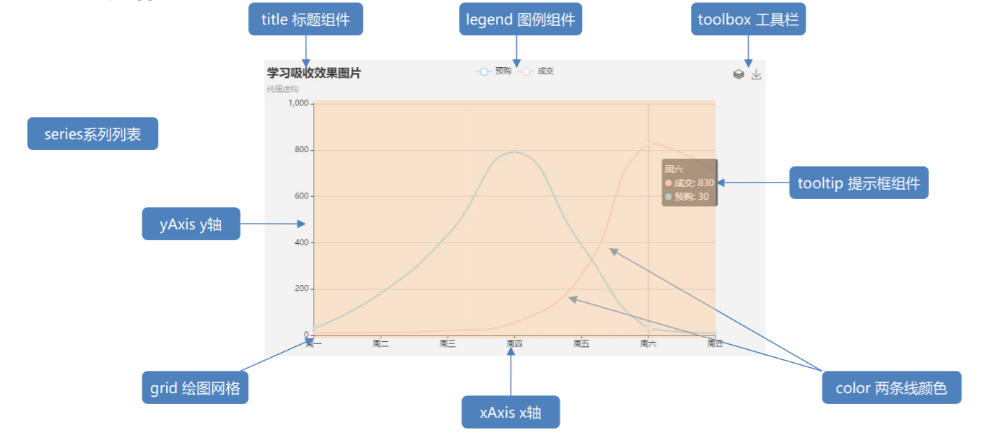
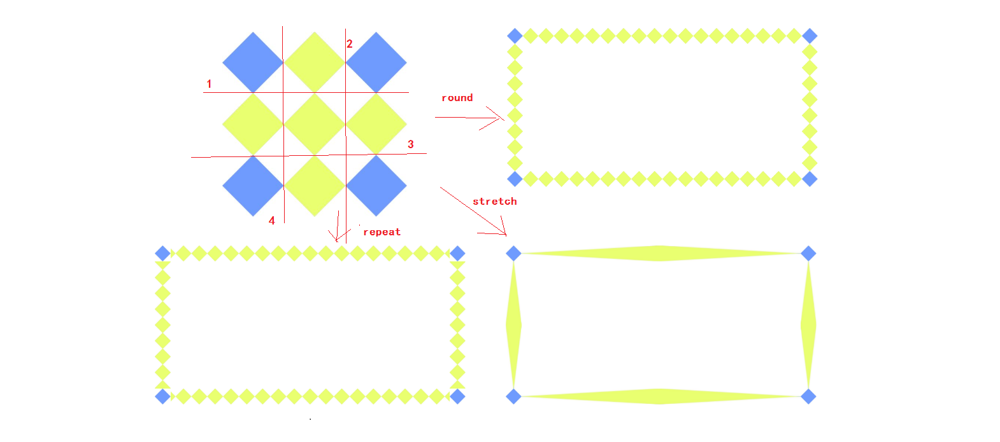
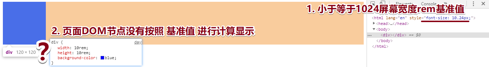

# Day01

## 1.数据可视化基本认知

引入:  本阶段我要带大家做一个数据可视化的项目,本节讲解的内容主要有以下三点。

讲解内容:

1. 什么是数据可视化?
   - **将数据转化成为交互的图形或图像**
     - 数据：字符串 / 数值的表示 , 表格里的一行;  代表一条数据 , JS代码里的一个对象; 代表一个数据
     - 可视化：数值大小，摆列出一些形状/关系
   - **优点** :
     - 以视觉可以感受的方式表达,增强我们对数据的认知和分析能力
     - 不仅可以很好地体现数据,让数据更加直观,而且也能让数据特点更加突出。


1. 应用场景
   -	应对现在数据可视化的趋势，越来越多企业需要在很多场景(营销数据，生产数据，用户数据)下使用


3. 常见的可视化插件

- d3.js+svg 	     优秀的Javascript 可视化工具库 - 封装度不高(入手难) https://d3js.org/ 
- Highcharts.js      国外的前端数据可视化库，非商用免费，被许多国外大公司所使用
- **ECharts.js**           百度出品的一个开源 Javascript 数据可视化库 

问题小结:

1. 什么是数据可视化以及它的优点?
2. 常见的可视化插件有哪些?


## 2. echarts入门及基本使用

引入：本节正式带大家开始学习echarts，首先来了解一下 echarts是什么

讲解内容:

1. **echarts基本介绍**

   - ECharts是一个使用 JavaScript 实现的开源可视化库，可以流畅的运行在 PC 和移动设备上，兼容当前绝大部分浏览器（IE8/9/10/11，Chrome，Firefox，Safari等）
   - 底层依赖矢量图形库 ZRender，提供直观，交互丰富，可高度个性化定制的数据可视化图表。
   - 官网地址: https://echarts.apache.org/zh/index.html          

   ​     	     

2. **echarts的特点**

   - 丰富的可视化类型
   - 多种数据格式支持
   - 流数据的支持
   - 移动端优化
   - 跨平台使用
   - 绚丽的特效 
   - 详细的文档说明

   

3. **echarts的基本使用**

   - 找到官网 - 看五分钟入门echarts

   - 五步曲

     1. 引入echarts.js - 图表依赖这个==js文件==
     2. 准备一个具备大小的DOM容器 - 生成的图表会放到这个==容器==内
     3. 初始化实例对象 - 实例化==echarts对象==
     4. 指定配置项和数据 - 根据具体需求修改==配置选项==

     - 将配置项对象设置给echarts实例对象 - 让配置==生效==(echarts.js内部封装的代码根据你传入的参数, 生成相应标签和样式到容器内)

```js
<!DOCTYPE html>
<html lang="en">

<head>
  <meta charset="UTF-8">
  <meta http-equiv="X-UA-Compatible" content="IE=edge">
  <meta name="viewport" content="width=device-width, initial-scale=1.0">
  <title>Document</title>
</head>

<body>
   // 2. 为 ECharts 准备一个具备大小（宽高）的 DOM 
  <div id="main" style="width: 600px;height:400px;"></div>
  // 1. 引入echarts 
  <script src="./js/echarts.js"></script>
  <script>
    // 3. 初始化实例对象
    let myChart = echarts.init(document.getElementById('main'))
    // 4. 指定图表的配置项和数据
    var option = {
      title: { 
        text: 'ECharts 入门示例',
      },
      tooltip: {},
      legend: { 
        data: ['销量2']  
      },
      xAxis: {
        data: ["衬衫", "羊毛衫", "雪纺衫", "裤子", "高跟鞋", "袜子"]
      },
      yAxis: { 
      },
      series: [{
        name: '销量2', 
        type: 'bar', 
        data: [5, 20, 36, 10, 10, 20] 
      }]
    };
    // 5. 使用刚指定的配置项和数据显示图表。
    myChart.setOption(option);
  </script>
</body>

</html>
```

问题小结: 

1. 请说说什么是echarts ?
2. 请说说绘制一个简单的图表的五个过程?


### 2.0 示例配置项的说明及文档查看方式

引入: 上节我们绘制了一个简单的柱状图图表(通过五步曲 一步步实现), 那么本节教大家如何通过文档中查看**配置项option**的一些说明

讲解内容:

1. 通过文档找到刚刚完成的柱状图配置项对应的一些配置的说明

````js
// 指定图表的配置项和数据
var option = {
    title: {  // 标题组件
        text: 'ECharts 入门示例', // 主标题文本
    },
    tooltip: {}, // 提示框组件
    legend: {  // 图例组件
        data: ['销量2']  // 图例的数据数组,对应series里的name
    },
    xAxis: { // 直角坐标系 grid 中的 x 轴
        data: ["衬衫", "羊毛衫", "雪纺衫", "裤子", "高跟鞋", "袜子"]
    },
    yAxis: { // 直角坐标系 grid 中的 y 轴, y轴里的data没有指定会自动从series.data里获取
    },
    series: [{
        name: '销量2', // 系列名称，用于tooltip的显示，legend 的图例筛选
        type: 'bar',  // 柱状图
        data: [5, 20, 36, 10, 10, 20] // 系列中的数据内容数组。数组项通常为具体的数据项
    }]
};
</script>
````


### 2.1	饼状图的使用及配置项的说明

引入: 通过案例演示  -   饼状图

讲解内容:

1. 查找文档示例,找到相似的饼状图
2. 新建一个案例,将文档中相似的饼状图的配置项复制到代码中
3. 分析配置项中参数的含义

```js
<!DOCTYPE html>
<html lang="en">

<head>
  <meta charset="UTF-8">
  <meta http-equiv="X-UA-Compatible" content="IE=edge">
  <meta name="viewport" content="width=device-width, initial-scale=1.0">
  <title>Document</title>
</head>

<body>
  <!-- 2.为echarts准备一个具备宽高的dom对象 -->
  <div id="main" style="width: 500px;height: 400px;"></div>
  <!-- 1.引入 echarts -->
  <script src="./js/echarts.min.js"></script>
  <script>
    // 3. 初始化一个echarts实例对象
    let myEcharts = echarts.init(document.getElementById('main'))
    // 4.指定图表的配置项和数据
    let option = {
      backgroundColor:'pink',
      title: {  // 标题组件，包含主标题和副标题
        text: '某站点用户访问来源', // 主标题
        subtext: '纯属虚构',  // 副标题
        left: 'center'  // title 组件离容器左侧的距离
      },
      tooltip: {  // 提示框组件
        trigger: 'item' // 触发类型 - 数据项图形触发，主要在散点图，饼图等无类目轴的图表中使用
      },
      legend: { // 图例组件
        orient: 'vertical', // 图例列表的布局朝向
        left: 'left', // 图例组件离容器左侧的距离
      },
      series: [
        {
          name: '访问来源', // 系列名称
          type: 'pie',  // 饼图
          radius: '50%', // 饼图的半径
          data: [  // 系列中的数据内容数组
            { value: 1048, name: '搜索引擎' },
            { value: 735, name: '直接访问' },
            { value: 580, name: '邮件营销' },
            { value: 484, name: '联盟广告' },
            { value: 300, name: '视频广告' }
          ],
          emphasis: { // 高亮状态的扇区和标签样式
            itemStyle: {
              shadowBlur: 10, // 图形阴影的模糊大小
              shadowOffsetX: 0, // 阴影水平方向上的偏移距离
              shadowColor: 'rgba(0, 0, 0, 0.5)' // 阴影颜色
            }
          }
        }
      ]
    };
    // 最后一步 5.使用刚指定的配置项和数据显示图表
    myEcharts.setOption(option)
  </script>
</body>

</html>
```


### 2.2 折线图的使用及配置项的说明

引入: 通过案例演示  -   折线图

讲解内容:

1. 查找文档示例,找到相似的折线图
2. 在示例编辑中修改配置项,并解释配置项中参数的含义
3. 新建案例,将修改过的配置项粘贴过来,并运行代码,查看效果

```js
// 图例组件数据
data: ['直播营销', '联盟广告', '视频广告', '直接访问']  
// 颜色
color: ['red', 'blue', 'green', 'skyblue']        
// x轴数据
data: ['星期一', '星期二', '周三', '周四', '周五', '周六', '周日']  
//系列数据
data: [230, 132, 101, 134, 90, 430, 210]    // 直播营销
data: [220, 182, 191, 234, 290, 330, 310]   // 联盟广告
data: [150, 232, 201, 154, 190, 330, 410]   // 视频广告
data: [320, 332, 301, 334, 390, 330, 320]   // 直接访问
```


```js
<!DOCTYPE html>
<html lang="en">

<head>
  <meta charset="UTF-8">
  <meta name="viewport" content="width=device-width, initial-scale=1.0">
  <meta http-equiv="X-UA-Compatible" content="ie=edge">
  <title>折线图的使用</title>
  <style>
    .box {
      width: 650px;
      height: 450px;
    }
  </style>
  <script src="./js/echarts.js"></script>
</head>

<body>

  <div class="box"></div>
  <script>
    var myChart = echarts.init(document.querySelector('.box'));
    var option = {
      backgroundColor: 'pink',
      color: ['red', 'blue', 'green', 'skyblue'],
      title: {
        text: '我的折线图'
      },
      tooltip: {
        trigger: 'axis'  // 在坐标轴上触发
      },
      legend: {  // 图例组件
        data: ['直播营销', '联盟广告', '视频广告', '直接访问']
      },
      grid: {  // 直角坐标系内绘图网格
        left: '3%',
        right: '3%',
        bottom: '3%',
        containLabel: true  // grid区域内是否包含坐标轴的刻度标签
      },
      toolbox: {  // 工具栏 
        feature: {  // 各工具配置项
          saveAsImage: {}  // 保存图片
        }
      },
      xAxis: {
        type: 'category',
        // 坐标轴两边留白策略 true，这时候刻度只是作为分隔线，标签和数据点都会在两个刻度之间的带(band)中间。
        boundaryGap: false,
        data: ['星期一', '星期二', '周三', '周四', '周五', '周六', '周日']
      },
      yAxis: {
        type: 'value'
      },
      series: [
        // 对应一条线
        {
          name: '直播营销',
          // 图表类型是线形图
          type: 'line',
          // stack: '总量',  // 数据堆叠，同个类目轴上系列配置相同的stack值后，后一个系列的值会在前一个系列的值上相加
          data: [230, 132, 101, 134, 90, 430, 210]
        },
        {
          name: '联盟广告',
          type: 'line',
          data: [220, 182, 191, 234, 290, 330, 310]
        },
        {
          name: '视频广告',
          type: 'line',
          data: [150, 232, 201, 154, 190, 330, 410]
        },
        {
          name: '直接访问',
          type: 'line',
          data: [320, 332, 301, 334, 390, 330, 320]
        }
      ]
    };

    myChart.setOption(option);
  </script>
</body>

</html>
```


### 2.3 配置项总结

* title：标题组件 
* tooltip：提示框组件    tooltip:{} 
* legend：图例组件 
* toolbox: 工具栏 
* grid：直角坐标系内绘图网格 
* xAxis：直角坐标系 grid 中的 x 轴 
* yAxis：直角坐标系 grid 中的 y 轴 
* series: 系列列表
  * type: 类型 (什么类型的图表) 比如 line 是折线 bar 柱形等 
  * name: 系列名称，用于tooltip的显示，legend 的图例筛选 变化 
  * data: 数据
* color：调色盘颜色列表   ['默认的颜色,'']
* backgroundColor: 背景色

**查阅文档：文档菜单—配置项手册 学echarts关键在于学会查阅文档，根据需求修改配置**



### 2.4 课上练习


## 3. 适配讲解

引入: 提问的方式 , 了解同学们对适配的实现方式的理解?

讲解内容:

1. 媒体查询及它的缺点 
2. rem单位是参照什么来换算 
   - html标签的font-size     16px 
3. flex布局
   - 横向的布局是固定的,可以实现自适应
4. flexible.js
   - 可以动态监测浏览器的宽度.去修改html文字的大小


### 3.0 css - 单位 - rem

- rem如何换算？

  | rem值  | html的font-size | 换算px         |
  | ------ | --------------- | -------------- |
  | 1rem   | 16px            | 1rem -> 16px   |
  | 1.5rem | 16px            | 1.5rem -> 24px |
  | 2rem   | 16px            | 2rem -> 32px   |
  | 1rem   | 100px           | 1rem -> 100px  |
  | 1rem   | 37.5px          | 1rem -> 37.5px |

  公式:  **rem的值 *  html的font-size的值 就是换算出的具体px**

- rem如何适配?

  1. rem 要根据HTML的font-size变化而变化
  2. HTML的font-size, 是根据 网页宽度 变化而变化 (网页放大, 字体放大)

- **难点重点**, 网页宽度和HTML的font-size关系

- html的font-size的值:  **网页宽度 / 份数**   

```js
<!DOCTYPE html>
<html lang="en">

<head>
    <meta charset="UTF-8">
    <meta name="viewport" content="width=device-width, initial-scale=1.0">
    <title>适配</title>
    <style>
        * {
            margin: 0
        }

        .my_div {
            float: left;
            width: 5rem;
            font-size: 0.5rem;
        }

        .my_div:nth-child(1) {
            background-color: red;
        }

        .my_div:nth-child(2) {
            background-color: blue;
        }
    </style>
</head>

<body>
    <div class="my_div">我是div1</div>
    <div class="my_div">我是div2</div>
</body>
<script>
  // 百分比参照的父级标签, 如果嵌套过深,算起来会非常麻烦
  // rem - 参照的是html根标签(维护起来比较容易)

  // 宽度px - 劈成10份,当做html的font-size来使用
  // 375px/10 - > 37.5px (当做html的font-size) 1rem相当于 37.5px, 10rem就是网页的宽度

  // 至于为什么是除以10,因为好写也比较好算

  // 适配方案 + html的font-size修改 + rem单位
  // window.onresize事件 - 窗口大小改变就触发这个事件
  window.onresize = function () {
    document.documentElement.style.fontSize = document.documentElement.clientWidth / 10+ 'px'
  }
  window.onresize()  // 因为网页打开就得适配下
</script>
</html>
```

问题小结:

1. rem单位是参照什么来换算 ?


### 3.1 PC端 - 范围内 - 自适应rem

需求:在pc端  屏幕范围 1024~1920px,实现自适应

讲解内容:

1. 屏幕范围 1024~1920px；(不考虑移动端 - 因为PC和移动的布局(标签排列方式/宽高都不同) - 正常是2套css(媒体查询

   - UI给的设计图 - 宽度1920px, 我们假设分80份(分多少你定), 但是根据这个基准值写好css以后就不要改了
   - 临界值字体:  1024宽: 12.8px  1920宽: 24px

   - **设计稿如果是1920, 那么量到的所有px都除以24换算rem, cssrem插件也得是24px, 如果设计稿是1024, 那么cssrem插件就得是12.8px**
   - UI给你多宽的图
   - 你要分多少份(每一份就是基准值html的font-size)

   

2. 解决调整网页宽度,当宽度小于1024或者大于1920时,对font-size字体的限制

```js
<!DOCTYPE html>
<html lang="en">

<head>
  <meta charset="UTF-8">
  <meta name="viewport" content="width=device-width, initial-scale=1.0">
  <title>适配</title>
  <style>
    * {
      margin: 0
    }

    .viewport {
      min-width: 1024px;
      max-width: 1920px;
      overflow: hidden;
      margin: 0 auto;
      /*防止超大屏 4000px宽度的屏幕 内容要就居中显示 */
    }

    .my_div {
      float: left;
      width: 40rem;
      /*1920宽度, 一人占一半, 而且要适配, 1920 / 2 = 960px, 除以html的基准字体24px, 得到40rem*/
      font-size: 1rem;
      /* font-size: 24px */
    }

    .my_div:nth-child(1) {
      background-color: red;
    }

    .my_div:nth-child(2) {
      background-color: blue;
    }
  </style>
</head>

<body>
  <div class="viewport">
    <div class="my_div">我是div1</div>
    <div class="my_div">我是div2</div>
  </div>
  <script>
    // 假设设计图的宽度1920px
    // 我们想分成80份
    // 公式: 基准值(html的font-size) = 宽度 / 份数

    // 屏幕范围 1024~1920px  - 适配的宽度最小是1024px 最大是1920px
    window.onresize = function () {
      let clientW = document.documentElement.clientWidth
      console.log(clientW);
      if (clientW > 1902) clientW = 1920    // 限制住html获取的宽度(只是为了适配,不会影响html的宽度)
      if (clientW < 1024) clientW = 1024
      document.documentElement.style.fontSize = clientW / 80 + 'px'
    }
    window.onresize()
      // 总结:
      // (1)基准值
      // 设计图的宽度 / 自己定义的份数 ->基准值 (html的font-size)
      // (2)一切都围绕着基准值(24px)来换算
      // 例如: 标签量取的宽度是400px, 400 / 24 -> 16.66666rem
  </script>
</body>

</html>
```

难道UI小姐姐给的图片都是px单位的, 我要自己除以基准值换成rem吗? 不!!! 有插件你写px自动换成rem

- 设计稿1920px，如果在设计图上测量是 100px------------>转化为rem单位是多少？**100 / 80 rem**

- 怎么计算？px to rem插件


> 福利: 上面公式记不住 没关系, 只要记住设置基准字体, 然后量好ui上的px, 自动转换, 再引入写好的自适应font--size代码即可

问题小结:

1. 我们定义的基准值(html的font-size)是如何计算而来的? 


### 3.2 flexible.js 使用

引入: 本节我带大家看下flexible.js的源码,分析一下它的实现原理.

讲解内容:

1. 打开flexible.js  - 分析内部实现过程 
2. 结合上一个案例的代码,引入flexible.js做演示

```js
// flexible.js是为了适配使用 
// flexible.js移动端 布局的利器 - 内部还是改变html的font-size
// 原理: 改变html的font-size 根据网页宽度/份数
```


### 3.3 边框 - 图片

引入: 通过演示立可得项目,多个容器边框相同引出使用边框图片的需求 

讲解内容:

1. 给多个宽高不同的容器设置边框图片 - 不一一使用背景图 - 繁琐 麻烦
2. 完成小案例中边框图片的切割

- 首先要学会把图片切4刀, 上, 右, 下, 左, 要图片的多少, 去填到标签的边框部分上去



```js
div {
      width: 400px;
      height: 300px;
      /* 边框的粗细*/
      border: 15px solid pink; 
      /*边框的图片*/
      border-image-source: url(./images/border.png); 
      /*裁剪图片的4个方向内的偏移的值 不跟单位*/
      border-image-slice: 27; 
      /*边框图片的宽度*/
      border-image-width: 27px ; 
      /* 填充到标签的边框时,以什么形式填充*/
      border-image-repeat: round;
      /*默认(stetch)中间拉伸,两头固定,
      repeat: 中间不拉伸,尽量重复
      round : 四舍五入(如果能将就,就尽量大点,否则就小点)*/
}
```


### 3.4 字体图标的使用

引入: 之前我们也都使用过字体图标,可以通过iconmoon网站或者iconfont阿里巴巴图标库下载所需要的字体图标

讲解内容:

1. 学会生成/下载字体图标
2. js操作类名 -设置字体图标

* icomoon网站

  

* 点击右上角iconMoon App

  

* 选中想使用的图标 - 然后点击生成

  

* 点击Generate Font 生成字体

  

* 点击downLoad下载即可得到字体集相关文件 - 和一个style.css  (注意他们之间是一个整体有相对路径不要分家)

  

  fonts文件夹里: (字体相关的描述信息)

  

使用:

```js
<!DOCTYPE html>
<html lang="en">
<head>
    <meta charset="UTF-8">
    <meta name="viewport" content="width=device-width, initial-scale=1.0">
    <title>字体图标的使用</title>
    <!-- 第一步: 引入字体图标的css -->
    <link rel="stylesheet" href="./css/style.css">
</head>
<body>
    <!-- 第二步: 使用style.css中的类名 -->
    <div class="icon-headphones"></div>
    <div class="icon-music"></div>

    <button id="btn">点击我在下面生成图标</button>
    <div id="targetDiv"></div>
    <script>
        // 点击按钮, 给右侧标签添加小图标
        let btn = document.getElementById("btn");
        btn.onclick = function(){
            document.getElementById("targetDiv").className = "icon-play";
        }
    </script>
</body>
</html>
```

> 原理: 
>
> 1. 在页面上放入该图标的 unicode 码 （可以自己创建一个）
> 2. 让该元素使用我们自定义的字体
> 3. 字体对应着我们自己创建的字体库文件
> 4. 字体库文件里有关于该 unicode 码的外形描述  (例如svg里看一看)

## 经验值

### rem适配计算

- **问题：设计稿适配范围为1024px~1920px，都除以公共的数据100，为什么1024的屏幕不适配？**



- 问题分析：

  - 1.根据页面元素显示的大小，计算当前显示rem基准值；

  

  - 2.根据上面的计算结果，推测浏览器有最小基准值限制，如果小于等于12px，不会按照JS计算设置生效；测试大于等于12px的测试结果。

  

- 结论：

  - 要求适配屏幕范围为1024px~1920px范围，计算rem基准值。虽然说除以同一个数值可以计算得到，但是该数值也应该有一定的要求！
  - 数值虽说没有具体的限制范围，**但是其得到最小的rem基准值的要大于12px（不然浏览器不会识别）**


### CSSrem插件配置

- 问题：按照上面问题，设置被除数为80，那么1024px~1920px屏幕范围下rem基准值计算结果为：12.8px~24px。当前设计稿为1024px，如果设计稿上测量元素大小为128px，插件转化rem计算结果不正确；


- 问题分析：插件转化rem单位，没有按照12.8px的基准值进行转化，通过反算，是按照20px进行转化；


- 结论：
  - **使用cssrem插件进行转化时，需要重新进行配置插件；不能使用上一次的配置。**
  - **配置数据依据：当前UI设计稿的基准值；**


