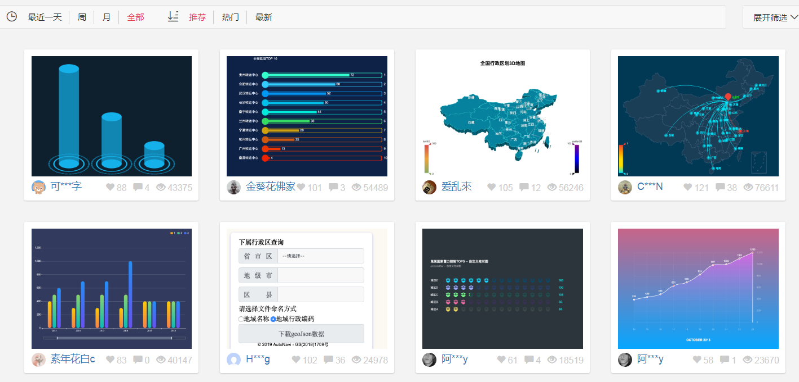

# 数据可视化项目布局

**先布好局， 之后利用ECharts 填充图表**

> ### 项目演示


> ### 项目目的

市场需求： 应对现在数据可视化的趋势，越来越多企业需要在很多场景(营销数据，生产数据，用户数据)下使用，可视化图表来展示 体现数据，让数据更加直观，数据特点更加突出


> ### 项目作用


> ### 项目技术


- **rem适配范围：1024~1920   等比适配**

- **该项目：**

  - **布局侧重理解、灵活CSS；课上不写布局css**
  - **手写JS；echarts配置！**

  

## 1. 项目基础布局

资源准备:

* images / bg.jpg - 全局的背景图
* images / logo.png - 顶部的logo图

> 这些图片都是在index.css中使用的背景图

最外框布局 


标签结构: (==可复制==)

```html
<div class="viewport">
    <div class="column">
        <!--概览-->
        <div class="overview panel">

        </div>
        <!--监控-->
        <div class="monitor panel">

        </div>
        <!-- 点位 -->
        <div class="point panel">

        </div>
    </div>
    <div class="column">
        <!-- 地图 -->
        <div class="map">

        </div>
        <!-- 用户 -->
        <div class="users panel">

        </div>
    </div>
    <div class="column">
        <!-- 订单 -->
        <div class="order panel">

        </div>
        <!-- 销售额 -->
        <div class="sales panel">

        </div>
        <!-- 渠道 季度 -->
        <div class="wrap">
            <div class="channel panel">

            </div>
            <div class="quarter panel">

            </div>
        </div>
        <!-- 排行榜 -->
        <div class="top panel">

        </div>
    </div>
</div>
```

样式准备 (==可复制==) 

```css
/*******清除元素默认的内外边距*****/

body {
    font-size: 0.5rem;
    font-family: Arial, Helvetica, sans-serif;
    margin: 0;
    padding: 0;
    /* 背景图定位 / 背景图尺寸  cover 完全铺满容器  contain 完整显示在容器内 */
    background: url(../images/bg.jpg) no-repeat 0 0 / cover;
    /* 行高是字体1.15倍 */
    line-height: 1.15;
}

h4, h3, ul { /*清除标签默认样式*/
    margin: 0;
    padding: 0;
    font-weight: normal;
}

ul { /*清除标签默认样式*/
    list-style: none;
}

a { /*清除标签默认样式*/
    text-decoration: none;
}

/*******清除元素默认的内外边距*****/


/********* 横向3列 - 样式 ***********/

.viewport {
    min-width: 1024px;
    max-width: 1920px;
    /* 撑开高度  看到背景 */
    min-height: 780px;
    background: url(../images/logo.png) no-repeat 0 0 / contain;
    display: flex;
    padding: 3.667rem 0.833rem 0;
}

.viewport .column {
    flex: 3;
    position: relative;
}

.viewport .column:nth-child(2) {
    flex: 4;
    margin: 1.333rem 0.833rem 0;
}

/********* 横向3列 - 样式 ***********/

/********* 渠道 - 季度 *************/

.wrap {
    display: flex;
}

.channel, .quarter {
    flex: 1;
    height: 9.667rem;
}

.channel {
    margin-right: 0.833rem;
}

/********* 渠道 - 季度 *************/
```

## 2. 公共面板边框样式

资源准备:

* images / border.png - 每个小块容器的边框图片

每一块, 外边框图片的使用


每一块上统一使用class名叫panel, 效果如下


样式准备 (==可复制==)

```css
/********* 公共面板边框样式 *********/

.panel {
    border: 2rem solid #ccc;
    border-width: 2.125rem 1.583rem 0.833rem 5.5rem;
    border-image: url(../images/border.png) 51 38 20 132;
    position: relative;
    margin-bottom: 0.833rem;
    box-sizing: border-box;
}
/*内容部分 用了一个inner容器来定位调整,top和left都是负值,往左上角移动 */
.panel .inner {
    position: absolute;
    top: -2.125rem;
    right: -1.583rem;
    bottom: -0.833rem;
    left: -5.5rem;
    padding: 1rem 1.5rem;
}

.panel h3 {
    font-size: 0.833rem;
    color: #fff;
}

/********* 公共面板边框样式 *********/
```

## 左侧

### 3. 概览区域布局

资源准备:

* fonts - 需要用到的所有字体图标 (在项目开始前, 分析需要的所有图标, 都生成下载完毕)

* js / rem.js - 之前写的根据宽度, 动态修改html的font-size的代码


> 引入 icomoon.css 
>
> 引入 rem.js

标签准备 (==可复制==)

```html
<!--概览-->
<div class="overview panel">
    <div class="inner">
        <div class="item">
            <h4>2,190</h4>
            <span>
                <i class="icon-dot" style="color: #006cff"></i>
                设备总数
            </span>
        </div>
    </div>
</div>
```

样式准备 (==可复制==)

```css
 
/********* 概览布局 *****************/

.overview {
    height: 4.583rem;
}

.overview .inner {
    display: flex;
    justify-content: space-between;
}

.overview h4 {
    color: #fff;
    font-size: 1.167rem;
    margin-bottom: 0.333rem;
    padding-left: 0.2rem;
}

.overview span {
    font-size: 0.667rem;
    color: #4c9bfd;
}

/********* 概览布局*****************/
```

JS动态创建

```js
// 概览区域数据
(function () {   // 自调用函数的目的 
    let arr = [
        {
            title: "设备总数",
            num: "2,190",
            iconColor: "#006cff"
        },
        {
            title: "季度新增",
            num: "1,190",
            iconColor: "#6acca3"
        },
        {
            title: "运营设备",
            num: "3,521",
            iconColor: "#6acca3"
        },
        {
            title: "异常设备",
            num: "108",
            iconColor: "#ed3f35"
        }
    ];
    $(arr).each(function(index,obj){
        // $("<li></li>") 创建标签对象
        // 把li标签对象给到ul的位置里追加即可
        $(".overview .inner").append($(`<div class="item">
                                        <h4>${obj.num}</h4>
                                        <span>
                                        <i class="icon-dot" style="color: ${obj.iconColor}"></i>
                                        ${obj.title}
                                        </span>
                                        </div>`))
    })
})();

```

问题小结:

- 我们创建一个自调用函数的目的是什么?

  

### 4. 监控区域布局


标签准备 (==可复制==)

```html
<!--监控-->
<div class="monitor panel">
    <div class="inner">
        <div class="tabs">
            <!-- <a href="javascript:;" data-index="0" class="active">故障设备监控</a> -->
			<!-- JS创建 -->
        </div>
        <div class="content" style="display: block;">
            <div class="head">
                <!-- <span class="col">故障时间</span> -->
				<!-- JS创建 -->
            </div>
            <div class="marquee-view">
                <div class="marquee">
                    <!-- <div class="row">
                        <span class="col">20180701</span>
                        <span class="col">11北京市昌平西路金燕龙写字楼</span>
                        <span class="col">1000001</span>
                        <span class="icon-dot"></span>
                    </div> -->
					<!-- JS创建 -->
                </div>
            </div>
        </div>
    </div>
</div>
```

样式准备 (==可复制==)

```css
/******** 监控区域布局**************/

.monitor {
    height: 20rem;
}

.monitor .inner {
    padding: 1rem 0;
    display: flex;
    flex-direction: column;
}

.monitor .tabs {
    padding: 0 1.5rem;
    margin-bottom: 0.75rem;
}

.monitor .tabs a {
    color: #1950c4;
    font-size: 0.75rem;
    padding: 0 1.125rem;
}

.monitor .tabs a:first-child {
    border-right: 0.083rem solid #00f2f1;
    padding-left: 0;
}

.monitor .tabs a.active {
    color: #fff;
}

.monitor .content {
    flex: 1;
    display: none;
    position: relative;
}

.monitor .head {
    background: rgba(255, 255, 255, 0.1);
    font-size: 0.583rem;
    padding: 0.5rem 1.5rem;
    color: #68d8fe;
    display: flex;
    justify-content: space-between;
    line-height: 1.05;
}

.monitor .col:nth-child(1) {
    width: 3.2rem;
}

.monitor .col:nth-child(2) {
    width: 8.4rem;
    /* 不换行  一行省略*/
    white-space: nowrap;
    overflow: hidden;
    text-overflow: ellipsis;
}

.monitor .col:nth-child(3) {
    width: 3.2rem;
}

.monitor .marquee-view {
    position: absolute;
    top: 1.6rem;
    bottom: 0;
    width: 100%;
    overflow: hidden;
}

.monitor .row {
    line-height: 1.05;
    padding: 0.5rem 1.5rem;
    color: #61a8ff;
    font-size: 0.5rem;
    position: relative;
    display: flex;
    justify-content: space-between;
}

.monitor .row:hover {
    color: #68d8ff;
    background: rgba(255, 255, 255, 0.1);
}

.monitor .row:hover .icon-dot {
    opacity: 1;
}

.monitor .icon-dot {
    position: absolute;
    left: 0.64rem;
    opacity: 0;
}

.monitor .marquee {
    animation: scroll-top 15s linear infinite;
}

.monitor .marquee:hover {
    /* 播放状态  running 播放  paused 暂停 */
    animation-play-state: paused;
}

/* 做动画 */

@keyframes scroll-top {
    0% {}
    100% {
        transform: translateY(-50%);
    }
}

/******** 监控区域布局**************/
```

JS代码 - 根据数据把固定的标签结构中的数据和多个row标签生成插入到页面上

```js
// 监控区域数据
(function () {
  // 1. 准备数据
  let arr = [
    {
      title: "故障设备监控",
      subTitle: [
        "故障时间",
        "设备地址",
        "异常代码"
      ],
      contentArr: [
        {
          time: "20150102",
          address: "北京市昌平西路金燕龙写字楼",
          code: 100001
        },
        {
          time: "20151215",
          address: "北京市海淀区上地大厦",
          code: 100022
        },
        {
          time: "20160322",
          address: "天津市滨海新区互联网大厦",
          code: 100103
        },
        {
          time: "20161012",
          address: "广州市南沙区可爱路",
          code: 100704
        },
        {
          time: "20170611",
          address: "深圳市盐田区五道口大街",
          code: 103205
        },
        {
          time: "20181112",
          address: "上海市宝山区南大街22号",
          code: 100008
        },
        {
          time: "20180520",
          address: "天津市市区梅花大厦",
          code: 100011
        },
        {
          time: "20190914",
          address: "北京市朝阳区人民写字楼",
          code: 100025
        },
        {
          time: "20201102",
          address: "北京市东城区公园",
          code: 100301
        },
        {
          time: "20201103",
          address: "石家庄市桥西区大龙写字楼",
          code: 105001
        }
      ]
    },
    {
      title: "异常设备监控",
      subTitle: [
        "异常时间",
        "地址",
        "代码"
      ],
      contentArr: [
        {
          time: "20201103",
          address: "石家庄市桥西区大龙写字楼",
          code: 105001
        },
        {
          time: "20160322",
          address: "天津市滨海新区互联网大厦",
          code: 100103
        },
        {
          time: "20170611",
          address: "深圳市盐田区五道口大街",
          code: 103205
        },
        {
          time: "20151215",
          address: "北京市海淀区上地大厦",
          code: 100022
        },
        {
          time: "20181112",
          address: "上海市宝山区南大街22号",
          code: 100008
        },
        {
          time: "20180520",
          address: "天津市市区梅花大厦",
          code: 100011
        },
        {
          time: "20190914",
          address: "北京市朝阳区人民写字楼",
          code: 100025
        },
        {
          time: "20150102",
          address: "北京市昌平西路金燕龙写字楼",
          code: 100001
        },
        {
          time: "20201102",
          address: "北京市东城区公园",
          code: 100301
        },
        {
          time: "20161012",
          address: "广州市南沙区可爱路",
          code: 100704
        }
      ]
    }
  ];
  // 2. 数据和标签的对应关系
  // 循环数据 - 初始化页面
  $(arr).each(function(index, obj){
    // 2.1 生成小a (tabs下的a)
    $(".monitor .tabs").append($(`<a href="javascript:;" class="${index == 0 ? 'active' : ''}">${obj.title}</a>`));
    // 2.2 生成head下的col(列标题)
    if (index == 0) {
      $(".monitor .head").append($(`<span class="col">${obj.subTitle[0]}</span><span class="col">${obj.subTitle[1]}</span><span class="col">${obj.subTitle[2]}</span>`));

      // 2.3 给第0个对象铺设下属的页面列表
      // 下属的任务有多个-对应多个对象-每个对象都要一套divclass叫row的标签
    $(obj.contentArr).each(function(rowIndex, rowObj){   
        $(".monitor .marquee").append($(`<div class="row">
        <span class="col">${rowObj.time}</span>
        <span class="col">${rowObj.address}</span>
        <span class="col">${rowObj.code}</span>
        <span class="icon-dot"></span>
      </div>`));
      })
    }
  })

})();
```

#### 无限滚动

思路: 把当前标签所有孩子复制克隆一份插入到当前标签内容末尾, 变成2倍高度, 帧动画滚动到一半即可实现无限滚动


==不可复制==

```js
 // 1. 先克隆marquee里面所有的行（row）- 为了滚动50%做动画而复制
  $(".marquee-view .marquee").each(function () {
    // console.log($(this));
    let rows = $(this)
      .children()
      .clone();
    $(this).append(rows);
  });
```

#### 点击导航 - 切换数据

==(不可复制)==

```js
// 3. 实现JS动态效果- 监控区域模块制作
  // 3.1 给a标签绑定点击事件
  $(".monitor .tabs").on("click", "a", function () {
    // 3.2 a标签点击的高亮效果
    $(this)
      .addClass("active")
      .siblings("a")
      .removeClass("active");

    // 3.3 根据点击的a标签的下角标 - 来切换数据
    // console.log($(this).index());
    // 3.4 根据下角标, 从arr数组里 - 取出对应的数据对象
    let bigObj = arr[$(this).index()];
    $(".monitor .head span").each(function (index, spanEl) {
      spanEl.innerHTML = bigObj.subTitle[index];
    });

    // 3.5 更改下面的数据
    let contentArr = bigObj.contentArr;
    contentArr = contentArr.concat(contentArr, contentArr);
    $(".monitor .marquee .row").each(function (index, rowEl) {
      let spanList = $(rowEl).find("span");
      spanList.eq(0).html(contentArr[index].time);
      spanList.eq(1).html(contentArr[index].address);
      spanList.eq(2).html(contentArr[index].code);
    })

  });
```

问题小结:

1. css无缝滚动动画的原理是什么?

### 5. 点位分布统计

资源准备

* js / echarts.js - 引入echars的插件
* images / rect.png - 点位分布统计 - 右侧背景图


标签准备 (==可复制==)

```html
<!-- 点位 -->
<div class="point panel">
    <div class="inner">
        <h3>点位分布统计</h3>
        <div class="chart">
            <div class="pie"></div>
            <div class="data">
                <div class="item">
                    <h4>320,11</h4>
                    <span>
                        <i class="icon-dot" style="color: #ed3f35"></i>
                        点位总数
                    </span>
                </div>
                <div class="item">
                    <h4>418</h4>
                    <span>
                        <i class="icon-dot" style="color: #eacf19"></i>
                        本月新增
                    </span>
                </div>
            </div>
        </div>
    </div>
</div>
```

样式准备(==可复制==)

```css
/******** 点位分布统计布局**********/

.point {
    height: 14.167rem;
}

.point .chart {
    display: flex;
    margin-top: 1rem;
    justify-content: space-between;
}

.point .pie {
    width: 13rem;
    height: 10rem;
    margin-left: -0.4rem;
}

.point .data {
    display: flex;
    flex-direction: column;
    justify-content: space-between;
    width: 7rem;
    padding: 1.5rem 1.25rem;
    box-sizing: border-box;
    background-image: url(../images/rect.png);
    background-size: cover;
}

.point h4 {
    margin-bottom: 0.5rem;
    font-size: 1.167rem;
    color: #fff;
}

.point span {
    display: block;
    color: #4c9bfd;
    font-size: 0.667rem;
}

/******** 点位分布统计布局**********/
```

#### echarts饼状图

打开官网实例 -> 寻找类似 -> 查看配置项 -> 修改成要的样 -> 在线改成相近的 -> 复制代码到html粘贴使用

需要注意的配置项

1. **饼图的半径**(内圆和外圆半径)

   ```js
   radius: ["10%", "70%"]
   ```

2. **是否展示成南丁格尔图**, 扇区圆心角展现数据的百分比，半径展现数据的大小。

   ```js
   roseType: 'radius'
   ```

3. **设置饼图图形上字体大小**

   ```js
   label: { fontSize: 10}
   ```

4. **标签的视觉引导线配置**

   ```js
   labelLine: { length: "2%", length2: "5%"}
   // length    视觉引导线第一段的长度
   // length2  视觉引导线第二段的长度
   ```

5. **图表自适应的问题**

准备的系列数据

```json
[{ value: 20, name: '云南' },
{ value: 26, name: '北京' },
{ value: 24, name: '山东' },
{ value: 25, name: '河北' },
{ value: 20, name: '江苏' },
{ value: 25, name: '浙江' },
{ value: 30, name: '四川' },
{ value: 42, name: '湖北' }]
```

准备的颜色数据

```js
['#006cff', '#60cda0', '#ed8884', '#ff9f7f', '#0096ff', '#9fe6b8', '#32c5e9', '#1d9dff']
```

完整JS代码(==自己写, 不要复制这里的代码, 尽量不要看==)

```js
// 为了防止全局变量重名, 污染全局作用域, 弄个自调用函数, 变成独立的作用域(内部变量孤立)
(function () {
    // 1. 准备配置
    let option = {
        tooltip: { // 提示框组件。
            trigger: 'item',// 触发类型。数据项图形触发，主要在散点图，饼图等无类目轴的图表中使用。
            formatter: '{a} <br/>{b} : {c} ({d}%)'

            // 提示框浮层内容格式器，支持字符串模板和回调函数两种形式。
            // 饼图、仪表盘、漏斗图: {a}（系列名称），{b}（数据项名称），{c}（数值）, {d}（百分比）
        },
        series: [ // 系列列表。每个系列通过 type 决定自己的图表类型
            {
                name: '销量', // 系列名称，用于tooltip的显示
                type: 'pie', // 饼图
                radius: ["10%", "70%"], // 饼图的半径(内圆和外圆半径)
                center: ['50%', '50%'], // 饼图的中心（圆心）坐标
                roseType: 'radius', // 是否展示成南丁格尔图, 扇区圆心角展现数据的百分比，半径展现数据的大小。
                label: { // 饼图图形上的文本标签，可用于说明图形的一些数据信息
                    show: true,
                    fontSize: 10
                },
                data: [{ value: 20, name: '云南' },
                       { value: 26, name: '北京' },
                       { value: 24, name: '山东' },
                       { value: 25, name: '河北' },
                       { value: 20, name: '江苏' },
                       { value: 25, name: '浙江' },
                       { value: 30, name: '四川' },
                       { value: 42, name: '湖北' }],
                labelLine: {
                    length: "2%", // 里面的线
                    length2: "5%"
                },
            }
        ],
        color: ['#006cff', '#60cda0', '#ed8884', '#ff9f7f', '#0096ff', '#9fe6b8', '#32c5e9', '#1d9dff']
    };
    // 2. 初始化echarts实例
    let myChart = echarts.init($('.pie')[0]);
    // 3. 使用配置
    myChart.setOption(option);
})();
```

## 中侧

### 6. 地图的实现

资料准备:

* js / china.js - 给echars注入中国地图的坐标数据 - 地图使用


标签准备 (==可复制==)

```html
<!-- 地图 -->
<div class="map">
    <h3>
        <span class="icon-cube"></span> 设备数据统计
    </h3>
    <div class="chart">
        <div class="geo"></div>
    </div>
</div>
```

样式准备(==可复制==)

```css
/******** 地图实现 ****************/

.map {
    height: 24.1rem;
    margin-bottom: 0.833rem;
    display: flex;
    flex-direction: column;
}

.map h3 {
    line-height: 1;
    padding: 0.667rem 0;
    margin: 0;
    font-size: 0.833rem;
    color: #fff;
}

.map .icon-cube {
    color: #68d8fe;
}

.map .chart {
    flex: 1;
    background-color: rgba(255, 255, 255, 0.05);
}

.map .geo {
    width: 100%;
    height: 100%;
}

/******** 地图实现 ****************/
```

#### 社区介绍

> 社区:https://www.makeapie.com/explore.html就是一些，活跃的echart使用者，交流和贡献定制好的图表的地方。



- 在这里可以找到一些基于echart的高度定制好的图表，相当于基于jquery开发的插件，这里是基于echarts开发的第三方的图表。

#### echarts - 地图 - 模拟航线

参考社区的例子：https://www.makeapie.com/editor.html?c=x2Ei_JbHZb

先引入china.js  (里面会向echarts注入地图的数据)

打开例子 -> 查看echarts相关的option配置 -> 修改成想要的样子 -> 粘贴到html的js处 -> 实例化到某个标签身上

==不可复制==

```js
(function () {
    // 1. 从echarts在线网站上, 调试好复制过来的
    let geoCoordMap = { // 每个城市的 坐标值
        '新疆玛纳斯基地': [86.22, 44.30],
        '九江': [116.00, 29.70],
        '新乡': [116.402217, 35.311657],
        ' ': [79.92, 37.12], // 注意这里要跟下面数组的key对上
        '  ': [86.85, 47.70],
        '若羌县': [88.17, 39.02],
        '上海': [121.4648, 31.2891],
        '东莞': [113.8953, 22.901],
        '东营': [118.7073, 37.5513],
        '中山': [113.4229, 22.478],
        '临汾': [111.4783, 36.1615],
        '临沂': [118.3118, 35.2936],
        '丹东': [124.541, 40.4242],
        '丽水': [119.5642, 28.1854],
        '乌鲁木齐': [87.9236, 43.5883],
        '佛山': [112.8955, 23.1097],
        '保定': [115.0488, 39.0948],
        '兰州': [103.5901, 36.3043],
        '包头': [110.3467, 41.4899],
        '北京': [116.4551, 40.2539],
        '北海': [109.314, 21.6211],
        '南京': [118.8062, 31.9208],
        '南宁': [108.479, 23.1152],
        '南昌': [116.0046, 28.6633],
        '南通': [121.1023, 32.1625],
        '厦门': [118.1689, 24.6478],
        '台州': [121.1353, 28.6688],
        '合肥': [117.29, 32.0581],
        '呼和浩特': [111.4124, 40.4901],
        '咸阳': [108.4131, 34.8706],
        '哈尔滨': [127.9688, 45.368],
        '唐山': [118.4766, 39.6826],
        '嘉兴': [120.9155, 30.6354],
        '大同': [113.7854, 39.8035],
        '大连': [122.2229, 39.4409],
        '天津': [117.4219, 39.4189],
        '太原': [112.3352, 37.9413],
        '威海': [121.9482, 37.1393],
        '宁波': [121.5967, 29.6466],
        '宝鸡': [107.1826, 34.3433],
        '宿迁': [118.5535, 33.7775],
        '常州': [119.4543, 31.5582],
        '广州': [113.5107, 23.2196],
        '廊坊': [116.521, 39.0509],
        '延安': [109.1052, 36.4252],
        '张家口': [115.1477, 40.8527],
        '徐州': [117.5208, 34.3268],
        '德州': [116.6858, 37.2107],
        '惠州': [114.6204, 23.1647],
        '成都': [103.9526, 30.7617],
        '扬州': [119.4653, 32.8162],
        '承德': [117.5757, 41.4075],
        '拉萨': [91.1865, 30.1465],
        '无锡': [120.3442, 31.5527],
        '日照': [119.2786, 35.5023],
        '昆明': [102.9199, 25.4663],
        '杭州': [119.5313, 29.8773],
        '枣庄': [117.323, 34.8926],
        '柳州': [109.3799, 24.9774],
        '株洲': [113.5327, 27.0319],
        '武汉': [114.3896, 30.6628],
        '汕头': [117.1692, 23.3405],
        '江门': [112.6318, 22.1484],
        '沈阳': [123.1238, 42.1216],
        '沧州': [116.8286, 38.2104],
        '河源': [114.917, 23.9722],
        '泉州': [118.3228, 25.1147],
        '泰安': [117.0264, 36.0516],
        '泰州': [120.0586, 32.5525],
        '济南': [117.1582, 36.8701],
        '济宁': [116.8286, 35.3375],
        '海口': [110.3893, 19.8516],
        '淄博': [118.0371, 36.6064],
        '淮安': [118.927, 33.4039],
        '深圳': [114.5435, 22.5439],
        '清远': [112.9175, 24.3292],
        '温州': [120.498, 27.8119],
        '渭南': [109.7864, 35.0299],
        '湖州': [119.8608, 30.7782],
        '湘潭': [112.5439, 27.7075],
        '滨州': [117.8174, 37.4963],
        '潍坊': [119.0918, 36.524],
        '烟台': [120.7397, 37.5128],
        '玉溪': [101.9312, 23.8898],
        '珠海': [113.7305, 22.1155],
        '盐城': [120.2234, 33.5577],
        '盘锦': [121.9482, 41.0449],
        '石家庄': [114.4995, 38.1006],
        '福州': [119.4543, 25.9222],
        '秦皇岛': [119.2126, 40.0232],
        '绍兴': [120.564, 29.7565],
        '聊城': [115.9167, 36.4032],
        '肇庆': [112.1265, 23.5822],
        '舟山': [122.2559, 30.2234],
        '苏州': [120.6519, 31.3989],
        '莱芜': [117.6526, 36.2714],
        '菏泽': [115.6201, 35.2057],
        '营口': [122.4316, 40.4297],
        '葫芦岛': [120.1575, 40.578],
        '衡水': [115.8838, 37.7161],
        '衢州': [118.6853, 28.8666],
        '西宁': [101.4038, 36.8207],
        '西安': [109.1162, 34.2004],
        '贵阳': [106.6992, 26.7682],
        '连云港': [119.1248, 34.552],
        '邢台': [114.8071, 37.2821],
        '邯郸': [114.4775, 36.535],
        '郑州': [113.4668, 34.6234],
        '鄂尔多斯': [108.9734, 39.2487],
        '重庆': [107.7539, 30.1904],
        '金华': [120.0037, 29.1028],
        '铜川': [109.0393, 35.1947],
        '银川': [106.3586, 38.1775],
        '镇江': [119.4763, 31.9702],
        '长春': [125.8154, 44.2584],
        '长沙': [113.0823, 28.2568],
        '长治': [112.8625, 36.4746],
        '阳泉': [113.4778, 38.0951],
        '青岛': [120.4651, 36.3373],
        '韶关': [113.7964, 24.7028]
    };

    let BJData = [ // 新乡-> 点和点的数据集
        [{
            name: '新乡'
        }, {
            name: '新乡',
            value: 200
        }],
        [{
            name: '新乡'
        }, {
            name: '呼和浩特',
            value: 90
        }],
        [{
            name: '新乡'
        }, {
            name: '哈尔滨',
            value: 90
        }],
        [{
            name: '新乡'
        }, {
            name: '石家庄',
            value: 90
        }],
        [{
            name: '新乡'
        }, {
            name: '昆明',
            value: 30
        }],
        [{
            name: '新乡'
        }, {
            name: '北京',
            value: 100
        }],
        [{
            name: '新乡'
        }, {
            name: '长春',
            value: 40
        }],
        [{
            name: '新乡'
        }, {
            name: '重庆',
            value: 40
        }],
        [{
            name: '新乡'
        }, {
            name: '贵阳',
            value: 50
        }],
        [{
            name: '新乡'
        }, {
            name: '南宁',
            value: 30
        }],
        [{
            name: '新乡'
        }, {
            name: '济南',
            value: 10
        }],
        [{
            name: '新乡'
        }, {
            name: '太原',
            value: 40
        }],
        [{
            name: '新乡'
        }, {
            name: '西安',
            value: 60
        }],
        [{
            name: '新乡'
        }, {
            name: '武汉',
            value: 50
        }],
        [{
            name: '新乡'
        }, {
            name: '合肥',
            value: 40
        }],
        [{
            name: '新乡'
        }, {
            name: '南京',
            value: 30
        }],
        [{
            name: '新乡'
        }, {
            name: '沈阳',
            value: 20
        }],
        [{
            name: '新乡'
        }, {
            name: '成都',
            value: 10
        }]
    ];

    let SHData = [ // 九江->地方
        [{
            name: '九江'
        }, {
            name: '九江',
            value: 200
        }],

        [{
            name: '九江'
        }, {
            name: '长沙',
            value: 95
        }],
        [{
            name: '九江'
        }, {
            name: '武汉',
            value: 30
        }],
        [{
            name: '九江'
        }, {
            name: '南昌',
            value: 20
        }],
        [{
            name: '九江'
        }, {
            name: '合肥',
            value: 70
        }],
        [{
            name: '九江'
        }, {
            name: '南京',
            value: 60
        }],
        [{
            name: '九江'
        }, {
            name: '福州',
            value: 50
        }],
        [{
            name: '九江'
        }, {
            name: '上海',
            value: 100
        }],
        [{
            name: '九江'
        }, {
            name: '深圳',
            value: 100
        }],

    ];

    let GZData = [ // 新疆-> 其他地方
        [{
            name: '新疆玛纳斯基地'
        }, {
            name: '新疆玛纳斯基地',
            value: 200
        }],
        [{
            name: '新疆玛纳斯基地'
        }, {
            name: '  ',
            value: 90
        }],
        [{
            name: '新疆玛纳斯基地'
        }, {
            name: ' ',
            value: 40
        }],
        [{
            name: '新疆玛纳斯基地'
        }, {
            name: '呼和浩特',
            value: 90
        }],
        [{
            name: '新疆玛纳斯基地'
        }, {
            name: '昆明',
            value: 40
        }],
        [{
            name: '新疆玛纳斯基地'
        }, {
            name: '成都',
            value: 10
        }],
        [{
            name: '新疆玛纳斯基地'
        }, {
            name: '兰州',
            value: 95
        }],
        [{
            name: '新疆玛纳斯基地'
        }, {
            name: '银川',
            value: 90
        }],
        [{
            name: '新疆玛纳斯基地'
        }, {
            name: '西宁',
            value: 80
        }],

    ];
	// svg标签绘制图形的坐标点
    
    let planePath = "path://M1705.06,1318.313v-89.254l-319.9-221.799l0.073-208.063c0.521-84.662-26.629-121.796-63.961-121.491c-37.332-0.305-64.482,36.829-63.961,121.491l0.073,208.063l-319.9,221.799v89.254l330.343-157.288l12.238,241.308l-134.449,92.931l0.531,42.034l175.125-42.917l175.125,42.917l0.531-42.034l-134.449-92.931l12.238-241.308L1705.06,1318.313z"
    
    let convertData = function (data) { // 生成坐标之间的数据数组
        let res = [];
        for (let i = 0; i < data.length; i++) {
            let dataItem = data[i];
            let fromCoord = geoCoordMap[dataItem[0].name];
            let toCoord = geoCoordMap[dataItem[1].name];
            if (fromCoord && toCoord) {
                res.push([{
                    coord: fromCoord // 格式: key: [118, 232]
                }, {
                    coord: toCoord
                }]);
            }
        }
        return res;
    };

    let color = ['#3ed4ff', '#ffa022', '#a6c84c']; // 三种分类线条连线颜色
    let series = [];
    [
        ['新乡', BJData],
        ['九江', SHData],
        ['新疆', GZData]
    ].forEach(function (item, i) {
        series.push({
            name: item[0] + ' Top3', // 系列名称，用于tooltip的显示
            type: 'lines', // 折线图
            zlevel: 1, // 折线图所有图形的 zlevel 值。大的在上面
            effect: { // 涟漪效果
                show: true,
                period: 6, // 动画的周期，秒数。
                trailLength: 0.7, // 特效尾迹的长度。取从 0 到 1 的值，数值越大尾迹越长。
                color: '#fff',
                symbolSize: 3 // 线两端的标记大小
            },
            lineStyle: { // 线的颜色
                normal: { // 正常
                    color: color[i], // 线条颜色
                    width: 0,
                    curveness: 0.2 // 边的曲度，支持从 0 到 1 的值，值越大曲度越大
                }
            },
            data: convertData(item[1]) // 线数据集
        }, {
            name: item[0] + ' Top3',
            type: 'lines',
            zlevel: 2,
            effect: {
                show: true,
                period: 6,
                trailLength: 0,
                symbol: planePath, // 标记的图形。
                symbolSize: 15
            },
            lineStyle: {
                normal: {
                    color: color[i],
                    width: 1,
                    opacity: 0.4,
                    curveness: 0.2
                }
            },
            data: convertData(item[1])
        }, {
            name: item[0] + ' Top3',
            type: 'effectScatter', // 带有涟漪特效动画的散点（气泡）图
            coordinateSystem: 'geo', // 该系列使用的坐标系
            zlevel: 2,
            rippleEffect: {  // 波纹的绘制方式
                brushType: 'stroke' // 地址原地的动画波纹放射
            },
            label: { // 城市名字提示
                normal: {
                    show: true,
                    position: 'right',
                    formatter: '{b}' // 数据名
                }
            },
            symbolSize: function (val) { // 标记的大小
                return val[2] / 8; // 看下面data的值
            },
            itemStyle: {
                normal: {
                    color: color[i]
                }
            },
            data: item[1].map(function (dataItem) {
                return {
                    name: dataItem[1].name,
                    value: geoCoordMap[dataItem[1].name].concat([dataItem[1].value])
                };
            }) // item[1] 的值 [[{}, {}], [{}, {}]]
            // map返回值 [{name: xx, vlaue: [118.2, 113.5, 80]}]
        });
    });

    let option = {

        backgroundColor: '#080a20',
        tooltip: { // 提示组件
            trigger: 'item'
        },
        geo: { // 地理坐标系组件。地理坐标系组件用于地图的绘制
            map: 'china', // 地图类型。(依赖于china.js)
            zoom: 1.2, // 缩放比例
            roam: false, // 是否开启鼠标缩放和平移漫游
            itemStyle: { // 地图区域的多边形 图形样式。
                normal: { // 正常情况的
                    areaColor: '#132937', // 区域颜色
                    borderColor: '#0692a4' // 边框颜色
                },
                emphasis: { // 高亮状态下的样式
                    areaColor: '#0b1c2d'
                }
            },
            label: {
                emphasis: { // 高亮的标签, 隐藏
                    show: false
                }
            },
        },
        series: series
    };
    // 2. 用标签实例化echarts对象
    let myecharts = echarts.init($('.map .geo')[0]);
    // 3. 把配置项交给这个实例化对象 -> 去标签上 -> 生成我们的地图
    myecharts.setOption(option)
})()
```

#### 飞机图形使用

```js
let planePath = "path://M1705.06,1318.313v-89.254l-319.9-221.799l0.073-208.063c0.521-84.662-26.629-121.796-63.961-121.491c-37.332-0.305-64.482,36.829-63.961,121.491l0.073,208.063l-319.9,221.799v89.254l330.343-157.288l12.238,241.308l-134.449,92.931l0.531,42.034l175.125-42.917l175.125,42.917l0.531-42.034l-134.449-92.931l12.238-241.308L1705.06,1318.313z";
```

### 7. 用户统计


标签准备(==可复制==)

```html
<!-- 用户 -->
<div class="users panel">
    <div class="inner">
        <h3>全国用户总量统计</h3>
        <div class="chart">
            <div class="bar"></div>
            <div class="data">
                <div class="item">
                    <h4>120,899</h4>
                    <span>
                        <i class="icon-dot" style="color: #ed3f35"></i>
                        用户总量
                    </span>
                </div>
                <div class="item">
                    <h4>248</h4>
                    <span>
                        <i class="icon-dot" style="color: #eacf19"></i>
                        本月新增
                    </span>
                </div>
            </div>
        </div>
    </div>
</div>
```

样式准备(==可复制==)

```css
/******** 用户统计 ***********/

.users {
    height: 14.167rem;
    display: flex;
}

.users .chart {
    display: flex;
    margin-top: 1rem;
}

.users .bar {
    width: 24.5rem;
    height: 10rem;
}

.users .data {
    display: flex;
    flex-direction: column;
    justify-content: space-between;
    width: 7rem;
    padding: 1.5rem 1.25rem;
    box-sizing: border-box;
    background-image: url(../images/rect.png);
    background-size: cover;
}

.users h4 {
    margin-bottom: 0.5rem;
    font-size: 1.167rem;
    color: #fff;
}

.users span {
    display: block;
    color: #4c9bfd;
    font-size: 0.667rem;
}

/******** 用户统计 ***********/
```

#### echarts - 柱状图

官方示例(找相近的) -> 在线修改配置(查看文档配置key属性的意义, 改后在线调试) -> 复制代码到html中使用

需要注意的配置项

1. **柱状图颜色数据 - 渐变**

```js
color: new echarts.graphic.LinearGradient(
    0, 0, 0, 1,
    [
        { offset: 0, color: '#00fffb' }, // 0 起始颜色
        { offset: 1, color: '#0061ce' } // 1 结束颜色
    ]
)
```

2.  **直角坐标系内绘图网格相关配置**

```js
grid: { 
    show:true,  // 是否显示直角坐标系网格
    containLabel: true, // grid 区域是否包含坐标轴的刻度标签
    borderColor: 'rgba(0, 240, 255, 0.3)', // 外边框颜色      
},
```

3. **x轴相关配置**

```js
xAxis: {
  // 坐标轴刻度相关设置。
  axisTick: {
    show: false // 不显示坐标轴刻度
  },
  // 刻度文字
  axisLabel: {
     color: '#4c9bfd'  //刻度文字颜色
  },
  axisLine: { // xAxis轴-垂直线段
      lineStyle: {  // 坐标轴线(分割线)的颜色 
          color: "rgba(0, 240, 255, 0.3)"
      }
  }
}
```

4. **y轴相关配置**

```js
  yAxis: {
      axisLabel: {  // 刻度文字颜色
        color: '#4c9bfd'
      },
      // 坐标轴刻度相关设置。
      axisTick: {
        show: false // 不显示坐标轴刻度
      },
      splitLine: {  //  轴线相关设置  
        lineStyle: { 
          color: 'rgba(0, 240, 255, 0.3)' // 坐标轴线(分割线)的颜色 
        }
      }

    },
```

5. **特殊的三列**

```js
let item = {
    value: 1200, // 值
    tooltip: { extraCssText: 'opacity:0' }, // 额外附加到浮层的 css 样式
    itemStyle: { // 图形样式。
        color: '#254065' // 柱条的颜色。 
    },
    emphasis: { //  鼠标移动上去hover的样式
        itemStyle: { // 图形样式。
            color: '#254065' // 柱条的颜色。 
        },
    }
};
```

6. **X轴的类目数据**

```js
['上海', '广州', '北京', '深圳', '合肥', '', '......', '', '杭州', '厦门', '济南', '成都', '重庆']
```

7. **系列series - 柱状图的数据**

```js
[2100, 1900, 1700, 1560, 1400, item, item, item, 900, 750, 600, 480, 240]
```

(重点讲解) - 多找找文档上对属性更多的讲解 / 百度看看别人和自己写的区别(找到哪块代码是控制这里的)

==不可复制==

```js
(function () {
    let item = {
        value: 1200, // 值
        tooltip: { extraCssText: 'opacity:0' }, // 额外附加到浮层的 css 样式
        itemStyle: { // 图形样式。
            color: '#254065' // 柱条的颜色。 
        },
        emphasis: { // 高亮的图形样式和标签样式。
            itemStyle: { // 图形样式。
                color: '#254065' // 柱条的颜色。 
            },
        }
    };
    // 1. 在线调试的柱状图的相关配置项
    let option = {
        color: new echarts.graphic.LinearGradient(
            0, 0, 0, 1,
            [
                { offset: 0, color: '#00fffb' }, // 0 起始颜色
                { offset: 1, color: '#0061ce' } // 1 结束颜色
            ]
        ),
        tooltip: {
            trigger: 'item'
        },
        grid: { // 直角坐标系内绘图网格
            left: '3%', // grid 组件离容器左侧的距离
            right: '4%',
            bottom: '3%',
            top: '4%',
            containLabel: true, // grid 区域是否包含坐标轴的刻度标签
            borderColor: 'rgba(0, 240, 255, 0.3)',
            show: true
        },
        xAxis: [ // 直角坐标系 grid 中的 x 轴
            {
                type: 'category', // 类目轴，适用于离散的类目数据。
                data: ['上海', '广州', '北京', '深圳', '合肥', '', '......', '', '杭州', '厦门', '济南', '成都', '重庆'],
                axisTick: { // 坐标轴刻度相关设置。
                    show: false,
                    alignWithLabel: true // 类目轴中在 boundaryGap 为 true 的时候有效，可以保证刻度线和标签对齐。如下图：
                },
                // 刻度文字
                axisLabel: {
                    color: '#4c9bfd'
                },
                  axisLine: { // xAxis轴-垂直线段
                      lineStyle: {  // 坐标轴线(分割线)的颜色 
                          color: "rgba(0, 240, 255, 0.3)"
                      }
                  }
            }
        ],
        yAxis: [ // 直角坐标系 grid 中的 y 轴，
            { // 'value' 数值轴，适用于连续数据。
                type: 'value',
                // 刻度设置
                axisTick: {
                    show: false
                },
                // 刻度文字
                axisLabel: {
                    color: '#4c9bfd'
                },
                // 分割线
                splitLine: {
                    lineStyle: {
                        color: 'rgba(0, 240, 255, 0.3)'
                    }
                }
            }
        ],
        series: [ // 系列
            {
                name: '用户统计',
                type: 'bar',
                barWidth: '60%',
                data: [2100, 1900, 1700, 1560, 1400, item, item, item, 900, 750, 600, 480, 240]
            }
        ]
    };
    // 2. 初始化实例对象
    let myChart = echarts.init($('.bar')[0]);
    // 3. 配置设置
    myChart.setOption(option);
})();
```

## 右侧

### 8. 订单


标签准备(==可复制==)

```html
<!-- 订单 -->
<div class="order panel">
    <div class="inner">
        <!-- 筛选 -->
        <div class="filter">
            <a href="javascript:;" data-key="day365" class="active">365天</a>
            <a href="javascript:;" data-key="day90">90天</a>
            <a href="javascript:;" data-key="day30">30天</a>
            <a href="javascript:;" data-key="day1">24小时</a>
        </div>
        <!-- 数据 -->
        <div class="data">
            <div class="item">
                <h4>20,301,987</h4>
                <span>
                    <i class="icon-dot" style="color: #ed3f35;"></i>
                    订单量
                </span>
            </div>
            <div class="item">
                <h4>99834</h4>
                <span>
                    <i class="icon-dot" style="color: #eacf19;"></i>
                    销售额(万元)
                </span>
            </div>
        </div>
    </div>
</div>
```

css样式(==可复制==)

```css
/******* 订单实现 **********/
.order {
    height: 6.167rem;
  }
  .order .filter {
    display: flex;
  }
  .order .filter a {
    display: block;
    height: 0.75rem;
    line-height: 1;
    padding: 0 0.75rem;
    color: #1950c4;
    font-size: 0.75rem;
    border-right: 0.083rem solid #00f2f1;
  }
  .order .filter a:first-child {
    padding-left: 0;
  }
  .order .filter a:last-child {
    border-right: none;
  }
  .order .filter a.active {
    color: #fff;
    font-size: 0.833rem;
  }
  .order .data {
    display: flex;
    margin-top: 0.833rem;
  }
  .order .item {
    width: 50%;
  }
  .order h4 {
    font-size: 1.167rem;
    color: #fff;
    margin-bottom: 0.417rem;
  }
  .order span {
    display: block;
    color: #4c9bfd;
    font-size: 0.667rem;
  }
  /**********订单实现**************/
```

数据

```js
let data = {
    day365: { orders: '20,301,987', amount: '99834' },
    day90: { orders: '301,987', amount: '9834' },
    day30: { orders: '1,987', amount: '3834' },
    day1: { orders: '987', amount: '834' }
}
```

#### 点击切换

==不可复制==

```js
(function(){
    // 准备数据
    let data = {
        day365: { orders: '20,301,987', amount: '99834' },
        day90: { orders: '301,987', amount: '9834' },
        day30: { orders: '1,987', amount: '3834' },
        day1: { orders: '987', amount: '834' }
    }

    // 1. 获取到所有a标签 - 点击事件
    $(".order .filter a").on("click", function(){
        nowIndex = $(this).index(); // 点击 - 同步索引
        clearInterval(t); // 计时器停止
        // 2. 点谁谁量
        $(this).addClass("active").siblings().removeClass();
        // 3. 思想(重要): 不用索引对应了, 而是用key来对应
        // $(this).attr("data-key"); // 取到了对应的key值
        // 拿着key值去data里换出对应的下面的数据对象
        let dataObj = data[$(this).attr("data-key")];
        // 具体的key名 才可以data.xxx  但是如果是变量必须data[变量名]
        // 4. 把对象里的数据 赋予到 页面的h4标签上
        $(".order .item h4").eq(0).html(dataObj.orders);
        $(".order .item h4").eq(1).html(dataObj.amount);
        // 9. 再把计时器创建回来
        orderInterval();
    })
    
})();

```

#### 自动切换

==不可复制==

```js
// 5. 创建一个计时器
let t;
let nowIndex = 0; // 默认第一个是高亮的
function orderInterval(){
    t = setInterval(function(){
        nowIndex++;
        // 6. 如果当前索引已经到了最后一个了, 我们要回去
        if (nowIndex == $(".order .filter a").length) { // 索引只能为3, 但是+到了4, 就得强制改成0回去
            nowIndex = 0; 
        }
        // 7. 有了索引, 用索引找到对应的a标签, 让a标签触发自己的点击事件
        $(".order .filter a").eq(nowIndex).click();
    }, 2000);
}
orderInterval();
```

### 9. 销售统计


标签结构(==可复制==)

```html
<!-- 销售额 -->
<div class="sales panel">
    <div class="inner">
        <div class="caption">
            <h3>销售额统计</h3>
            <a href="javascript:;" class="active" data-type="year">年</a>
            <a href="javascript:;" data-type="quarter">季</a>
            <a href="javascript:;" data-type="month">月</a>
            <a href="javascript:;" data-type="week">周</a>
        </div>
        <div class="chart">
            <div class="label">单位:万</div>
            <div class="line"></div>
        </div>
    </div>
</div>
```

css准备(==可复制==)

```css
/**********销售统计**************/

.sales {
    height: 10.333rem;
}

.sales .caption {
    display: flex;
    line-height: 1;
}

.sales h3 {
    height: 0.75rem;
    padding-right: 0.75rem;
    border-right: 0.083rem solid #00f2f1;
}

.sales a {
    padding: 0.167rem;
    font-size: 0.667rem;
    margin: -0.125rem 0 0 0.875rem;
    border-radius: 0.125rem;
    color: #0bace6;
}

.sales a.active {
    background-color: #4c9bfd;
    color: #fff;
}

.sales .inner {
    display: flex;
    flex-direction: column;
}

.sales .chart {
    flex: 1;
    padding-top: 0.6rem;
    position: relative;
}

.sales .label {
    position: absolute;
    left: 1.75rem;
    top: 0.75rem;
    color: #4996f5;
    font-size: 0.583rem;
}

.sales .line {
    width: 100%;
    height: 100%;
}

/**********销售统计**************/
```

#### echarts - 折线图

需要注意的配置项

1.  **折线的颜色**  

```js
color: ["#00f2f1", "#ed3f35"]
```

2. **图例配置**

```js
 legend: {
     data: ['预期销售额', '实际销售额'],
     textStyle: {  // 图例上的文字颜色
        color: "#4c9bfd"  // 浅蓝色
     },
     left: "25%"  // 距离左侧25%
 }
```

3. **x轴配置**

```js
xAxis: {
     type: 'category',
     boundaryGap: false,
     data:['1月', '2月', '3月', '4月', '5月', '6月', '7月', '8月', '9月', '10月', '11月', '12月'],
      axisTick: { // 去掉刻度
        show: false  
        },
        axisLabel: { // 文字颜色
            color: "#4c9bfd"
        },
        axisLine: { // xAxis轴-垂直线段
            lineStyle: {
                 color: "#012f4a"
             }
        }    
}

```

4.**y轴数配置**

```js
yAxis: {
       type: 'value',
       axisTick: {   // 坐标轴刻度相关设置
            show: false  // 不显示坐标轴刻度
        },
        axisLabel: { // 文字颜色
            color: '#4c9bfd'
         },
         axisLine: { // y轴-垂直线段
             lineStyle: {
                 color: "#012f4a"
             }
         },
        splitLine: {  //  轴线相关设置  
            lineStyle: {
                color: '#012f4a' // 坐标轴线(分割线)的颜色 
            }
        }
}
```

5.**绘图网格配置**

```js
grid: { // 直角坐标系内绘图网格
        top: '20%',
        left: '3%',
        right: '4%',
        bottom: '3%',
        containLabel: true, // grid 区域是否包含坐标轴的刻度标签
        show: true,  
        borderColor: '#012f4a'
}
```

数据准备(==可复制==)

```js
// X轴的数据
['1月', '2月', '3月', '4月', '5月', '6月', '7月', '8月', '9月', '10月', '11月', '12月']
```

查找相应的配置项 -> 在线修改后

```js
// 1. 准备数据 - 每个key对应的是年,季,月,周下的不同数据
let data = {
    year: [
        [24, 40, 101, 134, 90, 230, 210, 230, 120, 230, 210, 120],
        [40, 64, 191, 324, 290, 330, 310, 213, 180, 200, 180, 79]
    ],
    quarter: [
        [23, 75, 12, 97, 21, 67, 98, 21, 43, 64, 76, 38],
        [43, 31, 65, 23, 78, 21, 82, 64, 43, 60, 19, 34]
    ],
    month: [
        [34, 87, 32, 76, 98, 12, 32, 87, 39, 36, 29, 36],
        [56, 43, 98, 21, 56, 87, 43, 12, 43, 54, 12, 98]
    ],
    week: [
        [43, 73, 62, 54, 91, 54, 84, 43, 86, 43, 54, 53],
        [32, 54, 34, 87, 32, 45, 62, 68, 93, 54, 54, 24]
    ]
}
let option = {
    legend: { // 图例
        right: '10%', // 距离右侧10%
        textStyle: { // 图例上的文字颜色
            color: '#4c9bfd' // 浅蓝色
        }
    },
    tooltip: { // 提示
        trigger: 'axis'
    },
    grid: { // 直角坐标系内绘图网格
        top: '20%',
        left: '3%',
        right: '4%',
        bottom: '3%',
        containLabel: true,
        show: true,
        borderColor: '#012f4a'
    },
    xAxis: {
        type: 'category',
        boundaryGap: false, // 坐标轴两边留白策略
        data: ['1月', '2月', '3月', '4月', '5月', '6月', '7月', '8月', '9月', '10月', '11月', '12月'],
        axisTick: {  // 去掉刻度
            show: false
        },
        axisLabel: { // 文字颜色
            color: '#4c9bfd'
        },
        axisLine: { // 隐藏轴线
            show: false
        }
    },
    yAxis: {
        type: 'value',
        axisTick: {  // 去掉刻度
            show: false
        },
        axisLabel: { // 文字颜色
            color: '#4c9bfd'
        },
        splitLine: { // 坐标轴在图标里分割线
            lineStyle: {
                color: '#012f4a'
            }
        }
    },
    series: [
        {
            name: '预期销售额',
            type: 'line',
            smooth: true, // 是否平滑曲线显示。
            itemStyle: {
                color: '#00f2f1' // 线颜色
            },
            data: data.year[0],
        },
        {
            name: '实际销售额',
            type: 'line',
            smooth: true,
            itemStyle: {
                color: '#ed3f35' // 线颜色
            },
            data: data.year[1],
        }
    ]
};

// 2. 初始化echart
let myChart = echarts.init($('.line').get(0));
// 3. 使用配置
myChart.setOption(option);
```

#### 点击切换

==不可复制==

```js
// 4. 点击切换功能
// 绑定点击事件（切换样式，切换图表数据）
$('.sales').on('click', '.caption a', function () {
    $(this).addClass('active').siblings().removeClass('active')
    // 修改数据
    let currData = data[$(this).attr("data-type")];
    // currData 是数组  第一项 是第一条线的数据  第二项 是是第二条线的数据
    option.series[0].data = currData[0]
    option.series[1].data = currData[1]
    // 重新渲染 echarts图表
    myChart.setOption(option)
    
    index = $(this).index() - 1; // 因为上面有个h3
})
```

#### 自动切换

==不可复制==

```js
let $allA = $('.sales .caption a');
let t;
function createTimer() {
    t = setInterval(function () {
        index++
        if (index >= 4) {
            index = 0
        }
        // 切换上面的文字按钮
        $allA.eq(index).click()
    }, 2000)
}
createTimer();
```

#### 移入暂停 / 移出继续

==不可复制==

```js
// 6. 移入停止计时器/移出在创建回来
$(".sales").hover(() => {
    clearInterval(t)
}, ()=>{
    createTimer();
})
```

### 10. 渠道 & 销售进度


标签准备(==可复制==)

```html
<!-- 渠道 季度 -->
<div class="wrap">
    <div class="channel panel">
        <div class="inner">
            <h3>渠道分布</h3>
            <div class="data">
                <div class="item">
                    <h4>39 <small>%</small></h4>
                    <span>
                        <i class="icon-plane"></i>
                        机场
                    </span>
                </div>
                <div class="item">
                    <h4>28 <small>%</small></h4>
                    <span>
                        <i class="icon-bag"></i>
                        商场
                    </span>
                </div>
            </div>
            <div class="data">
                <div class="item">
                    <h4>20 <small>%</small></h4>
                    <span>
                        <i class="icon-train"></i>
                        地铁
                    </span>
                </div>
                <div class="item">
                    <h4>13 <small>%</small></h4>
                    <span>
                        <i class="icon-bus"></i>
                        火车站
                    </span>
                </div>
            </div>
        </div>
    </div>
    <div class="quarter panel">
        <div class="inner">
            <h3>一季度销售进度</h3>
            <div class="chart">
                <div class="box">
                    <div class="gauge"></div>
                    <div class="label">75<small> %</small></div>
                </div>
                <div class="data">
                    <div class="item">
                        <h4>1,321</h4>
                        <span>
                            <i class="icon-dot" style="color: #6acca3"></i>
                            销售额(万元)
                        </span>
                    </div>
                    <div class="item">
                        <h4>150%</h4>
                        <span>
                            <i class="icon-dot" style="color: #ed3f35"></i>
                            同比增长
                        </span>
                    </div>
                </div>
            </div>
        </div>
    </div>
</div>
```

样式准备(==可复制==)

```css
/**********渠道和销售进度********/

.wrap {
    display: flex;
}

.channel, .quarter {
    flex: 1;
    height: 9.667rem;
}

.channel {
    margin-right: 0.833rem;
}

.channel .data {
    overflow: hidden;
}

.channel .item {
    margin-top: 0.85rem;
}

.channel .item:first-child {
    float: left;
}

.channel .item:last-child {
    float: right;
}

.channel h4 {
    color: #fff;
    font-size: 1.333rem;
    margin-bottom: 0.2rem;
}

.channel small {
    font-size: 50%;
}

.channel span {
    display: block;
    color: #4c9bfd;
    font-size: 0.583rem;
}

/* 季度区块 */

.quarter .inner {
    display: flex;
    flex-direction: column;
    margin: 0 -0.25rem;
}

.quarter .chart {
    flex: 1;
    padding-top: 0.75rem;
}

.quarter .box {
    position: relative;
}

.quarter .label {
    transform: translate(-50%, -30%);
    color: #fff;
    font-size: 1.25rem;
    position: absolute;
    left: 50%;
    top: 50%;
}

.quarter .label small {
    font-size: 50%;
}

.quarter .gauge {
    height: 3.5rem;
}

.quarter .data {
    display: flex;
    justify-content: space-between;
}

.quarter .item {
    width: 50%;
}

.quarter h4 {
    color: #fff;
    font-size: 1rem;
    margin-bottom: 0.4rem;
}

.quarter span {
    display: block;
    width: 100%;
    white-space: nowrap;
    text-overflow: ellipsis;
    overflow: hidden;
    color: #4c9bfd;
    font-size: 0.583rem;
}

/**********渠道和销售进度********/
```

#### echarts - 饼状图

> 技巧: 不想要下面一半, 可以设置透明度transparent即可

数据准备

```js
data: [{
    value: 100,
    itemStyle: {
        color: new echarts.graphic.LinearGradient(
            // (x1,y2) 点到点 (x2,y2) 之间进行渐变
            0, 0, 0, 1, [
                { offset: 0, color: '#00fffb' }, // 0 起始颜色
                { offset: 1, color: '#0061ce' } // 1 结束颜色
            ]
        )
    }
},
{ value: 100, itemStyle: { color: '#12274d' } },
{ value: 200, itemStyle: { color: 'transparent' } }
]
```

==不可复制==

```js
(function () {
    // 销售进度-饼状图
    let option = {

        series: [
            {
                type: 'pie',  // 饼状图
                radius: ['130%', '150%'],  // 饼图的半径**(内圆和外圆半径)
                center: ['48%', '80%'],    // 饼图的中心（圆心）坐标
                label: {   // 饼图图形上的文本标签，可用于说明图形的一些数据信息
                    show: false  // 不显示
                },
                startAngle: 180,  // 起始角度
                hoverOffset: 0, 
                data: [{
                    value: 100,
                    itemStyle: {
                        color: new echarts.graphic.LinearGradient(
                            // (x1,y2) 点到点 (x2,y2) 之间进行渐变
                            0, 0, 0, 1, [
                                { offset: 0, color: '#00fffb' }, // 0 起始颜色
                                { offset: 1, color: '#0061ce' } // 1 结束颜色
                            ]
                        )
                    }
                },
                       { value: 100, itemStyle: { color: '#12274d' } },
                       { value: 200, itemStyle: { color: 'transparent' } }
                      ]
            }
        ]
    };

    let myChart = echarts.init($('.gauge')[0])
    myChart.setOption(option)
})();

```

### 11. 热销排行


标签准备

```html
 <!-- 全国热榜模块制作 -->
<div class="top panel">
    <div class="inner">
        <div class="all">
            <h3>全国热榜</h3>
            <ul>
                <li>
                    <i class="icon-cup1" style="color: #d93f36;"></i>
                    可爱多
                </li>
                <li>
                    <i class="icon-cup2" style="color: #68d8fe;"></i>
                    娃哈啥
                </li>
                <li>
                    <i class="icon-cup3" style="color: #4c9bfd;"></i>
                    喜之郎
                </li>
            </ul>
        </div>
        <div class="province">
            <h3>各省热销 <i class="date">// 近30日 //</i></h3>
            <div class="data">
                <ul class="sup">
                    <!-- <li>
                    <span>北京</span>
                    <span>25,179 <s class="icon-up"></s></span>
                    </li>
                    <li>
                    <span>河北</span>
                    <span>23,252 <s class="icon-down"></s></span>
                    </li> -->
                </ul>
                <ul class="sub">
                    <!-- <li><span></span><span> <s class="icon-up"></s></span></li> -->
                </ul>
            </div>
        </div>
    </div>
</div>
```

css准备

```css
/**********热销排行*************/

.top {
    height: 11.8rem;
}

.top .inner {
    display: flex;
}

.top .all {
    display: flex;
    flex-direction: column;
    width: 7rem;
    color: #4c9bfd;
    font-size: 0.6rem;
    vertical-align: middle;
}

.top .all ul {
    padding-left: 0.5rem;
    margin-top: 0.5rem;
    flex: 1;
    display: flex;
    flex-direction: column;
    justify-content: space-around;
}

.top .all li {
    overflow: hidden;
}

.top .all [class^="icon-"] {
    font-size: 1.5rem;
    vertical-align: middle;
    margin-right: 0.5rem;
}

.top .province {
    flex: 1;
    display: flex;
    flex-direction: column;
    color: #fff;
}

.top .province i {
    padding: 0 0.5rem;
    margin-top: 0.208rem;
    float: right;
    font-style: normal;
    font-size: 0.583rem;
    color: #0bace6;
}

.top .province s {
    display: inline-block;
    transform: scale(0.8);
    text-decoration: none;
}

.top .province .icon-up {
    color: #dc3c33;
}

.top .province .icon-down {
    color: #36be90;
}

.top .province .data {
    flex: 1;
    display: flex;
    margin-top: 0.6rem;
}

.top .province ul {
    flex: 1;
    line-height: 1;
    margin-bottom: 0.25rem;
}

.top .province ul li {
    display: flex;
    justify-content: space-between;
}

.top .province ul span {
    display: block;
    overflow: hidden;
    white-space: nowrap;
    text-overflow: ellipsis;
}

.top .province ul.sup {
    font-size: 0.583rem;
}

.top .province ul.sup li {
    color: #4995f4;
    padding: 0.5rem;
}

.top .province ul.sup li.active {
    color: #a3c6f2;
    background-color: rgba(10, 67, 188, 0.2);
}

.top .province ul.sub {
    display: flex;
    flex-direction: column;
    justify-content: space-around;
    font-size: 0.5rem;
    background-color: rgba(10, 67, 188, 0.2);
}

.top .province ul.sub li {
    color: #52ffff;
}

.clock {
    position: absolute;
    top: -1.5rem;
    right: 1.667rem;
    font-size: 0.833rem;
    color: #0bace6;
}

.clock i {
    margin-right: 5px;
    font-size: 0.833rem;
}
@media screen and (max-width: 1600px) {
    .top .province ul.sub li {
      transform: scale(0.9);
    }
}

/**********热销排行*************/
```

JS - 数据准备

```js
let hotData = [
    {
      city: "北京", // 城市
      sales: "25, 179", // 销售额
      flag: true, //  上升还是下降
      brands: [
        //  品牌种类数据
        { name: "可爱多", num: "9,086", flag: true },
        { name: "娃哈哈", num: "8,341", flag: true },
        { name: "喜之郎", num: "7,407", flag: false },
        { name: "八喜", num: "6,080", flag: false },
        { name: "小洋人", num: "6,724", flag: false },
        { name: "好多鱼", num: "2,170", flag: true }
      ]
    },
    {
      city: "河北",
      sales: "23,252",
      flag: false,
      brands: [
        { name: "可爱多", num: "3,457", flag: false },
        { name: "娃哈哈", num: "2,124", flag: true },
        { name: "喜之郎", num: "8,907", flag: false },
        { name: "八喜", num: "6,080", flag: true },
        { name: "小洋人", num: "1,724", flag: false },
        { name: "好多鱼", num: "1,170", flag: false }
      ]
    },
    {
      city: "上海",
      sales: "20,760",
      flag: true,
      brands: [
        { name: "可爱多", num: "2,345", flag: true },
        { name: "娃哈哈", num: "7,109", flag: true },
        { name: "喜之郎", num: "3,701", flag: false },
        { name: "八喜", num: "6,080", flag: false },
        { name: "小洋人", num: "2,724", flag: false },
        { name: "好多鱼", num: "2,998", flag: true }
      ]
    },
    {
      city: "江苏",
      sales: "23,252",
      flag: false,
      brands: [
        { name: "可爱多", num: "2,156", flag: false },
        { name: "娃哈哈", num: "2,456", flag: true },
        { name: "喜之郎", num: "9,737", flag: true },
        { name: "八喜", num: "2,080", flag: true },
        { name: "小洋人", num: "8,724", flag: true },
        { name: "好多鱼", num: "1,770", flag: false }
      ]
    },
    {
      city: "山东",
      sales: "20,760",
      flag: true,
      brands: [
        { name: "可爱多", num: "9,567", flag: true },
        { name: "娃哈哈", num: "2,345", flag: false },
        { name: "喜之郎", num: "9,037", flag: false },
        { name: "八喜", num: "1,080", flag: true },
        { name: "小洋人", num: "4,724", flag: false },
        { name: "好多鱼", num: "9,999", flag: true }
      ]
    }
  ];
```

#### 鼠标移入移出 - 自动切换

```js
// JS- 铺设页面
// 2. 数组里的每个对象 - 一套li - 省级名字
hotData.forEach(function (obj, index) {
    let theLi = `<li class="${index == 0 ? 'active' : ''}">
                <span>${obj.city}</span>
                <span>${obj.sales} <s class="${obj.flag == true ? 'icon-up' : 'icon-down'}"></s></span>
                </li>`;

    $(".top .sup").append(theLi);
})

// 3. 先把右侧的数据铺设出来(默认显示的应该是北京的, 第一个对象里的brands)
hotData[0].brands.forEach(function (cObj, index) {
    let cLi = `<li><span>${cObj.name}</span><span>${cObj.num}</span><s class="${cObj.flag == true ? 'icon-up' : 'icon-down'}"></s></li>`;
    $(".top .sub").append(cLi);
})


// 4. 自动滚动的计时器
let t;
let nowIndex = 0;
function create() {
    t = setInterval(function () {
        nowIndex++;
        if (nowIndex == $('.top .sup li').length) {
            nowIndex = 0;
        }

        // 计时器改变完, 就不会触发鼠标移入的停止计时器的代码
        $(".top .sup li").eq(nowIndex).addClass("active").siblings().removeClass();
        // 拿到 a的索引值, 去hotData里作为下角标, 换出数据对象
        let obj = hotData[nowIndex];
        // 替换右侧的数据
        obj.brands.forEach(function (cObj, index) {
            $(".top .sub li").eq(index).find("span:eq(0)").html(cObj.name);
            $(".top .sub li").eq(index).find("span:eq(1)").html(cObj.num);
            $(".top .sub li").eq(index).find("s").removeClass().addClass(cObj.flag === true ? 'icon-up' : 'icon-down');
        })
    }, 2000);
}
create();

// 5. 鼠标移入效果 - 切换右侧数据
$(".top .sup li").on("mouseenter", function () {
    nowIndex = $(this).index();
    clearInterval(t);
    $(this).addClass("active").siblings().removeClass();
    // 拿到 a的索引值, 去hotData里作为下角标, 换出数据对象
    let obj = hotData[$(this).index()];
    // 替换右侧的数据
    obj.brands.forEach(function (cObj, index) {
        $(".top .sub li").eq(index).find("span:eq(0)").html(cObj.name);
        $(".top .sub li").eq(index).find("span:eq(1)").html(cObj.num);
        $(".top .sub li").eq(index).find("s").removeClass().addClass(cObj.flag === true ? 'icon-up' : 'icon-down');
    })
}).on("mouseleave", function () {
    create();
})
```

   


