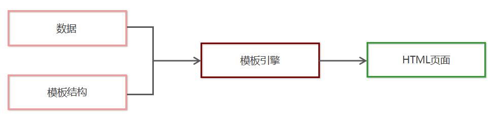

# AJAX 笔记

- 测试接口 : 111.229.6.231:9996
- 图书列表接口  : https://www.showdoc.com.cn/ajaxapi?page_id=3753323218792173

# 课程大纲


# 客户端和服务器

思考：我们写完一个页面，怎么让所有人都能访问到？？？？？？

## 客户端

- 具有向服务器 **索取服务** 能力的终端，叫做客户端。
- 索取服务包括 : 
  - 获取数据
  - 传递数据
  - 修改数据
  - 删除数据
- 比如  浏览器 (pc + 移动端的) 


## 服务器

- 通俗的讲，就是一台机器    
- 一台能够提供某种服务 / 数据的机器（计算机）, 我们称之为服务器
- 我们最常见的就是 http 服务器

### HTTP 服务器 

即网站服务器，主要提供网页浏览服务，一般安装 Apache、Nginx 服务器软件。

常见的运行在服务端的编程语言包括 php、java、.net、Python、Node..... 等。


## 服务器与客户端的关系

- 客户端：**索取服务/数据** 的一方
- 服务器：**提供服务/数据** 的一方


## URL地址

- 浏览器是如何访问服务器的呢  

### URL地址的概念

URL（全称是Uniform Resource Locator）中文叫统一资源定位符，用于标识互联网上每个资源的唯一存放位置。浏览器只有通过URL地址，才能正确定位资源的存放位置，从而成功访问到对应的资源。
常见的URL举例：

- http://www.baidu.com
- http://www.taobao.com
- http://web.itcast.cn/


### URL地址的组成部分

> URL地址一般由三部组成：
>
> https://www.baidu.com/img/PCtm_d9c8750bed0b3c7d089fa7d55720d6cf.png
>
> https://gimg2.baidu.com/image_search/src=http%3A%2F%2Fattach.bbs.miui.com%2Fforum%2F201311%2F22%2F172342ehscjzq4jbpjjnt4.jpg&refer=http%3A%2F%2Fattach.bbs.miui.com&app=2002&size=f9999,10000&q=a80&n=0&g=0n&fmt=jpeg?sec=1629421075&t=eb1757cdb1061f386d77fd67997ecac4

① 客户端与服务器之间的通信协议
② 存有该资源的服务器名称
③ 资源在服务器上具体的存放位置


# 表单处理

> 表单（form）：表单用于收集用户输入信息，并将数据提交给服务器。是一种常见的与服务端数据交互的一种方式

HTML中的form标签，就是用于采集用户输入的信息，并通过form标签的提交操作，把采集到的信息提交到服务器端进行处理。


```html
  <form action='http://111.229.6.231:9996/v1/get' method="GET">
    <!-- 输入框 -->  
    <input type="text" name='name'  value="admin"> <br>
    <input type="text" name='pwd'   value="123456"> <br>
    <!-- 提交数据 -->
    <input type="submit" value="提交-get">
  </form>
```


## 表单作用

```
 1. 收集数据
 2. 给后台发送请求  
```


## 表单属性

1. `action`：指定表单的提交地址
   1. 当 form表单在未指定 action 属性值的情况下，action 的默认值为当前页面的 URL 地址。
   2. 注意点: 当提交表单后，页面会立即跳转到 action 属性指定的 URL 地址
2. `method`: 指定表单的提交方式，`get`/`post`，默认 `get`
3. `input` 的数据想要提交到后台，必须指定 name 属性，后台通过 name 属性获取值
4.  想要提交表单，不能使用 `input:button` 必须使用 `input:submit`


## 演示发送请求

```html
  <form action='http://111.229.6.231:9996/v1/get' method="GET">
    <input type="text" name='name'  value="admin"> <br>
    <input type="password" name='pwd' value="123456"> <br>
    <!-- 提交数据 -->
    <input type="submit" value="提交-get">
  </form>

  <form action='http://111.229.6.231:9996/v1/post' method="POST">
    <input type="text" name='name' value="admin"> <br>
    <input type="password" name='pwd' value="123456"> <br>
    <!-- 提交数据 -->
    <input type="submit" value="提交-post">
  </form>
```


## get 与 post 的区别

1. get 方式
   1. 数据会拼接在 url 地址的后面 `?name=admin&pwd=123456`
   2. 地址栏有长度限制，因此 get 方式提交数据大小不会超过 4k
2. post 方式
   1. 数据不会在 url 中显示，相比 get 方式，post 更安全
   2. 提交的数据没有大小限制

根据 HTTP 规范，GET 用于信息获取，POST 表示可能修改变服务器上的资源的请求


## 表单提交缺点

通过点击 submit 按钮，触发表单提交的操作，从而使页面跳转到 action URL 的行为，叫做表单的同步提交。

- form表单同步提交后，整个页面会发生跳转，跳转到 action URL 所指向的地址，用户体验很差。
- form表单同步提交后，页面之前的状态和数据会丢失。


思考：如何解决上述两个问题？

**解决方案：表单只负责采集数据，Ajax 负责将数据提交到服务器。**


# HTTP 协议

**协议**是指计算机通信网络中两台计算机之间进行通信所必须共同遵守的规则或约定.

通俗理解: 通信双方**采用约定好的格式**来**发送和接受消息**(就是事先预定好的通信格式)

客户端和服务器之间要实现**网页内容的传输**, 则双方必须遵守网页内容的传输协议.

网页内容又叫做超文本, 因此网页内容的传输协议又叫做 **超文本传输协议** (Hypertext transfer protocol), 简称HTTP协议.

HTTP协议规定了客户端与服务器之间进行的网页内容传输时, 所必须遵守的传输格式.

例如: 

- 客户端要以HTTP协议要求的格式把数据**提交**到服务器
- 服务器要以HTTP协议要求的格式把内容**响应**到客户端

HTTP 协议分为**请求** 和**响应** 两个部分组成。

客户端发起的请求叫做**HTTP请求**, 客户端发送到服务器的消息, 叫做**HTTP请求消息(又称请求报文)**.


## 请求与请求报文

- 请求行
- 请求头
- 请求体


**get 请求的请求报文详解**

```javascript
//--------------------------请求行--------------------------------
GET /day02/01.php?username=lw&password=123456 HTTP/1.1
// GET  请求方式
// /day02/01.php?username=lw&password=123456    请求路径+参数（注意点）
// HTTP/1.1 HTTP的版本号

//--------------------------请求头--------------------------------
// Host:主机地址
Host: www.study.com
// HTTP1.1版本默认开启，建立过连接后，TCP连接不会断开，下次连接可以继续使用（底层，不用管）
Connection: keep-alive
//chrome浏览器自己增加的，不用管
Upgrade-Insecure-Requests: 1
//浏览器的代理字符串（版本信息）
User-Agent: Mozilla/5.0 (Windows NT 10.0; WOW64) AppleWebKit/537.36 (KHTML, like Gecko) Chrome/58.0.3029.96 Safari/537.36
//浏览器端可以接受的类型。
Accept: text/html,application/xhtml+xml,application/xml;q=0.9,image/webp,`*/*`;q=0.8
//从哪个页面发出的请求
Referer: http://www.study.com/day02/01-login.html
//检查浏览器支持的压缩方式
Accept-Encoding: gzip, deflate, sdch
//浏览器支持的语言，优先中文。
Accept-Language: zh-CN,zh;q=0.8,en;q=0.6

//----------------------------请求体-------------------------------------
// get请求没有请求体，但是参数会拼接到请求行中
```


**POST 请求的请求报文**

```javascript
//-----------------------请求行---------------------------------------------
POST /day02/01.php HTTP/1.1

//-----------------------请求头--------------------------------------------
Host: www.study.com
Connection: keep-alive
// ★ 传递的参数的长度。
Content-Length: 29
Cache-Control: max-age=0
Origin: http://www.study.com
Upgrade-Insecure-Requests: 1
User-Agent: Mozilla/5.0 (Windows NT 10.0; WOW64) AppleWebKit/537.36 (KHTML, like Gecko) Chrome/58.0.3029.96 Safari/537.36
// ★ 内容类型：表单数据，如果是post请求，必须指定这个属性。
Content-Type: application/x-www-form-urlencoded
Accept: text/html,application/xhtml+xml,application/xml;q=0.9,image/webp,`*/*`;q=0.8
Referer: http://www.study.com/day02/01-login.html
Accept-Encoding: gzip, deflate
Accept-Language: zh-CN,zh;q=0.8,en;q=0.6

//------------------------请求体------------------------------------------
username=lw&password=123456
```


**GET 请求与 POST 请求的对比**

- GET 请求没有请求体，因为 GET 请求的参数拼接到地址栏中了
- POST 请求有请求体，就是传递的参数
- POST 请求需要指定 content-type 属性。


## 响应与响应报文

```javascript
//---------------------状态行（响应行）-------------------------------
HTTP/1.1 200 OK
//HTTP/1.1  HTTP版本
//200 响应的状态
	//200表示成功
	//404表示找不到资源
	//500表示服务端错误


//----------------------响应头-----------------------------------------------
Date: Thu, 22 Jun 2017 16:51:22 GMT
Server: Apache/2.4.23 (Win32) OpenSSL/1.0.2j PHP/5.4.45
X-Powered-By: PHP/5.4.45
Content-Length: 18
Keep-Alive: timeout=5, max=100
Connection: Keep-Alive
//内容类型，告诉浏览器该如何解析响应结果
Content-Type: text/html;charset=utf-8

//-----------------------响应体------------------------------------------------
用户登录成功
```

可以直接使用谷歌浏览器来查看请求报文和响应报文。谷歌浏览器会对报文进行一定的格式化，看起来虽然不是原生的报文，但是使用起来更加的方便简洁。


# AJAX

> Ajax 的全称是 Asynchronous [e'sɪŋkrənəs] Javascript And XML（异步 JavaScript 和 XML）， AJAX 不是一门的新的语言，而是对现有技术的综合利用。

本质是在 HTTP 协议的基础上以异步的方式与服务器进行通信。


## 同步与异步

### 区分两个标识

- async- 异步
- sync-同步

> 小 => api => 数据存储
>
> 小 => 服务器 => 内容安全


### 同步和异步概念：

同步: 指的就是事情要一件一件做。等做完前一件才能做后一件任务

- 阻塞

异步: 不受当前任务的影响，两件事情同时进行，做一件事情时，不影响另一件事情的进行。

- 不阻塞

编程中：异步程序代码执行时**不会阻塞**其它程序代码执行,从而提升整体执行效率。

XMLHttpRequest 可以以异步方式的处理程序。


## Ajax的典型应用场景

1. 用户名检测：注册用户时，通过 ajax 的形式，动态检测用户名是否被占用
2. 搜索提示：当输入搜索关键字时，通过 ajax 的形式，动态加载搜索提示列表
3. 数据分页显示：当点击页码值的时候，通过 ajax 的形式，根据页码值动态刷新表格的数据
   1. 微博热评的加载更多
4. 数据的增删改查：数据的添加、删除、修改、查询操作，都需要通过 ajax 的形式，来实现数据的交互


### ajax和表单

+ 都能够发送http请求
+ ajax发送的是异步的http请求，表单发送的是同步的http请求
+ 如果使用表单发送请求，页面一定会发生跳转
+ ajax允许你在操作页面的同时异步的发送请求，，，，页面可以不跳转


## XMLHttpRequest

> XMLHttpRequest（简称 xhr）是浏览器提供的 Javascript 对象，通过它，用于与服务器通信(交换数据)。由此我们便可实现对网页的部分更新，而不是刷新整个页面。这个请求是异步，即在往服务器发送请求时，并不会阻碍程序的运行，浏览器会继续渲染后续的结构。

最简单的用法 `let xhr = new XMLHttpRequest()`


### 发送 get 请求

使用XMLHttpRequest发送get请求的步骤:

1. 创建 xhr 对象
2. 请求行 - 调用 xhr.open() 函数
3. 请求体 - 调用 xhr.send() 函数

```javascript
// 点击按钮准备 
<button>发送请求 </button>
let btn =  document.querySelector('button')
btn.onclick =  function () { ... }

//1. 创建一个ajax对象, xhr 就是ajax实例, 可以发送请求 
var xhr = new XMLHttpRequest(); 

// 2. 设置请求的三部分
// 2.1 设置请求行
// 参数1 ：请求方式
// 参数2 : 请求url地址 
xhr.open('get', 'http://111.229.6.231:9996/v1/get?name=admin&pwd=123456')

// 2.2 需要设置请求头 
// get请求的请求头浏览器默认会添加, 此处不用设置请起头了

// 2.3 设置请求体  get请求没有请求体, 因为请求体就是放参数的, 参数已经拼在 url上了
// 注意：必须调用send才会发送请求，get请求，参数为null
// 参数：请求体
xhr.send()
```


### 发送 post 请求

步骤：

1. 创建 xhr 对象
2. 请求行 - 调用 xhr.open() 函数
3. 请求头 - 设置 Content-Type 属性（固定写法）
4. 请求体 - 调用 xhr.send() 函数，同时指定要发送的数据

```javascript
 // 1. 创建 xhr 
let xhr = new XMLHttpRequest()

// 2. 请求
// 2.1 请求行
xhr.open('post','http://111.229.6.231:9996/v1/post')

// 2.2 请求头
// Content-Type: application/x-www-form-urlencoded
xhr.setRequestHeader('content-type','application/x-www-form-urlencoded')

// 2.3 请求体
xhr.send('name=admin&pwd=123456')
```

- post 请求, 参数列表不能拼接到 url 后面
- post 必须设置请求头中的 content-type 为 application/x-www-form-urlencoded
- post 请求需要将参数放到send中


### 获取响应

```js
// 结构  
  <input type="text" class="name" placeholder="账号"> <br>
  <input type="text" class="pwd" placeholder="密码"> <br>
  <button>提交</button>
// 点击按钮准备 
let btn =  document.querySelector('button')
btn.onclick =  function () { ... }

      // 1. 收集数据
      let name = document.querySelector('.name').value
      let pwd = document.querySelector('.pwd').value

      // 2. 发送ajax 请求
      let xhr = new XMLHttpRequest()

      xhr.open('get', `http://111.229.6.231:9996/v1/get?name=${name}&pwd=${pwd}`)
      xhr.send()

      // 3. 获取响应
      xhr.onload = function () {
        // console.log(xhr);
        // console.log(xhr.status);
        // console.log(xhr.responseText);

        if (xhr.status === 200) {
          alert(xhr.responseText)
        } else {
          alert('请求失败')
         }
      }
```


### 练习1 : 判断用户名存在-get

```js
<input type="text"> <span></span>

 <script>
    let ipt = document.querySelector('input')
    let span = document.querySelector('span')

    ipt.onblur = function () {
      // 0. 获取输入内容
      let name = this.value

      // 发送请求 校验 
      // 1. 创建 xhr
      let xhr = new XMLHttpRequest()

      // 2. 请求
      // 2.1 请求行
      xhr.open('get', `http://111.229.6.231:9996/v1/regist?name=${name}`)
      // 2.2 请求头
      // 2.3 请求体
      xhr.send()

      // 3. 响应
      xhr.onload = function () {

        console.log(xhr.responseText);

        if (xhr.responseText == 'ok') {

          span.innerText = '用户名没有被注册'
          span.style.color = 'green'
        } else {
            
          span.innerText = '用户名被注册了'
          span.style.color = 'red'
        }
      }
    }
  </script>
```


### 练习2 : 判断用户名存在-post

```js
      // 2.1 请求行
     xhr.open('post', 'http://111.229.6.231:9996/v1/regist')
      // 2.2 请求头
      xhr.setRequestHeader('content-type', 'application/x-www-form-urlencoded')
      // 2.3 请求体
      xhr.send(`name=${name}`)
```


### 练习3 : 登录后跳转到百度-post

```js
 btn.onclick = function () {
      
      let name  = document.querySelector('.name').value
      let pwd =  document.querySelector('.pwd').value
      
        //1. 
        let xhr = new XMLHttpRequest

        //2. 
        xhr.open('post', 'http://111.229.6.231:9996/v1/post')
        xhr.setRequestHeader('content-type','application/x-www-form-urlencoded')
        xhr.send(`name=${name}&pwd=${pwd}`)

        xhr.onload = function () {
          console.log(xhr.responseText);
          if (xhr.responseText=='登录成功') {
            alert(xhr.responseText)
            location.href = 'http://baidu.com'
          } else {
            alert('登录失败')
          }
        }
      }
```


# 数据交互

> 浏览器端只是负责用户的交互和数据的收集以及展示，真正的数据都是存储在服务器端的。但是每个编程语言的语法都不一样。因此我们会采用通用的数据交换格式（XML、JSON）来进行数据的交互。

简单理解: 数据交换格式，就是服务器端与客户端之间进行数据传输与交换的格式。

前端领域，经常提及的两种数据交换格式分别是 XML 和 JSON。其中 XML 用的非常少，所以，我们重点要学习的数据交换格式就是 JSON。


## XML数据

**什么是 XML**

- XML 指可扩展标记语言（EXtensible Markup Language）
- XML 是一种标记语言，很类似 HTML
- XML 的设计宗旨是传输数据，而非显示数据   <div></div>   <aaa></aaa> <bbb></bbb>
- XML 标签没有被预定义。您需要自行定义标签。

**语法规范**

- 必须有一个根元素（有且仅有一个）
- 标签不可有空格、不可以数字或.开头、大小写敏感
- 不可交叉嵌套，都是双标签，如果是单标签，必须闭合
- 属性双引号（浏览器自动修正成双引号了）
- 注释和 HTML 一样

```xml
<books>
    <book>
      <id>1</id>
      <bookname>西游记</bookname>
      <author>吴承恩</author>
      <publisher>北京图书出版社</publisher>
    </book>
    <book>
      <id>2</id>
      <bookname>西游记</bookname>
      <author>吴承恩</author>
      <publisher>北京图书出版社</publisher>
    </book>
    <book>
      <id>3</id>
      <bookname>西游记</bookname>
      <author>吴承恩</author>
      <publisher>北京图书出版社</publisher>
    </book>
</books>
```

**XML缺点：**

虽然可以描述和传输复杂数据，但是

1. XML 格式臃肿，和数据无关的代码多，体积大，传输效率低
2. 在 Javascript 中解析 XML 比较麻烦

所以实现开发已经很少使用了。


## JSON 数据

#### 概念: 

JSON的英文全称是JavaScript Object Notation, 既 "JavaScript对象表示法"

简单来讲, **JSON就是JavaScript对象和数组的字符串表示法, 使用文本表示一个JS对象或数组的信息, 因此, JSON的本质是字符串.**

#### 作用：

JSON 是一种轻量级的文本数据交换格式，在作用上类似于 XML，专门用于存储和传输数据，但是 JSON 比 XML 更小、更快、更易解析。

#### 现状：

JSON 是在 2001 年开始被推广和使用的数据格式，到现今为止，JSON 已经成为了主流的数据交换格式。

#### 说明：

- JSON 是 JS 对象的字符串表示法，它使用文本表示一个 JS 对象的信息，本质是一个字符串。

- JSON 的作用：在计算机与网络之间存储和传输数据。

  JSON 的本质：用字符串来表示 Javascript 对象数据或数组数据

- 不同的语言各自也都对应有解析方法，需要解析完成后才能读取

#### JSON的两种结构

JSON 就是用字符串来表示 Javascript 的对象和数组。所以，JSON 中包含对象和数组两种结构，通过这两种结构的相互嵌套，可以表示各种复杂的数据结构。

#### json格式:

- 数据在名称/值对中
- 数据由逗号分隔(最后一个健/值对不能带逗号)
- 花括号保存对象，方括号保存数组
- 键使用双引号  ★

```javascript
var obj = { a: "Hello", b: "World" }; // 这是一个对象，注意键名也是可以使用引号包裹的

var json = '{"a": "Hello", "b": "World"}'; // 这是一个 JSON 字符串，本质是一个字符串
```

#### JSON语法注意事项

- 属性名必须使用双引号包裹
- 字符串类型的值必须使用双引号包裹（JSON 中不允许使用单引号表示字符串）
- JSON 中不能写注释
- JSON 的最外层必须是对象或数组格式
- 不能使用 undefined 或函数作为 JSON 的值

#### JSON和JS对象的关系

JSON 是 JS 对象的字符串表示法，它使用文本表示一个 JS 对象的信息，本质是一个字符串。例如：

```js
//这是一个对象
var obj = {a: 'Hello', b: 'World'}

//这是一个 JSON 字符串，本质是一个字符串
var obj_json = `{"a": "Hello", "b": "World"}` 或者 '{"a": "Hello", "b": "World"}'
```

#### json  =====>   js 对象/js数组

> 序列化和反序列化

- 调用 `JSON.stringify()` 函，把数据对象转换为json字符串的过程，叫做JSON序列化.

  ```js
      // 对象
      let obj = { name : 'zs', age : 20 }
      console.log(obj);
  
      // 把 obj 转化为 字符串的obj (json)
      // json的字符串都是双引号 
      let obj_json =  JSON.stringify(obj)
      console.log(obj_json);
  
      // 数组
      let arr = [{ id : 1, name : "张三" }, { id :2, name : "李四" }]
      console.log(arr);
  
      // 转化为json
      let arr_json =  JSON.stringify(arr)
      console.log(arr_json);
  ```

- 调用 `JSON.parse()`，把json字符串转换为数据对象的过程, 叫做JSON反序列化。

  ```js
  // JSON.parse(obj) 实现 JSON 字符串 ==> JS 对象 
  
  // 把 json 转化为 对象 或者 数组
  // 纯字符串
  let obj_json = `{ id : 1, name : '张三' }`  => 转化会报语法错误
  // 这才是 json
  let obj_json = `{ "id" : 1, "name" : "张三" }`
  
  let obj = JSON.parse(obj_json)
  
  console.log(obj);
  ```


## xhr 获取的数据就是 json 格式

```js
//1. 
let xhr = new XMLHttpRequest

//2. 请求
xhr.open('get','http://www.liulongbin.top:3006/api/getbooks')
xhr.send()

xhr.onload = function () {
    console.log(xhr.responseText);

    // 转化为对象
    let obj_json = JSON.parse(xhr.responseText)
    console.log(obj_json);
}
```


# jQuery 中的 ajax 方法

> 浏览器中提供的 XMLHttpRequest 用法比较复杂，所以 jQuery 对 XMLHttpRequest 进行了封装，提供了一系列 Ajax 相关的函数，极大地降低了 Ajax 的使用难度。

jQuery 中发起 Ajax 请求最常用的三个方法如下：

```js
$.get()  知道就行,不掌握
$.post() 知道就行, 不掌握
$.ajax()
```


### $.ajax()函数的语法 -- 重要

> 相比于 $.get() 和 $.post() 函数，jQuery 中提供的 $.ajax() 函数，是一个功能比较综合的函数，它允许我们对 Ajax 请求进行更详细的配置。

$.ajax() 函数的基本语法如下：

```js
$.ajax({
   type: '', // 请求的方式，例如 GET 或 POST
   url: '',  // 请求的 URL 地址
   data: { },// 这次请求要携带的数据
   success: function(res) { } // 请求成功之后的回调函数
})
```

### `$.ajax`的参数列表

| 参数名称   | 描述                                                         | 取值                                                        | 示例                       |
| ---------- | ------------------------------------------------------------ | ----------------------------------------------------------- | -------------------------- |
| url        | 后台地址                                                     |                                                             | url:"02.php"               |
| type       | 请求方式                                                     | get/post                                                    | type:"get"                 |
| dataType   | 服务器返回的数据格式                                         | json/xml/text，如果不指定，会自动根据 content-type 进行判定 | dataType:"json"            |
| data       | 发送的请求数据                                               | 对象、字符串                                                | data:{name:"zs", age:18}   |
| beforeSend | 调用前的回调函数，在 beforeSend 中 return false，会阻止 ajax 的发送 | function(){}                                                | beforeSend:function(){ }   |
| success    | 成功的回调函数                                               | function (data) {}                                          | success:function (data) {} |
| error      | 失败的回调函数                                               | function (error) {}                                         | error:function(data) {}    |
| complete   | 完成后的回调函数                                             | function () {}                                              | complete:function () {}    |


### 使用示例：

```javascript
$.ajax({
    type: "get", //请求类型
    url: "02.php", //请求地址
    data: { name: "zs", age: 18 }, //请求数据
    beforeSend: function() {
        //alert("发送ajax前调用");
    },
    success: function(data) {
        //alert("请求成功时调用");
        console.log(data);
    },
    error: function(error) {
        //alert("请求失败时调用");
        console.log(error);
    },
    complete: function() {
        //alert("请求完成时调用， 不论失败还是成功都会执行");
    },
});
```


## 演示基本使用

```js
  <button class="get">ajax - get</button>
  <button class="get">ajax - get</button>


  <script src="./jquery.js"></script>
  <script>


	// 点击第一个按钮
    $('button').eq(0).on('click', () => {

      $.ajax({
        type: 'get',
        url: 'http://www.liulongbin.top:3006/api/getbooks',
        success: function (res) {
          console.log(res);
        }
      })
    })

    // 点击 第二个按钮
    $('button').eq(1).on('click', () => {

      $.ajax({
        type: 'post',
        url: 'http://www.liulongbin.top:3006/api/addbook',
        data: {
          bookname: '哈哈',
          author: '嘻嘻',
          publisher: "嘎嘎"
        },
        success: (res) => {
          console.log(res);
        }
      })
    })
  </script>
```


# 接口化开发

>  使用 Ajax 请求数据时，被请求的 URL 地址，就叫做数据接口（简称接口）。同时，每个接口必须有请求方式。

例如：

```txt
http://www.liulongbin.top:3006/api/getbooks  获取图书列表的接口(GET请求)
http://www.liulongbin.top:3006/api/addbook   添加图书的接口（POST请求）
```

### 接口文档

#### 什么是接口文档

接口文档，顾名思义就是接口的说明文档，它是我们调用接口的依据。一个接口对应一个功能， 好的接口文档包含了对接口URL，参数以及输出内容的说明，我们参照接口文档就能方便的知道接口的作用，以及接口如何进行调用。

这样前后端在开发过程中，可以减少不必要的讨论， 从而并行开发，可以极大的提升开发效率，另外一个好处，当网站进行改版后，服务端接口进行调整时，并不影响到前端的功能。

#### 接口文档的组成部分

接口文档可以包含很多信息，也可以按需进行精简，不过，一个合格的接口文档，应该包含以下6项内容，从而为接口的调用提供依据：

1. 接口名称：用来标识各个接口的简单说明，如登录接口，获取图书列表接口等。
2. 接口URL：接口的调用地址。
3. 调用方式：接口的调用方式，如 GET 或 POST。
4. 参数格式：接口需要传递的参数，每个参数必须包含参数名称、参数类型、是否必选、参数说明这4项内容。
5. 响应格式：接口的返回值的详细描述，一般包含数据名称、数据类型、说明3项内容。
6. 返回示例（可选）：通过对象的形式，例举服务器返回数据的结构。

#### 接口文档示例

[在线Ajax课程测试学习接口](https://www.showdoc.com.cn/ajaxapi?page_id=3753323218792173)


## 通过Ajax提交表单数据

1. 监听表单提交事件

2. 阻止表单默认提交行为

   当监听到表单的提交事件以后，可以调用事件对象的 `event.preventDefault()` 函数，来阻止表单的提交和页面的跳转

3. 快速获取表单中的数据

   `serialize()`函数 或者 `serializeArray()` 
   
   注意该方法是jQ提供的方法

### 表单序列化 `serialize`

jquery 提供了一个`serialize()`方法序列化表单，说白就是将表单中带有 `name` 属性的所有参数拼成一个格式为`name=value&name1=value1`这样的查询字符串格式。方便我们获取表单的数据。

```javascript
$("form").serialize();

// serialize将表单参数序列化成一个字符串。必须指定name属性
"name=cc&pass=123456&repass=123456&mobile=18511241111&code=1234"
```

jquery 的 ajax 方法的data 参数能够直接识别表单序列化的数据

```javascript
$.post({
  url: "register.php",
  data: $("form").serialize(),
  dataType: "json",
  success: function(info) {
    console.log(info);
  },
});
```


## 案例 –聊天机器人


## 模板引擎

> 是为了使用户界面与业务数据（内容）分离而产生的，它可以生成特定格式的文档，用于网站的模板引擎就会生成一个标准的 HTML 文档。 数据+模版 = 最终需要显示的结构（动态）

### 为什么要使用模板引擎

我们通过 ajax 获取到数据后，需要把数据渲染到页面，在学习模板引擎前，我们的做法是大量的拼接字符串，对于结构简单的页面，这么做还行

但是如果页面结构很复杂，使用拼串的话**代码可阅读性非常的差，而且非常容易出错，后期代码维护也是相当的麻烦。**

### 拼串渲染两大缺点：

1. js 中大量充斥着 html 结构拼串代码， 很冗余， 可读性差
2. 字符串拼接很麻烦， 且维护起来也很麻烦， 容易出错

### 模板引擎的好处

- 减少了字符串的拼接操作
- 使代码结构更清晰
- 使代码更易于阅读与维护

### 什么是模板引擎

模板引擎，简单理解，它可以根据程序员指定的模板结构和数据，自动生成一个完整的HTML页面。



### artTemplate介绍 

> artTemplate 是一个简约、超快的模板引擎，需要大家掌握。

[中文 api 地址](https://aui.github.io/art-template/zh-cn/docs/index.html)


### artTemplate 入门

[在线下载地址](https://unpkg.com/art-template@4.13.2/lib/template-web.js)

**1.引入模板引擎的 js 文件**

```
<script src="template-web.js"></script>
```

**2.准备模板**

```html
<!-- 指定了type为text/html后，这一段script标签并不会当做js来解析 -->
<script type="text/html" id="myTmp">
  <p>姓名：隔壁老王</p>
  <p>年龄：18</p>
  <p>技能：查水表</p>
  <p>描述：年轻力气壮</p>
</script>
```

**3.准备数据**

```js
// 3. 准备数据, 数据是后台获取的，可以随时变化
var json = {
  userName: "隔壁老王",
  age: 18,
  skill: "查水表",
  desc: "年轻气壮",
};
```

**4.将模板与数据进行绑定**

```javascript
//第一个参数：模板的id
//第二个参数：数据
//返回值：根据模板生成的字符串。
var html = template("myTmp", json);
console.log(html);
```

**5.修改模板**

```html
<script type="text/html" id="myTmp">
  <p>姓名：{{userName}}</p>
  <p>年龄：{{age}}</p>
  <p>技能：{{skill}}</p>
  <p>描述：{{desc}}</p>
</script>
```

**6.将数据显示到页面**

```javascript
var div = document.querySelector("div");
div.innerHTML = html;
```

### artTemplate 标准语法

**输出**

art-template 提供了 `{{ }}` 这种语法格式，在 `{{ }}` 内可以进行变量输出，或循环数组等操作，这种 `{{ }}` 语法在 art-template 中被称为标准语法

**if 语法**

如果要实现条件输出，则可以在{{}}中使用if语句进行按需输出。

```js
{{if value}} 按需输出的内容 {{/if}}

{{if v1}} 按需输出的内容 {{else if v2}} 按需输出的内容 {{/if}}
```

```html
{{if gender === '男'}}
	<p>性别：男</p>
{{else}}
	<p>性别：女</p>
{{/if}}
```

**each 语法（循环输出）**

如果要实现循环输出，则可以在 {{ }} 内，通过 each 语法循环数组，当前循环的索引使用 $index 进行访问，当前的循环项使用 $value 进行访问。

```js
{{each arr}}
    {{$index}} {{$value}}
{{/each}}
```

```html
<!--
  1. {{each data}}  可以通过$value 和 $index获取值和下标
  2. {{each data v i}}  自己指定值为v，下标为i
-->
{{each data v i}}
<li>
  <a href="{{v.url}}">
    
    <p>{{v.content}}</p>
  </a>
</li>
{{/each}}
```

```javascript
// 如果返回的数据是个数组，可以使用对象进行包裹
var html = template("navTmp", { data: info });
```

**过滤器**

过滤器的本质，就是一个 function 处理函数。


定义过滤器的基本语法如下：

```js
template.defaults.imports.filterName = function(value){
    // 形参value 就是需要处理的数据
	// return处理好的结果
}
```

过滤器语法类似管道操作符，它的上一个输出作为下一个输入。

```js
{{value | filterName}}
```

举例：过滤器处理时间

```js
// 定义一个格式化时间的过滤器 dateFormat 如下：
template.defaults.imports.dateFormat = function(date) {
    var y = date.getFullYear()
    var m = date.getMonth() + 1
    var d = date.getDate()

    return y + '-' + m + '-' + d // 注意，过滤器最后一定要 return 一个值
}


// 模板中使用过滤器函数
<div>注册时间：{{regTime | dateFormat}}</div>
```

### 模板引擎的使用步骤

- 导入 `art-template`
- 获取数据
- 定义模板
- 调用 `template` 函数，将数据和模板结合起来得到HTML结构
- 渲染HTML结构
- 使用模板语法，调整模板

### 案例 – 新闻列表


## XMLHttpRequest Level2的新特性

### 旧版XMLHttpRequest的缺点

1. 只支持文本数据的传输，无法用来读取和上传文件
2. 传送和接收数据时，没有进度信息，只能提示有没有完成
3. 受到了"同源策略"的限制

### XMLHttpRequest Level2的新功能

1. 可以设置 HTTP 请求的时限
2. 可以使用 FormData 对象管理表单数据（可以上传文件）
3. 可以获得数据传输的进度信息
4. 允许请求不同域名下的数据（跨域）


### 设置 HTTP 请求的时限

>  有时，Ajax 操作很耗时，而且无法预知要花多少时间。如果网速很慢，用户可能要等很久。新版本的 XMLHttpRequest 对象，增加了 timeout 属性，可以设置 HTTP 请求的时限

```js
xhr.timeout = 3000; // 单位是ms
// 上面的语句，将最长等待时间设为 3000 毫秒。过了这个时限，就自动停止HTTP请求。

// 与之配套的还有一个 timeout 事件，用来指定回调函数：
xhr.ontimeout = function(event){
    alert('请求超时！')
}
```


### FormData对象管理表单数据

> Ajax 操作往往用来提交表单数据。为了方便表单处理，HTML5 新增了一个 FormData 对象，可以模拟表单操作：

FormData对象管理表单数据

```js
 // 获取表单元素
 var form = document.querySelector('#form');

 // 监听表单元素的 submit 事件
 form.addEventListener('submit', function(e) {
    e.preventDefault();
     
     // 根据 form 表单创建 FormData 对象，会自动将表单数据填充到 FormData 对象中
     var fd = new FormData(form);
     
     var xhr = new XMLHttpRequest();
     
     xhr.open('POST', 'xxxx');
     	
     // 直接提交 FormData 对象
     xhr.send(fd);
     
     xhr.onreadystatechange = function() {
         // ...
     }
})
```

### 原生XHR上传文件

> 新版 XMLHttpRequest 对象，不仅可以发送文本信息，还可以上传文件。

```html
<!-- 文件选择框 -->
<input type="file" id="file" />
```

**验证是否选择了文件**

通过文件域的DOM对象的files属性来查看选择文件的个数

```js
// 1. 获取上传文件的按钮
var btnUpload = document.querySelector('#btnUpload');

// 2. 为按钮添加 click 事件监听
btnUpload.addEventListener('click', function() {
    // 3. 获取到选择的文件列表
    var files = document.querySelector('#file').files;
    
    if (files.length < 1) {
        return alert('请选择要上传的文件！')
    }
    // ...后续业务逻辑
})
```

**显示文件上传进度**

新版本的 XMLHttpRequest 对象中，可以通过监听 `xhr.upload.onprogress` 事件，来获取到文件的上传进度。语法格式如下：

```js
// 创建 XHR 对象
var xhr = new XMLHttpRequest();

// 监听 xhr.upload 的 onprogress 事件
xhr.upload.onprogress = function(e) {
    // e.loaded 已传输的字节
    // e.total  需传输的总字节
    
    // 可以计算出当前上传大小占比
    var percentComplete = Math.ceil((e.loaded / e.total) * 100);
}
```

**监听上传完成的事件**

```js
xhr.upload.onload = function() {
    alert("上传文件完成");
	// ... 
}
```

###  使用jQuery上传文件

```js
<script>
  $('input').on('change', function () {
    const fd = new FormData()
    fd.append('avatar', this.files[0])
    $.ajax({
      type: 'post',
      url: 'http://www.liulongbin.top:3006/api/upload/avatar',
      data: fd,
      // 不修改 Content-Type 属性，使用 FormData 默认的 Content-Type 值
      contentType: false,
      // 不对 FormData 中的数据进行 url 编码，而是将 FormData 数据原样发送到服务器
      processData: false,
      success(res) {
        console.log(res)
        $('div').html(
          ``
        )
      },
      // 用于增强xhr，必须返回一个xhr对象
      xhr() {
        const xhr = new XMLHttpRequest()
        xhr.upload.onprogress = function (e) {
          $('progress').attr('max', e.total)
          $('progress').attr('value', e.loaded)
        }
        return xhr
      },
    })
  })
</script>
```


## Axios

>  Axios 是专注于网络数据请求的库。

- 相比于原生的 XMLHttpRequest 对象，axios 简单易用。
- 相比于 jQuery，axios 更加轻量化，只专注于网络数据请求。

### axios发起GET请求

```js
axios.get('url', { params: { /*参数*/ } }).then(callback)
```

代码演示

```js
// 请求的 URL 地址
var url = 'http://www.liulongbin.top:3006/api/post';

// 调用 axios.post() 发起 POST 请求
axios.post(url, { location: '北京', address: '顺义' }).then(function(res) {
    // res.data 是服务器返回的数据
    var result = res.data
    console.log(result)
})
```

### axios发起POST请求

```js
axios.post('url', { /*参数*/ }).then(callback)
```

代码演示

```js
// 请求的 URL 地址
var url = 'http://www.liulongbin.top:3006/api/post'

// 调用 axios.post() 发起 POST 请求
axios.post(url, { location: '北京', address: '顺义' }).then(function(res) {
    // res.data 是服务器返回的数据
    var result = res.data
    console.log(result)
})
```

### 直接使用axios发起请求

> axios 也提供了类似于 jQuery 中 $.ajax() 的函数，语法如下：

```js
axios({
    method: '请求类型',
    url: '请求的URL地址',
    data: { /* POST数据 */ },
    params: { /* GET参数 */ }
}) .then(callback)
```


## 同源与跨域

### 同源策略的基本概念

> 1995 年，同源政策由 Netscape 公司引入浏览器。目前，所有浏览器都实行这个政策。
> 同源策略：最初，它的含义是指，A 网页不能往 B 网页发送 ajax 请求，除非这两个网页"同源"。所谓"同源"指的是"三个相同"。

```javascript
协议相同   http  https
域名相同   www.baidu.com  www.taobao.cn  www.jd.com
端口相同   80 81 82
```

如果两个页面的协议，域名和端口都相同，则两个页面具有相同的源。

举例来说，`http://www.test.com/index.html` 这个网址，协议是`http://`，域名是`www.example.com`，端口是`80`（默认端口可以省略）。

同源检测：

```
http://www.test.com/other.html  	同源（协议、域名、端口相同）
https://www.test.com/about.html		协议不同（http 与 https）
http://blog.test.com/movie.html		域名不同（www.test.com 与 blog.test.com）
http://www.test.com:7001/home.html	端口不同（默认的 80 端口与 7001 端口）
http://www.test.com:80/main.html	同源（协议、域名、端口相同）
```

### 同源策略的目的

> 同源政策的目的，是为了保证用户信息的安全，防止恶意的网站窃取数据。

设想这样一种情况：A 网站是一家银行，用户登录以后，又去浏览其他网站。如果其他网站可以读取 A 网站的 Cookie，会发生什么？

很显然，如果 Cookie 包含隐私（比如存款总额），这些信息就会泄漏。更可怕的是，Cookie 往往用来保存用户的登录状态，如果用户没有退出登录，其他网站就可以冒充用户，为所欲为。

**因此同源策略是必须的，如果 cookie 可以在不同源的网站中共享，那么互联网将毫无安全可言。**

### 同源策略的限制范围

> 随着互联网的发展，“同源策略”越来越严格，目前，如果非同源，以下三种行为都将收到限制。

```
1. Cookie、LocalStorage 和 IndexDB 无法读取。
2. DOM 无法获得。
3. AJAX 请求不能发送。
```

虽然这些限制是很有必要的，但是也给我们日常开发带来不好的影响。比如实际开发过程中，往往都会把服务器端架设到一台甚至是一个集群的服务器中，把客户端页面放到另外一个单独的服务器。那么这时候就会出现不同源的情况，如果我们知道两个网站都是安全的话，我们是希望两个不同源的网站之间可以相互请求数据的。这就需要使用到**跨域** 。

### 跨域

- 同源指的是两个 URL 的协议、域名、端口一致，反之，则是跨域。
- 出现跨域的根本原因：浏览器的同源策略不允许非同源的 URL 之间进行资源的交互。

### 跨域解决方案 - jsonp

现如今，实现跨域数据请求，最主要的两种解决方案，分别是 `JSONP` 和 `CORS`。

> JSONP(JSON with Padding)、可用于解决主流浏览器的跨域数据访问的问题。

原理：服务端返回一个预先定义好的 javascript 函数的调用，并且将服务器的数据以该函数参数的形式传递过来，这个方法需要前后端配合。

jsonp: 带补丁的 json, 服务器不直接返回 json , 而是把 json 数据放到函数中作为实参传递

`script`  标签是不受同源策略的限制的，它可以载入任意地方的 JavaScript 文件，而并不要求同源。类似的还有`img`和`link`标签

```html
<!--不受同源策略的标签-->

<link rel="stylesheet" href="http://www.api.com/1.css" />
<script src="http://www.api.com/1.js"></script>
```

说白了，jsonp 的原理就是 借助了 script 标签不受同源策略的限制，在服务端返回一个函数的调用，将数据作为当前调用函数的实参。 在浏览器端，需要程序要声明一个函数，通过形参就可以获取到服务端返回的对应的值。

注意：JSONP 和 Ajax 之间没有任何关系，不能把 JSONP 请求数据的方式叫做 Ajax，因为 JSONP 没有用到 XMLHttpRequest 这个对象。

### jquery 对于 jsonp 的封装

> jsonp 原理大家知道即可，因此 jquery 已经帮我们封装好了，我们使用起来非常的方便。

jQuery 提供的 $.ajax() 函数，除了可以发起真正的 Ajax 数据请求之外，还能够发起 JSONP 数据请求

```javascript
// 使用起来相当的简单，还是$.ajax的语法，只需要把dataType指定成jsonp即可。
$.ajax({
    type: "get",
    url: "http://www.api.com/testjs.php",
    // 如果要使用 $.ajax() 发起 JSONP 请求，必须指定 dataType 为 jsonp
    dataType: "jsonp",
    data: {
        uname: "hucc",
        upass: "123456",
    },
    success: function(info) {
        console.log(info);
    },
});
```

补充说明：

1. jQuery 中的 JSONP，也是通过 `<script>` 标签的 src 属性实现跨域数据访问的，
2. 只不过，jQuery 采用的是动态创建和移除 `<script>` 标签的方式，来发起 JSONP 数据请求。
3. 在发起 JSONP 请求的时候，动态向 `<header>` 中 append 一个 `<script>` 标签；
4. 在 JSONP 请求成功以后，动态从 `<header>` 中移除刚才 append 进去的 `<script>` 标签；

### 跨域解决方案-CORS

> 新版本的 XMLHttpRequest 对象，可以向不同域名的服务器发出 HTTP 请求。这叫做["跨域资源共享"](http://en.wikipedia.org/wiki/Cross-Origin_Resource_Sharing)（Cross-origin resource sharing，简称 CORS）。

跨域资源共享（CORS）的前提

- 浏览器支持这个功能
- 服务器必须允许这种跨域。

服务器允许跨域的代码：

```php
// 允许所有的域名访问这个接口
ctx.set('Access-Control-Allow-Origin', '*');

// 允许http://www.study.com这个域名访问这个接口
ctx.set('Access-Control-Allow-Origin', 'http://www.study.com');
```

### CORS 的具体流程（了解）

1. 浏览器会向发送一条请求，服务器接受到请求之后，会返回请求头信息，浏览器查看返回的响应头信息中是否设置了`header('Access-Control-Allow-Origin:请求源域名或者*');`

2. 如果没有设置，说明服务器不允许使用 cors 跨域，那么浏览器会把获取到的数据拦截。

3. 如果返回的响应头中设置了`header('Access-Control-Allow-Origin:请求源域名或者*');`,浏览器会跟请求头中的`Origin: http://www.study.com`进行对比，如果满足要求，就把数据发送给用户。

4. 结论：**跨域行为是浏览器行为，是浏览器阻止了 ajax 行为。服务器与服务器之间是不存在跨域的问题的**

5. 注意：浏览器允许发起跨域请求，但是，跨域请求回来的数据，会被浏览器拦截，无法被页面获取到！

   

### jsonp 与 cors 的对比

- jsonp 兼容性好，老版本浏览器也支持
  - 缺点是只支持 GET 请求，不支持 POST 请求。
  - 发送的数据量有限。使用麻烦
- CORS：出现的较晚，它是 W3C 标准，属于跨域 Ajax 请求的根本解决方案。
  - 支持 GET 和 POST 请求。
  - 缺点是不兼容某些低版本的浏览器。(浏览器支持 cors 功能才行)
  - 但是使用简单，**只要服务端设置允许跨域，对于客户端来说，跟普通的 get、post 请求并没有什么区别。**
- 跨域的安全性问题：很多同学会觉得跨域能带来安全性问题，其实并不会，**因为跨域是需要服务端配合的** ，也就是说不论 jsonp 还是 cors，如果没有服务端的允许，浏览器是没法做到跨域的。


